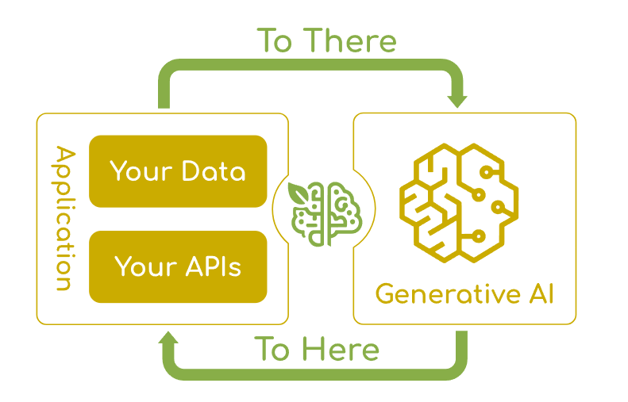
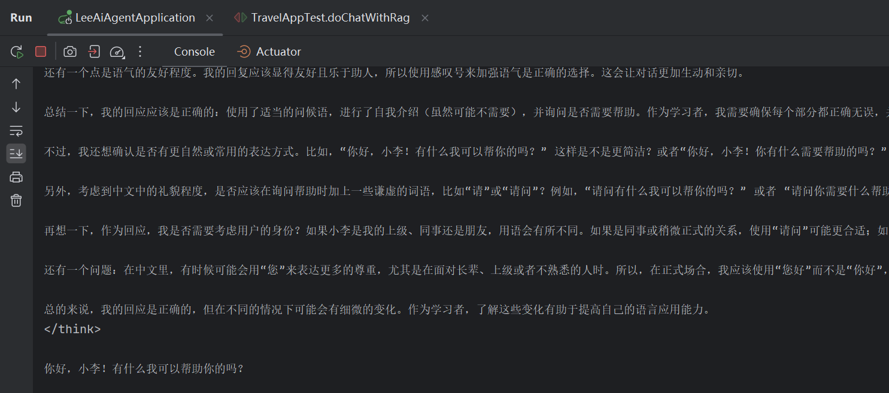

# AI大模型接入

## 四、程序调用 AI 大模型

在实际开发中，有⁠多种方式可以在应用程序中调用 ‌AI 大模型。下面详细介绍 4 种主流的接入方式，并通过实例‎代码展示如何在 Java 项目‌中实现与 AI 大模型的交互。

1. SDK 接入：使用官方提供的软件开发工具包，最直接的集成方式
2. HTTP 接入：通过 REST API 直接发送 HTTP 请求调用模型
3. Spring AI：基于 Spring 生态系统的 AI 框架，更方便地接入大模型
4. LangChain4j：专注于构建 LLM 应用的 Java 框架，提供丰富的 AI 调用组件

本教程选择⁠阿里云百炼平台作为示‌例，因为阿里系大模型对 Java 开发生‎态支持较好，更容易与‌现有 Java 框架集成。

再次提示：⁠AI 技术领域发展迅‌猛，相关 API 和技术栈更新非常快速，‎强烈建议在阅读教程时‌，结合最新的官方文档学习。

下面所有的示例代码均放置在项目的 `demo.invoke` 包下，方便统一管理和查阅。

### 3⁠、Spring A‌I

[Spring AI](https://docs.spring.io/spring-ai/reference/) 是 Spring 生态系统的新成员，旨在简化 AI 功能与 Spring 应用的集成。Spring AI 通过提供统一接口、支持集成多种 AI 服务提供商和模型类型、各种 AI 开发常用的特性（比如 RAG 知识库、Tools 工具调用和 MCP 模型上下文协议），简化了 AI 应用开发代码，使开发者能够专注于业务逻辑，提高了开发效率。



Sprin⁠g AI 的文档写‌得还是比较清晰易懂的，打破了我对国外‎文档的一贯认知（

Spring AI 的核心特性如下，参考官方文档：

- 跨 AI 供应商的可移植 API 支持：适用于聊天、文本转图像和嵌入模型，同时支持同步和流式 API 选项，并可访问特定于模型的功能。
- 支持所有主流 AI 模型供应商：如 Anthropic、OpenAI、微软、亚马逊、谷歌和 Ollama，支持的模型类型包括：聊天补全、嵌入、文本转图像、音频转录、文本转语音
- 结构化输出：将 AI 模型输出映射到 POJO（普通 Java 对象）。
- 支持所有主流向量数据库：如 Apache Cassandra、Azure Cosmos DB、Azure Vector Search、Chroma、Elasticsearch、GemFire、MariaDB、Milvus、MongoDB Atlas、Neo4j、OpenSearch、Oracle、PostgreSQL/PGVector、PineCone、Qdrant、Redis、SAP Hana、Typesense 和 Weaviate。
- 跨向量存储供应商的可移植 API：包括新颖的类 SQL 元数据过滤 API。
- 工具 / 函数调用：允许模型请求执行客户端工具和函数，从而根据需要访问必要的实时信息并采取行动。
- 可观测性：提供与 AI 相关操作的监控信息。
- 文档 ETL 框架：适用于数据工程场景。
- AI 模型评估工具：帮助评估生成内容并防范幻觉响应。
- Spring Boot 自动配置和启动器：适用于 AI 模型和向量存储。
- ChatClient API：与 AI 聊天模型通信的流式 API，用法类似于 WebClient 和 RestClient API。
- Advisors API：封装常见的生成式 AI 模式，转换发送至语言模型（LLM）和从语言模型返回的数据，并提供跨各种模型和用例的可移植性。
- 支持聊天对话记忆和检索增强生成（RAG）。

Spring AI 默认没有支持所有的大模型（尤其是国产的），更多的是支持兼容 OpenAI API 的大模型的集成，参考 [官方的模型对比](https://docs.spring.io/spring-ai/reference/api/chat/comparison.html)。因此，我们如果想要调用阿里系大模型（比如通义千问），推荐直接使用阿里自主封装的 [Spring AI Alibaba 框架](https://java2ai.com/)，它不仅能直接继承阿里系大模型，用起来更方便，而且与标准的 Spring AI 保持兼容。

可以参考下列官方文档，来跑通调用大模型的流程：

- [灵积模型接入指南](https://java2ai.com/docs/1.0.0-M6.1/models/dashScope/)
- [通义千问接入指南](https://java2ai.com/docs/1.0.0-M6.1/models/qwq/)

1）引入依赖：

```
<dependency>
    <groupId>com.alibaba.cloud.ai</groupId>
    <artifactId>spring-ai-alibaba-starter</artifactId>
    <version>1.0.0-M6.1</version>
</dependency>
```

官方提醒：由于 spring-ai 相关依赖包还没有发布到中央仓库，如出现 spring-ai-core 等相关依赖解析问题，请在项目的 pom.xml 依赖中加入如下仓库配置。

```
<repositories>
  <repository>
    <id>spring-milestones</id>
    <name>Spring Milestones</name>
    <url>https://repo.spring.io/milestone</url>
    <snapshots>
      <enabled>false</enabled>
    </snapshots>
  </repository>
</repositories>
```

2）编写配置：

```
spring:
  application:
    name: spring-ai-alibaba-qwq-chat-client-example
  ai:
    dashscope:
      api-key: ${AI_DASHSCOPE_API_KEY}
      chat:
        options:
          model: qwen-plus
```

3）编写示例代码，注意要注入 `dashscopeChatModel`：

```
@Component
public class SpringAiAiInvoke implements CommandLineRunner {

    @Resource
    private ChatModel dashscopeChatModel;

    @Override
    public void run(String... args) throws Exception {
        AssistantMessage output = dashscopeChatModel.call(new Prompt("你好，我是鱼皮"))
                .getResult()
                .getOutput();
        System.out.println(output.getText());
    }
}
```

上述代码实现了 C⁠ommandLineRunner 接‌口，我们启动 Spring Boot 项目时，会自动注入大模型 Chat‎Model 依赖，并且单次执行该类的‌ run 方法，达到测试的效果。

💡 上述代码中我们是通⁠过 ChatModel 对象调用大模型，适合简单‌的对话场景。除了这种方式外，Spring AI 还提供了 ChatClient 调用方式，提供更‎多高级功能（比如会话记忆），适合复杂场景，在后续‌ AI 应用开发章节中会详细介绍。

### 4、LangChain4j

和 Spring AI ⁠作用一样，LangChain4j 是一个专注于‌构建基于大语言模型（LLM）应用的 Java 框架，作为知名 AI 框架 LangChain‎ 的 Java 版本，它提供了丰富的工具和抽象‌层，简化了与 LLM 的交互和应用开发。

LangChain 官方是没有支持阿里系大模型的，只能用 [社区版本的整合大模型包](https://github.com/langchain4j/langchain4j-community/tree/main/models)。可以在官方文档中查询支持的模型列表：[LangChain4j 模型集成](https://docs.langchain4j.dev/integrations/language-models/)

要接入阿里云灵积模型，可以参考官方文档：[DashScope 模型集成](https://docs.langchain4j.dev/integrations/language-models/dashscope)，提供了依赖和示例代码。

1）首先引入依赖：

```
<dependency>
    <groupId>dev.langchain4j</groupId>
    <artifactId>langchain4j-community-dashscope</artifactId>
    <version>1.0.0-beta2</version>
</dependency>
```

值得一提的是，LangChain4j 也提供了 Spring Boot Starter，方便在 Spring 项目中使用，最新版本号可以在 [Maven 中央仓库](https://mvnrepository.com/artifact/dev.langchain4j/langchain4j-community-dashscope) 查询。我们这里由于只是编写 Demo，而且已经引入了 Spring AI 的 Starter，就不再引入 LangChain 的 Starter 了，担心会有冲突。

2）参考 [官方文档](https://docs.langchain4j.dev/get-started) 来编写示例对话代码，创建了一个 ChatModel 并调用，是不是和 Spring AI 很像？

```java
public class LangChainAiInvoke {

    public static void main(String[] args) {
        ChatLanguageModel qwenModel = QwenChatModel.builder()
                .apiKey(TestApiKey.API_KEY)
                .modelName("qwen-max")
                .build();
        String answer = qwenModel.chat("你好，我是程序员小李，正在带大家开发旅游规划大师最新的原创项目 - AI 超级智能体");
        System.out.println(answer);
    }
}
```

最后直接运行 Main 方法进行测试即可。

### 接入方式对比

以下是 4⁠ 种 AI 大模型接‌入方式的优缺点对比：          ‎          ‌            

| 接入方式    | 优点                                                         | 缺点                                                         | 适用场景                                            |
| ----------- | ------------------------------------------------------------ | ------------------------------------------------------------ | --------------------------------------------------- |
| SDK 接入    | • 类型安全，编译时检查 • 完善的错误处理 • 通常有详细文档 • 性能优化好 | • 依赖特定版本 • 可能增加项目体积 • 语言限制                 | • 需要深度集成 • 单一模型提供商 • 对性能要求高      |
| HTTP 接入   | • 无语言限制 • 不增加额外依赖 • 灵活性高 ⁠                    | • 需要手动处理错误 • 序列化 / 反序列化复杂 • 代码冗长        | • SDK 不支持的语言 • 简单原型验证 • 临时性集成      |
| Spring‌ AI   | • 统一的抽象接口 • 易于切换模型提供商 • 与 Spring 生态完美融合 • 提供高级功能 | • 增加额外抽象层 • 可能不支持特定模型的特性 • 版本还在快速迭代 | • Spring 应用 • 需要支持多种模型 • 需要高级 AI 功能 |
| LangChain4j | ‎ • 提供完整的 AI 应用工具链 • 支持复杂工作流 • 丰富的组件和工具 • 适合构建 AI 代理 | • 学习曲线较陡 • 文档相对较少 • 抽‌象可能引入性能开销         | • 构建复杂 AI 应用 • 需要链式操作 • RAG 应用开发    |

个人更推荐选择 Spring⁠ AI，一方面是它属于 Spring 生态，更主流；另‌一方面是它简单易用、资源更多，更利于学习，也能满足我们绝大多数 AI 项目的开发需求。因此本项目的后续教程，‎也会以 Spring AI 为主。学会一个 AI 开发‌框架后，其他框架学起来都是如鱼得水。

💡 无论⁠选择哪种接入方式，‌都建议先使用简单的测试案例验证接入是‎否成功，然后再进行‌更复杂的功能开发。

## 五、扩展知识 - 本地部署和接入 AI 大模型

有时，我们希望在本⁠地环境中部署和使用大模型，以获得更好‌的数据隐私控制、更低的延迟以及无需网络连接的使用体验。下面来讲解如何在本‎地安装和接入 AI 大模型，并通过 ‌Spring AI 框架进行调用。

### 1、本地安装大模型

### 2、Spring AI 调用 Ollama 大模型

Spring AI 原生支持调用 Ollama 大模型，直接参考 [官方文档](https://java2ai.com/docs/1.0.0-M6.1/models/ollama) 编写配置和代码即可。

1）需要先引入依赖：

```
<dependency>
    <groupId>org.springframework.ai</groupId>
    <artifactId>spring-ai-ollama-spring-boot-starter</artifactId>
    <version>1.0.0-M6</version>
</dependency>
```

官方提醒：由于 spring-ai 相关依赖包还没有发布到中央仓库，如出现 spring-ai-core 等相关依赖解析问题，请在项目的 pom.xml 依赖中加入如下仓库配置。

```
<repositories>
  <repository>
    <id>spring-milestones</id>
    <name>Spring Milestones</name>
    <url>https://repo.spring.io/milestone</url>
    <snapshots>
      <enabled>false</enabled>
    </snapshots>
  </repository>
</repositories>
```

如果安装依赖失败了，需要查看具体的报错信息，比如出现了因为 Lombok 没有指定版本号导致的错误。可以尝试删除本地仓库中与 Lombok 相关的缓存文件，Mac 系统的本地仓库一般位于`~/.m2/repository` ，找到`org/projectlombok/lombok`目录并删除，然后重新构建项目。

2）填写配置，注意模型填写为我们刚刚安装并运行的模型：

```
spring:
  ai:
    ollama:
      base-url: http://localhost:11434
      chat:
        model: gemma3:1b
```

3）在 `demo.invoke` 包中编写一段测试代码：

```
public class OllamaAiInvoke implements CommandLineRunner {

    @Resource
    private ChatModel ollamaChatModel;

    @Override
    public void run(String... args) throws Exception {
        AssistantMessage output = ollamaChatModel.call(new Prompt("你好，我是鱼皮"))
                .getResult()
                .getOutput();
        System.out.println(output.getText());
    }
}
```

4）启动项目，成功运行并查看到 AI 的回答：

