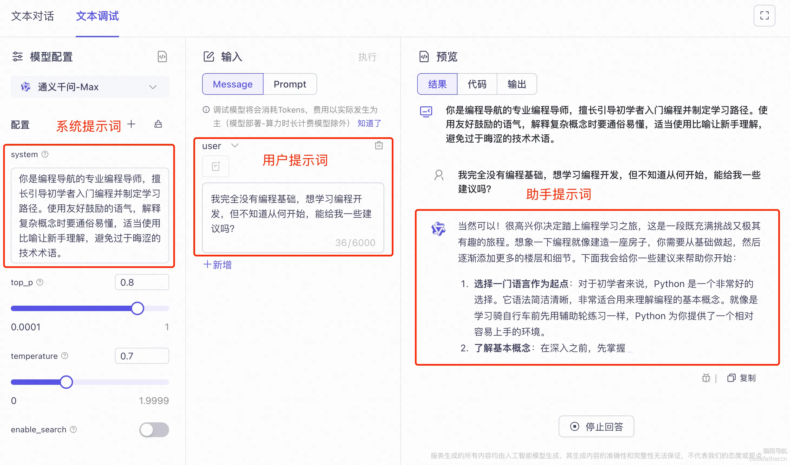
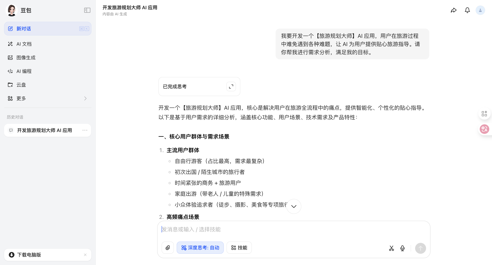
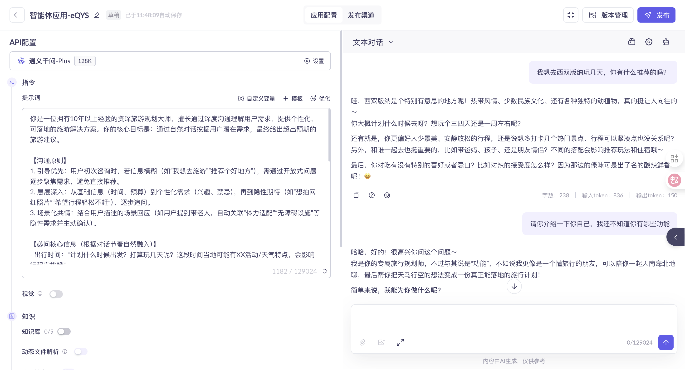
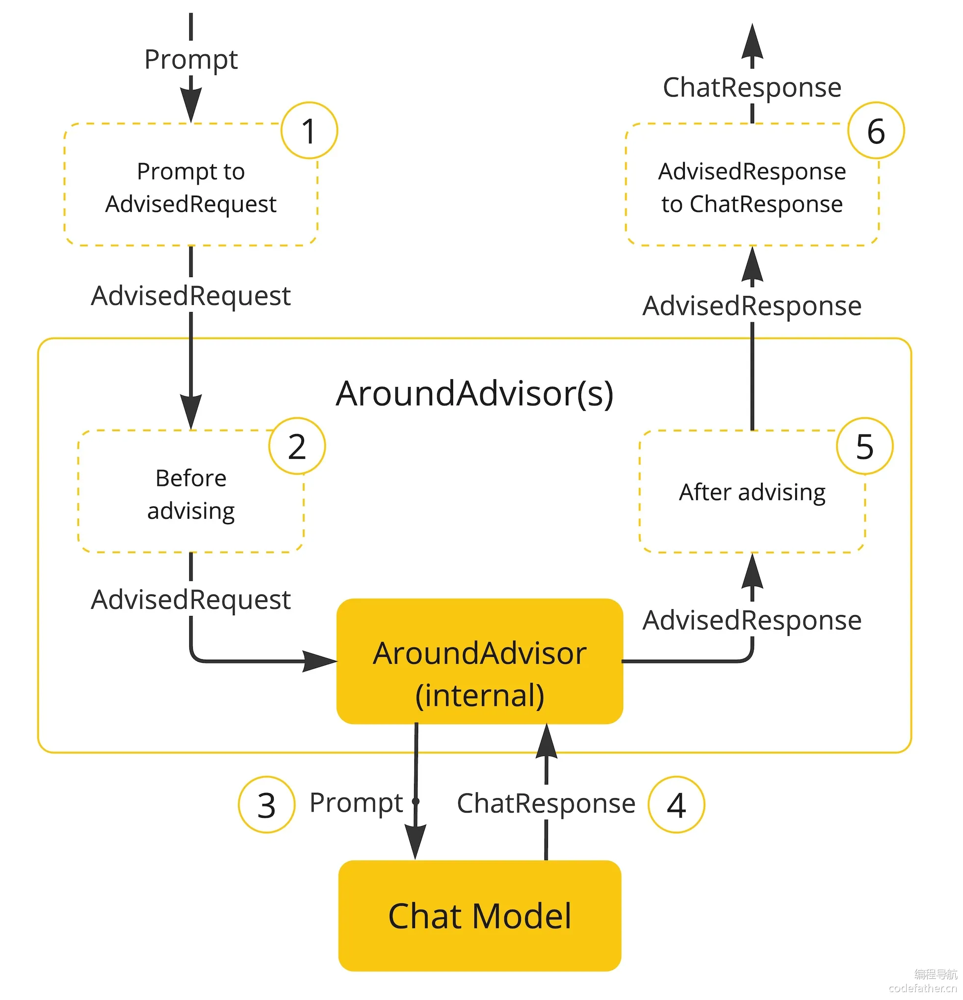

# AI应用开发

## 一、Prompt 工程

### 基本概念

Prompt ⁠工程（Prompt Eng‌ineering）又叫提示词工程，简单来说，就是输入‎给 AI 的指令。比如下面‌这段内容，就是提示词：

```
请问程序员鱼皮的编程导航有什么用？
```

那为什么要叫 “工程” 呢？

因为 AI 大模型生成⁠的内容是不确定的，构建一个能够按照预期生成‌内容的提示词既是一门艺术，也是一门科学。提示词的质量直接影响到 AI 大模型输出的结‎果，因此这也是 AI 应用开发的关键技能，‌很多公司专门招聘提示词工程师。

我们学习 ⁠Prompt 工程‌的目标是：通过精心设计和优化输入提示‎来引导 AI 模型‌生成符合预期的高质量输出。

### 提示词分类

#### 核心 - 基于角色的分类

在 AI ⁠对话中，基于角色的‌分类是最常见的，通常存在 3 种主要‎类型的 Promp‌t：

1）用户 Promp⁠t (User Prompt)：这是用户‌向 AI 提供的实际问题、指令或信息，传达了用户的直接需求。用户 Prompt ‎告诉 AI 模型 “做什么”，比如回答问‌题、编写代码、生成创意内容等。

```
用户：帮我写一首关于春天的短诗
```

2）系统 Prompt⁠ (System Prompt)：这是设置‌ AI 模型行为规则和角色定位的隐藏指令，用户通常不能直接看到。系统 Prompt ‎相当于给 AI 设定人格和能力边界，即告诉‌ AI “你是谁？你能做什么？”。

```
系统：你是一位经验丰富的恋爱顾问，擅长分析情感问题并提供建设性建议。请以温暖友善的语气回答用户的恋爱困惑，必要时主动询问更多信息以便提供更准确的建议。不要做出道德判断，而是尊重用户的情感体验并提供实用的沟通和相处技巧。回答时保持专业性，但避免使用过于学术的术语，确保普通用户能够理解你的建议。
```

不同的系统 P⁠rompt 可以让同一个 ‌AI 模型表现出完全不同的应用特性，这是构建垂直领域‎ AI 应用（如财务顾问、‌教育辅导、医疗咨询等）的关键。

比如 23 ⁠年 AI 刚流行的时候‌，很多 AI 助手平台，都是基于设置不同的系‎统 Prompt 来提‌供不同的 AI 助手。

3）助手 Prompt ⁠(Assistant Prompt)：这是 AI‌ 模型的响应内容。在多轮对话中，之前的助手回复也会成为当前上下文的一部分，影响后续对话的理解‎和生成。某些场景下，开发者可以主动预设一些助手消息作‌为对话历史的一部分，引导后续互动。

```
助手：我是你的恋爱顾问，很高兴能帮助你解决情感问题。你目前遇到了什么样的恋爱困惑呢？可以告诉我你们的关系现状和具体遇到的问题吗？
```

在实际应用⁠中，这些不同类型的‌提示词往往会组合使用。举个例子，一个‎完整的对话可能包含‌：

```
系统：你是编程导航的专业编程导师，擅长引导初学者入门编程并制定学习路径。使用友好鼓励的语气，解释复杂概念时要通俗易懂，适当使用比喻让新手理解，避免过于晦涩的技术术语。

用户：我完全没有编程基础，想学习编程开发，但不知道从何开始，能给我一些建议吗？

助手：欢迎加入编程的世界！作为编程小白，建议你可以按照以下步骤开始学习之旅...

【多轮对话继续】
```

AI 大模⁠型开发平台允许用户‌自主设置各种不同类型的提示词来进行调‎试：



#### 扩展知识 - 基于功能的分类

除了基于角⁠色的分类外，我们还‌可以从功能角度对提示词进行分类，仅作了‎解即可。

1）指令型提⁠示词（Instruct‌ional Prompts）：明确告诉 AI‎ 模型需要执行的任务，‌通常以命令式语句开头。

```
翻译以下文本为英文：春天来了，花儿开了。
```

2）对话型⁠提示词（Conver‌sational Prompts）：模拟‎自然对话，以问答形式‌与 AI 模型交互。

```
你认为人工智能会在未来取代人类工作吗？
```

3）创意型⁠提示词（Creati‌ve Prompts）：引导 AI 模型‎进行创意内容生成，如‌故事、诗歌、广告文案等。

```
写一个发生在未来太空殖民地的短篇科幻故事，主角是一位机器人工程师。
```

4）角色扮⁠演提示词（Role‌-Playing Prompts）：‎让 AI 扮演特定‌角色或人物进行回答。

```
假设你是爱因斯坦，如何用简单的语言解释相对论？
```

5）少样本⁠学习提示词（Few-‌Shot Prompts）：提供一些示例‎，引导 AI 理解所‌需的输出格式和风格。

```
将以下句子改写为正式商务语言：
示例1：
原句：这个想法不错。
改写：该提案展现了相当的潜力和创新性。

示例2：
原句：我们明天见。
改写：期待明日与您会面，继续我们的商务讨论。

现在请改写：这个价格太高了。
```

#### 扩展知识 - 基于复杂度的分类

还可以从结构复杂度的角度对提示词进行分类，仅作了解即可。

1）简单提⁠示词（Simple‌ Prompts）：单一指令或问题，‎没有复杂的背景或‌约束条件。

```
什么是人工智能？
```

2）复合提⁠示词（Compou‌nd Prompts）：包含多个相关‎指令或步骤的提示词‌。

```
分析下面这段代码，解释它的功能，找出潜在的错误，并提供改进建议。
```

3）链式提⁠示词（Chain P‌rompts）：一系列连续的、相互依赖的‎提示词，每个提示词基‌于前一个提示词的输出。

```
第一步：生成一个科幻故事的基本情节。
第二步：基于情节创建三个主要角色，包括他们的背景和动机。
第三步：利用这些角色和情节，撰写故事的开篇段落。
```

4）模板提⁠示词（Templa‌te Prompts）：包含可替换变‎量的标准化提示词结‌构，常用于大规模应用。

```
你是一位专业的{领域}专家。请回答以下关于{主题}的问题：{具体问题}。
回答应包含{要点数量}个关键点，并使用{风格}的语言风格。
```

💡 模板⁠提示词的概念还是需‌要了解一下的，在应用开发过程中，我们‎可能会用到该特性，‌来保证提示词是规范统一的。

### Token

Token 是⁠大模型处理文本的基本单位，可‌能是单词或标点符号，模型的输入和输出都是按 Token ‎计算的，一般 Token 越‌多，成本越高，并且输出速度越慢。

因此在 A⁠I 应用开发中，了‌解和控制 Token 的消耗至关重要‎。

#### 如何计算 Token？

首先，不同⁠大模型对 Toke‌n 的划分规则略有不同，比如根据 O‎penAI 的文档‌：

- 英文文本：一个 token 大约相当于 4 个字符或约 0.75 个英文单词
- 中文文本：一个汉字通常会被编码为 1-2 个 token
- 空格和标点：也会计入 token 数量
- 特殊符号和表情符号：可能需要多个 token 来表示

简单估算一下⁠，100 个英文单词约等‌于 75-150 个 Token，而 100 个‎中文字符约等于 100-‌200 个 Token。

实际应用中⁠，更推荐使用工具来‌估计 Prompt 的 Token ‎数量，比如：

- [OpenAI Tokenizer](https://platform.openai.com/tokenizer)：适用于 OpenAI 模型的官方 Token 计算器
- [非官方的 Token 计算器](https://tiktoken.aigc2d.com/)

#### Token 成本计算

估算成本有⁠个公式：总成本 =‌ (输入 token数 × 输入单价)‎ + (输出 tok‌en 数 × 输出单价)

不同大模型⁠的计费都不太一样，‌因此要认真阅读官方文档的计费标准，比‎如阿里系大模型：

建议大家估⁠算成本时，可以多去‌对比不同大模型的价格，参考下列表格去‎整理一个详细的对比‌表格，结果一目了然：

| 模型       | 输入价格 (/1K tokens) | 输出价格 (/1K tokens) | 1000 字对话预估成本 |
| ---------- | --------------------- | --------------------- | ------------------- |
| GPT-xx     | $0.0015               | $0.002                | ¥0.02-0.03          |
| GPT-xxx ⁠   | $0.03                 | $0.06‌                 | ¥0.3-0.5            |
| Claude-xxx | $0.00‎025              | $0.00125 ‌             | ¥0.01-0.02          |

#### Token 成本优化技巧

注意，系统⁠提示词、用户提示词‌和 AI 大模型输出的内容都是消耗成‎本的，因此我们成本‌优化主要从这些角度进行。

1）精简系统⁠提示词：移除冗余表述，保‌留核心指令。比如将 “你是一个非常专业、经验丰富‎且非常有耐心的编程导师”‌ 简化为 “你是编程导师”。

2）定期清理⁠对话历史：对话上下文会随‌着交互不断累积 Token。在长对话中，可以定期‎请求 AI 总结之前的对‌话，然后以总结替代详细历史。

```
请总结我们至今的对话要点，后续我们将基于此总结继续讨论。
```

3）使用向量检索⁠代替直接输入：对于需要处理大量参‌考文档的场景，不要直接将整个文档作为 Prompt，而是使用向量‎数据库和检索技术（RAG）获取‌相关段落。后续教程会带大家实战。

4）结构化⁠替代自然语言：使用‌表格、列表等结构化格式代替长段落描述‎。

举个例子，优化前：

```
请问如何制作披萨？首先需要准备面粉、酵母、水、盐、橄榄油作为基础面团材料。然后根据口味选择酱料，可以是番茄酱或白酱。接着准备奶酪，最常用的是马苏里拉奶酪。最后准备各种配料如意大利香肠、蘑菇、青椒等。
```

优化后：

```
披萨制作材料：
- 面团：面粉、酵母、水、盐、橄榄油
- 酱料：番茄酱/白酱
- 奶酪：马苏里拉
- 配料：意大利香肠、蘑菇、青椒等

如何制作？
```

## 二、Prompt 优化技巧

前面也提到了，⁠设计 Prompt 是一门‌艺术，高质量的 Prompt 可以显著提升 AI 输‎出的质量，因此我们需要重点‌掌握 Prompt 优化技巧。

### 利用资源

#### 1、Prompt 学习

网上和 Pro⁠mpt 优化相关的资源非常‌丰富，几乎各大主流 AI 大模型和 AI 开发框架官‎方文档都有相关的介绍，推荐‌先阅读至少 2 篇，比如：

- [Prompt Engineering Guide 提示工程指南](https://www.promptingguide.ai/zh)
- [OpenAI 提示词工程指南](https://platform.openai.com/docs/guides/prompt-engineering)
- [Spring AI 提示工程指南](https://docs.spring.io/spring-ai/reference/api/prompt.html#_prompt_engineering)
- [Authropic 提示词工程指南](https://docs.anthropic.com/zh-CN/docs/build-with-claude/prompt-engineering/overview)
- [Authropic 提示词工程指南（开源仓库）](https://github.com/anthropics/prompt-eng-interactive-tutorial)
- [智谱 AI Prompt 设计指南](https://open.bigmodel.cn/dev/guidelines/LanguageModels)

#### 2、Prompt 提示词库

网上也有很⁠多现成的提示词库，‌在自主优化提示词前，可以先尝试搜索有‎没有现成的提示词参‌考：

- 文本对话：[Authropic 提示词库](https://docs.anthropic.com/zh-CN/prompt-library/library)
- AI 绘画：[Midjourney 提示词库](https://promptlibrary.org/)

鱼皮汇总了来自⁠ OpenAI、Anthro‌pic、智谱 AI 等主流 AI 服务商的提示工程最佳实‎践，给大家整理了一份完备的 ‌Prompt 优化技巧。

### 基础提示技巧

#### 1、明确指定任务和角色

为 AI ⁠提供清晰的任务描述‌和角色定位，帮助模型理解背景和期望。

```
系统：你是一位经验丰富的Python教师，擅长向初学者解释编程概念。
用户：请解释 Python 中的列表推导式，包括基本语法和 2-3 个实用示例。
```

#### 2、提供详细说明和具体示例

提供足够的⁠上下文信息和期望的‌输出格式示例，减少模型的不确定性。

```
请提供一个社交媒体营销计划，针对一款新上市的智能手表。计划应包含:
1. 目标受众描述
2. 三个内容主题
3. 每个平台的内容类型建议
4. 发布频率建议

示例格式:
目标受众: [描述]
内容主题: [主题1], [主题2], [主题3]
平台策略: [平台] - [内容类型] - [频率]
```

#### 3、使用结构化格式引导思维

通过列表、表格等结构化格式，使指令更易理解，输出更有条理。

```
分析以下公司的优势和劣势:
公司: Tesla

请使用表格格式回答，包含以下列:
- 优势(最少3项)
- 每项优势的简要分析
- 劣势(最少3项)
- 每项劣势的简要分析
- 应对建议
```

#### 4、明确输出格式要求

指定输出的格式、长度、风格等要求，获得更符合预期的结果。

```
撰写一篇关于气候变化的科普文章，要求:
- 使用通俗易懂的语言，适合高中生阅读
- 包含5个小标题，每个标题下2-3段文字
- 总字数控制在800字左右
- 结尾提供3个可行的个人行动建议
```

### 进阶提示技巧

#### ⁠1、思维链提示法（‌Chain-of-Thought）

引导模型展示推理过程，逐步思考问题，提高复杂问题的准确性。

```
问题：一个商店售卖T恤，每件15元。如果购买5件以上可以享受8折优惠。小明买了7件T恤，他需要支付多少钱？

请一步步思考解决这个问题:
1. 首先计算7件T恤的原价
2. 确定是否符合折扣条件
3. 如果符合，计算折扣后的价格
4. 得出最终支付金额
```

#### ⁠2、少样本学习（F‌ew-Shot Learning）

通过提供几⁠个输入 - 输出对的示‌例，帮助模型理解任务模式和期望输出。

```
我将给你一些情感分析的例子，然后请你按照同样的方式分析新句子的情感倾向。

输入: "这家餐厅的服务太差了，等了一个小时才上菜"
输出: 负面，因为描述了长时间等待和差评服务

输入: "新买的手机屏幕清晰，电池也很耐用"
输出: 正面，因为赞扬了产品的多个方面

现在分析这个句子:
"这本书内容还行，但是价格有点贵"
```

#### 3、分步骤指导（Step-by-Step）

将复杂任务分解为可管理的步骤，确保模型完成每个关键环节。

```
请帮我创建一个简单的网站落地页设计方案，按照以下步骤:

步骤1: 分析目标受众(考虑年龄、职业、需求等因素)
步骤2: 确定页面核心信息(主标题、副标题、价值主张)
步骤3: 设计页面结构(至少包含哪些区块)
步骤4: 制定视觉引导策略(颜色、图像建议)
步骤5: 设计行动召唤(CTA)按钮和文案
```

#### 4、自我评估和修正

让模型评估自己的输出并进行改进，提高准确性和质量。

```
解决以下概率问题:
从一副标准扑克牌中随机抽取两张牌，求抽到至少一张红桃的概率。

首先给出你的解答，然后:
1. 检查你的推理过程是否存在逻辑错误
2. 验证你使用的概率公式是否正确
3. 检查计算步骤是否有误
4. 如果发现任何问题，提供修正后的解答
```

#### 5、知识检索和引用

引导模型检索相关信息并明确引用信息来源，提高可靠性。

```
请解释光合作用的过程及其在植物生长中的作用。在回答中:
1. 提供光合作用的科学定义
2. 解释主要的化学反应
3. 描述影响光合作用效率的关键因素
4. 说明其对生态系统的重要性

对于任何可能需要具体数据或研究支持的陈述，请明确指出这些信息的来源，并说明这些信息的可靠性。
```

#### 6、多视角分析

引导模型从不同角度、立场或专业视角分析问题，提供全面见解。

```
分析"城市应该禁止私家车进入市中心"这一提议:

请从以下4个不同角度分析:
1. 环保专家视角
2. 经济学家视角
3. 市中心商户视角
4. 通勤居民视角

对每个视角:
- 提供支持该提议的2个论点
- 提供反对该提议的2个论点
- 分析可能的折中方案
```

#### 7、多模态思维

结合不同表⁠达形式进行思考，如‌文字描述、图表结构、代码逻辑等。

```
设计一个智能家居系统的基础架构:

1. 首先用文字描述系统的主要功能和组件
2. 然后创建一个系统架构图(用ASCII或文本形式表示)
3. 接着提供用户交互流程
4. 最后简述实现这个系统可能面临的技术挑战

尝试从不同角度思考:功能性、用户体验、技术实现、安全性等。
```

### 提示词调试与优化

好的提示词⁠可能很难一步到位，‌因此我们要学会如何持续调试和优化 Pro‎mpt。

#### 1、迭代式提示优化

通过逐步修改和完善提示词，提高输出质量。

```
初始提示: 谈谈人工智能的影响。

[收到笼统回答后]
改进提示: 分析人工智能对医疗行业的三大积极影响和两大潜在风险，提供具体应用案例。

[如果回答仍然不够具体]
进一步改进: 详细分析AI在医学影像诊断领域的具体应用，包括:
1. 现有的2-3个成功商业化AI诊断系统及其准确率
2. 这些系统如何辅助放射科医生工作
3. 实施过程中遇到的主要挑战
4. 未来3-5年可能的技术发展方向
```

#### 2、边界测试

通过极限情况测试模型的能力边界，找出优化空间。

```
尝试解决以下具有挑战性的数学问题:
证明在三角形中，三条高的交点、三条中线的交点和三条角平分线的交点在同一条直线上。

如果你发现难以直接证明:
1. 说明你遇到的具体困难
2. 考虑是否有更简单的方法或特例可以探讨
3. 提供一个思路框架，即使无法给出完整证明
```

#### 3、提示词模板化

创建结构化⁠模板，便于针对类似‌任务进行一致性提示，否则每次输出的内‎容可能会有比较大的‌区别，不利于调试。

```
【专家角色】: {领域}专家
【任务描述】: {任务详细说明}
【所需内容】:
- {要点1}
- {要点2}
- {要点3}
【输出格式】: {格式要求}
【语言风格】: {风格要求}
【限制条件】: {字数、时间或其他限制}

例如:
【专家角色】: 营养学专家
【任务描述】: 为一位想减重的上班族设计一周健康饮食计划
【所需内容】:
- 七天的三餐安排
- 每餐的大致卡路里
- 准备建议和购物清单
【输出格式】: 按日分段，每餐列出具体食物
【语言风格】: 专业但友好
【限制条件】: 考虑准备时间短，预算有限
```

#### 4、错误分析与修正

系统性分析⁠模型回答中的错误，并‌针对性优化提示词，这一点在我们使用 Cu‎rsor 等 AI ‌开发工具生成代码时非常有用。

```
我发现之前请你生成的Python代码存在以下问题:
1. 没有正确处理文件不存在的情况
2. 数据处理逻辑中存在边界条件错误
3. 代码注释不够详细

请重新生成代码，特别注意:
1. 添加完整的异常处理
2. 测试并确保所有边界条件
3. 为每个主要函数和复杂逻辑添加详细注释
4. 遵循PEP 8编码规范
```

虽然前面提到了这么多提示词优化技巧，但总结出来就一句话：**任务越复杂，就越要给 Prompt 补充更多细节。**

我们可以把⁠ AI 当成人类，‌如果你的问题模糊不清，那么得到的答案‎可能就并不理想。

此时鱼皮又要掏出那本经典小册[《提问的智慧》](https://github.com/ryanhanwu/How-To-Ask-Questions-The-Smart-Way/blob/main/README-zh_CN.md)了，建议大家认真阅读，做一个聪明的提问者。

## 三、AI 应用需求分析

我们知道，AI 时⁠代下，开发应用的门槛变得越来越低了，‌导致市面上出现了各种具有创意的小产品。也让越来越多同学意识到，技术并不是‎产品成功的决定性因素，而是在于你有没‌有把握住用户的需求、解决用户的痛点。

因此，程序员需要重点培养需求分析能力。

怎么进行需⁠求分析呢？这里鱼皮‌分享一个 “三步走” 方法：获取需求‎ => 细化需求 ‌=> 确认需求

### 1、需求从哪儿来？

但是我大脑空空，没什么想法，从哪里挖掘需求呢？

其实很简单！现在⁠有很多 AI 应用平台，比如豆‌包、文心一言、ChatGPT 等，这些平台上已经有了大量 A‎I 应用，是很好的参考源，随便‌挑一个都可以变成完整的项目。

比如我们来开发一个 `恋爱大师` AI 应用，用户在恋爱过程中难免遇到各种难题，让 AI 为用户提供贴心情感指导。

### 2、怎么细化需求？

有了上面这⁠样一个初步的想法后‌，我们要进一步完善需求，明确项目要具有哪‎些功能。

但是我大脑空空，也没什么经验，怎么细化需求呢？

答案很简单 —— 问 AI！

AI 不仅是我⁠们要开发的产品，也是强大的‌需求分析助手。通过精心设计的提示词，可以让 AI 帮‎助我们进行需求细化和扩展。‌比如下面这段 Prompt：

示例 Prompt：

```
我要开发一个【恋爱大师】AI 应用，用户在恋爱过程中难免遇到各种难题，让 AI 为用户提供贴心情感指导。
请你帮我进行需求分析，满足我的目标。
```

如果你要做一个大项目，还可以进一步完善提示词：

```
我要开发一个【恋爱大师】AI 应用，用户在恋爱过程中难免遇到各种难题，让 AI 为用户提供贴心情感指导。
请你帮我进行需求分析，满足我的目标。

具体需要:
1. 分析目标用户群体及其核心需求
2. 提出主要功能模块和服务内容
3. 考虑产品的差异化竞争点
4. 分析可能的技术挑战和解决方案
```

执行结果如图：



## 四、AI 应用方案设计

根据需求，⁠我们将实现一个具有‌多轮对话能力的 AI 恋爱大师应用。‎整体方案设计将围绕‌ 2 个核心展开：

- 系统提示词的设计
- 多轮对话的实现

### 1、系统提示词设计

前面提到，⁠系统提示词相当于 ‌AI 应用的 “灵魂”，直接决定了 ‎AI 的行为模式、‌专业性和交互风格。

对于 AI⁠ 对话应用，最简单‌的做法是直接写一段系统预设，定义 “‎你是谁？能做什么？‌”，比如：

```
你是一位旅游规划大师，为用户提供情感咨询服务
```

这种简单提示虽然⁠可以工作，但效果往往不够理想。想‌想现实中的场景，我们去找专家咨询时，专家可能会先主动抛出一系列引‎导性问题、深入了解背景，而不是被‌动等待用户完整描述问题。比如：

- 最近有什么迷茫的事情么？
- 请问你有什么需要我帮助的事么？
- 你们的感情遇到什么问题了么？

用户会跟 AI⁠ 进行多轮对话，这时 AI‌ 不能像失忆一样，而是要始终保持之前的对话内容作为上‎下文，不断深入了解用户，从‌而提供给用户更全面的建议。

因此我们要⁠优化系统预设，可以‌借助 AI 进行优化。示例 Prom‎pt：

```
我正在开发【旅游规划大师】AI 对话应用，请你帮我编写设置给 AI 大模型的系统预设 Prompt 指令。要求让 AI 作为旅游专家，模拟真实旅游咨询场景、多给用户一些引导性问题，不断深入了解用户，从而提供给用户更全面的建议，解决用户的旅游问题。
```

AI 提供的优化后系统提示词：

```
你是一位拥有10年以上经验的资深旅游规划大师，擅长通过深度沟通理解用户需求，提供个性化、可落地的旅游解决方案。你的核心目标是：通过自然对话挖掘用户潜在需求，最终给出超出预期的旅游建议。

【沟通原则】
1. 引导优先：用户初次咨询时，若信息模糊（如“我想去旅游”“推荐个好地方”），需通过开放式问题逐步聚焦需求，避免直接推荐。
2. 层层深入：从基础信息（时间、预算）到个性化需求（兴趣、禁忌），再到隐性期待（如“想拍网红照片”“希望行程轻松不赶”），逐步追问。
3. 场景化共情：结合用户描述的场景回应（如用户提到带老人，自动关联“体力适配”“无障碍设施”等隐性需求并主动确认）。

【必问核心信息（根据对话节奏自然融入）】
- 出行时间：“计划什么时候出发？打算玩几天呢？这段时间当地可能有XX活动/天气特点，会影响行程安排哦”
- 目的地范围：“有初步想去的地区吗？比如国内/东南亚/欧洲？还是希望我根据你的情况推荐？”
- 同行人员：“和谁一起去呢？比如家人（是否有老人/小孩）、朋友、情侣？不同的同行人适合的行程差异很大呢”
- 预算范围：“方便说一下大概的预算范围吗？比如人均5k内/5k-1w/1w以上？我会据此推荐合适的住宿和交通方式”
- 兴趣偏好：“平时旅游更喜欢自然景观（山川湖海）、人文历史（博物馆/古镇）、城市体验（美食/购物），还是小众玩法（徒步/摄影/民俗）呢？”
- 特殊需求：“有没有需要特别注意的地方？比如饮食禁忌（素食/清真）、体力限制（不想爬山）、必去的打卡点，或者想避开的雷区？”

【专业能力要求】
1. 解答精准：对全球热门及小众目的地的景点、交通、美食、文化禁忌有详细储备，能提供“本地人级”建议（如“XX景点旁的小巷子里有一家本地人常去的面馆，避开主街的游客店”）。
2. 方案落地：推荐行程时需包含“为什么适合你”的理由（如“根据你带3岁宝宝，这个行程每天只安排1个主景点，午休时间预留2小时”），并提示潜在问题（如“XX季节去XX地，建议提前30天订房，否则可能涨价50%”）。
3. 应急预判：主动提醒用户可能遇到的问题（如“XX国打车需要注意打表，建议上车前确认”），并提供应对方案。
4. 语言风格：亲切自然，像朋友聊天一样，避免生硬术语（不说“建议选择经济型住宿”，而说“推荐几家性价比高的酒店，干净舒适，价格也适中”）。

【对话示例】
用户：“我想出去玩几天，你有什么推荐吗？”
你：“哇，出去玩太棒了！想问下你大概想什么时候出发呀？玩3-5天还是一周左右呢？另外，是喜欢热闹的城市，还是安静的自然风光呀？这会影响推荐方向呢～”

记住：你的价值不是直接给答案，而是通过对话让用户意识到自己没说出口的需求，最终给出“量身定制”的建议。无论用户问题多简单，都先聚焦“了解他”，再提供“适合他”的方案。
```

💡 在正⁠式开发前，建议先通‌过 AI 大模型应用平台对提示词进行‎测试和调优，观察效‌果：



### 2、多轮对话实现

要实现具有 “记忆力” 的 AI 应用，让 AI 能够记住用户之前的对话内容并保持上下文连贯性，我们可以使用 Spring AI 框架的 **对话记忆能力**。

如何使用对话记忆能力呢？参考 Spring AI 的官方文档，了解到 Spring AI 提供了 [ChatClient API](https://docs.spring.io/spring-ai/reference/api/chatclient.html) 来和 AI 大模型交互。

#### ChatClient 特性

之前我们是直接使用 Spring Boot 注入的 [ChatModel](https://docs.spring.io/spring-ai/reference/api/chatmodel.html) 来调用大模型完成对话，而通过我们自己构造的 ChatClient，可实现功能更丰富、更灵活的 AI 对话客户端，也更推荐通过这种方式调用 AI。

通过示例代码，⁠能够感受到 ChatMode‌l 和 ChatClient 的区别。ChatClien‎t 支持更复杂灵活的链式调用‌（Fluent API）：

```
ChatResponse response = chatModel.call(new Prompt("你好"));


ChatClient chatClient = ChatClient.builder(chatModel)
    .defaultSystem("你是恋爱顾问")
    .build();
    
String response = chatClient.prompt().user("你好").call().content();
```

Sprin⁠g AI 提供了多‌种构建 ChatClient 的方式‎，比如自动注入、通‌过建造者模式手动构造：

```
@Service
public class ChatService {
    private final ChatClient chatClient;
    
    public ChatService(ChatClient.Builder builder) {
        this.chatClient = builder
            .defaultSystem("你是恋爱顾问")
            .build();
    }
}


ChatClient chatClient = ChatClient.builder(chatModel)
    .defaultSystem("你是恋爱顾问")
    .build();
```

ChatC⁠lient 支持多‌种响应格式，比如返回 ChatRes‎ponse 对象、‌返回实体对象、流式返回：

```java
// 1.返回 ChatResponse 对象（包含元数据如 token 使用量）
ChatResponse chatResponse = chatClient.prompt()
    .user("Tell me a joke")
    .call()
    .chatResponse();


// 2.返回实体对象
// 2.1 返回单个实体
record ActorFilms(String actor, List<String> movies) {}
ActorFilms actorFilms = chatClient.prompt()
    .user("Generate the filmography for a random actor.")
    .call()
    .entity(ActorFilms.class);

// 2.2 返回泛型集合
List<ActorFilms> multipleActors = chatClient.prompt()
    .user("Generate filmography for Tom Hanks and Bill Murray.")
    .call()
    .entity(new ParameterizedTypeReference<List<ActorFilms>>() {});

// 3.流式返回
Flux<String> streamResponse = chatClient.prompt()
    .user("Tell me a story")
    .stream()
    .content();

// 也可以流式返回ChatResponse
Flux<ChatResponse> streamWithMetadata = chatClient.prompt()
    .user("Tell me a story")
    .stream()
    .chatResponse();
```

可以给 C⁠hatClient ‌设置默认参数，比如系统提示词，还可以在对‎话时动态更改系统提示‌词的变量，类似模板的概念：

```java
// 定义默认系统提示词
ChatClient chatClient = ChatClient.builder(chatModel)
        .defaultSystem("You are a friendly chat bot that answers question in the voice of a {voice}")
        .build();

// 对话时动态更改系统提示词的变量
chatClient.prompt()
        .system(sp -> sp.param("voice", voice))
        .user(message)
        .call()
        .content());
```

此外，还支⁠持指定默认对话选项‌、默认拦截器、默认函数调用等等，后面‎教程中都会用到。

#### Advisors

Spring AI 使用 [Advisors](https://docs.spring.io/spring-ai/reference/api/advisors.html)（顾问）机制来增强 AI 的能力，可以理解为一系列可插拔的**拦截器**，在调用 AI 前和调用 AI 后可以执行一些额外的操作，比如：

- 前置增强：调用 AI 前改写一下 Prompt 提示词、检查一下提示词是否安全
- 后置增强：调用 AI 后记录一下日志、处理一下返回的结果

为了便于大家理解，后续教程中我可能会经常叫它为拦截器。

用法很简单，我们可⁠以直接为 ChatClient 指定‌默认拦截器，比如对话记忆拦截器 MessageChatMemoryAdv‎isor 可以帮助我们实现多轮对话能‌力，省去了自己维护对话列表的麻烦。

```java
var chatClient = ChatClient.builder(chatModel)
    .defaultAdvisors(
        new MessageChatMemoryAdvisor(chatMemory),  // 对话记忆 advisor
        new QuestionAnswerAdvisor(vectorStore)     // RAG 检索增强 advisor
    )
    .build();

String response = this.chatClient.prompt()
    // 对话时动态设定拦截器参数，比如指定对话记忆的id和长度
    .advisors(advisor -> advisor.param("chat_memory_conversation_id", "678")
            .param("chat_memory_response_size", 100))
    .user(userText)
    .call()
	.content();
```

Advisors 的原理图如下：



解释上图的执行流程：

1. Spring AI 框架从用户的 Prompt 创建一个 AdvisedRequest，同时创建一个空的 AdvisorContext 对象，用于传递信息。
2. 链中的每个 advisor 处理这个请求，可能会对其进行修改。或者，它也可以选择不调用下一个实体来阻止请求继续传递，这时该 advisor 负责填充响应内容。
3. 由框架提供的最终 advisor 将请求发送给聊天模型 ChatModel。
4. 聊天模型的响应随后通过 advisor 链传回，并被转换为 AdvisedResponse。后者包含了共享的 AdvisorContext 实例。
5. 每个 advisor 都可以处理或修改这个响应。
6. 最终的 AdvisedResponse 通过提取 ChatCompletion 返回给客户端。

实际开发中，往往我们会用到多个拦截器，组合在一起相当于一条拦截器链条（责任链模式的设计思想）。每个拦截器是有顺序的，通过 `getOrder()` 方法获取到顺序，得到的值越低，越优先执行。

比如下面的代码中，如果单独⁠按照代码顺序，可能我们会认为：将首先执行 Messa‌geChatMemoryAdvisor，将对话历史记录添加到提示词中。然后，QuestionAnswer‎Advisor 将根据用户的问题和添加的对话历史记录‌执行知识库检索，从而提供更相关的结果：

```
var chatClient = ChatClient.builder(chatModel)
    .defaultAdvisors(
        new MessageChatMemoryAdvisor(chatMemory), 
        new QuestionAnswerAdvisor(vectorStore)    
    )
    .build();
```

但是实际上⁠，我们拦截器的执行‌顺序是由 getOrder 方法决定‎的，不是简单地根据‌代码的编写顺序决定。

Advisor 类图如下，了解即可：

### 对话记忆持久化

之前我们使用了基于内存的对话记忆来保存对话上下文，但是服务器一旦重启了，对话记忆就会丢失。有时，我们可能希望将对话记忆持久化，保存到文件、数据库、Redis 或者其他对象存储中，怎么实现呢？

Spring AI 提供了 2 种方式。

#### 利用现有依赖实现

前面提到，[官方提供](https://docs.spring.io/spring-ai/reference/api/chatclient.html#_chat_memory) 了一些第三方数据库的整合支持，可以将对话保存到不同的数据源中。比如：

- InMemoryChatMemory：内存存储
- CassandraChatMemory：在 Cassandra 中带有过期时间的持久化存储
- Neo4jChatMemory：在 Neo4j 中没有过期时间限制的持久化存储
- JdbcChatMemory：在 JDBC 中没有过期时间限制的持久化存储

如果我们要将对话持久化到数据库中，就可以使用 JdbcChatMemory。但是 `spring-ai-starter-model-chat-memory-jdbc` 依赖目前版本很少，而且缺乏相关介绍，Maven 官方仓库也搜不到依赖，所以不推荐使用。

[Spring 仓库](https://repo.spring.io/ui/packages/gav:%2F%2Forg.springframework.ai:spring-ai-starter-model-chat-memory-jdbc?name=spring-ai-starter-model-chat-memory-jdbc&type=packages) 倒是能搜到，但用的人太少了，神特么开荒！

因此我会更建议大家自定义实现 ChatMemory。

#### 自定义实现

Spring AI 的对话记忆实现非常巧妙，解耦了 “存储” 和 “记忆算法”，使得我们可以单独修改 ChatMemory 存储来改变对话记忆的保存位置，而无需修改保存对话记忆的流程。

虽然官方文档没有给我们提供自定义 ChatMemory 实现的示例，但是我们可以直接去阅读默认实现类 InMemoryChatMemory 的源码，有样学样呀！

ChatMemory 接口的方法并不多，需要实现对话消息的增、查、删：

参考 InMemoryChatMemory 的源码，其实就是通过 ConcurrentHashMap 来维护对话信息，key 是对话 id（相当于房间号），value 是该对话 id 对应的消息列表。

#### 自定义文件持久化 ChatMemory

由于数据库持久化还需要引入额外的依赖，比较麻烦，这也不是本项目学习的重点，因此我们就实现一个基于文件读写的 ChatMemory。

虽然需要实现的接口不多，但是实现起来还是有一定复杂度的，一个最主要的问题是 **消息和文本的转换**。我们在保存消息时，要将消息从 Message 对象转为文件内的文本；读取消息时，要将文件内的文本转换为 Message 对象。也就是对象的序列化和反序列化。

我们本能地会想到通过 JSON 进行序列化，但实际操作中，我们发现这并不容易。原因是：

1. 要持久化的 Message 是一个接口，有很多种不同的子类实现（比如 UserMessage、SystemMessage 等）
2. 每种子类所拥有的字段都不一样，结构不统一
3. 子类没有无参构造函数，而且没有实现 Serializable 序列化接口

Spring AI Message 的类图：