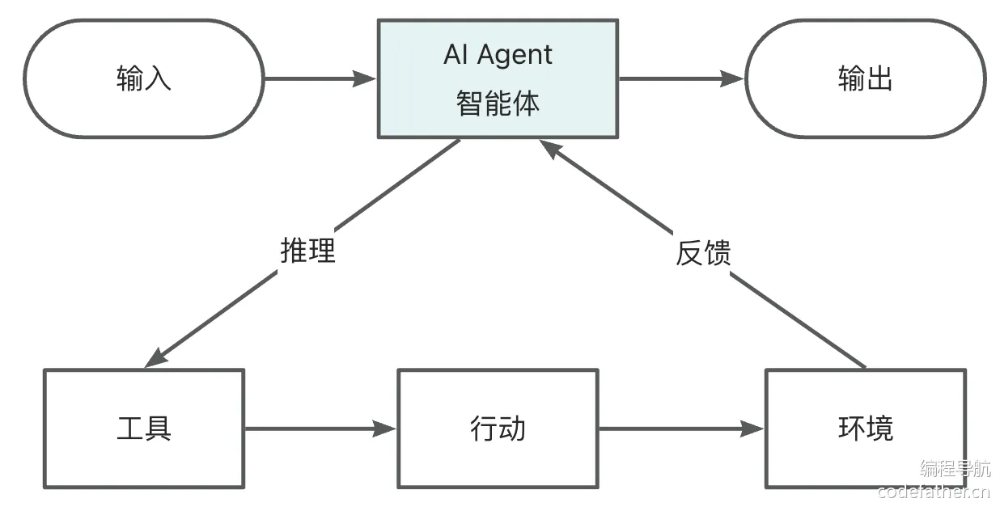
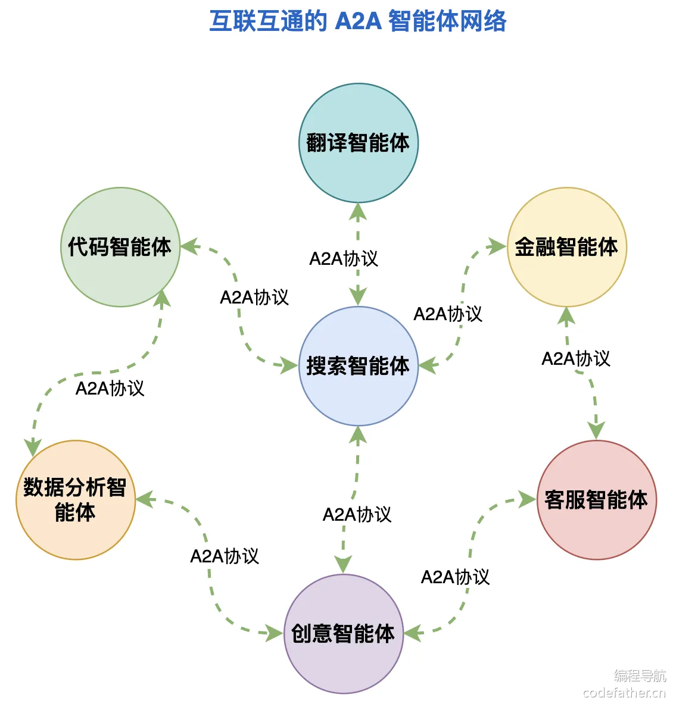
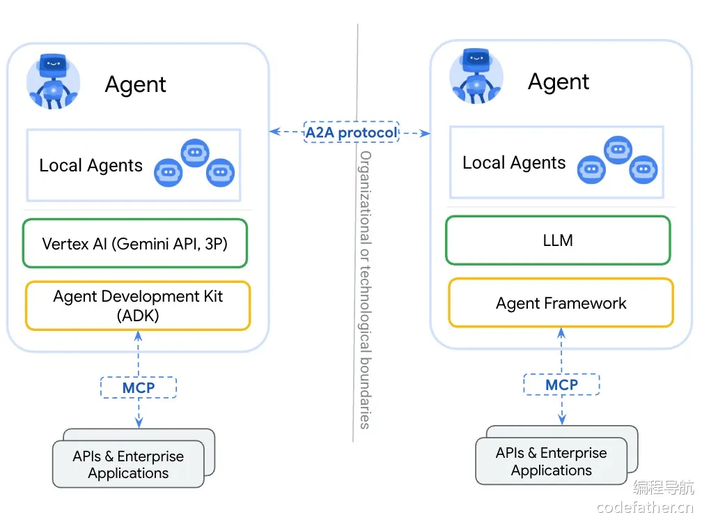

# 智能体

## 一、什么是智能体？

智能体（Agent）是一个能够感知环境、进行推理、制定计划、做出决策并自主采取行动以实现特定目标的 AI 系统。它以大语言模型为核心，集成 **记忆、知识库和工具** 等能力为一体，构造了完整的决策能力、执行能力和记忆能力，就像一个有主观能动性的人类一样。

与普通的 AI 大模型不同，智能体能够：

1. 感知环境：通过各种输入渠道获取信息（多模态），理解用户需求和环境状态
2. 自主规划任务步骤：将复杂任务分解为可执行的子任务，并设计执行顺序
3. 主动调用工具完成任务：根据需要选择并使用各种外部工具和 API，扩展自身能力边界
4. 进行多步推理：通过思维链（Chain of Thought）逐步分析问题并推导解决方案
5. 持续学习和记忆过去的交互：保持上下文连贯性，利用历史交互改进决策
6. 根据环境反馈调整行为：根据执行结果动态调整策略，实现闭环优化

大多数同学⁠第一次感受到智能体‌应该是 “深度思考” 功能，这是 A‎I 逐步智能化的体‌现：

AI 会像人类一样先思考后回答，让答案更准确：

### 智能体的分类

跟人的生长⁠阶段一样，智能体也‌是可以不断进化的。按照自主性和规划能‎力，智能体可以分为‌几个层次：

1）反应式智能⁠体：仅根据当前输入和固定规则‌做出反应，类似简单的聊天机器人，没有真正的规划能力。23‎ 年时的大多数 AI 聊天机‌器人应用，几乎都是反应式智能体。

2）有限规划智能体：能进⁠行简单地多步骤执行，但执行路径通常是预设的或有‌严格限制的。鉴定为 “能干事、但干不了复杂的大事”。24 年流行的很多可联网搜索内容、调用知‎识库和工具的 AI 应用，都属于这类智能体。比‌如 ChatGPT + Plugins：

3）自主规⁠划智能体：也叫目标导‌向智能体，能够根据任务目标自主分解任务、‎制定计划、选择工具并‌一步步执行，直到完成任务。

比如 25 年初很火的 M⁠anus 项目，它的核心亮点在于其 “自主执行” 能‌力。据官方介绍，Manus 能够在虚拟机中调用各种工具（如编写代码、爬取数据）完成任务。其应用场景‎覆盖旅行规划、股票分析、教育内容生成等 40 余个‌领域，所以在当时给了很多人震撼感。

但其实早在这之前，就有类似的项目了，比如 AutoGPT，所以 Manus 大火的同时也被人诟病 “会营销而已”。甚至没隔多久就有小团队开源了 Manus 的复刻版 —— [OpenManus](https://github.com/FoundationAgents/OpenManus)，这类智能体通过 “思考 - 行动 - 观察” 的循环模式工作，能够持续推进任务直至完成目标。

需要注意，自主⁠规划能力是智能体发展的重要‌方向，但并非所有应用场景都需要完全的自主规划能力。在‎某些场景中，限制智能体的自‌主性反而能提高效率和安全性。

## 二、智能体实现关键技术

在自主开发⁠智能体前，我们要先‌了解一下智能体的关键实现技术，也就是‎方案设计阶段做的事‌情。

### CoT 思维链

CoT（Chain of⁠ Thought）思维链是一种让 AI 像人类一‌样 “思考” 的技术，帮助 AI 在处理复杂问题时能够按步骤思考。对于复杂的推理类问题，先思考后‎执行，效果往往更好。而且还可以让模型在生成答案时‌展示推理过程，便于我们理解和优化 AI。

CoT 的实现方式其实很简单⁠，可以在输入 Prompt 时，给模型提供额外的提示或‌引导，比如 “让我们一步一步思考这个问题”，让模型以逐步推理的方式生成回答。还可以运用 Prompt 的优化‎技巧 few shot，给模型提供包含思维链的示例问题‌和答案，让模型学习如何构建自己的思维链。

在 Ope⁠nManus 早期‌版本中，可以看到实现 CoT 的系统‎提示词：

```
You are an assistant focused on Chain of Thought reasoning. For each question, please follow these steps:  
  
1. Break down the problem: Divide complex problems into smaller, more manageable parts  
2. Think step by step: Think through each part in detail, showing your reasoning process  
3. Synthesize conclusions: Integrate the thinking from each part into a complete solution  
4. Provide an answer: Give a final concise answer  
  
Your response should follow this format:  
Thinking: [Detailed thought process, including problem decomposition, reasoning for each step, and analysis]  
Answer: [Final answer based on the thought process, clear and concise]  
  
Remember, the thinking process is more important than the final answer, as it demonstrates how you reached your conclusion.
```

我们来测试一下：

### Agent Loop 执行循环

Agent⁠ Loop 是智能体‌最核心的工作机制，指智能体在没有用户输入‎的情况下，自主重复执‌行推理和工具调用的过程。

在传统的聊天模型中，⁠每次用户提问后，AI 回复一次就结束‌了。但在智能体中，AI 回复后可能会继续自主执行后续动作（如调用工具、处理结果、继续‎推理），形成一个自主执行的循环，直到任务‌完成（或者超出预设的最大步骤数）。

Agent Loop 的实现很简单，参考代码如下：

```java
public String execute() {  
    List<String> results = new ArrayList<>();  
    while (currentStep < MAX_STEPS && !isFinished) {  
        currentStep++;  
        
        String stepResult = executeStep();  
        results.add("步骤 " + currentStep + ": " + stepResult);  
    }  
    if (currentStep >= MAX_STEPS) {  
        results.add("达到最大步骤数: " + MAX_STEPS);  
    }  
    return String.join("\n", results);  
}
```

### ReAct 模式

ReAct（**Reas⁠oning + Acting**）是一种结合‌推理和行动的智能体架构，它模仿人类解决问题时 ” 思考 - 行动 - 观察” 的循‎环，目的是通过交互式决策解决复杂任务，是‌目前最常用的智能体工作模式之一。

核心思想：

1. 推理（Reason）：将原始问题拆分为多步骤任务，明确当前要执行的步骤，比如 “第一步需要打开编程导航网站”。
2. 行动（Act）：调用外部工具执行动作，比如调用搜索引擎、打开浏览器访问网页等。
3. 观察（Observe）：获取工具返回的结果，反馈给智能体进行下一步决策。比如将打开的网页代码输入给 AI。
4. 循环迭代：不断重复上述 3 个过程，直到任务完成或达到终止条件。

ReAct 流程如图：



示例实现代码：

```java
void executeReAct(String task) {  
    String state = "开始";  
  
    while (!state.equals("完成")) {  
        
        String thought = "思考下一步行动";  
        System.out.println("推理: " + thought);  
  
        
        String action = "执行具体操作";  
        System.out.println("行动: " + action);  
  
        
        String observation = "观察执行结果";  
        System.out.println("观察: " + observation);  
  
        
        state = "完成";  
    }  
}
```

### 所需支持系统

除了基本的工作机制外，智能体的实现还依赖于很多支持系统。

1）首先是 ⁠AI 大模型，这个就不‌多说了，大模型提供了思考、推理和决策的核心能‎力，越强的 AI 大模‌型通常执行任务的效果越好。

2）记忆系统

智能体需要记忆系统⁠来存储对话历史、中间结果和执行状态，‌这样它才能够进行连续对话并根据历史对话分析接下来的工作步骤。之前我们学习‎过如何使用 Spring AI 的 ‌ChatMemory 实现对话记忆。

3）知识库

尽管大语言模型拥有⁠丰富的参数知识，但针对特定领域的专‌业知识往往需要额外的知识库支持。之前我们学习过，通过 RAG 检索增‎强生成 + 向量数据库等技术，智能‌体可以检索并利用专业知识回答问题。

4）工具调用

工具是扩展智能体⁠能力边界的关键，智能体通过工具调‌用可以访问搜索引擎、数据库、API 接口等外部服务，极大地增强了‎其解决实际问题的能力。当然，MC‌P 也可以算是工具调用的一种。

💡 这里分享一种特⁠殊的工具调用 —— Compute U‌se，它允许智能体直接与计算环境交互，比如执行代码、操作文件系统等。目前 C‎laude 等平台已提供此类能力，感兴‌趣的同学可以阅读下面的资料学习：

- Claude 支持 Compute Use：https://docs.anthropic.com/en/docs/agents-and-tools/computer-use
- Compute Use 实现示例：https://github.com/anthropics/anthropic-quickstarts/tree/main/computer-use-demo
- Compute Use 开源实现：https://github.com/e2b-dev/open-computer-use、https://github.com/showlab/computer_use_ootb

使用 Com⁠pute Use 功能‌时需要注意，这些操作会在我们自己的系统上执行‎，建议在虚拟环境中运行‌，防止意外操作影响实际系统。

综合上面 4 类⁠技术，并且结合 CoT、Agen‌t Loop、ReAct 等机制（可以总称为 “规划执行机制”）‎，我们就可以构建一个完整的、有自‌主规划能力的智能体系统啦。

## 三、使用 AI 智能体

有 3 种⁠方式可以使用 AI‌ 智能体，之前的教程中其实我们已经有‎接触过，这里再快速‌复习一遍。

### 1、平台中使用

许多 AI⁠ 大模型开发平台已‌经提供了智能体创建和使用功能，最简单‎的方式就是直接在这‌些平台上创建和使用智能体。

比如可以在阿里云百炼、Dify 等平台上创建智能体：

### 2、软件中使用

AI 开发工具 C⁠ursor 就集成了 AI 智能体‌，可以帮我们生成完整的项目代码、或者解释项目代码。选择 Agent ‎模式就可以直接使用了，建议同时开启‌ Thinking 深度思考：

运行效果如⁠图，典型的 CoT‌ + Agent Loop + Re‎Act 模式：

### 3、程序中使用

之前有讲解过⁠，如果使用 AI 大模‌型开发平台创建了智能体，那么可以直接通过 S‎DK 或 API 在自‌己的程序中调用智能体。

当然也可以完全通⁠过编程自主开发智能体，之前我们‌通过 Spring AI 创建的旅游规划大师 APP 就已经是个‎智能体了，包含了大模型决策、记‌忆能力、知识库集成和工具调用。

```
ChatResponse response = chatClient  
        .prompt()  
        .user(message)  
        
        .advisors(spec -> spec.param(CHAT_MEMORY_CONVERSATION_ID_KEY, chatId)  
                .param(CHAT_MEMORY_RETRIEVE_SIZE_KEY, 10))  
        
        .advisors(new MyLoggerAdvisor())  
        
        .advisors(new QuestionAnswerAdvisor(loveAppVectorStore))  
        
        .tools(toolCallbackProvider)  
        .call()  
        .chatResponse();
```

但是，这个⁠实现还不具备完整的‌自主规划和执行能力，下面我们将学习更‎高级的自主规划智‌能体架构。

## 四、OpenManus 实现原理

在我们开发超级智能体前，可以先学习下优秀的开源项目。下面以 [OpenManus 项目](https://github.com/FoundationAgents/OpenManus) 为例，从 0 开始阅读项目源码，学到超级智能体实现方式的同时，帮助大家掌握快速学习开源项目的方法。

💡 友情提⁠示，分析的源‌码是 2025 年 5 月 16 日的，后续‎源码可能会持续更新，重‌点在于学习分析源码的套路。

### 快速运行

学习开源项目的第一步是阅读官方提供的 `README.md` 项目介绍文档，先把项目跑起来，借此熟悉业务流程，而不是一上来就啃源码。

OpenM⁠anus 官方提供‌了一个 Demo 视频，我们就不必再‎自己搭建环境来跑项‌目了：

下面让我们看一⁠个 OpenManus 的‌对话示例，帮助我们了解它的工作流程。假设用户要完成一‎个任务 —— 在编程导航网‌站上寻找热门文章，对话如下：

```
用户：帮我在编程导航网站上找到最近的几篇热门文章  
  
系统：OpenManus 已启动，正在处理您的请求...  
  
助手：我会帮您在编程导航网站查找最近的热门文章。让我先用浏览器工具访问编程导航网站。  
  
系统：正在调用浏览器工具...  
  
助手：我成功打开了浏览器并访问了编程导航网站。从网站内容来看，我现在需要导航到热门文章区域，然后提取这些文章的信息。  
  
系统：正在执行浏览器操作...  
  
助手：我已在编程导航网站找到了热门文章区域，以下是最近的几篇热门文章：  
  
1. 《Spring Boot 实战：构建微服务应用》- 阅读量：3200  
2. 《前端框架对比：React vs Vue vs Angular》- 阅读量：2850  
3. 《Python 数据分析入门：从 Pandas 到可视化》- 阅读量：2400  
4. 《Docker 容器化应用部署最佳实践》- 阅读量：2150  
5. 《算法学习路线：从入门到精通》- 阅读量：1980  
  
这些文章是根据网站显示的阅读量排序的热门文章。  
  
系统：正在调用终止工具...  
  
助手：已完成任务，成功找到编程导航网站上的热门文章。如果您对某篇文章感兴趣或有其他需求，请随时告诉我。
```

在这个示例中，OpenMa⁠nus 首先理解用户任务，然后选择合适的工具（浏览‌器工具）来执行任务，最后整理信息并返回结果。整个过程体现了 ReAct 模式的核心要素：思考（Thi‎nking）、行动（Action）和观察（Obse‌rvation）的循环，直到任务完成。

### OpenManus 整体架构

了解了 OpenManus 的核心功能后，先 **从整体到局部** 地观察 OpenManus 的架构，简单来说就是看文件夹的组织形式、文件的命名规则、以及文件之间的关联，暂时不用深入源码。

#### 1、整体文件夹组织形式

先看文件夹的组织形式，见名知意：

#### 2、agent 目录

agent ⁠目录是 OpenMan‌us 实现的核心，采用了分层的代理架构，不同‎层次的代理负责不同的功‌能，这样更利于系统的扩展。

OpenManus 的代理架构主要包含以下几层：

- BaseAgent：最基础的代理抽象类，定义了所有代理的基本状态管理和执行循环
- ReActAgent：实现 ReAct 模式的代理，具有思考（Think）和行动（Act）两个主要步骤
- ToolCallAgent：能够调用工具的代理，继承自 ReActAgent 并扩展了工具调用能力
- Manus：具体实现的智能体实例，集成了所有能力并添加了更多专业工具

还有更多适用于特定领域⁠的智能体实例，比如 DataAnalysis‌ 数据分析 Agent、SWE 软件开发工程师 Agent、MCP 服务交互 Agent‎、Browser 浏览器操作 Agent，它‌们都继承了 ToolCallAgent。

#### 3、tool 目录

tool ⁠目录定义了各种各样‌的工具，比如网页搜索、文件操作、询求‎用户帮助、代码执行‌器等等：

#### 4、prompt 目录

promp⁠t 目录定义了整个项‌目中可能会用到的提示词。从下图中我们可以‎看到提示词写的比较专‌业，这块也是比较值得学习的。

#### 5、其他支持

为了实现完⁠整的智能体功能，O‌penManus 依赖以下关键组件：

- 记忆系统：使用 Memory 类存储对话历史和中间状态
- LLM 大模型：通过 LLM 类提供思考和决策能力
- 工具系统：提供 BaseTool 和 ToolCollection 类扩展智能体的能力边界
- 流程控制：通过 AgentState 和执行循环管理状态转换和任务流程

在 OpenManus 中，这些都是自主实现的：

### AI 智能体核心实现

了解整体架构后，我们重点学习 Agent 分层代理架构。

#### 1、BaseAgent

BaseAgent 是所有代理的基础，定义了代理状态管理和执行循环的核心逻辑。查看 `base.py` 文件，关键代码就是 Agent Loop 的实现，通过 while 实现循环，并且定义了死循环检查机制：

实现，通过 while 实现循环，并且定义了死循环检查机制：

```python
class BaseAgent(BaseModel, ABC):  
    async def run(self, request: Optional[str] = None) -> str:  
        """执行代理的主循环"""  
        if self.state != AgentState.IDLE:  
            raise RuntimeError(f"Cannot run agent from state: {self.state}")  
  
        if request:  
            self.update_memory("user", request)  
  
        results: List[str] = []  
        async with self.state_context(AgentState.RUNNING):  
            while (self.current_step < self.max_steps and   
                  self.state != AgentState.FINISHED):  
                self.current_step += 1  
                step_result = await self.step()  
                  
                
                if self.is_stuck():  
                    self.handle_stuck_state()  
                      
                results.append(f"Step {self.current_step}: {step_result}")  
  
            if self.current_step >= self.max_steps:  
                self.current_step = 0  
                self.state = AgentState.IDLE  
                results.append(f"Terminated: Reached max steps ({self.max_steps})")  
          
        return "\n".join(results) if results else "No steps executed"  
      
    @abstractmethod  
    async def step(self) -> str:  
        """执行单步操作，必须由子类实现"""
```

这里其实使⁠用了**模板方法**设计模‌式，父类定义执行流程，具体的执行方法‎（step）交给‌子类实现。

#### 2、ReActAgent

ReActAgent 实现了 ReAct 模式，将代理的执行过程分为思考（Think）和行动（Act）两个关键步骤。查看 `react.py` 文件：

```python
class ReActAgent(BaseAgent, ABC):  
    @abstractmethod  
    async def think(self) -> bool:  
        """处理当前状态并决定下一步行动"""  
          
    @abstractmethod  
    async def act(self) -> str:  
        """执行决定的行动"""  
          
    async def step(self) -> str:  
        """执行单步：思考和行动"""  
        should_act = await self.think()  
        if not should_act:  
            return "Thinking complete - no action needed"  
        return await self.act()
```

上述代码同样运用⁠了模板方法设计模式，这种设计体现‌了 ReAct 模式的核心思想，也就是 “思考 - 行动 - 观‎察” 的循环过程。但是具体怎么思‌考、怎么行动，交给子类去实现。

#### 3、ToolCallAgent

ToolCallAgent 在 ReAct 模式的基础上增加了工具调用能力，是 OpenManus 最重要的一个层次。查看 `toolcall.py` 文件，虽然代码比较复杂，但原理很简单，就是工具调用机制的具体实现：

1. think：和 AI 交互思考使用什么工具
2. act：程序执行工具
3. observe：将结果返回给 AI

```python
class ToolCallAgent(ReActAgent):  
    """能够执行工具调用的代理类"""  
      
    available_tools: ToolCollection = ToolCollection(  
        CreateChatCompletion(), Terminate()  
    )  
    tool_choices: TOOL_CHOICE_TYPE = ToolChoice.AUTO  
    special_tool_names: List[str] = Field(default_factory=lambda: [Terminate().name])  
      
    async def think(self) -> bool:  
        """处理当前状态并使用工具决定下一步行动"""  
        
        if self.next_step_prompt:  
            user_msg = Message.user_message(self.next_step_prompt)  
            self.messages += [user_msg]  
              
        
        response = await self.llm.ask_tool(  
            messages=self.messages,  
            system_msgs=([Message.system_message(self.system_prompt)]   
                        if self.system_prompt else None),  
            tools=self.available_tools.to_params(),  
            tool_choice=self.tool_choices,  
        )  
          
        
        self.tool_calls = tool_calls = (  
            response.tool_calls if response and response.tool_calls else []  
        )  
        content = response.content if response and response.content else ""  
          
        
        assistant_msg = (  
            Message.from_tool_calls(content=content, tool_calls=self.tool_calls)  
            if self.tool_calls  
            else Message.assistant_message(content)  
        )  
        self.memory.add_message(assistant_msg)  
          
        
        return bool(self.tool_calls or content)  
      
    async def act(self) -> str:  
        """执行工具调用并处理结果"""  
        if not self.tool_calls:  
            
            return self.messages[-1].content or "No content or commands to execute"  
              
        results = []  
        for command in self.tool_calls:  
            
            result = await self.execute_tool(command)  
              
            
            tool_msg = Message.tool_message(  
                content=result,  
                tool_call_id=command.id,  
                name=command.function.name,  
                base64_image=self._current_base64_image,  
            )  
            self.memory.add_message(tool_msg)  
            results.append(result)  
              
        return "\n\n".join(results)
```

#### 4、Manus

Manus 类是 OpenManus 的核心智能体实例，集成了各种工具和能力。查看 `manus.py` 文件：

```python
class Manus(ToolCallAgent):  
    """多功能通用智能体，支持本地和 MCP 工具"""  
      
    name: str = "Manus"  
    description: str = "A versatile agent that can solve various tasks using multiple tools"  
      
    
    available_tools: ToolCollection = Field(  
        default_factory=lambda: ToolCollection(  
            PythonExecute(),  
            BrowserUseTool(),  
            StrReplaceEditor(),  
            AskHuman(),  
            Terminate(),  
        )  
    )  
```

#### MCP 客户端用于远程工具访问

mcp_clients: MCPClients = Field(default_factory=MCPClients)

```
    @classmethod  
    async def create(cls, **kwargs) -> "Manus":  
        """工厂方法创建并初始化 Manus 实例"""  
        instance = cls(**kwargs)  
        await instance.initialize_mcp_servers()  
        instance._initialized = True  
        return instance  
          
    async def think(self) -> bool:  
        """处理当前状态并根据上下文决定下一步行动"""  
        if not self._initialized:  
            await self.initialize_mcp_servers()  
            self._initialized = True  
              
        
        original_prompt = self.next_step_prompt  
        browser_in_use = self._check_browser_in_use()  
          
        if browser_in_use:  
            self.next_step_prompt = (  
                await self.browser_context_helper.format_next_step_prompt()  
            )  
              
        result = await super().think()  
          
        
        self.next_step_prompt = original_prompt  
          
        return result
```

### 关键实现细节

学完了超级智能体⁠的核心实现后，我们再学习一些项‌目中比较微妙的实现细节，对我们自己开发项目也会很有帮助   ‎               ‌              

#### 1、工具系统设计

1）工具抽象层 BaseTool

所有工具均继承自 `BaseTool` 抽象基类，提供统一的接口和行为：

```
class BaseTool(ABC, BaseModel):  
    name: str  
    description: str  
    parameters: Optional[dict] = None  
      
    async def __call__(self, **kwargs) -> Any:  
        """使用给定参数执行工具"""  
        return await self.execute(**kwargs)  
          
    @abstractmethod  
    async def execute(self, **kwargs) -> Any:  
        """执行工具的具体逻辑，由子类实现"""  
          
    def to_param(self) -> Dict:  
        """将工具转换为函数调用格式"""  
        return {  
            "type": "function",  
            "function": {  
                "name": self.name,  
                "description": self.description,  
                "parameters": self.parameters,  
            },  
        }
```

这种设计使⁠得每个工具都有统一‌的调用方式，同时具有规范化的参数描述‎，便于 LLM 理‌解工具的使用方法。

2）终止工具 Terminate

Termi⁠nate 工具是一个‌特殊的工具，允许智能体通过 AI 大模型‎自主决定何时结束任务‌，避免无限循环或者过早结束。

```
class Terminate(BaseTool):  
    name: str = "terminate"  
    description: str = """Terminate the interaction when the request is met OR   
                          if the assistant cannot proceed further with the task.  
                          When you have finished all the tasks, call this tool to end the work."""  
      
    parameters: dict = {  
        "type": "object",  
        "properties": {  
            "status": {  
                "type": "string",  
                "description": "The finish status of the interaction.",  
                "enum": ["success", "failure"],  
            }  
        },  
        "required": ["status"],  
    }  
      
    async def execute(self, status: str) -> str:  
        """完成当前执行"""  
        return f"The interaction has been completed with status: {status}"
```

在 agent 源码中，有一个 `special_tool_names` 变量，用于指定终止工具等特殊工具：

3）询问工具 AskHuman

AskHuma⁠n 工具允许智能体在遇到无‌法自主解决的问题时向人类寻求帮助，也就是给用户一个输‎入框，让我们能够更好地干预‌智能体完成任务的过程。

```
class AskHuman(BaseTool):  
    """Add a tool to ask human for help."""  
  
    name: str = "ask_human"  
    description: str = "Use this tool to ask human for help."  
    parameters: str = {  
        "type": "object",  
        "properties": {  
            "inquire": {  
                "type": "string",  
                "description": "The question you want to ask human.",  
            }  
        },  
        "required": ["inquire"],  
    }  
  
    async def execute(self, inquire: str) -> str:  
        return input(f"""Bot: {inquire}\n\nYou: """).strip()
```

这个工具实⁠现虽然简单，但极大‌地提升了智能体的实用性和安全性。

4）工具集合 ToolCollection

OpenM⁠anus 设计了 T‌oolCollection 类来管理多个‎工具实例，提供统一的‌工具注册和执行接口：

```
class ToolCollection:  
    """A collection of defined tools."""  
  
    def __init__(self, *tools: BaseTool):  
        self.tools = tools  
        self.tool_map = {tool.name: tool for tool in tools}  
  
    def to_params(self) -> List[Dict[str, Any]]:  
        return [tool.to_param() for tool in self.tools]  
  
    async def execute(self, *, name: str, tool_input: Dict[str, Any] = None) -> ToolResult:  
        tool = self.tool_map.get(name)  
        if not tool:  
            return ToolFailure(error=f"Tool {name} is invalid")  
        try:  
            result = await tool(**tool_input)  
            return result  
        except ToolError as e:  
            return ToolFailure(error=e.message)  
              
    def add_tools(self, *tools: BaseTool):  
        """Add multiple tools to the collection."""  
        for tool in tools:  
            self.add_tool(tool)  
        return self
```

这种设计使得 O⁠penManus 可以灵活地添‌加、移除和管理工具，实现了工具系统的可插拔性。我们之前利用 ‎Spring AI 开发工具调‌用时，也写了个类似的工具注册类。

#### 2、MCP 协议支持

1）MCP 与工具系统的集成

还记得么，之前鱼皮在教程中提到过 “MCP 的本质就是工具调用”，OpenManus 的实现也是遵循了这一思想。通过 `MCPClients` 类（继承自 ToolCollection）将 MCP 服务集成到现有工具系统中。查看 `tool/mcp.py` 的源码：

```
class MCPClients(ToolCollection):  
    """  
    A collection of tools that connects to multiple MCP servers and manages available tools through the Model Context Protocol.  
    """  
  
    sessions: Dict[str, ClientSession] = {}  
    exit_stacks: Dict[str, AsyncExitStack] = {}  
    description: str = "MCP client tools for server interaction"  
  
    def __init__(self):  
        super().__init__()  
        self.name = "mcp"  
```

2）动态工具代理

每当连接到 MCP 服务器时，OpenManus 会动态创建 `MCPClientTool` 实例（继承自 BaseTool）作为每个远程工具的代理。查看 `tool/mcp.py` 的源码，通过向 MCP 服务器发送远程请求来执行工具：

```
class MCPClientTool(BaseTool):  
    """Represents a tool proxy that can be called on the MCP server from the client side."""  
  
    session: Optional[ClientSession] = None  
    server_id: str = ""  
    original_name: str = ""  
  
    async def execute(self, **kwargs) -> ToolResult:  
        """Execute the tool by making a remote call to the MCP server."""  
        if not self.session:  
            return ToolResult(error="Not connected to MCP server")  
  
        try:  
            result = await self.session.call_tool(self.original_name, kwargs)  
            content_str = ", ".join(  
                item.text for item in result.content if isinstance(item, TextContent)  
            )  
            return ToolResult(output=content_str or "No output returned.")  
        except Exception as e:  
            return ToolResult(error=f"Error executing tool: {str(e)}")
```

3）Manus 中的 MCP 集成机制

Manus 智能体 **通过工具调用** 实现了与 MCP 服务器的无缝集成。查看 `agent/manus.py` 的源码，发现本质上是把 MCP 服务提供的工具动态添加到可用的工具集合中：

```
async def connect_mcp_server(  
    self,  
    server_url: str,  
    server_id: str = "",  
    use_stdio: bool = False,  
    stdio_args: List[str] = None,  
) -> None:  
    """Connect to an MCP server and add its tools."""  
    if use_stdio:  
        await self.mcp_clients.connect_stdio(server_url, stdio_args or [], server_id)  
    else:  
        await self.mcp_clients.connect_sse(server_url, server_id)  
      
    
    new_tools = [  
        tool for tool in self.mcp_clients.tools if tool.server_id == server_id  
    ]  
    self.available_tools.add_tools(*new_tools)
```

这样一来，⁠对大模型来说，MC‌P 工具与本地工具的调用方式一致，很‎巧妙地复用了代码。

#### 3、其他值得学习的源码

1）Python 代码执行沙箱

`PythonExecute` 工具实现了一个安全的 Python 代码执行环境，这是一个值得学习的安全实现。查看 `tool/python_execute.py` 源码：

```
class PythonExecute(BaseTool):  
    name: str = "python_execute"  
      
    async def execute(self, code: str, timeout: int = 5) -> Dict:  
        """安全执行 Python 代码"""  
        with multiprocessing.Manager() as manager:  
            result = manager.dict({"observation": "", "success": False})  
            
            safe_globals = {"__builtins__": __builtins__.__dict__.copy()}  
            
            proc = multiprocessing.Process(  
                target=self._run_code, args=(code, result, safe_globals)  
            )  
            proc.start()  
            proc.join(timeout)  
  
            
            if proc.is_alive():  
                proc.terminate()  
                proc.join(1)  
                return {  
                    "observation": f"Execution timeout after {timeout} seconds",  
                    "success": False,  
                }  
            return dict(result)
```

这段代码展示了几个安全编程的最佳实践：

- 使用独立进程隔离代码执行
- 实现了超时机制防止无限循环
- 截获和处理所有异常
- 重定向标准输出以捕获打印内容

2）状态管理与上下文切换机制

`BaseAgent` 实现了一个优雅的状态管理和上下文切换机制：

```
@asynccontextmanager  
async def state_context(self, new_state: AgentState):  
    """Context manager for safe agent state transitions."""  
    if not isinstance(new_state, AgentState):  
        raise ValueError(f"Invalid state: {new_state}")  
  
    previous_state = self.state  
    self.state = new_state  
    try:  
        yield  
    except Exception as e:  
        self.state = AgentState.ERROR  
        raise e  
    finally:  
        self.state = previous_state  
```

这个上下文⁠管理器确保了状态转‌换的安全性和可靠性，即使在异常情况下‎也能正确恢复状态，‌是一个值得学习的设计模式。

3）工具结果统一表示与组合

OpenManus 设计了 `ToolResult` 类来统一表示工具执行结果，并支持结果组合。查看 `tool/base.py` 源码：

```
class ToolResult(BaseModel):  
    """Represents the result of a tool execution."""  
  
    output: Any = Field(default=None)  
    error: Optional[str] = Field(default=None)  
    base64_image: Optional[str] = Field(default=None)  
    system: Optional[str] = Field(default=None)  
      
    def __add__(self, other: "ToolResult"):  
        """组合两个工具结果"""  
        def combine_fields(field: Optional[str], other_field: Optional[str], concatenate: bool = True):  
            if field and other_field:  
                if concatenate:  
                    return field + other_field  
                raise ValueError("Cannot combine tool results")  
            return field or other_field  
  
        return ToolResult(  
            output=combine_fields(self.output, other.output),  
            error=combine_fields(self.error, other.error),  
            base64_image=combine_fields(self.base64_image, other.base64_image, False),  
            system=combine_fields(self.system, other.system),  
        )
```

这种设计使⁠得工具结果处理更加‌统一和灵活，特别是在需要组合多个工具‎结果或处理异常情况‌时。

## 五、自主实现 Manus 智能体

虽然 OpenManus 代⁠码量很大，但其实很多代码都是在实现智能体所需的支持系统‌，比如调用大模型、会话记忆、工具调用能力等。如果使用 AI 开发框架，这些能力都不需要我们自己实现，代码量会简‎单很多。下面就让我们基于 Spring AI 框架，‌实现一个简化版的 Manus 智能体。

### 定义数据模型

新建 `agent.model` 包，将所有用到的数据模型（实体类、枚举类等）都放到该包下。

目前我们只⁠需要定义 Agen‌t 的状态枚举，用于控制智能体的执行‎。AgentSta‌te 代码如下：

```
public enum AgentState {  
  
      
    IDLE,  
  
      
    RUNNING,  
  
      
    FINISHED,  
  
      
    ERROR  
}
```

### 核⁠心架构开发

首先定义智能体的核心架构，包括以下类：

- BaseAgent：智能体基类，定义基本信息和多步骤执行流程
- ReActAgent：实现思考和行动两个步骤的智能体
- ToolCallAgent：实现工具调用能力的智能体
- LeeManus：最终可使用的 Manus 实例

#### 1、开发基础 Agent 类

参考 Op⁠enManus 的‌实现方式，BaseAgent 的代码‎如下：

```java
@Data  
@Slf4j  
public abstract class BaseAgent {  
  
    
    private String name;  
  
    
    private String systemPrompt;  
    private String nextStepPrompt;  
  
    
    private AgentState state = AgentState.IDLE;  
  
    
    private int maxSteps = 10;  
    private int currentStep = 0;  
  
    // LLM 大模型
    private ChatClient chatClient;  
  
    
    private List<Message> messageList = new ArrayList<>();  
  
      
    public String run(String userPrompt) {  
        if (this.state != AgentState.IDLE) {  
            throw new RuntimeException("Cannot run agent from state: " + this.state);  
        }  
        if (StringUtil.isBlank(userPrompt)) {  
            throw new RuntimeException("Cannot run agent with empty user prompt");  
        }  
        
        state = AgentState.RUNNING;  
        
        messageList.add(new UserMessage(userPrompt));  
        
        List<String> results = new ArrayList<>();  
        try {  
            for (int i = 0; i < maxSteps && state != AgentState.FINISHED; i++) {  
                int stepNumber = i + 1;  
                currentStep = stepNumber;  
                log.info("Executing step " + stepNumber + "/" + maxSteps);  
                
                String stepResult = step();  
                String result = "Step " + stepNumber + ": " + stepResult;  
                results.add(result);  
            }  
            
            if (currentStep >= maxSteps) {  
                state = AgentState.FINISHED;  
                results.add("Terminated: Reached max steps (" + maxSteps + ")");  
            }  
            return String.join("\n", results);  
        } catch (Exception e) {  
            state = AgentState.ERROR;  
            log.error("Error executing agent", e);  
            return "执行错误" + e.getMessage();  
        } finally {  
            
            this.cleanup();  
        }  
    }  
  
      
    public abstract String step();  
  
      
    protected void cleanup() {  
        
    }  
}
```

上述代码中，我们要注意 3 点：

1. 包含 chatClient 属性，由调用方传入具体调用大模型的对象，而不是写死使用的大模型，更灵活
2. 包含 messageList 属性，用于维护消息上下文列表
3. 通过 state 属性来控制智能体的执行流程

#### 2、开发 ReActAgent 类

参考 OpenM⁠anus 的实现方式，继承自 ‌BaseAgent，并且将 step 方法分解为 think‎ 和 act 两个抽象方法。R‌eActAgent 的代码如下：

```
@EqualsAndHashCode(callSuper = true)  
@Data  
public abstract class ReActAgent extends BaseAgent {  
  
      
    public abstract boolean think();  
  
      
    public abstract String act();  
  
      
    @Override  
    public String step() {  
        try {  
            boolean shouldAct = think();  
            if (!shouldAct) {  
                return "思考完成 - 无需行动";  
            }  
            return act();  
        } catch (Exception e) {  
            
            e.printStackTrace();  
            return "步骤执行失败: " + e.getMessage();  
        }  
    }  
}
```

#### 3、开发 ToolCallAgent 类

ToolCa⁠llAgent 负责实现‌工具调用能力，继承自 ReActAgent，具体‎实现了 think 和 ‌act 两个抽象方法。

我们有 3 种方案来实现 ToolCallAgent：

1）基于 ⁠Spring AI‌ 的工具调用能力，手动控制工具执行。

其实 Spring 的 ChatClient 已经支持选择工具进行调用（内部完成了 think、act、observe），但这里我们要自主实现，可以使用 Spring AI 提供的 [手动控制工具执行](https://docs.spring.io/spring-ai/reference/api/tools.html#_user_controlled_tool_execution)。

2）基于 ⁠Spring AI‌ 的工具调用能力，简化调用流程。

由于 Spr⁠ing AI 完全托管了‌工具调用，我们可以直接把所有工具调用的代码作为 ‎think 方法，而 a‌ct 方法不定义任何动作。

3）自主实现工具调用能力。

也就是工具调用⁠章节提到的实现原理：自己写‌ Prompt，引导 AI 回复想要调用的工具列表和‎调用参数，然后再执行工具并‌将结果返送给 AI 再次执行。

使用哪种方案呢？

如果是为了学⁠习 ReAct 模式，让‌流程更清晰，推荐第一种；如果只是为了快速实现，推‎荐第二种；不建议采用第三‌种方案，过于原生，开发成本高。

下面我们采⁠用第一种方案实现 ‌ToolCallAgent，先定义所‎需的属性和构造方法‌：

```
@EqualsAndHashCode(callSuper = true)  
@Data  
@Slf4j  
public class ToolCallAgent extends ReActAgent {  
  
    
    private final ToolCallback[] availableTools;  
  
    
    private ChatResponse toolCallChatResponse;  
  
    
    private final ToolCallingManager toolCallingManager;  
  
    
    private final ChatOptions chatOptions;  
  
    public ToolCallAgent(ToolCallback[] availableTools) {  
        super();  
        this.availableTools = availableTools;  
        this.toolCallingManager = ToolCallingManager.builder().build();  
        
        this.chatOptions = DashScopeChatOptions.builder()  
                .withProxyToolCalls(true)  
                .build();  
    }  
}
```

注意，在上述代码中⁠，我们通过将 DashScopeCh‌atOptions 的 withProxyToolCalls 选项设置为‎ true，来禁止 Spring A‌I 托管工具调用，而是我们自主实现。

虽然官方提供的示例代码是设⁠置 internalToolExecutionEna‌bled 为 false 来禁用 Spring AI 托管工具调用，但是由于我们使用的是阿里的 Dash‎ScopeChatModel 大模型客户端，如果按照‌下面的方式，会直接导致工具调用失效！

```
ChatOptions chatOptions = ToolCallingChatOptions.builder()  
    .toolCallbacks(new CustomerTools())  
    .internalToolExecutionEnabled(false)  
    .build();
```

下面我们实⁠现 think 方‌法，传入工具列表并调用大模型，得到需‎要调用的工具列表：

```
@Override  
public boolean think() {  
    if (getNextStepPrompt() != null && !getNextStepPrompt().isEmpty()) {  
        UserMessage userMessage = new UserMessage(getNextStepPrompt());  
        getMessageList().add(userMessage);  
    }  
    List<Message> messageList = getMessageList();  
    Prompt prompt = new Prompt(messageList, chatOptions);  
    try {  
        
        ChatResponse chatResponse = getChatClient().prompt(prompt)  
                .system(getSystemPrompt())  
                .tools(availableTools)  
                .call()  
                .chatResponse();  
        
        this.toolCallChatResponse = chatResponse;  
        AssistantMessage assistantMessage = chatResponse.getResult().getOutput();  
        
        String result = assistantMessage.getText();  
        List<AssistantMessage.ToolCall> toolCallList = assistantMessage.getToolCalls();  
        log.info(getName() + "的思考: " + result);  
        log.info(getName() + "选择了 " + toolCallList.size() + " 个工具来使用");  
        String toolCallInfo = toolCallList.stream()  
                .map(toolCall -> String.format("工具名称：%s，参数：%s",  
                        toolCall.name(),  
                        toolCall.arguments())  
                )  
                .collect(Collectors.joining("\n"));  
        log.info(toolCallInfo);  
        if (toolCallList.isEmpty()) {  
            
            getMessageList().add(assistantMessage);  
            return false;  
        } else {  
            
            return true;  
        }  
    } catch (Exception e) {  
        log.error(getName() + "的思考过程遇到了问题: " + e.getMessage());  
        getMessageList().add(  
                new AssistantMessage("处理时遇到错误: " + e.getMessage()));  
        return false;  
    }  
}
```

最后实现 ⁠act 方法，执行‌工具调用列表，得到返回结果，并将工具‎的响应添加到消息列‌表中：

```
@Override  
public String act() {  
    if (!toolCallChatResponse.hasToolCalls()) {  
        return "没有工具调用";  
    }  
    
    Prompt prompt = new Prompt(getMessageList(), chatOptions);  
    ToolExecutionResult toolExecutionResult = toolCallingManager.executeToolCalls(prompt, toolCallChatResponse);  
    
    setMessageList(toolExecutionResult.conversationHistory());  
    
    ToolResponseMessage toolResponseMessage = (ToolResponseMessage) CollUtil.getLast(toolExecutionResult.conversationHistory());  
    String results = toolResponseMessage.getResponses().stream()  
            .map(response -> "工具 " + response.name() + " 完成了它的任务！结果: " + response.responseData())  
            .collect(Collectors.joining("\n"));  
    log.info(results);  
    return results;  
}
```

注意维护消息上下文，不要重复添加了消息，因为 `toolExecutionResult.conversationHistory()` 方法已经包含了助手消息和工具调用返回的结果。

可以带看下 toolCallingManager.executeToolCalls 的源码，会自动追加助手消息到上下文中：

千万别忘了⁠，我们还需要定义一‌个终止工具，让智能体可以自行决定任‎务结束。

1）在 tools 包下新建 TerminateTool：

```
public class TerminateTool {  
  
    @Tool(description = """  
            Terminate the interaction when the request is met OR if the assistant cannot proceed further with the task.  
            "When you have finished all the tasks, call this tool to end the work.  
            """)  
    public String doTerminate() {  
        return "任务结束";  
    }  
}
```

2）修改 ToolRegistration，注册中止工具：

```
TerminateTool terminateTool = new TerminateTool();  
  
return ToolCallbacks.from(  
        fileOperationTool,  
        webSearchTool,  
        webScrapingTool,  
        resourceDownloadTool,  
        terminalOperationTool,  
        pdfGenerationTool,  
        terminateTool  
);
```

3）完善 ⁠act 方法，当调‌用了终止工具时，修改 agent 的‎状态为 “已结束”‌：

```
ToolResponseMessage toolResponseMessage = (ToolResponseMessage) CollUtil.getLast(toolExecutionResult.conversationHistory());  
String results = toolResponseMessage.getResponses().stream()  
        .map(response -> "工具 " + response.name() + " 完成了它的任务！结果: " + response.responseData())  
        .collect(Collectors.joining("\n"));  

boolean terminateToolCalled = toolResponseMessage.getResponses().stream()  
        .anyMatch(response -> "doTerminate".equals(response.name()));  
if (terminateToolCalled) {  
    setState(AgentState.FINISHED);  
}  
log.info(results);  
return results;
```

#### 4、开发 LeeManus 类

LeeManus 是⁠可以直接提供给其他方法调用的 AI‌ 超级智能体实例，继承自 ToolCallAgent，需要给智能体设‎置各种参数，比如对话客户端 cha‌tClient、工具调用列表等。

代码如下：

```
@Component  
public class LeeManus extends ToolCallAgent {  
  
    public LeeManus(ToolCallback[] allTools, ChatModel dashscopeChatModel) {  
        super(allTools);  
        this.setName("yuManus");  
        String SYSTEM_PROMPT = """  
                You are YuManus, an all-capable AI assistant, aimed at solving any task presented by the user.  
                You have various tools at your disposal that you can call upon to efficiently complete complex requests.  
                """;  
        this.setSystemPrompt(SYSTEM_PROMPT);  
        String NEXT_STEP_PROMPT = """  
                Based on user needs, proactively select the most appropriate tool or combination of tools.  
                For complex tasks, you can break down the problem and use different tools step by step to solve it.  
                After using each tool, clearly explain the execution results and suggest the next steps.  
                If you want to stop the interaction at any point, use the `terminate` tool/function call.  
                """;  
        this.setNextStepPrompt(NEXT_STEP_PROMPT);  
        this.setMaxSteps(20);  
        
        ChatClient chatClient = ChatClient.builder(dashscopeChatModel)  
                .defaultAdvisors(new MyLoggerAdvisor())  
                .build();  
        this.setChatClient(chatClient);  
    }  
}
```

### 测试智能体

编写单元测试类，让超级智能体完成一个较为复杂的任务：

```java
@SpringBootTest  
class YuManusTest {  
  
    @Resource  
    private YuManus yuManus;  
  
    @Test  
    void run() {  
        String userPrompt = """  
                我的另一半居住在上海静安区，请帮我找到 5 公里内合适的约会地点，  
                并结合一些网络图片，制定一份详细的约会计划，  
                并以 PDF 格式输出""";  
        String answer = yuManus.run(userPrompt);  
        Assertions.assertNotNull(answer);  
    }  
}
```

以 Deb⁠ug 模式运行，能‌够查看到 AI 每一步的思考过程：

## 六、扩展知识

### 智能体工作流

当我们面对复杂任⁠务时，单一智能体可能无法满足需‌求。因此智能体工作流（Agent Workflow）应运而生‎，通过简单的编排，允许多个专业‌智能体协同工作，各司其职。

智能体工作流编排的精髓在于 **将复杂任务分解为连贯的节点链**，每个节点由最适合的智能体处理，节点间通过条件路由灵活连接，形成一个高效、可靠的执行网络。

Anthropic 曾经在一篇 [研究报告《Building effective agents》](https://www.anthropic.com/engineering/building-effective-agents?spm=4347728f.4638ae38.0.0.54b97646EY5Jbw) 中提到了多种不同的智能体工作模式，大家需要了解每种模式的特点和适用场景。

#### 智能体工作模式

1）Prompt Chaining 提示链工作流

Prompt C⁠haining 是最常见的智能体‌工作流模式之一。它的核心思想是将一个复杂任务拆解为一系列有序的子‎任务，每一步由 LLM 处理前一‌步的输出，逐步推进任务完成。

比如在内容生成⁠场景中，可以先让模型生成大‌纲，再根据大纲生成详细内容，最后进行润色和校对。每一‎步都可以插入校验和中间检查‌，确保流程正确、输出更精准。

这种模式结⁠构清晰，易于调试，‌非常适合任务可以被自然分解为多个阶段‎的场景。

2）Routing 路由分流工作流

Routing ⁠工作流模式则更像是一个智能的路由‌器。系统会根据输入内容的类型或特征，将任务分发给最合适的下‎游智能体或处理流程。非常适合多‌样化输入和多种处理策略的场景。

比如在客服系统中，⁠可以将常见问题、退款请求、技术支持等‌分流到不同的处理模块；在多模型系统中，可以将简单问题分配给小模型，复杂问‎题交给大模型。这样既提高了处理效率，‌也保证了每类问题都能得到最优解答。

3）Parallelization 并行化工作流

在 Par⁠allelizati‌on 并行化模式下，任务会被拆分为多个可‎以并行处理的子任务，‌最后聚合各自的结果。

比如在代码安全审查场景⁠中，可以让多个智能体分别对同一段代码进行安全‌审查，最后 “投票” 决定是否有问题。又比如在处理长文档时，可以将文档分段，每段由不同智‎能体并行总结。这种模式可以显著提升处理速度，‌并通过 “投票” 机制提升结果的准确度。

4）Orc⁠hestrator‌-Workers 协调器 - 执行者工作‎流

对于复杂的任务、参与任务⁠的智能体增多时，我们可以引入一位 “管理者”，会‌根据任务动态拆解出多个子任务，并将这些子任务分配给多个 “工人” 智能体，最后再整合所有工人‎的结果。这种中央协调机制提高了复杂系统的整体效率，适‌合任务结构不确定、需要动态分解的复杂场景。

5）Eva⁠luator-Op‌timizer 评估 - 优化循环工作流

Evaluato⁠r-Optimizer 模式模拟‌了人类 “写 => 评 => 改” 的过程。一个智能体负责生成初‎步结果，另一个智能体负责评估和反‌馈，二者循环迭代优化输出。

举个例子，在机⁠器翻译场景中，先由翻译智能体‌输出，再由评审智能体给出改进建议，反复迭代直到达到满意‎的质量。这种模式特别适合需要多‌轮打磨和质量提升的任务。

### A2A 协议

#### 什么是 A2A 协议？

A2A（Agent to Agent）也是最近很热门的一个概念，简单来说，[A2A 协议](https://google.github.io/A2A/) 就是为 “智能体之间如何直接交流和协作” 制定的一套标准。

A2A 协议的核心，是让每⁠个智能体都能像 “网络节点” 一样，拥有自己的身份‌、能力描述和通信接口。它不仅规定了消息的格式和传递方式，还包括了身份认证、能力发现、任务委托、结果回传‎等机制。这样一来，智能体之间就可以像人类团队一样‌，互相打招呼、询问对方能做什么、请求协助。

可以把 A2A 类比为智能体世⁠界里的 HTTP 协议，HTTP 协议让全球不同服务器和电脑之‌间能够交换数据，A2A 协议则是让不同厂商、不同平台、不同能力的智能体能够像团队成员一样互相理解、协作和分工。如果说 H‎TTP 协议让互联网成为了一个开放、互联的世界，那么 A2A‌ 协议则让智能体世界变得开放、协作和高效。



#### A2A 协议的应用场景

A2A 协议的应用非常广泛，总结下来 4 个字就是 **开放互联**。比如在自动驾驶领域，不同车辆的智能体可以实时交换路况信息，协同避障和规划路线；在制造车间，生产线上的各类机器人智能体可以根据任务动态分工，互相补位；在金融风控、智能客服等场景，不同的智能体可以根据自身专长协作处理复杂业务流程。

我们还可以大胆想象⁠，未来开发者可以像调用云服务一样，‌按需租用或组合不同的智能体服务，甚至实现智能体之间的自动交易和结算。‎目前其实就有很多智能体平台，只不过‌智能体之间的连接协作甚少。

#### 和 MCP 协议的区别

虽然 A2⁠A 和 MCP 都‌算是协议（或者标准），但二者存在本质上‎的区别。

MCP 协议是 **智能体和外部工具之间的标准**，它规定了智能体如何安全、规范地调用外部的数据库、搜索引擎、代码执行等工具资源。你可以把 MCP 理解为 “智能体 - 工具” 的 HTTP 协议。

而 A2A 协议则是 **智能体之间的通信协议**。它更像是让不同的 AI 角色之间可以直接对话、协作和分工。

从安全角度⁠看，MCP 和 A‌2A 处理的是不同层面的安全问题：

- MCP 的安全关注点：主要集中在单个智能体与工具之间的安全交互，主要防范的是工具滥用和提示词注入攻击。
- A2A 的安全关注点：更关注智能体网络中的身份认证、授权和信任链。A2A 需要解决 “我怎么知道我在和谁通信”、“这个智能体有权限请求这项任务吗”、“如何防止恶意智能体窃取或篡改任务数据” 等问题。（这些问题也是 HTTP 协议需要考虑的）

显然，A2⁠A 面临的安全挑战‌更加复杂，因为它处理的是跨网络、跨平‎台、多方协作的场景‌。

对于一个成熟的⁠智能体系统，可能会同时运用‌ MCP 和 A2A，MCP 负责某个智能体内部调用‎工具完成任务，A2A 负责‌智能体之间协同完成任务。

