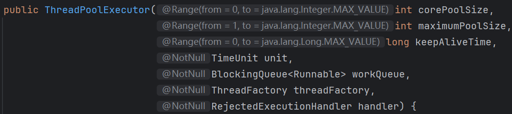

# JUC并发编程

## 并发安全

### 怎么保证多线程安全？

- **synchronized关键字**：可以使用 `synchronized` 关键字来**同步**代码块或方法，**确保同一时刻只有一个线程可以访问这些代码**。对象锁是通过 `synchronized` 关键字锁定对象的监视器（monitor）来实现的。

```java
public synchronized void someMethod() { /* ... */ }

public void anotherMethod() {
    synchronized (someObject) {
        /* ... */
    }
}
```

- **volatile关键字**：`volatile` 关键字用于变量，**确保所有线程看到的是该变量的最新值**，而不是可能存储在本地寄存器中的副本。

```java
public volatile int sharedVariable;
```

- **Lock接口和ReentrantLock类**：`java.util.concurrent.locks.Lock` 接口提供了比 `synchronized` 更强大的锁定机制，`ReentrantLock` 是一个实现该接口的例子，提供了更灵活的锁管理和更高的性能。

```java
private final ReentrantLock lock = new ReentrantLock();

public void someMethod() {
    lock.lock();
    try {
        /* ... */
    } finally {
        lock.unlock();
    }
}
```

- **原子类**：Java并发库（`java.util.concurrent.atomic`）提供了原子类，如 `AtomicInteger`、`AtomicLong` 等，这些类提供了原子操作，可以用于更新基本类型的变量而无需额外的同步。

```java
AtomicInteger counter = new AtomicInteger(0);

int newValue = counter.incrementAndGet();
```

- **线程局部变量**：`ThreadLocal` 类可以为每个线程提供独立的变量副本，这样每个线程都拥有自己的变量，消除了竞争条件。
  
  ```java
  ThreadLocal<Integer> threadLocalVar = new ThreadLocal<>();
  threadLocalVar.set(10);
  int value = threadLocalVar.get();
  ```
  
- **并发集合**：使用 `java.util.concurrent` 包中的线程安全集合，如 `ConcurrentHashMap`、`ConcurrentLinkedQueue` 等，这些集合内部已经实现了线程安全的逻辑。

- **JUC工具类**：使用 `java.util.concurrent` 包中的一些工具类可以用于控制线程间的同步和协作。例如：`Semaphore` 和 `CyclicBarrier` 等。

### juc包下你常用的类？

并发集合类：

- ConcurrentHashMap：线程安全的哈希映射表，用于在多线程环境下高效地存储和访问键值对。它采用了**分段锁**等技术，允许多个线程同时访问不同的段，提高了并发性能，在高并发场景下比传统的Hashtable性能更好。
- CopyOnWriteArrayList：：线程安全的列表，在对列表进行修改操作时，会创建一个新的底层数组，将修改操作应用到新数组上，而读操作仍然可以在旧数组上进行，从而实现了读写分离，提高了并发读的性能，适用于读多写少的场景。

原子类：

- AtomicInteger：原子整数类，提供了对整数类型的原子操作，如自增、自减、比较并交换等。通过硬件级别的原子指令来保证操作的原子性和线程安全性，避免了使用锁带来的性能开销，在多线程环境下对整数进行计数、状态标记等操作非常方便。

> 在项目中的SSE用过ConcurrentHashMap、AtomicInteger

### 除了用synchronized，还有什么方法可以实现线程同步？

- 使用 ReentrantLock 类：ReentrantLock 是一个可重入的互斥锁，相比 synchronized 提供了更灵活的锁定和解锁操作。它还支持公平锁和非公平锁，以及可以响应中断的锁获取操作。
- 使用 volatile 关键字：虽然 volatile 不是一种锁机制，但它可以确保变量的可见性。当一个变量被声明为 volatile 后，线程将直接从主内存中读取该变量的值，这样就能保证线程间变量的可见性。但它不具备原子性。
- 使用 Atomic 类：Java提供了一系列的原子类，例如 AtomicInteger 、AtomicLong 、AtomicReference 等，用于实现对单个变量的原子操作，这些类在实现细节上利用了**CAS（Compare-And-Swap）**算法，可以用来实现无锁的线程安全。

### CAS 和 AQS 有什么关系？

CAS 和 AQS 两者的区别：
- CAS 是一种**乐观锁**机制，它包含三个操作数：内存位置（V）、预期值（A）和新值（B）。CAS 操作的逻辑是，如果内存位置 V 的值等于预期值 A，则将其更新为新值 B，否则不做任何操作。整个过程是原子性的，通常由硬件指令支持，如在现代处理器上，cmpxchg 指令可以实现 CAS 操作。
- AQS 是一个用于构建锁和同步器的框架，许多同步器如 ReentrantLock、Semaphore、CountDownLatch 等都是基于 AQS 构建的。AQS 使用一个 volatile 的整数变量 state 来表示同步状态，通过内置的 FIFO 队列来管理等待线程。它提供了一些基本的操作，如 acquire（获取资源）和 release（释放资源），这些操作会修改 state 的值，并根据 state 的值来判断线程是否可以获取或释放资源。AQS 的 acquire 操作通常会先尝试获取资源，如果失败，线程将被添加到等待队列中，并阻塞等待。release 操作会释放资源，并唤醒等待队列中的线程。

CAS 和 AQS 两者的联系：
- CAS 为 AQS 提供原子操作支持：AQS 内部使用 CAS 操作来更新 state 变量，以实现线程安全的状态修改。在 acquire 操作中，当线程尝试获取资源时，会使用 CAS 操作尝试将 state 从一个值更新为另一个值，如果更新失败，说明资源已被占用，线程会进入等待队列。在 release 操作中，当线程释放资源时，也会使用 CAS 操作将 state 恢复到相应的值，以保证状态更新的原子性。

### Threadlocal作用，原理，具体里面存的key value是啥，会有什么问题，如何解决? 

`ThreadLocal` 是Java中用于解决线程安全问题的一种机制，它允许创建线程**局部变量**，即每个线程都有自己独立的变量副本，从而避免了线程间的资源共享和同步问题。


从内存结构图，我们可以看到： 

- Thread类中，有个ThreadLocal.ThreadLocalMap 的成员变量。 
- ThreadLocalMap内部维护了Entry数组，每个Entry代表一个完整的对象，key是 `ThreadLocal` 本 身，value是ThreadLocal的泛型对象值。

> ThreadLocal 的作用 

- 线程隔离： `ThreadLocal` 为每个线程提供了独立的变量副本，这意味着线程之间不会相互影响，可以安全地在多线程环境中使用这些变量而不必担心数据竞争或同步问题。

- 性能优势：由于 `ThreadLocal` 避免了线程间的同步开销，所以在大量线程并发执行时，相比传统的锁机制，它可以提供更好的性能。

> ThreadLocal的原理 

`ThreadLocal` 的实现依赖于 Thread 类中的一个 `ThreadLocalMap` 字段，这是一个存储 `ThreadLocal` 变量本身和对应值的映射。每个线程都有自己的 `ThreadLocalMap` 实例，用于存储该线程所持有的所有 `ThreadLocal` 变量的值。 

当你创建一个 `ThreadLocal` 变量时，它实际上就是一个 `ThreadLocal` 对象的实例。每个 `ThreadLocal` 对象都可以存储任意类型的值，这个值对每个线程来说是独立的。 

- 当调用 `ThreadLocal` 的 get() 方法时，` ThreadLocal` 会检查当前线程的 ThreadLocalMap 中是 否有与之关联的值。
-  如果有，返回该值； 
- 如果没有，会调用 `initialValue()` 方法（如果重写了的话）来初始化该值，然后将其放入 `ThreadLocalMap` 中并返回。 
- 当调用 set() 方法时， ThreadLocal 会将给定的值与当前线程关联起来，即在当前线程的 ThreadLocalMap 中存储一个键值对，键是 ThreadLocal 对象自身，值是传入的值。 
- 当调用 remove() 方法时，会从当前线程的 ThreadLocalMap 中移除与该 `ThreadLocal` 对象关联 的条目。 

> 可能存在的问题 

当一个线程结束时，其 `ThreadLocalMap` 也会随之销毁，但是 `ThreadLocal` 对象本身不会立即被垃圾回收，直到没有其他引用指向它为止。 

因此，在使用 `ThreadLocal` 时需要注意，如果不显式调用 remove() 方法，或者线程结束时未正确 清理 `ThreadLocal` 变量，可能会导致**内存泄漏**，因为 `ThreadLocalMap` 会持续持有 `ThreadLocal` 变量的引用，即使这些变量不再被其他地方引用。

 因此，实际应用中需要在使用完 `ThreadLocal` 变量后调用 remove() 方法释放资源。

### volatile关键字有什么作用？

volatile作用有 2 个：

- **保证变量对所有线程的可见性**。当一个变量被声明为volatile时，它会保证对这个变量的写操作会立即刷新到主存中，而对这个变量的读操作会直接从主存中读取，从而确保了多线程环境下对该变量访问的可见性。这意味着一个线程修改了volatile变量的值，其他线程能够立刻看到这个修改，不会受到各自线程工作内存的影响。

- **禁止指令重排序优化**。volatile关键字在Java中主要通过**内存屏障**来禁止特定类型的指令重排序。

  - 1）**写-写（Write-Write）屏障**：在对volatile变量执行写操作之前，会插入一个写屏障。这确保了在该变量写操作之前的所有普通写操作都已完成，防止了这些写操作被移到volatile写操作之后。

  - 2）**读-写（Read-Write）屏障**：在对volatile变量执行读操作之后，会插入一个读屏障。它确保了对volatile变量的读操作之后的所有普通读操作都不会被提前到volatile读之前执行，保证了读取到的数据是最新的。

  - 3）**写-读（Write-Read）屏障**：这是最重要的一个屏障，它发生在volatile写之后和volatile读之前。这个屏障确保了volatile写操作之前的所有内存操作（包括写操作）都不会被重排序到volatile读之后，同时也确保了volatile读操作之后的所有内存操作（包括读操作）都不会被重排序到volatile写之前。

### 什么情况会产生死锁问题？如何解决？

死锁只有**同时满足**以下四个条件才会发生：

- 互斥条件：互斥条件是指**多个线程不能同时使用同一个资源**。
- 持有并等待条件：持有并等待条件是指，当线程 A 已经持有了资源 1，又想申请资源 2，而资源 2 已经被线程 C 持有了，所以线程 A 就会处于等待状态，但是线程 A 在等待资源 2 的同时并不会释放自己已经持有的资源 1。
- 不可剥夺条件：不可剥夺条件是指，当线程已经持有了资源 ，在自己使用完之前不能被其他线程获取，线程 B 如果也想使用此资源，则只能在线程 A 使用完并释放后才能获取。
- 环路等待条件：环路等待条件指的是，在死锁发生的时候，两个线程获取资源的顺序构成了环形链。

避免死锁问题就只需要破坏其中一个条件就可以，最常见的并且可行的就是**使用资源有序分配法，来破坏环路等待条件**。

那什么是资源有序分配法呢？线程 A 和 线程 B 获取资源的顺序要一样，当线程 A 是先尝试获取资源 A，然后尝试获取资源 B 的时候，线程 B 同样也是先尝试获取资源 A，然后尝试获取资源 B。也就是说，线程 A 和 线程 B 总是以相同的顺序申请自己想要的资源。

## 线程池

### 介绍一下线线程程池池的工作原理 

线程池是为了减少频繁的创建线程和销毁线程带来的性能损耗，线线程程池池的工作原理如下图：


线程池分为核心线程池，线程池的最大容量，还有等待任务的队列，提交一个任务，如果核心线程没有满，就创建一个线程，如果满了，就是会加入等待队列，如果等待队列满了，就会增加线程，如果达到最大线程数量，如果都达到最大线程数量，就会按照一些丢弃的策略进行处理。 任务执行流程如下：

```
提交任务 → 核心线程是否已满？
  ├─ 未满 → 创建核心线程执行
  └─ 已满 → 任务入队
       ├─ 队列未满 → 等待执行
       └─ 队列已满 → 创建非核心线程
           ├─ 未达最大线程数 → 执行任务
           └─ 已达最大线程数 → 执行拒绝策略
```

### 线程池的参数有哪些？

线程池的构造函数有7个参数：



- **corePoolSize**：线程池核心线程数量。默认情况下，线程池中线程的数量如果 <= `corePoolSize`，那么即使这些线程处于空闲状态，那也不会被销毁。 
- **maximumPoolSize**：限制了线程池能创建的**最大线程总数**（包括核心线程和非核心线程），
  - 当 `corePoolSize` 已满 并且 尝试将新任务加入阻塞队列失败（即队列已满）并且 当前线程数 < `maximumPoolSize` ，就会创建新线程执行此任务，

  - 但是当 `corePoolSize` 满 并且 队列满 并且 线程数已达 `maximumPoolSize` 并且 又有新任务提交时，就会触发拒绝策略。

- **keepAliveTime**：当线程池中线程的数量大于 `corePoolSize` ，并且某个线程的**空闲时间**超过了 `keepAliveTime` ，那么这个线程就会被销毁。 
- unit：就是 `keepAliveTime` 时间的单位。
- **workQueue**：工作队列。当没有空闲的线程执行新任务时，该任务就会被放入工作队列中，等待执行。

- threadFactory：线程工厂。可以用来给线程取名字等等 
- handler：拒绝策略。当一个新任务交给线线程程池池，如果此时线线程程池池中有空闲的线程，就会直接执行，如果没有空闲的线程，就会将该任务加入到阻塞队列中，如果阻塞队列满了，就会创建一 个新线程，从阻塞队列头部取出一个任务来执行，并将新任务加入到阻塞队列末尾。如果当前 线线程程池池中线程的数量等于maximumPoolSize，就不会创建新线程，就会去执行拒绝策略

## AQS

### AQS 是什么？

AQS （`AbstractQueuedSynchronizer` ，抽象队列同步器）是从 JDK1.5 开始提供的 Java 并发核心组件。

AQS 解决了开发者在实现同步器时的复杂性问题。它提供了一个通用框架，用于实现各种同步器，例如 **可重入锁**（`ReentrantLock`）、**信号量**（`Semaphore`）和 **倒计时器**（`CountDownLatch`）。通过封装底层的线程同步机制，AQS 将复杂的线程管理逻辑隐藏起来，使开发者只需专注于具体的同步逻辑。

简单来说，AQS 是一个抽象类，为同步器提供了通用的 **执行框架**。它定义了 **资源获取和释放的通用流程**，而具体的资源获取逻辑则由具体同步器通过重写模板方法来实现。 因此，可以将 AQS 看作是同步器的 **基础“底座”**，而同步器则是基于 AQS 实现的 **具体“应用”**。

### ⭐️AQS 的原理是什么？

AQS 核心思想是，如果被请求的共享资源空闲，则将当前请求资源的线程设置为有效的工作线程，并且将共享资源设置为锁定状态。如果被请求的共享资源被占用，那么就需要一套线程阻塞等待以及被唤醒时锁分配的机制，这个机制 AQS 是基于 **CLH 锁** （Craig, Landin, and Hagersten locks） 进一步优化实现的。

**CLH 锁** 对自旋锁进行了改进，是基于单链表的自旋锁。在多线程场景下，会将请求获取锁的线程组织成一个单向队列，每个等待的线程会通过自旋访问前一个线程节点的状态，前一个节点释放锁之后，当前节点才可以获取锁。**CLH 锁** 的队列结构如下图所示

### CountDownLatch 有什么用？

`CountDownLatch` 允许 `count` 个线程阻塞在一个地方，直至所有线程的任务都执行完毕。

`CountDownLatch` 是一次性的，计数器的值只能在构造方法中初始化一次，之后没有任何机制再次对其设置值，当 `CountDownLatch` 使用完毕后，它不能再次被使用。

