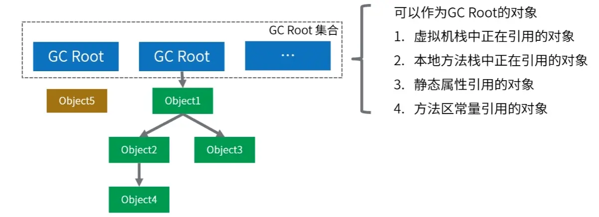

# JVM

[基于jdk17的JVM GC配置详解](https://blog.csdn.net/qq_27027927/article/details/133928425)

[Spring Boot应用性能优化：深入JVM调优与线程池配置实战](https://blog.csdn.net/2501_91980039/article/details/148027328)

## 1. 字节码篇


## 2. 类的加载篇

双亲委派机制（Parent Delegation Model）是 Java 类加载器（ClassLoader）的一种工作机制，用于确定由哪个类加载器来加载特定的类。这种机制是 Java 保证类的唯一性和安全性的重要手段。下面是双亲委派机制的详细解释：

1. 类加载器层次结构

在 Java 中，类加载器形成了一个层次结构，通常包括以下几个层级：
- **启动类加载器（Bootstrap ClassLoader）**：负责加载 Java 核心类库，如 `java.lang.String` 等，由 C++ 实现，不是 Java 类。
- **扩展类加载器（Extension ClassLoader）**：负责加载 `JAVA_HOME/lib/ext` 目录或者由系统属性 `java.ext.dirs` 指定位置中的类库。
- **应用程序类加载器（Application ClassLoader）**：也称为系统类加载器，负责加载环境变量 `classpath` 或系统属性 `java.class.path` 指定路径下的类库。

2. 双亲委派机制的工作流程

当一个类需要被加载时，Java 虚拟机（JVM）会按照以下步骤进行：
1. **检查该类是否已经被加载**：如果已经被加载，则直接返回该类的引用。
2. **委派给父类加载器**：JVM 会首先请求父类加载器进行加载，如果父类加载器存在并且能够完成类加载，则返回类的引用。
3. **递归委派**：如果父类加载器无法完成加载，则将请求传递给上一级父类加载器，直到启动类加载器。
4. **当前类加载器加载**：如果所有父类加载器都无法完成类加载，则当前类加载器尝试自己加载类。
5. **加载类**：类加载器加载类后，将其放入 JVM 的方法区，并返回类的引用。

3. 双亲委派机制的优点

- **避免类的重复加载**：由于类加载器的层次结构，可以确保每个类只被加载一次。
- **保证类的唯一性**：不同类加载器加载的类是不同的，即使它们的全限定名相同。
- **安全性**：核心类库由启动类加载器加载，防止用户自定义类覆盖核心类库中的类。

4. 破坏双亲委派机制

尽管双亲委派机制有很多优点，但在某些情况下，我们需要破坏这种机制，例如：
- **热替换（Hot Swap）**：在运行时替换某个类。
- **OSGi（Open Service Gateway initiative）**：一种动态模块系统，需要自定义类加载器来实现模块的加载和卸载。

为了破坏双亲委派机制，可以使用自定义类加载器。自定义类加载器需要继承 `java.lang.ClassLoader` 类，并重写 `findClass` 方法来实现自定义的类加载逻辑。

5. 示例：自定义类加载器

以下是一个简单的自定义类加载器示例：

```java
public class CustomClassLoader extends ClassLoader {
    @Override
    public Class<?> findClass(String name) throws ClassNotFoundException {
        // 加载类的字节码数组
        byte[] classData = getClassDataFromCustomLocation(name);
        if (classData == null) {
            throw new ClassNotFoundException("Cannot load class " + name);
        }
        // 使用自定义的字节码数组来定义这个类
        return defineClass(name, classData, 0, classData.length);
    }

    private byte[] getClassDataFromCustomLocation(String name) {
        // 实现从自定义位置加载类的字节码数组的逻辑
        // ...
        return null; // 返回类的字节码数组
    }
}
```

通过自定义类加载器，我们可以在不破坏双亲委派机制的前提下，实现类的热替换和模块化加载等功能。

## 3. 运行时内存篇

###  JVM的内存模型介绍一下

根据JDK 8规范，JVM运行时内存共分为虚拟机栈、堆、元空间、程序计数器、本地方法栈五个部分。还有一部分内存叫直接内存，属于操作系统的本地内存，也是可以直接操作的。


JVM的内存结构主要分为以下几个部分：

- **程序计数器**：可以看作是当前线程所执行的字节码的行号指示器，用于存储当前线程正在执行的Java方法的JVM指令地址。如果线程执行的是Native方法，计数器值为null。是唯一一个在Java虚拟机规范中没有规定任何OutOfMemoryError情况的区域，生命周期与线程相同。

- **Java虚拟机栈**：每个线程都有自己的Java虚拟机栈，生命周期与线程相同。每个方法在执行时都会创建一个栈帧，用于存储局部变量表、操作数栈、动态链接、方法出口等信息。可能会抛出StackOverflowError和OutOfMemoryError异常。

- **本地方法栈**：与Java虚拟机栈类似，主要为虚拟机使用的Native方法服务，在HotSpot虚拟机中和Java虚拟机栈合二为一。本地方法执行时也会出现StackOverflowError和OutOfMemoryError两种错误。

- **Java堆**：JVM中最大的一块内存区域，被所有线程共享，在虚拟机启动时创建，用于存放对象实例。从内存回收角度，堆被划分为新生代和老年代，新生代又分为Eden区和两个Survivor区（From Survivor和To Survivor）。如果在堆中没有内存完成实例分配，并且堆也无法扩展时会抛出OutOfMemoryError异常。

- **方法区（元空间）**：在JDK 1.8及以后的版本中，方法区被元空间取代，使用本地内存。用于存储已被虚拟机加载的类信息、常量、静态变量等数据。虽然方法区被描述为**堆的逻辑部分**，但有“非堆”的别名。方法区可以选择不实现垃圾收集，内存不足时会抛出OutOfMemoryError异常。

- **运行时常量池**：是方法区的一部分，用于存放编译期生成的各种字面量和符号引用，具有动态性，运行时也可将新的常量放入池中。当无法申请到足够内存时，会抛出OutOfMemoryError异常。

- **直接内存**：不属于JVM运行时数据区的一部分，通过NIO类引入，是一种堆外内存，可以显著提高I/O性能。直接内存的使用受到本机总内存的限制，若分配不当，可能导致OutOfMemoryError异常。

### 堆分为哪几部分呢

Java堆（Heap）是Java虚拟机（JVM）中内存管理的一个重要区域，主要用于存放对象实例和数组。随着JVM的发展和不同垃圾收集器的实现，堆的具体划分可能会有所不同，但通常可以分为以下几个部分：


- 新生代（Young Generation）:新生代分为Eden Space和Survivor Space。
  - 在Eden Space中， 大多数新创建的对象首先存放在这里。Eden区相对较小，当Eden区满时，会触发一次Minor GC（新生代垃圾回收）。
  - 在Survivor Spaces中，通常分为两个相等大小的区域，称为S0（Survivor 0）和S1（Survivor 1）。在每次Minor GC后，存活下来的对象会被移动到其中一个Survivor空间，以继续它们的生命周期。这两个区域轮流充当对象的中转站，帮助区分短暂存活的对象和长期存活的对象。

- 老年代（Old Generation/Tenured Generation）：存放过一次或多次Minor GC仍存活的对象会被移动到老年代。老年代中的对象生命周期较长，因此Major GC（也称为Full GC，涉及老年代的垃圾回收）发生的频率相对较低，但其执行时间通常比Minor GC长。老年代的空间通常比新生代大，以存储更多的长期存活对象。

- 元空间（Metaspace）:从Java 8开始，永久代（Permanent Generation）被元空间取代，用于存储类的元数据信息，如类的结构信息（如字段、方法信息等）。元空间并不在Java堆中，而是使用本地内存，这解决了永久代容易出现的内存溢出问题。

- 大对象区（Large Object Space / Humongous Objects）:在某些JVM实现中（如**G1垃圾收集器**），为大对象分配了专门的区域，称为大对象区或Humongous Objects区域。大对象是指需要大量连续内存空间的对象，如大数组。这类对象直接分配在**老年代**，以避免因频繁的年轻代晋升而导致的内存碎片化问题。

## 4. 对象内存布局

## 5. 执行引擎篇

## 6. 垃圾回收篇

###  判断垃圾的方法有哪些？

在Java中，判断对象是否为垃圾（即不再被使用，可以被垃圾回收器回收）主要依据两种主流的垃圾回收算法来实现：引用计数法和可达性分析算法。

> 引用计数法（Reference Counting）

- 原理：为每个对象分配一个引用计数器，每当有一个地方引用它时，计数器加1；当引用失效时，计数器减1。当计数器为0时，表示对象不再被任何变量引用，可以被回收。

- 缺点：不能解决**循环引用**的问题，即两个对象相互引用，但不再被其他任何对象引用，这时引用计数器不会为0，导致对象无法被回收。

> 可达性分析算法（Reachability Analysis）



Java虚拟机主要采用此算法来判断对象是否为垃圾。

- 原理：从一组称为GC Roots（垃圾收集根）的对象出发，向下追溯它们引用的对象，以及这些对象引用的其他对象，以此类推。如果一个对象到GC Roots没有任何引用链相连（即从GC Roots到这个对象不可达），那么这个对象就被认为是不可达的，可以被回收。
- GC Roots对象包括：虚拟机栈（栈帧中的本地变量表）中引用的对象、方法区中类静态属性引用的对象、本地方法栈中JNI（Java Native Interface）引用的对象、活跃线程的引用等。

### 垃圾回收器有哪些

| 垃圾回收器      | 参数                                                    |
| --------------- | ------------------------------------------------------- |
| Serial GC       | `-XX:+UseSerialGC`                                      |
| Parallel GC     | `-XX:+UseParallelGC`                                    |
| Parallel Old GC | `-XX:+UseParallelOldGC`                                 |
| CMS GC          | `-XX:+UseConcMarkSweepGC`                               |
| G1 GC           | `-XX:+UseG1GC`                                          |
| ZGC             | `-XX:+UnlockExperimentalVMOptions -XX:+UseZGC`          |
| Shenandoah GC   | `-XX:+UnlockExperimentalVMOptions -XX:+UseShenandoahGC` |
| Epsilon GC      | `-XX:+UnlockExperimentalVMOptions -XX:+UseEpsilonGC`    |

| 垃圾收集器                 | 类型           | 作用域                       | 使用算法                 | 特点         | 适用场景                                     |
| -------------------------- | -------------- | ---------------------------- | ------------------------ | ------------ | -------------------------------------------- |
| Serial                     | 串行回收       | 新生代                       | 复制算法                 | 响应速度优先 | 适用于单核 CPU 环境下的 Client 模式          |
| Serial Old                 | 串行回收       | 老年代                       | 标记-压缩算法            | 响应速度优先 | 适用于单核 CPU 环境下的 Client 模式          |
| ParNew                     | 并行回收       | 新生代                       | 复制算法                 | 响应速度优先 | 多核 CPU 环境中 Server 模式下与 CMS 配合使用 |
| Parallel Scavenge          | 并行回收       | 新生代                       | 复制算法                 | 吞吐量优先   | 适用于后台运算，而交互少的场景               |
| Parallel Old               | 并行回收       | 老年代                       | 标记-压缩算法            | 吞吐量优先   | 适用于后台运算，而交互少的场景               |
| CMS(Concurrent Mark-Sweep) | 并发回收       | 老年代                       | 标记-清除算法            | 响应速度优先 | 适用于 B/S 业务，也就是交互多的场景          |
| G1(Garbage-First)          | 并发, 并行回收 | 新生代 & 老年代 (整堆收集器) | 复制算法 & 标记-压缩算法 | 响应速度优先 | 面向服务端的应用                             |

- G1(Garbage First)收集器 (标记-整理算法)： Java堆并行收集器，G1收集器是JDK1.7提供的一个新收集器，G1收集器基于“标记-整理”算法实现，也就是说不会产生内存碎片。此外，G1收集器不同于之前的收集器的一个重要特点是：G1回收的范围是整个Java堆(包括新生代，老年代)，而前六种收集器回收的范围仅限于新生代或老年代
  - G1HeapRegionSize  设置每个Region的大小。值是2的幂，范围是1MB到32MB之间，目标是根据最小的Java堆大小划分出约2048个区域。默认是堆内存的1/2000。
  - MaxGCPauseMillis 设置期望达到最大GC停顿时间指标（JVM会尽力实现，但不保证达到）。默认值是200ms。
  - ParallelGCThreads   设置STW时GC线程数的值。

### 垃圾回收算法有哪些

- 标记-清除算法：标记-清除算法分为“标记”和“清除”两个阶段，首先通过**可达性分析**，标记出所有需要回收的对象，然后统一回收所有被标记的对象。
  - 标记-清除算法有两个缺陷，一个是效率问题，标记和清除的过程效率都不高，另外一个就是，清除结束后会造成大量的碎片空间。有可能会造成在申请大块内存的时候因为没有足够的连续空间导致再次 GC。
- 复制算法：为了解决碎片空间的问题，出现了“复制算法”。复制算法的原理是，将内存分成两块，每次申请内存时都使用其中的一块，当内存不够时，将这一块内存中所有存活的复制到另一块上。然后将然后再把已使用的内存整个清理掉。
  - 复制算法解决了空间碎片的问题。但是也带来了新的问题。因为每次在申请内存时，都只能使用一半的内存空间。内存利用率严重不足。
- 标记-整理算法：复制算法在 GC 之后存活对象较少的情况下效率比较高，但如果存活对象比较多时，会执行较多的复制操作，效率就会下降。而**老年代**的对象在 GC 之后的存活率就比较高，所以就有人提出了“标记-整理算法”。标记-整理算法的“标记”过程与“标记-清除算法”的标记过程一致，但标记之后不会直接清理。而是将所有存活对象都移动到内存的一端。移动结束后直接清理掉剩余部分。
- 分代回收算法：分代收集是将内存划分成了新生代和老年代。分配的依据是对象的生存周期，或者说经历过的 GC 次数。对象创建时，一般在新生代申请内存，当经历一次 GC 之后如果对还存活，那么对象的年龄 +1。当年龄超过一定值(默认是 15，可以通过参数 -XX:MaxTenuringThreshold 来设定)后，如果对象还存活，那么该对象会进入老年代。

## 7. JVM性能监控篇

## 8. JVM性能调优案例篇

### 步骤


### 案例

#### 案例1

调整堆大小提高服务的吞吐量

## 参数

C:\Users\acer>java -XX:+PrintFlagsFinal -version
[Global flags]
      int ActiveProcessorCount                     = -1                                        {product} {default}
    uintx AdaptiveSizeDecrementScaleFactor         = 4                                         {product} {default}
    uintx AdaptiveSizeMajorGCDecayTimeScale        = 10                                        {product} {default}
    uintx AdaptiveSizePolicyCollectionCostMargin   = 50                                        {product} {default}
    uintx AdaptiveSizePolicyInitializingSteps      = 20                                        {product} {default}
    uintx AdaptiveSizePolicyOutputInterval         = 0                                         {product} {default}
    uintx AdaptiveSizePolicyWeight                 = 10                                        {product} {default}
    uintx AdaptiveSizeThroughPutPolicy             = 0                                         {product} {default}
    uintx AdaptiveTimeWeight                       = 25                                        {product} {default}
     bool AggressiveHeap                           = false                                     {product} {default}
     intx AliasLevel                               = 3                                      {C2 product} {default}
     bool AlignVector                              = false                                  {C2 product} {default}
    ccstr AllocateHeapAt                           =                                           {product} {default}
     intx AllocateInstancePrefetchLines            = 1                                         {product} {default}
     intx AllocatePrefetchDistance                 = 192                                       {product} {default}
     intx AllocatePrefetchInstr                    = 3                                         {product} {default}
     intx AllocatePrefetchLines                    = 4                                         {product} {default}
     intx AllocatePrefetchStepSize                 = 64                                        {product} {default}
     intx AllocatePrefetchStyle                    = 1                                         {product} {default}
     bool AllowParallelDefineClass                 = false                                     {product} {default}
     bool AllowRedefinitionToAddDeleteMethods      = false                                     {product} {default}
     bool AllowUserSignalHandlers                  = false                                     {product} {default}
     bool AllowVectorizeOnDemand                   = true                                   {C2 product} {default}
     bool AlwaysActAsServerClassMachine            = false                                     {product} {default}
     bool AlwaysCompileLoopMethods                 = false                                     {product} {default}
     bool AlwaysLockClassLoader                    = false                                     {product} {default}
     bool AlwaysPreTouch                           = false                                     {product} {default}
     bool AlwaysRestoreFPU                         = false                                     {product} {default}
     bool AlwaysTenure                             = false                                     {product} {default}
    ccstr ArchiveClassesAtExit                     =                                           {product} {default}
     intx ArrayCopyLoadStoreMaxElem                = 8                                      {C2 product} {default}
   size_t AsyncLogBufferSize                       = 2097152                                   {product} {default}
     intx AutoBoxCacheMax                          = 128                                    {C2 product} {default}
     intx BCEATraceLevel                           = 0                                         {product} {default}
     bool BackgroundCompilation                    = true                                   {pd product} {default}
   size_t BaseFootPrintEstimate                    = 268435456                                 {product} {default}
     intx BiasedLockingBulkRebiasThreshold         = 20                                        {product} {default}
     intx BiasedLockingBulkRevokeThreshold         = 40                                        {product} {default}
     intx BiasedLockingDecayTime                   = 25000                                     {product} {default}
     intx BiasedLockingStartupDelay                = 0                                         {product} {default}
     bool BlockLayoutByFrequency                   = true                                   {C2 product} {default}
     intx BlockLayoutMinDiamondPercentage          = 20                                     {C2 product} {default}
     bool BlockLayoutRotateLoops                   = true                                   {C2 product} {default}
     intx C1InlineStackLimit                       = 5                                      {C1 product} {default}
     intx C1MaxInlineLevel                         = 9                                      {C1 product} {default}
     intx C1MaxInlineSize                          = 35                                     {C1 product} {default}
     intx C1MaxRecursiveInlineLevel                = 1                                      {C1 product} {default}
     intx C1MaxTrivialSize                         = 6                                      {C1 product} {default}
     bool C1OptimizeVirtualCallProfiling           = true                                   {C1 product} {default}
     bool C1ProfileBranches                        = true                                   {C1 product} {default}
     bool C1ProfileCalls                           = true                                   {C1 product} {default}
     bool C1ProfileCheckcasts                      = true                                   {C1 product} {default}
     bool C1ProfileInlinedCalls                    = true                                   {C1 product} {default}
     bool C1ProfileVirtualCalls                    = true                                   {C1 product} {default}
     bool C1UpdateMethodData                       = true                                   {C1 product} {default}
     intx CICompilerCount                          = 12                                        {product} {ergonomic}
     bool CICompilerCountPerCPU                    = true                                      {product} {default}
     bool CITime                                   = false                                     {product} {default}
     bool CheckJNICalls                            = false                                     {product} {default}
     bool ClassUnloading                           = true                                      {product} {default}
     bool ClassUnloadingWithConcurrentMark         = true                                      {product} {default}
     bool ClipInlining                             = true                                      {product} {default}
    uintx CodeCacheExpansionSize                   = 65536                                  {pd product} {default}
     bool CompactStrings                           = true                                   {pd product} {default}
    ccstr CompilationMode                          = default                                   {product} {default}
ccstrlist CompileCommand                           =                                           {product} {default}
    ccstr CompileCommandFile                       =                                           {product} {default}
ccstrlist CompileOnly                              =                                           {product} {default}
     intx CompileThreshold                         = 10000                                  {pd product} {default}
   double CompileThresholdScaling                  = 1.000000                                  {product} {default}
     intx CompilerThreadPriority                   = -1                                        {product} {default}
     intx CompilerThreadStackSize                  = 0                                      {pd product} {default}
   size_t CompressedClassSpaceSize                 = 1073741824                                {product} {default}
     uint ConcGCThreads                            = 4                                         {product} {ergonomic}
     intx ConditionalMoveLimit                     = 3                                   {C2 pd product} {default}
     intx ContendedPaddingWidth                    = 128                                       {product} {default}
     bool CrashOnOutOfMemoryError                  = false                                     {product} {default}
     bool CreateCoredumpOnCrash                    = true                                      {product} {default}
     bool CriticalJNINatives                       = false                                     {product} {default}
     bool DTraceAllocProbes                        = false                                     {product} {default}
     bool DTraceMethodProbes                       = false                                     {product} {default}
     bool DTraceMonitorProbes                      = false                                     {product} {default}
     bool DisableAttachMechanism                   = false                                     {product} {default}
     bool DisableExplicitGC                        = false                                     {product} {default}
     bool DisplayVMOutputToStderr                  = false                                     {product} {default}
     bool DisplayVMOutputToStdout                  = false                                     {product} {default}
     bool DoEscapeAnalysis                         = true                                   {C2 product} {default}
     bool DoReserveCopyInSuperWord                 = true                                   {C2 product} {default}
     bool DontCompileHugeMethods                   = true                                      {product} {default}
     bool DontYieldALot                            = false                                  {pd product} {default}
    ccstr DumpLoadedClassList                      =                                           {product} {default}
     bool DumpReplayDataOnError                    = true                                      {product} {default}
     bool DumpSharedSpaces                         = false                                     {product} {default}
     bool DynamicDumpSharedSpaces                  = false                                     {product} {default}
     bool EagerXrunInit                            = false                                     {product} {default}
     intx EliminateAllocationArraySizeLimit        = 64                                     {C2 product} {default}
     bool EliminateAllocations                     = true                                   {C2 product} {default}
     bool EliminateAutoBox                         = true                                   {C2 product} {default}
     bool EliminateLocks                           = true                                   {C2 product} {default}
     bool EliminateNestedLocks                     = true                                   {C2 product} {default}
     bool EnableContended                          = true                                      {product} {default}
     bool EnableDynamicAgentLoading                = true                                      {product} {default}
   size_t ErgoHeapSizeLimit                        = 0                                         {product} {default}
    ccstr ErrorFile                                =                                           {product} {default}
     bool ErrorFileToStderr                        = false                                     {product} {default}
     bool ErrorFileToStdout                        = false                                     {product} {default}
 uint64_t ErrorLogTimeout                          = 120                                       {product} {default}
   double EscapeAnalysisTimeout                    = 20.000000                              {C2 product} {default}
     bool EstimateArgEscape                        = true                                      {product} {default}
     bool ExecutingUnitTests                       = false                                     {product} {default}
     bool ExitOnOutOfMemoryError                   = false                                     {product} {default}
     bool ExplicitGCInvokesConcurrent              = false                                     {product} {default}
     bool ExtendedDTraceProbes                     = false                                     {product} {default}
     bool ExtensiveErrorReports                    = false                                     {product} {default}
    ccstr ExtraSharedClassListFile                 =                                           {product} {default}
     bool FilterSpuriousWakeups                    = true                                      {product} {default}
     bool FlightRecorder                           = false                                     {product} {default}
    ccstr FlightRecorderOptions                    =                                           {product} {default}
     bool ForceTimeHighResolution                  = false                                     {product} {default}
     intx FreqInlineSize                           = 325                                 {C2 pd product} {default}
   double G1ConcMarkStepDurationMillis             = 10.000000                                 {product} {default}
    uintx G1ConcRSHotCardLimit                     = 4                                         {product} {default}
   size_t G1ConcRSLogCacheSize                     = 10                                        {product} {default}
   size_t G1ConcRefinementGreenZone                = 0                                         {product} {default}
   size_t G1ConcRefinementRedZone                  = 0                                         {product} {default}
    uintx G1ConcRefinementServiceIntervalMillis    = 300                                       {product} {default}
     uint G1ConcRefinementThreads                  = 15                                        {product} {ergonomic}
   size_t G1ConcRefinementThresholdStep            = 2                                         {product} {default}
   size_t G1ConcRefinementYellowZone               = 0                                         {product} {default}
    uintx G1ConfidencePercent                      = 50                                        {product} {default}
   size_t G1HeapRegionSize                         = 2097152                                   {product} {ergonomic}
    uintx G1HeapWastePercent                       = 5                                         {product} {default}
    uintx G1MixedGCCountTarget                     = 8                                         {product} {default}
    uintx G1PeriodicGCInterval                     = 0                                      {manageable} {default}
     bool G1PeriodicGCInvokesConcurrent            = true                                      {product} {default}
   double G1PeriodicGCSystemLoadThreshold          = 0.000000                               {manageable} {default}
     intx G1RSetRegionEntries                      = 512                                       {product} {default}
     intx G1RSetSparseRegionEntries                = 16                                        {product} {default}
     intx G1RSetUpdatingPauseTimePercent           = 10                                        {product} {default}
     uint G1RefProcDrainInterval                   = 1000                                      {product} {default}
    uintx G1ReservePercent                         = 10                                        {product} {default}
    uintx G1SATBBufferEnqueueingThresholdPercent   = 60                                        {product} {default}
   size_t G1SATBBufferSize                         = 1024                                      {product} {default}
   size_t G1UpdateBufferSize                       = 256                                       {product} {default}
     bool G1UseAdaptiveConcRefinement              = true                                      {product} {default}
     bool G1UseAdaptiveIHOP                        = true                                      {product} {default}
    uintx GCDrainStackTargetSize                   = 64                                        {product} {ergonomic}
    uintx GCHeapFreeLimit                          = 2                                         {product} {default}
    uintx GCLockerEdenExpansionPercent             = 5                                         {product} {default}
    uintx GCPauseIntervalMillis                    = 201                                       {product} {default}
    uintx GCTimeLimit                              = 98                                        {product} {default}
    uintx GCTimeRatio                              = 12                                        {product} {default}
   size_t HeapBaseMinAddress                       = 2147483648                             {pd product} {default}
     bool HeapDumpAfterFullGC                      = false                                  {manageable} {default}
     bool HeapDumpBeforeFullGC                     = false                                  {manageable} {default}
     intx HeapDumpGzipLevel                        = 0                                      {manageable} {default}
     bool HeapDumpOnOutOfMemoryError               = false                                  {manageable} {default}
    ccstr HeapDumpPath                             =                                        {manageable} {default}
    uintx HeapFirstMaximumCompactionCount          = 3                                         {product} {default}
    uintx HeapMaximumCompactionInterval            = 20                                        {product} {default}
    uintx HeapSearchSteps                          = 3                                         {product} {default}
   size_t HeapSizePerGCThread                      = 43620760                                  {product} {default}
     bool IgnoreEmptyClassPaths                    = false                                     {product} {default}
     bool IgnoreUnrecognizedVMOptions              = false                                     {product} {default}
    uintx IncreaseFirstTierCompileThresholdAt      = 50                                        {product} {default}
     bool IncrementalInline                        = true                                   {C2 product} {default}
    uintx InitialCodeCacheSize                     = 2555904                                {pd product} {default}
   size_t InitialHeapSize                          = 264241152                                 {product} {ergonomic}
    uintx InitialRAMFraction                       = 64                                        {product} {default}
   double InitialRAMPercentage                     = 1.562500                                  {product} {default}
    uintx InitialSurvivorRatio                     = 8                                         {product} {default}
    uintx InitialTenuringThreshold                 = 7                                         {product} {default}
    uintx InitiatingHeapOccupancyPercent           = 45                                        {product} {default}
     bool Inline                                   = true                                      {product} {default}
    ccstr InlineDataFile                           =                                           {product} {default}
     intx InlineSmallCode                          = 2500                                {C2 pd product} {default}
     bool InlineSynchronizedMethods                = true                                   {C1 product} {default}
     intx InteriorEntryAlignment                   = 16                                  {C2 pd product} {default}
     intx InterpreterProfilePercentage             = 33                                        {product} {default}
     bool JavaMonitorsInStackTrace                 = true                                      {product} {default}
     intx JavaPriority10_To_OSPriority             = -1                                        {product} {default}
     intx JavaPriority1_To_OSPriority              = -1                                        {product} {default}
     intx JavaPriority2_To_OSPriority              = -1                                        {product} {default}
     intx JavaPriority3_To_OSPriority              = -1                                        {product} {default}
     intx JavaPriority4_To_OSPriority              = -1                                        {product} {default}
     intx JavaPriority5_To_OSPriority              = -1                                        {product} {default}
     intx JavaPriority6_To_OSPriority              = -1                                        {product} {default}
     intx JavaPriority7_To_OSPriority              = -1                                        {product} {default}
     intx JavaPriority8_To_OSPriority              = -1                                        {product} {default}
     intx JavaPriority9_To_OSPriority              = -1                                        {product} {default}
   size_t LargePageHeapSizeThreshold               = 134217728                                 {product} {default}
   size_t LargePageSizeInBytes                     = 0                                         {product} {default}
     intx LiveNodeCountInliningCutoff              = 40000                                  {C2 product} {default}
     intx LoopMaxUnroll                            = 16                                     {C2 product} {default}
     intx LoopOptsCount                            = 43                                     {C2 product} {default}
     intx LoopPercentProfileLimit                  = 10                                  {C2 pd product} {default}
    uintx LoopStripMiningIter                      = 1000                                   {C2 product} {default}
    uintx LoopStripMiningIterShortLoop             = 100                                    {C2 product} {default}
     intx LoopUnrollLimit                          = 60                                  {C2 pd product} {default}
     intx LoopUnrollMin                            = 4                                      {C2 product} {default}
     bool LoopUnswitching                          = true                                   {C2 product} {default}
     bool ManagementServer                         = false                                     {product} {default}
   size_t MarkStackSize                            = 4194304                                   {product} {ergonomic}
   size_t MarkStackSizeMax                         = 536870912                                 {product} {default}
     uint MarkSweepAlwaysCompactCount              = 4                                         {product} {default}
    uintx MarkSweepDeadRatio                       = 5                                         {product} {default}
     intx MaxBCEAEstimateLevel                     = 5                                         {product} {default}
     intx MaxBCEAEstimateSize                      = 150                                       {product} {default}
 uint64_t MaxDirectMemorySize                      = 0                                         {product} {default}
     bool MaxFDLimit                               = true                                      {product} {default}
    uintx MaxGCMinorPauseMillis                    = 18446744073709551615                      {product} {default}
    uintx MaxGCPauseMillis                         = 200                                       {product} {default}
    uintx MaxHeapFreeRatio                         = 70                                     {manageable} {default}
   size_t MaxHeapSize                              = 4221566976                                {product} {ergonomic}
     intx MaxInlineLevel                           = 15                                     {C2 product} {default}
     intx MaxInlineSize                            = 35                                     {C2 product} {default}
     intx MaxJNILocalCapacity                      = 65536                                     {product} {default}
     intx MaxJavaStackTraceDepth                   = 1024                                      {product} {default}
     intx MaxJumpTableSize                         = 65000                                  {C2 product} {default}
     intx MaxJumpTableSparseness                   = 5                                      {C2 product} {default}
     intx MaxLabelRootDepth                        = 1100                                   {C2 product} {default}
     intx MaxLoopPad                               = 11                                     {C2 product} {default}
   size_t MaxMetaspaceExpansion                    = 5439488                                   {product} {default}
    uintx MaxMetaspaceFreeRatio                    = 70                                        {product} {default}
   size_t MaxMetaspaceSize                         = 18446744073709551615                      {product} {default}
   size_t MaxNewSize                               = 2531262464                                {product} {ergonomic}
     intx MaxNodeLimit                             = 80000                                  {C2 product} {default}
 uint64_t MaxRAM                                   = 137438953472                           {pd product} {default}
    uintx MaxRAMFraction                           = 4                                         {product} {default}
   double MaxRAMPercentage                         = 25.000000                                 {product} {default}
     intx MaxRecursiveInlineLevel                  = 1                                      {C2 product} {default}
    uintx MaxTenuringThreshold                     = 15                                        {product} {default}
     intx MaxTrivialSize                           = 6                                      {C2 product} {default}
     intx MaxVectorSize                            = 32                                     {C2 product} {default}
    ccstr MetaspaceReclaimPolicy                   = balanced                                  {product} {default}
   size_t MetaspaceSize                            = 22020096                                  {product} {default}
     bool MethodFlushing                           = true                                      {product} {default}
   size_t MinHeapDeltaBytes                        = 2097152                                   {product} {ergonomic}
    uintx MinHeapFreeRatio                         = 40                                     {manageable} {default}
   size_t MinHeapSize                              = 8388608                                   {product} {ergonomic}
     intx MinInliningThreshold                     = 250                                       {product} {default}
     intx MinJumpTableSize                         = 10                                  {C2 pd product} {default}
   size_t MinMetaspaceExpansion                    = 327680                                    {product} {default}
    uintx MinMetaspaceFreeRatio                    = 40                                        {product} {default}
    uintx MinRAMFraction                           = 2                                         {product} {default}
   double MinRAMPercentage                         = 50.000000                                 {product} {default}
    uintx MinSurvivorRatio                         = 3                                         {product} {default}
   size_t MinTLABSize                              = 2048                                      {product} {default}
     intx MultiArrayExpandLimit                    = 6                                      {C2 product} {default}
    uintx NUMAChunkResizeWeight                    = 20                                        {product} {default}
   size_t NUMAInterleaveGranularity                = 2097152                                   {product} {default}
    uintx NUMAPageScanRate                         = 256                                       {product} {default}
   size_t NUMASpaceResizeRate                      = 1073741824                                {product} {default}
     bool NUMAStats                                = false                                     {product} {default}
    ccstr NativeMemoryTracking                     = off                                       {product} {default}
     bool NeverActAsServerClassMachine             = false                                  {pd product} {default}
     bool NeverTenure                              = false                                     {product} {default}
    uintx NewRatio                                 = 2                                         {product} {default}
   size_t NewSize                                  = 1363144                                   {product} {default}
   size_t NewSizeThreadIncrease                    = 5320                                   {pd product} {default}
     intx NmethodSweepActivity                     = 10                                        {product} {default}
     intx NodeLimitFudgeFactor                     = 2000                                   {C2 product} {default}
    uintx NonNMethodCodeHeapSize                   = 7602480                                {pd product} {ergonomic}
    uintx NonProfiledCodeHeapSize                  = 122027880                              {pd product} {ergonomic}
     intx NumberOfLoopInstrToAlign                 = 4                                      {C2 product} {default}
     intx ObjectAlignmentInBytes                   = 8                              {product lp64_product} {default}
   size_t OldPLABSize                              = 1024                                      {product} {default}
   size_t OldSize                                  = 5452592                                   {product} {default}
     bool OmitStackTraceInFastThrow                = true                                      {product} {default}
ccstrlist OnError                                  =                                           {product} {default}
ccstrlist OnOutOfMemoryError                       =                                           {product} {default}
     intx OnStackReplacePercentage                 = 140                                    {pd product} {default}
     bool OptimizeFill                             = false                                  {C2 product} {default}
     bool OptimizePtrCompare                       = true                                   {C2 product} {default}
     bool OptimizeStringConcat                     = true                                   {C2 product} {default}
     bool OptoBundling                             = false                               {C2 pd product} {default}
     intx OptoLoopAlignment                        = 16                                     {pd product} {default}
     bool OptoRegScheduling                        = true                                {C2 pd product} {default}
     bool OptoScheduling                           = false                               {C2 pd product} {default}
    uintx PLABWeight                               = 75                                        {product} {default}
     bool PSChunkLargeArrays                       = true                                      {product} {default}
      int ParGCArrayScanChunk                      = 50                                        {product} {default}
    uintx ParallelGCBufferWastePct                 = 10                                        {product} {default}
     uint ParallelGCThreads                        = 15                                        {product} {default}
   size_t ParallelOldDeadWoodLimiterMean           = 50                                        {product} {default}
   size_t ParallelOldDeadWoodLimiterStdDev         = 80                                        {product} {default}
     bool ParallelRefProcBalancingEnabled          = true                                      {product} {default}
     bool ParallelRefProcEnabled                   = true                                      {product} {default}
     bool PartialPeelAtUnsignedTests               = true                                   {C2 product} {default}
     bool PartialPeelLoop                          = true                                   {C2 product} {default}
     intx PartialPeelNewPhiDelta                   = 0                                      {C2 product} {default}
    uintx PausePadding                             = 1                                         {product} {default}
     intx PerBytecodeRecompilationCutoff           = 200                                       {product} {default}
     intx PerBytecodeTrapLimit                     = 4                                         {product} {default}
     intx PerMethodRecompilationCutoff             = 400                                       {product} {default}
     intx PerMethodTrapLimit                       = 100                                       {product} {default}
     bool PerfAllowAtExitRegistration              = false                                     {product} {default}
     bool PerfBypassFileSystemCheck                = false                                     {product} {default}
     intx PerfDataMemorySize                       = 32768                                     {product} {default}
     intx PerfDataSamplingInterval                 = 50                                        {product} {default}
    ccstr PerfDataSaveFile                         =                                           {product} {default}
     bool PerfDataSaveToFile                       = false                                     {product} {default}
     bool PerfDisableSharedMem                     = false                                     {product} {default}
     intx PerfMaxStringConstLength                 = 1024                                      {product} {default}
   size_t PreTouchParallelChunkSize                = 1073741824                             {pd product} {default}
     bool PreferInterpreterNativeStubs             = false                                  {pd product} {default}
     intx PrefetchCopyIntervalInBytes              = 576                                       {product} {default}
     intx PrefetchFieldsAhead                      = 1                                         {product} {default}
     intx PrefetchScanIntervalInBytes              = 576                                       {product} {default}
     bool PreserveAllAnnotations                   = false                                     {product} {default}
     bool PreserveFramePointer                     = false                                  {pd product} {default}
   size_t PretenureSizeThreshold                   = 0                                         {product} {default}
     bool PrintClassHistogram                      = false                                  {manageable} {default}
     bool PrintCodeCache                           = false                                     {product} {default}
     bool PrintCodeCacheOnCompilation              = false                                     {product} {default}
     bool PrintCommandLineFlags                    = false                                     {product} {default}
     bool PrintCompilation                         = false                                     {product} {default}
     bool PrintConcurrentLocks                     = false                                  {manageable} {default}
     bool PrintExtendedThreadInfo                  = false                                     {product} {default}
     bool PrintFlagsFinal                          = true                                      {product} {command line}
     bool PrintFlagsInitial                        = false                                     {product} {default}
     bool PrintFlagsRanges                         = false                                     {product} {default}
     bool PrintGC                                  = false                                     {product} {default}
     bool PrintGCDetails                           = false                                     {product} {default}
     bool PrintHeapAtSIGBREAK                      = true                                      {product} {default}
     bool PrintSharedArchiveAndExit                = false                                     {product} {default}
     bool PrintSharedDictionary                    = false                                     {product} {default}
     bool PrintStringTableStatistics               = false                                     {product} {default}
     bool PrintTieredEvents                        = false                                     {product} {default}
     bool PrintVMOptions                           = false                                     {product} {default}
     bool PrintWarnings                            = true                                      {product} {default}
    uintx ProcessDistributionStride                = 4                                         {product} {default}
     bool ProfileInterpreter                       = true                                   {pd product} {default}
     intx ProfileMaturityPercentage                = 20                                        {product} {default}
    uintx ProfiledCodeHeapSize                     = 122027880                              {pd product} {ergonomic}
    uintx PromotedPadding                          = 3                                         {product} {default}
    uintx QueuedAllocationWarningCount             = 0                                         {product} {default}
      int RTMRetryCount                            = 5                                    {ARCH product} {default}
     bool RangeCheckElimination                    = true                                      {product} {default}
     bool ReassociateInvariants                    = true                                   {C2 product} {default}
     bool RecordDynamicDumpInfo                    = false                                     {product} {default}
     bool ReduceBulkZeroing                        = true                                   {C2 product} {default}
     bool ReduceFieldZeroing                       = true                                   {C2 product} {default}
     bool ReduceInitialCardMarks                   = true                                   {C2 product} {default}
     bool ReduceSignalUsage                        = false                                     {product} {default}
     intx RefDiscoveryPolicy                       = 0                                         {product} {default}
     bool RegisterFinalizersAtInit                 = true                                      {product} {default}
     bool RelaxAccessControlCheck                  = false                                     {product} {default}
    ccstr ReplayDataFile                           =                                           {product} {default}
     bool RequireSharedSpaces                      = false                                     {product} {default}
    uintx ReservedCodeCacheSize                    = 251658240                              {pd product} {ergonomic}
     bool ResizePLAB                               = true                                      {product} {default}
     bool ResizeTLAB                               = true                                      {product} {default}
     bool RestoreMXCSROnJNICalls                   = false                                     {product} {default}
     bool RestrictContended                        = true                                      {product} {default}
     bool RestrictReservedStack                    = true                                      {product} {default}
     bool RewriteBytecodes                         = true                                   {pd product} {default}
     bool RewriteFrequentPairs                     = true                                   {pd product} {default}
     bool SafepointTimeout                         = false                                     {product} {default}
     intx SafepointTimeoutDelay                    = 10000                                     {product} {default}
     bool ScavengeBeforeFullGC                     = false                                     {product} {default}
     bool SegmentedCodeCache                       = true                                      {product} {ergonomic}
     intx SelfDestructTimer                        = 0                                         {product} {default}
    ccstr SharedArchiveConfigFile                  =                                           {product} {default}
    ccstr SharedArchiveFile                        =                                           {product} {default}
   size_t SharedBaseAddress                        = 34359738368                               {product} {default}
    ccstr SharedClassListFile                      =                                           {product} {default}
    uintx SharedSymbolTableBucketSize              = 4                                         {product} {default}
     bool ShowCodeDetailsInExceptionMessages       = true                                   {manageable} {default}
     bool ShowMessageBoxOnError                    = false                                     {product} {default}
     bool ShrinkHeapInSteps                        = true                                      {product} {default}
   size_t SoftMaxHeapSize                          = 4221566976                             {manageable} {ergonomic}
     intx SoftRefLRUPolicyMSPerMB                  = 1000                                      {product} {default}
     bool SplitIfBlocks                            = true                                   {C2 product} {default}
     intx StackRedPages                            = 1                                      {pd product} {default}
     intx StackReservedPages                       = 0                                      {pd product} {default}
     intx StackShadowPages                         = 7                                      {pd product} {default}
     bool StackTraceInThrowable                    = true                                      {product} {default}
     intx StackYellowPages                         = 3                                      {pd product} {default}
    uintx StartAggressiveSweepingAt                = 10                                        {product} {default}
     bool StartAttachListener                      = false                                     {product} {default}
    ccstr StartFlightRecording                     =                                           {product} {default}
     uint StringDeduplicationAgeThreshold          = 3                                         {product} {default}
    uintx StringTableSize                          = 65536                                     {product} {default}
     bool SuperWordLoopUnrollAnalysis              = true                                {C2 pd product} {default}
     bool SuperWordReductions                      = true                                   {C2 product} {default}
     bool SuppressFatalErrorMessage                = false                                     {product} {default}
    uintx SurvivorPadding                          = 3                                         {product} {default}
    uintx SurvivorRatio                            = 8                                         {product} {default}
   double SweeperThreshold                         = 0.500000                                  {product} {default}
    uintx TLABAllocationWeight                     = 35                                        {product} {default}
    uintx TLABRefillWasteFraction                  = 64                                        {product} {default}
   size_t TLABSize                                 = 0                                         {product} {default}
     bool TLABStats                                = true                                      {product} {default}
    uintx TLABWasteIncrement                       = 4                                         {product} {default}
    uintx TLABWasteTargetPercent                   = 1                                         {product} {default}
    uintx TargetPLABWastePct                       = 10                                        {product} {default}
    uintx TargetSurvivorRatio                      = 50                                        {product} {default}
    uintx TenuredGenerationSizeIncrement           = 20                                        {product} {default}
    uintx TenuredGenerationSizeSupplement          = 80                                        {product} {default}
    uintx TenuredGenerationSizeSupplementDecay     = 2                                         {product} {default}
     intx ThreadPriorityPolicy                     = 0                                         {product} {default}
     bool ThreadPriorityVerbose                    = false                                     {product} {default}
     intx ThreadStackSize                          = 0                                      {pd product} {default}
    uintx ThresholdTolerance                       = 10                                        {product} {default}
     intx Tier0BackedgeNotifyFreqLog               = 10                                        {product} {default}
     intx Tier0InvokeNotifyFreqLog                 = 7                                         {product} {default}
     intx Tier0ProfilingStartPercentage            = 200                                       {product} {default}
     intx Tier23InlineeNotifyFreqLog               = 20                                        {product} {default}
     intx Tier2BackEdgeThreshold                   = 0                                         {product} {default}
     intx Tier2BackedgeNotifyFreqLog               = 14                                        {product} {default}
     intx Tier2CompileThreshold                    = 0                                         {product} {default}
     intx Tier2InvokeNotifyFreqLog                 = 11                                        {product} {default}
     intx Tier3BackEdgeThreshold                   = 60000                                     {product} {default}
     intx Tier3BackedgeNotifyFreqLog               = 13                                        {product} {default}
     intx Tier3CompileThreshold                    = 2000                                      {product} {default}
     intx Tier3DelayOff                            = 2                                         {product} {default}
     intx Tier3DelayOn                             = 5                                         {product} {default}
     intx Tier3InvocationThreshold                 = 200                                       {product} {default}
     intx Tier3InvokeNotifyFreqLog                 = 10                                        {product} {default}
     intx Tier3LoadFeedback                        = 5                                         {product} {default}
     intx Tier3MinInvocationThreshold              = 100                                       {product} {default}
     intx Tier4BackEdgeThreshold                   = 40000                                     {product} {default}
     intx Tier4CompileThreshold                    = 15000                                     {product} {default}
     intx Tier4InvocationThreshold                 = 5000                                      {product} {default}
     intx Tier4LoadFeedback                        = 3                                         {product} {default}
     intx Tier4MinInvocationThreshold              = 600                                       {product} {default}
     bool TieredCompilation                        = true                                   {pd product} {default}
     intx TieredCompileTaskTimeout                 = 50                                        {product} {default}
     intx TieredRateUpdateMaxTime                  = 25                                        {product} {default}
     intx TieredRateUpdateMinTime                  = 1                                         {product} {default}
     intx TieredStopAtLevel                        = 4                                         {product} {default}
     bool TimeLinearScan                           = false                                  {C1 product} {default}
    ccstr TraceJVMTI                               =                                           {product} {default}
     intx TrackedInitializationLimit               = 50                                     {C2 product} {default}
     bool TrapBasedNullChecks                      = false                                  {pd product} {default}
     bool TrapBasedRangeChecks                     = false                               {C2 pd product} {default}
     intx TypeProfileArgsLimit                     = 2                                         {product} {default}
    uintx TypeProfileLevel                         = 111                                    {pd product} {default}
     intx TypeProfileMajorReceiverPercent          = 90                                     {C2 product} {default}
     intx TypeProfileParmsLimit                    = 2                                         {product} {default}
     intx TypeProfileWidth                         = 2                                         {product} {default}
     intx UnguardOnExecutionViolation              = 0                                         {product} {default}
     bool UseAES                                   = true                                      {product} {default}
     intx UseAVX                                   = 2                                    {ARCH product} {default}
     bool UseAdaptiveGenerationSizePolicyAtMajorCollection  = true                             {product} {default}
     bool UseAdaptiveGenerationSizePolicyAtMinorCollection  = true                             {product} {default}
     bool UseAdaptiveNUMAChunkSizing               = true                                      {product} {default}
     bool UseAdaptiveSizeDecayMajorGCCost          = true                                      {product} {default}
     bool UseAdaptiveSizePolicy                    = true                                      {product} {default}
     bool UseAdaptiveSizePolicyFootprintGoal       = true                                      {product} {default}
     bool UseAdaptiveSizePolicyWithSystemGC        = false                                     {product} {default}
     bool UseAddressNop                            = true                                 {ARCH product} {default}
     bool UseBASE64Intrinsics                      = false                                     {product} {default}
     bool UseBMI1Instructions                      = true                                 {ARCH product} {default}
     bool UseBMI2Instructions                      = true                                 {ARCH product} {default}
     bool UseBiasedLocking                         = false                                     {product} {default}
     bool UseBimorphicInlining                     = true                                   {C2 product} {default}
     bool UseCLMUL                                 = true                                 {ARCH product} {default}
     bool UseCMoveUnconditionally                  = false                                  {C2 product} {default}
     bool UseCodeAging                             = true                                      {product} {default}
     bool UseCodeCacheFlushing                     = true                                      {product} {default}
     bool UseCompiler                              = true                                      {product} {default}
     bool UseCompressedClassPointers               = true                           {product lp64_product} {ergonomic}
     bool UseCompressedOops                        = true                           {product lp64_product} {ergonomic}
     bool UseCondCardMark                          = false                                     {product} {default}
     bool UseCountLeadingZerosInstruction          = true                                 {ARCH product} {default}
     bool UseCountTrailingZerosInstruction         = true                                 {ARCH product} {default}
     bool UseCountedLoopSafepoints                 = true                                   {C2 product} {default}
     bool UseCounterDecay                          = true                                      {product} {default}
     bool UseDivMod                                = true                                   {C2 product} {default}
     bool UseDynamicNumberOfCompilerThreads        = true                                      {product} {default}
     bool UseDynamicNumberOfGCThreads              = true                                      {product} {default}
     bool UseEmptySlotsInSupers                    = true                                      {product} {default}
     bool UseFMA                                   = true                                      {product} {default}
     bool UseFPUForSpilling                        = true                                   {C2 product} {default}
     bool UseFastJNIAccessors                      = true                                      {product} {default}
     bool UseFastStosb                             = false                                {ARCH product} {default}
     bool UseG1GC                                  = true                                      {product} {ergonomic}
     bool UseGCOverheadLimit                       = true                                      {product} {default}
     bool UseHeavyMonitors                         = false                                     {product} {default}
     bool UseInlineCaches                          = true                                      {product} {default}
     bool UseInterpreter                           = true                                      {product} {default}
     bool UseJumpTables                            = true                                   {C2 product} {default}
     bool UseLargePages                            = false                                  {pd product} {default}
     bool UseLargePagesIndividualAllocation        = false                                  {pd product} {ergonomic}
     bool UseLoopCounter                           = true                                      {product} {default}
     bool UseLoopInvariantCodeMotion               = true                                   {C1 product} {default}
     bool UseLoopPredicate                         = true                                   {C2 product} {default}
     bool UseMaximumCompactionOnSystemGC           = true                                      {product} {default}
     bool UseNUMA                                  = false                                     {product} {default}
     bool UseNUMAInterleaving                      = false                                     {product} {default}
     bool UseNewLongLShift                         = false                                {ARCH product} {default}
     bool UseNotificationThread                    = true                                      {product} {default}
     bool UseOSErrorReporting                      = false                                     {product} {default}
     bool UseOnStackReplacement                    = true                                   {pd product} {default}
     bool UseOnlyInlinedBimorphic                  = true                                   {C2 product} {default}
     bool UseOptoBiasInlining                      = false                                  {C2 product} {default}
     bool UsePSAdaptiveSurvivorSizePolicy          = true                                      {product} {default}
     bool UseParallelGC                            = false                                     {product} {default}
     bool UsePerfData                              = true                                      {product} {default}
     bool UsePopCountInstruction                   = true                                      {product} {default}
     bool UseProfiledLoopPredicate                 = true                                   {C2 product} {default}
     bool UseRTMDeopt                              = false                                {ARCH product} {default}
     bool UseRTMLocking                            = false                                {ARCH product} {default}
     bool UseSHA                                   = true                                      {product} {default}
     intx UseSSE                                   = 4                                    {ARCH product} {default}
     bool UseSSE42Intrinsics                       = true                                 {ARCH product} {default}
     bool UseSerialGC                              = false                                     {product} {default}
     bool UseSharedSpaces                          = true                                      {product} {default}
     bool UseShenandoahGC                          = false                                     {product} {default}
     bool UseSignalChaining                        = true                                      {product} {default}
     bool UseStoreImmI16                           = false                                {ARCH product} {default}
     bool UseStringDeduplication                   = false                                     {product} {default}
     bool UseSubwordForMaxVector                   = true                                   {C2 product} {default}
     bool UseSuperWord                             = true                                   {C2 product} {default}
     bool UseTLAB                                  = true                                      {product} {default}
     bool UseThreadPriorities                      = true                                   {pd product} {default}
     bool UseTypeProfile                           = true                                      {product} {default}
     bool UseTypeSpeculation                       = true                                   {C2 product} {default}
     bool UseUnalignedLoadStores                   = true                                 {ARCH product} {default}
     bool UseVectorCmov                            = false                                  {C2 product} {default}
     bool UseXMMForArrayCopy                       = true                                      {product} {default}
     bool UseXMMForObjInit                         = true                                 {ARCH product} {default}
     bool UseXmmI2D                                = false                                {ARCH product} {default}
     bool UseXmmI2F                                = false                                {ARCH product} {default}
     bool UseXmmLoadAndClearUpper                  = true                                 {ARCH product} {default}
     bool UseXmmRegToRegMoveAll                    = true                                 {ARCH product} {default}
     bool UseZGC                                   = false                                     {product} {default}
     intx VMThreadPriority                         = -1                                        {product} {default}
     intx VMThreadStackSize                        = 0                                      {pd product} {default}
     intx ValueMapInitialSize                      = 11                                     {C1 product} {default}
     intx ValueMapMaxLoopSize                      = 8                                      {C1 product} {default}
     intx ValueSearchLimit                         = 1000                                   {C2 product} {default}
     bool VerifySharedSpaces                       = false                                     {product} {default}
    uintx YoungGenerationSizeIncrement             = 20                                        {product} {default}
    uintx YoungGenerationSizeSupplement            = 80                                        {product} {default}
    uintx YoungGenerationSizeSupplementDecay       = 8                                         {product} {default}
   size_t YoungPLABSize                            = 4096                                      {product} {default}
   double ZAllocationSpikeTolerance                = 2.000000                                  {product} {default}
   double ZCollectionInterval                      = 0.000000                                  {product} {default}
   double ZFragmentationLimit                      = 25.000000                                 {product} {default}
   size_t ZMarkStackSpaceLimit                     = 8589934592                                {product} {default}
     bool ZProactive                               = true                                      {product} {default}
     bool ZUncommit                                = true                                      {product} {default}
    uintx ZUncommitDelay                           = 300                                       {product} {default}
     bool ZeroTLAB                                 = false                                     {product} {default}
java version "17.0.7" 2023-04-18 LTS
Java(TM) SE Runtime Environment (build 17.0.7+8-LTS-224)
Java HotSpot(TM) 64-Bit Server VM (build 17.0.7+8-LTS-224, mixed mode, sharing)
