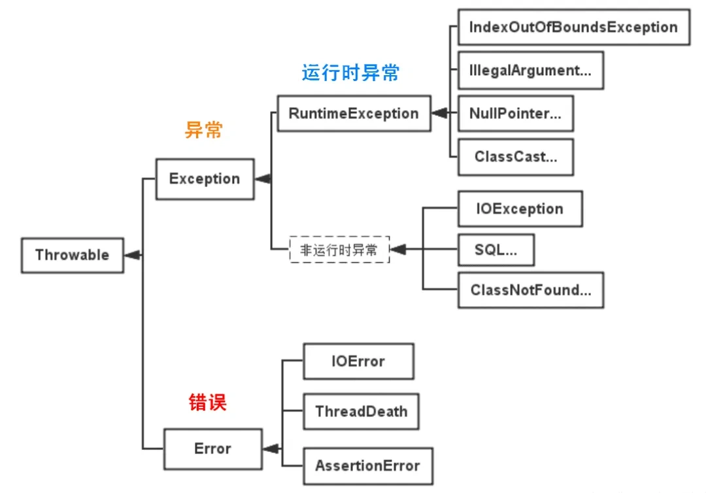

# Java

## 基础

### 关键字

####  Java 中 final 作用是什么？

final 关键字主要有以下三个方面的作用：用于修饰类、方法和变量。

- 修饰类：当 final 修饰一个类时，表示这个类不能被继承，是类继承体系中的最终形态。例如，Java 中的 String 类就是用 final 修饰的，这保证了 String 类的不可变性和安全性，防止其他类通过继承来改变 String 类的行为和特性。
- 修饰方法：用 final 修饰的方法不能在子类中被重写。例如，java.lang.Object 类中的 getClass 方法就是 final 的，因为这个方法的行为是由 Java 虚拟机底层实现来保证的，不应该被子类修改。
- 修饰变量：
  - 当 final 修饰基本数据类型的变量时，该变量一旦被赋值就不能再改变。例如，final int num = 10;，这里的 num 就是一个常量，不能再对其进行重新赋值操作，否则会导致编译错误。
  - 对于引用数据类型，final 修饰意味着这个引用变量不能再指向其他对象，**但对象本身的内容是可以改变的**。例如，final StringBuilder sb = new StringBuilder("Hello");，不能让 sb 再指向其他 StringBuilder 对象，但可以通过 sb.append(" World"); 来修改字符串的内容。

### 异常

#### 介绍一下Java异常

Java异常类层次结构图：



Java的异常体系主要基于两大类：**Throwable类**及其子类。Throwable有两个重要的子类：Error和Exception，它们分别代表了不同类型的异常情况。

1. **Error（错误）**：表示运行时环境的错误。错误是程序无法处理的严重问题，如系统崩溃、虚拟机错误、动态链接失败等。通常，程序不应该尝试捕获这类错误。例如，OutOfMemoryError、StackOverflowError等。

2. **Exception（异常）**：表示程序本身可以处理的异常条件。异常分为两大类：
   - **非运行时异常**：这类异常在编译时期就必须被捕获或者声明抛出。它们通常是外部错误，如文件不存在（FileNotFoundException）、类未找到（ClassNotFoundException）等。非运行时异常强制程序员处理这些可能出现的问题，增强了程序的健壮性。
   - **运行时异常**：这类异常包括运行时异常（RuntimeException）和错误（Error）。运行时异常由程序错误导致，如空指针访问（NullPointerException）、数组越界（ArrayIndexOutOfBoundsException）等。**运行时异常是不需要在编译时强制捕获或声明的。**

## 集合

### List

####  ArrayList线程安全吗？把ArrayList变成线程安全有哪些方法？

> 笔试：小红书

不是线程安全的，ArrayList变成线程安全的方式有：

- 使用**Collections**类的synchronizedList方法将ArrayList包装成线程安全的List：

  ```java
  List<String> synchronizedList = Collections.synchronizedList(arrayList);
  ```

- 使用CopyOnWriteArrayList类代替ArrayList，它是一个线程安全的List实现：

  ```java
  CopyOnWriteArrayList copyOnWriteArrayList = new CopyOnWriteArrayList<>(arrayList)
  ```

- 使用Vector类代替ArrayList，Vector是线程安全的List实现：

  ```java
  Vector<String> vector = new Vector<>(arrayList);
  ```

### Map

#### HashMap 的底层实现

**为什么优先扩容而非直接转为红黑树？**

数组扩容能减少哈希冲突的发生概率（即将元素重新分散到新的、更大的数组中），这在多数情况下比直接转换为红黑树更高效。

红黑树需要保持自平衡，维护成本较高。并且，过早引入红黑树反而会增加复杂度。

**为什么选择阈值 8 和 64？**

1. 泊松分布表明，链表长度达到 8 的概率极低（小于千万分之一）。在绝大多数情况下，链表长度都不会超过 8。阈值设置为 8，可以保证性能和空间效率的平衡。
2. 数组长度阈值 64 同样是经过实践验证的经验值。在小数组中扩容成本低，优先扩容可以避免过早引入红黑树。数组大小达到 64 时，冲突概率较高，此时红黑树的性能优势开始显现。

> TreeMap、TreeSet 以及 JDK1.8 之后的 HashMap 底层都用到了红黑树。红黑树就是为了解决二叉查找树的缺陷，因为二叉查找树在某些情况下会退化成一个线性结构。

结合源码分析一下 `HashMap` 链表到红黑树的转换。

**1、 `putVal` 方法中执行链表转红黑树的判断逻辑。**

链表的长度大于 8 的时候，就执行 `treeifyBin` （转换红黑树）的逻辑。

```java
// 遍历链表
for (int binCount = 0; ; ++binCount) {
    // 遍历到链表最后一个节点
    if ((e = p.next) == null) {
        p.next = newNode(hash, key, value, null);
        // 如果链表元素个数大于TREEIFY_THRESHOLD（8）
        if (binCount >= TREEIFY_THRESHOLD - 1) // -1 for 1st
            // 红黑树转换（并不会直接转换成红黑树）
            treeifyBin(tab, hash);
        break;
    }
    if (e.hash == hash &&
        ((k = e.key) == key || (key != null && key.equals(k))))
        break;
    p = e;
}
```

**2、`treeifyBin` 方法中判断是否真的转换为红黑树。**

```java
final void treeifyBin(Node<K,V>[] tab, int hash) {
    int n, index; Node<K,V> e;
    // 判断当前数组的长度是否小于 64
    if (tab == null || (n = tab.length) < MIN_TREEIFY_CAPACITY)
        // 如果当前数组的长度小于 64，那么会选择先进行数组扩容
        resize();
    else if ((e = tab[index = (n - 1) & hash]) != null) {
        // 否则才将列表转换为红黑树

        TreeNode<K,V> hd = null, tl = null;
        do {
            TreeNode<K,V> p = replacementTreeNode(e, null);
            if (tl == null)
                hd = p;
            else {
                p.prev = tl;
                tl.next = p;
            }
            tl = p;
        } while ((e = e.next) != null);
        if ((tab[index] = hd) != null)
            hd.treeify(tab);
    }
}
```

将链表转换成红黑树前会判断，如果当前数组的长度小于 64，那么会选择先进行数组扩容，而不是转换为红黑树。

#### HashMap 为什么线程不安全？

JDK1.7 及之前版本，在多线程环境下，`HashMap` 扩容时会造成死循环和数据丢失的问题。

数据丢失这个在 JDK1.7 和 JDK 1.8 中都存在，这里以 JDK 1.8 为例进行介绍。

JDK 1.8 后，在 `HashMap` 中，多个键值对可能会被分配到同一个桶（bucket），并以链表或红黑树的形式存储。多个线程对 `HashMap` 的 `put` 操作会导致线程不安全，具体来说会有**数据覆盖**的风险。

举个例子：

- 两个线程 1,2 同时进行 put 操作，并且发生了哈希冲突（hash 函数计算出的插入下标是相同的）。
- 不同的线程可能在不同的时间片获得 CPU 执行的机会，当前线程 1 执行完哈希冲突判断后，由于时间片耗尽挂起。线程 2 先完成了插入操作。
- 随后，线程 1 获得时间片，由于之前已经进行过 hash 碰撞的判断，所有此时会直接进行插入，这就导致线程 2 插入的数据被线程 1 覆盖了。

```java
public V put(K key, V value) {
        return putVal(hash(key), key, value, false, true);
    }

    
final V putVal(int hash, K key, V value, boolean onlyIfAbsent,
               boolean evict) {
    Node<K,V>[] tab; Node<K,V> p; int n, i;
    if ((tab = table) == null || (n = tab.length) == 0)
        n = (tab = resize()).length;
    // 判断是否出现 hash 碰撞
    // (n - 1) & hash 确定元素存放在哪个桶中，桶为空，新生成结点放入桶中(此时，这个结点是放在数组中)
    if ((p = tab[i = (n - 1) & hash]) == null)
        tab[i] = newNode(hash, key, value, null);
    else {
        Node<K,V> e; K k;
        if (p.hash == hash &&
            ((k = p.key) == key || (key != null && key.equals(k))))
            e = p;
        else if (p instanceof TreeNode)
            e = ((TreeNode<K,V>)p).putTreeVal(this, tab, hash, key, value);
        else {
            for (int binCount = 0; ; ++binCount) {
                if ((e = p.next) == null) {
                    p.next = newNode(hash, key, value, null);
                    if (binCount >= TREEIFY_THRESHOLD - 1) // -1 for 1st
                        treeifyBin(tab, hash);
                    break;
                }
                if (e.hash == hash &&
                    ((k = e.key) == key || (key != null && key.equals(k))))
                    break;
                p = e;
            }
        }
        if (e != null) { // existing mapping for key
            V oldValue = e.value;
            if (!onlyIfAbsent || oldValue == null)
                e.value = value;
            afterNodeAccess(e);
            return oldValue;
        }
    }
    ++modCount;
    // 实际大小大于阈值则扩容
    if (++size > threshold)
        resize();
    // 插入后回调
    afterNodeInsertion(evict);
    return null;
}
```

还有一种情况是这两个线程同时 `put` 操作导致 `size` 的值不正确，进而导致数据覆盖的问题：

1. 线程 1 执行 `if(++size > threshold)` 判断时，假设获得 `size` 的值为 10，由于时间片耗尽挂起。
2. 线程 2 也执行 `if(++size > threshold)` 判断，获得 `size` 的值也为 10，并将元素插入到该桶位中，并将 `size` 的值更新为 11。
3. 随后，线程 1 获得时间片，它也将元素放入桶位中，并将 size 的值更新为 11。
4. 线程 1、2 都执行了一次 `put` 操作，但是 `size` 的值只增加了 1，也就导致实际上只有一个元素被添加到了 `HashMap` 中。

###  ConcurrentHashMap怎么实现的？

JDK 1.8 ConcurrentHashMap JDK 1.8 ConcurrentHashMap 主要通过 volatile + CAS 或者 synchronized 来实现的线程安全的。添加元素时首先会判断容器是否为空：

- 如果为空则使用  volatile  加  CAS  来初始化
- 如果容器不为空，则根据存储的元素计算该位置是否为空。
  - 如果根据存储的元素计算结果为空，则利用  CAS  设置该节点；
  - 如果根据存储的元素计算结果不为空，则使用 synchronized  ，然后，遍历桶中的数据，并替换或新增节点到桶中，最后再判断是否需要转为红黑树，这样就能保证并发访问时的线程安全了。

## 新特性

### Java8 新特性

#### Date-Time API

在Java中，`Date`和`LocalDateTime`是两种不同的日期时间类，它们在设计、功能和用途上存在诸多区别，以下是详细对比：

设计理念

- **`Date`**：是Java早期的日期时间类，它将日期和时间封装在一起，同时包含了时间戳（自1970年1月1日00:00:00 GMT以来的毫秒数）的概念。它的设计较为简单，但在处理时区、日期时间计算等方面存在一些不足。
- **`LocalDateTime`**：是Java 8引入的新的日期时间类，属于`java.time`包。它是基于ISO日历系统的日期时间类，不包含时区信息。它的设计更加科学和灵活，解决了`Date`类中的一些问题，是Java日期时间API的现代替代方案。

功能特性

- **时区处理**：
    - **`Date`**：虽然`Date`类本身不直接包含时区信息，但它与系统默认时区相关联。在不同时区的系统上，`Date`对象的显示可能会有所不同。
    - **`LocalDateTime`**：明确不包含时区信息，它只表示一个具体的日期和时间，与时区无关。如果需要处理时区，可以使用`ZonedDateTime`类。
- **不可变性**：
    - **`Date`**：是可变类，可以通过`setTime`等方法修改对象的值。这种可变性可能导致线程安全问题。
    - **`LocalDateTime`**：是不可变类，一旦创建，其值不能被修改。如果需要修改日期时间，必须创建一个新的对象。这种不可变性使得`LocalDateTime`在多线程环境中更加安全。
- **日期时间计算**：
    - **`Date`**：提供了一些基本的日期时间计算方法，如`getTime`、`setTime`等，但功能相对有限，且不够直观。
    - **`LocalDateTime`**：提供了丰富的日期时间计算方法，如`plusDays`、`minusMonths`、`plusYears`等，这些方法返回一个新的`LocalDateTime`对象，使得日期时间计算更加方便和直观。
- **格式化和解析**：
    - **`Date`**：通常需要借助`SimpleDateFormat`类来进行格式化和解析，但`SimpleDateFormat`是线程不安全的，使用时需要注意线程安全问题。
    - **`LocalDateTime`**：可以使用`DateTimeFormatter`类进行格式化和解析，`DateTimeFormatter`是线程安全的，且提供了更强大的格式化功能。

使用场景

- **`Date`**：由于其历史原因，`Date`类在一些旧的Java项目中仍然被广泛使用。如果需要与旧的系统或库进行兼容，可能仍然需要使用`Date`类。
- **`LocalDateTime`**：在新的Java项目中，推荐使用`LocalDateTime`类及其相关类（如`ZonedDateTime`、`Instant`等）。它提供了更强大的功能、更好的**线程安全性**和更清晰的API设计，能够更好地满足现代应用程序对日期时间处理的需求。

总的来说，`LocalDateTime`是Java日期时间API的现代替代方案，它在设计、功能和安全性方面都优于`Date`类，建议在新的项目中优先使用`LocalDateTime`。