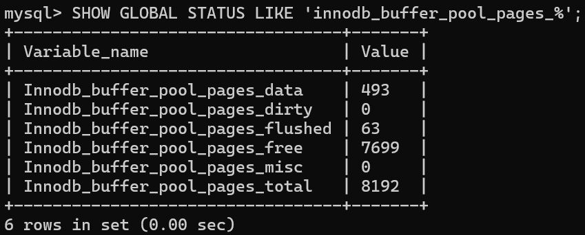

# MySQL面试题

## 语法

### LIMIT

```sql
SELECT column1, column2, ...
FROM table_name
WHERE condition
LIMIT offset, row_count;
```

- **`offset`**：表示跳过的行数，从哪一行开始返回数据（从 0 开始计数）。
- **`row_count`**：表示返回的行数。

如果只指定一个参数，它将被解释为返回的行数，从结果集的第一行开始返回。

### LEFT JOIN 和 RIGHT JOIN

- 左连接返回左表（主表）的所有记录，即使这些记录在右表中没有匹配的记录。如果左表的某条记录在右表中没有匹配，则右表的字段在结果集中会显示为 `NULL`。
- 右连接返回右表（主表）的所有记录，即使这些记录在左表中没有匹配的记录。如果右表的某条记录在左表中没有匹配，则左表的字段在结果集中会显示为 `NULL`。

### 在SQL中，为什么建议在大表上避免频繁使用DELETE操作而推荐使用TRUNCATE？

在SQL中，对于大表，建议避免频繁使用`DELETE`操作而推荐使用`TRUNCATE`，主要有以下原因：

1. **性能差异**：
   - `DELETE`操作是**逐行**删除数据，速度较慢，尤其是对于大表，会产生**大量日志记录**，占用存储空间并降低性能。
   - `TRUNCATE`操作是直接删除表中的所有数据页，**速度非常快**，几乎不产生日志记录，对系统资源的压力很小。

2. **事务支持**：
   - `DELETE`操作是可回滚的，适合需要根据特定条件删除部分数据或保证数据一致性的场景。
   - `TRUNCATE`操作是不可回滚的，适合需要清空整个表数据的场景，且在性能要求较高的场景中表现更优。

3. **适用场景**：
   - 如果需要根据特定条件删除部分数据，`DELETE`是合适的选择。
   - 如果需要快速清空整个表的数据，`TRUNCATE`是更好的选择，尤其是在处理大表时。

因此，在大表上，如果目标是快速清空表中的所有数据，`TRUNCATE`通常是更高效的选择。但需要注意，`TRUNCATE`操作不可回滚，使用时需谨慎。

### 查询SQL

```sql
# 统计出学生的成绩总分，按降序排序
select name, sum(score) as total_score from tbname group by name order by total_score desc;

# 查询所有课程的平均成绩
select subject, avg(score) as avg_score from tbname group by subject;
```


### 项目中的用法

```sql
# 给video_records表新增一个del_flag字段，类型为INT，默认值为1
ALTER TABLE detect_video_records ADD COLUMN del_flag INT(11) DEFAULT 1;
# 给sys_role_info表新增一个role_desc、enabled_flag字段
ALTER TABLE sys_role_info ADD COLUMN role_desc VARCHAR(255) COMMENT '角色描述';
ALTER TABLE sys_role_info ADD COLUMN enabled_flag CHAR(1) DEFAULT '1' COMMENT '是否启用';

# Asc 表示升序（Ascending），即从低到高或从小到大排序；
# Desc 表示降序（Descending），即从高到低或从大到小排序。

# 修改del_flag字段的默认值为0
ALTER TABLE detect_img_records ALTER del_flag SET DEFAULT 0;
ALTER TABLE detect_video_records ALTER del_flag SET DEFAULT 0;
ALTER TABLE detect_camera_records ALTER del_flag SET DEFAULT 0;
```


## 存储引擎

### MyISAM 和 InnoDB 有什么区别？

MySQL 5.5 之前，MyISAM 引擎是 MySQL 的默认存储引擎。

虽然，MyISAM 的性能还行，各种特性也还不错（比如全文索引、压缩、空间函数等）。但是，MyISAM 不支持事务和行级锁，而且最大的缺陷就是崩溃后无法安全恢复。

MySQL 5.5 版本之后，InnoDB 是 MySQL 的默认存储引擎。

简单对比一下两者：

**1、是否支持行级锁**

MyISAM 只有表级锁(table-level locking)，而 InnoDB 支持行级锁(row-level locking)和表级锁,默认为行级锁。

也就说，MyISAM 一锁就是锁住了整张表，这在并发写的情况下是多么滴憨憨啊！这也是为什么 InnoDB 在并发写的时候，性能更牛皮了！

**2、是否支持事务**

MyISAM 不提供事务支持。

InnoDB 提供事务支持，实现了 SQL 标准定义了四个隔离级别，具有提交(commit)和回滚(rollback)事务的能力。并且，InnoDB 默认使用的 REPEATABLE-READ（可重读）隔离级别是可以解决幻读问题发生的（基于 MVCC 和 Next-Key Lock）。

关于 MySQL 事务的详细介绍，可以看看我写的这篇文章：[MySQL 事务隔离级别详解]()。

**3、是否支持外键**

MyISAM 不支持，而 InnoDB 支持。

外键对于维护数据一致性非常有帮助，但是对性能有一定的损耗。因此，通常情况下，我们是不建议在实际生产项目中使用外键的，在业务代码中进行约束即可！

阿里的《Java 开发手册》也是明确规定禁止使用外键的。

不过，在代码中进行约束的话，对程序员的能力要求更高，具体是否要采用外键还是要根据你的项目实际情况而定。

总结：一般我们也是不建议在数据库层面使用外键的，应用层面可以解决。不过，这样会对数据的一致性造成威胁。具体要不要使用外键还是要根据你的项目来决定。

**4、是否支持数据库异常崩溃后的安全恢复**

MyISAM 不支持，而 InnoDB 支持。

使用 InnoDB 的数据库在异常崩溃后，数据库重新启动的时候会保证数据库恢复到崩溃前的状态。这个恢复的过程依赖于 `redo log` 。

**5、是否支持 MVCC**

MyISAM 不支持，而 InnoDB 支持。

讲真，这个对比有点废话，毕竟 MyISAM 连行级锁都不支持。MVCC 可以看作是行级锁的一个升级，可以有效减少加锁操作，提高性能。

**6、索引实现不一样。**

虽然 MyISAM 引擎和 InnoDB 引擎都是使用 B+Tree 作为索引结构，但是两者的实现方式不太一样。

InnoDB 引擎中，其数据文件本身就是索引文件。相比 MyISAM，索引文件和数据文件是分离的，其表数据文件本身就是按 B+Tree 组织的一个索引结构，树的叶节点 data 域保存了完整的数据记录。

详细区别，推荐你看看我写的这篇文章：[MySQL 索引详解]()。

**7、性能有差别。**

InnoDB 的性能比 MyISAM 更强大，不管是在读写混合模式下还是只读模式下，随着 CPU 核数的增加，InnoDB 的读写能力呈线性增长。MyISAM 因为读写不能并发，它的处理能力跟核数没关系。

**8、数据缓存策略和机制实现不同。**

InnoDB 使用缓冲池（Buffer Pool）缓存数据页和索引页，MyISAM 使用键缓存（Key Cache）仅缓存索引页而不缓存数据页。

**总结**：

- InnoDB 支持行级别的锁粒度，MyISAM 不支持，只支持表级别的锁粒度。
- MyISAM 不提供事务支持。InnoDB 提供事务支持，实现了 SQL 标准定义了四个隔离级别。
- MyISAM 不支持外键，而 InnoDB 支持。
- MyISAM 不支持 MVCC，而 InnoDB 支持。
- 虽然 MyISAM 引擎和 InnoDB 引擎都是使用 B+Tree 作为索引结构，但是两者的实现方式不太一样。
- MyISAM 不支持数据库异常崩溃后的安全恢复，而 InnoDB 支持。
- InnoDB 的性能比 MyISAM 更强大。

最后，再分享一张图片给你，这张图片详细对比了常见的几种 MySQL 存储引擎。

## 事务

另外，关系型数据库（例如：`MySQL`、`SQL Server`、`Oracle` 等）事务都有 **ACID** 特性：

1. **原子性**（`Atomicity`）：事务是最小的执行单位，不允许分割。事务的原子性确保动作要么全部完成，要么完全不起作用；

2. **一致性**（`Consistency`）：执行事务前后，数据保持一致，例如转账业务中，无论事务是否成功，转账者和收款人的总额应该是不变的；

3. **隔离性**（`Isolation`）：并发访问数据库时，一个用户的事务不被其他事务所干扰，各并发事务之间数据库是独立的；

4. **持久性**（`Durability`）：一个事务被提交之后。它对数据库中数据的改变是持久的，即使数据库发生故障也不应该对其有任何影响。

🌈 这里要额外补充一点：**只有保证了事务的持久性、原子性、隔离性之后，一致性才能得到保障。也就是说 A、I、D 是手段，C 是目的！**

### SQL 标准定义了哪些事务隔离级别?

SQL 标准定义了四种事务隔离级别，用来平衡事务的隔离性（Isolation）和并发性能。级别越高，数据一致性越好，但并发性能可能越低。这四个级别是：

- **READ-UNCOMMITTED(读取未提交)** ：最低的隔离级别，允许读取尚未提交的数据变更，可能会导致**脏读、幻读或不可重复读**。这种级别在实际应用中很少使用，因为它对数据一致性的保证太弱。

- **READ-COMMITTED(读取已提交)** ：允许读取并发事务已经提交的数据，可以**阻止脏读**，但是幻读或不可重复读仍有可能发生。这是大多数数据库（如 Oracle, SQL Server）的默认隔离级别。

- **REPEATABLE-READ(可重复读)** ：对同一字段的多次读取结果都是一致的，除非数据是被本身事务自己所修改，可以阻止脏读和不可重复读，但幻读仍有可能发生。MySQL InnoDB 存储引擎的**默认隔离级别**正是 REPEATABLE READ。并且，InnoDB 在此级别下通过 MVCC（多版本并发控制） 和 Next-Key Locks（间隙锁+行锁） 机制，在很大程度上解决了幻读问题。

- **SERIALIZABLE(可串行化)** ：最高的隔离级别，完全服从 ACID 的隔离级别。所有的事务依次逐个执行，这样事务之间就完全不可能产生干扰，也就是说，该级别可以防止脏读、不可重复读以及幻读。

| 隔离级别         | 脏读 (Dirty Read) | 不可重复读 (Non-Repeatable Read) | 幻读 (Phantom Read)    |
| ---------------- | ----------------- | -------------------------------- | ---------------------- |
| READ UNCOMMITTED | √                 | √                                | √                      |
| READ COMMITTED   | ×                 | √                                | √                      |
| REPEATABLE READ  | ×                 | ×                                | √ (标准) / ≈× (InnoDB) |
| SERIALIZABLE     | ×                 | ×                                | ×                      |

```sql
SELECT @@GLOBAL.tx_isolation, @@tx_isolation;
```

可以看到，默认的隔离级别为 REPEATABLE-READ，全局隔离级别和当前会话隔离级别皆是如此。

不可重复读和脏读的区别在于，脏读是看到了其他事务未提交的数据，而不可重复读是看到了其他事务已经提交的数据（由于当前 SQL 也是在事务中，因此有可能并不想看到其他事务已经提交的数据）。

## 索引

### 覆盖索引和联合索引
#### 覆盖索引

如果一个索引包含（或者说覆盖）所有需要查询的字段的值，我们就称之为 **覆盖索引（Covering Index）**。

在 InnoDB 存储引擎中，非主键索引的叶子节点包含的是主键的值。这意味着，当使用非主键索引进行查询时，数据库会先找到对应的主键值，然后再通过主键索引来定位和检索完整的行数据。这个过程被称为“回表”。

**覆盖索引即需要查询的字段正好是索引的字段，那么直接根据该索引，就可以查到数据了，而无需回表查询。**

> 如主键索引，如果一条 SQL 需要查询主键，那么正好根据主键索引就可以查到主键。再如普通索引，如果一条 SQL 需要查询 name，name 字段正好有索引，
>  那么直接根据这个索引就可以查到数据，也无需回表。

以 `score` 和 `name` 两个字段建立联合索引：

```sql
ALTER TABLE `cus_order` ADD INDEX id_score_name(score, name);
```

创建完成之后，再用 `EXPLAIN` 命令分析再次分析这条 SQL 语句。通过 `Extra` 这一列的 `Using index`，说明这条 SQL 语句成功使用了覆盖索引。


这条SQL语句的索引：SELECT * FROM table WHERE a=x AND b>x AND c=x 怎么建

这条语句的索引必须把等值列全部放在前导部分，把范围列放在最后，否则范围列会把后面的列“挡”在索引过滤之外。

具体做法  
1. 把 a、c 两个等值筛选列放在最前面（顺序可交换，看哪个选择性更高就放在更前面）。  
2. 把 b 这个范围列放在它们之后。  

因此推荐索引：

```sql
CREATE INDEX idx_table_a_c_b ON table (a, c, b);
```

说明  
- a、c 是等值匹配，放在前导部分，让 B-Tree 可以直接定位到对应区间。  
- b 是范围条件 (>x)，放在最后，引擎在已经定位的区间内再做范围扫描即可。  
- SELECT * 需要回表拿整行数据；如果查询频繁或表很大，可以考虑把常用的列再包含进索引做覆盖索引，减少回表。


现有联合索引（a，b，c）。请问select * from t where c=1，b=2，a=3走不走索引？

会走索引，但**无法利用“最左前缀”原则**，等价于对整棵索引树做一次**全索引扫描**，而不是精准定位。

具体过程  
1. 索引顺序是 (a, b, c)，查询条件却是 `a=3 AND b=2 AND c=1`。  
2. 优化器发现三个列都在条件里，且全部用“=”匹配，**可以**直接沿着 (a→b→c) 的三层路径一次定位到唯一区间，属于**非常高效的“完全匹配”**。  
3. 如果 WHERE 子句里写的是 `c=1 AND b=2 AND a=3`（顺序不同），优化器会在 **逻辑层** 把条件重排成 `a=3 AND b=2 AND c=1`，因此结果与上面一样，**依然能精准走索引**。

结论  
- 查询条件覆盖全部索引列且均为等值匹配 ⇒ **能走联合索引，且定位非常精准**（不是全表扫描，也不是全索引扫描）。  
- 只要列都出现在 WHERE 里并用 AND 连接，优化器会自动调整顺序去匹配索引，开发者无需关心书写顺序。


现有联合索引（a，b，c）。请问select * from t where c=1，b=2走不走索引？

不会**有效使用**这个联合索引 (a,b,c)。

原因  
1. 最左前缀原则：索引以 a 开头，而查询条件里没有 a，只有 b、c。  
2. 优化器拿到 `WHERE b=2 AND c=1` 后，无法沿着 (a→b→c) 的顺序进入索引树，只能退化成**全索引扫描**（type = index），甚至直接选择**全表扫描**（type = ALL）。  
3. 无论把 b、c 的顺序怎么写，结果都一样——缺了 a，就断了前缀。

结论  
• 现有 (a,b,c) 索引对这条查询**几乎无效**。  
• 如果该查询很常见，需要再建一个以 b、c 开头的索引，例如：  

  ```sql
  CREATE INDEX idx_t_b_c ON t(b, c);
  ```


现有联合索引（b，c）。select a，b，c from t where c=1，b=2 

select b，c from t where c=1，b=2有什么区别

区别只在于**返回的列集不同**；两条语句在现有联合索引 `(b, c)` 上的**索引使用方式完全一样**：

1. 查询条件都是 `b = 2 AND c = 1`，符合联合索引 `(b, c)` 的最左前缀，优化器会走 **精确匹配**（type = ref）。  
2. 两条语句需要的列 **都包含在索引里**（第一条要 `a, b, c`，第二条只要 `b, c`），但索引里只有 `b, c`，没有 `a`。  
   - 第一条：拿到满足条件的 `(b, c)` 后，**必须回表**取 `a` 列。  
   - 第二条：拿到满足条件的 `(b, c)` 后，**无需回表**即可直接返回，属于 **覆盖索引**（Using index）。

因此：  
- 第一条会 **走索引 + 回表**；  
- 第二条会 **走索引 + 不回表**，性能更好。

## 锁

### MySQL 有哪些锁？

在 MySQL 里，根据加锁的范围，可以分为**全局锁、表级锁和行锁**三类。

#### 全局锁

```sql
# 使用全局锁
# 执行后，整个数据库就处于只读状态了
flush tables with read lock
# 释放全局锁
unlock tables
```

#### 表级锁

MySQL 里面表级别的锁有这几种：

- 表锁
- 元数据锁（MDL）
- 意向锁
- AUTO-INC锁

```sql
//表级别的共享锁，也就是读锁；
//允许当前会话读取被锁定的表，但阻止其他会话对这些表进行写操作。
lock tables t_student read;

//表级别的独占锁，也就是写锁；
//允许当前会话对表进行读写操作，但阻止其他会话对这些表进行任何操作（读或写）。
lock tables t_stuent write;
```

#### 行级锁

## 日志


## 重要知识点

### SQL语句在MySQL中的执行过程

以上就是一条查询 SQL 的执行流程，那么接下来我们看看一条更新语句如何执行的呢？SQL 语句如下：

```sql
update tb_student A set A.age='19' where A.name=' 张三 ';
```

我们来给张三修改下年龄，在实际数据库肯定不会设置年龄这个字段的，不然要被技术负责人打的。其实这条语句也基本上会沿着上一个查询的流程走，只不过执行更新的时候肯定要记录日志啦，这就会引入日志模块了，MySQL 自带的日志模块是 **binlog（归档日志）** ，所有的存储引擎都可以使用，我们常用的 InnoDB 引擎还自带了一个日志模块 **redo log（重做日志）**，我们就以 InnoDB 模式下来探讨这个语句的执行流程。流程如下：

- 先查询到张三这一条数据，不会走查询缓存，因为更新语句会导致与该表相关的查询缓存失效。
- 然后拿到查询的语句，把 age 改为 19，然后调用引擎 API 接口，写入这一行数据，InnoDB 引擎把数据保存在内存中，同时记录 redo log，此时 redo log 进入 prepare 状态，然后告诉**执行器**，执行完成了，随时可以提交。
- 执行器收到通知后记录 binlog，然后调用引擎接口，提交 redo log 为提交状态。
- 更新完成。

我们来给张三修改下年龄，在实际数据库肯定不会设置年龄这个字段的，不然要被技术负责人打的。其实这条语句也基本上会沿着上一个查询的流程走，只不过执行更新的时候肯定要记录日志啦，这就会引入日志模块了，MySQL 自带的日志模块是 **binlog（归档日志）** ，所有的存储引擎都可以使用，我们常用的 InnoDB 引擎还自带了一个日志模块 **redo log（重做日志）**，我们就以 InnoDB 模式下来探讨这个语句的执行流程。流程如下：

- 先查询到张三这一条数据，不会走查询缓存，因为更新语句会导致与该表相关的查询缓存失效。
- 然后拿到查询的语句，把 age 改为 19，然后调用引擎 API 接口，写入这一行数据，InnoDB 引擎把数据保存在内存中，同时记录 redo log，此时 redo log 进入 prepare 状态，然后告诉执行器，执行完成了，随时可以提交。
- 执行器收到通知后记录 binlog，然后调用引擎接口，提交 redo log 为提交状态。
- 更新完成。

### MySQL主从同步是如何实现的 

*Binary log：主数据库的二进制日志。*

*Relay log：从服务器的中继日志。*

**第一步：**master在每个事务更新数据完成之前，将该操作记录串行地写入到 `binlog` 文件中。

**第二步：**salve开启一个I/O Thread，该线程在master打开一个普通连接，主要工作是binlog dump process。如果读取的进度已经跟上了master，就进入睡眠状态并等待master产生新的事件。I/O线程最终的目的是将这些事件写入到中继日志中。

**第三步：**SQL Thread会读取中继日志，并顺序执行该日志中的SQL事件，从而与主数据库中的数据保持一致。

这个同步是有延迟的，无法做到实时同步。

### 你对MySQL的慢查询优化有了解吗 

**慢查询** 是指执行时间超过设定阈值的查询语句。MySQL 的默认阈值是 10 秒，但通常我们会根据实际情况调整。

1. **添加索引**
   - **复合索引**：联合索引可以加速多个字段的查询，尤其是 `AND` 连接条件时。
   - **覆盖索引**：索引包含查询所需的所有列，避免回表查询，提高查询效率。
2. **优化 SQL 语句**
   - **避免 SELECT \* **：只查询需要的字段，减少数据传输。
   - **使用合适的 JOIN**：避免使用 `N+1` 查询，避免笛卡尔积，尽量减少查询的次数。
3. **表结构与数据设计优化**
   - **优化表结构**：合理选择数据类型，避免过大的字段长度，尽量使用合适的 `INT`、`VARCHAR` 类型。
   - **分表分库**：对于极大的表，可以通过分表分库来减轻单一表的压力，提升查询效率。
4. **查询缓存与数据库配置优化**

### 慢 SQL 怎么排查

1. 开启慢查询日志

2. 分析慢查询日志

   慢查询日志记录了执行时间超过阈值的 SQL 语句。可以使用以下工具来分析慢查询日志：

   - **mysqldumpslow**：MySQL 自带的命令行工具，用于解析和汇总慢查询日志文件。例如：

     ```bash
     mysqldumpslow -s t -t 10 /path/to/your/slow.log
     ```

     这条命令会按执行时间排序，显示前 10 条最慢的查询。

   - **pt-query-digest**：更强大的工具，可以提供详细的查询分析报告。例如：

     ```bash
     pt-query-digest /path/to/your/slow.log > query_report.txt
     ```

     这条命令会生成一个详细的查询分析报告。

3. 使用 `EXPLAIN` 分析查询计划

   如果 `EXPLAIN` 的输出中 `type` 列显示为 `ALL`，说明是全表扫描，没有使用索引

4. 优化查询语句

5. 使用 `SHOW PROCESSLIST` 查看当前执行的 SQL

6. 调整数据库配置

## 性能调优

### 1. 选择合适的存储引擎: InnoDB

### 2. 保证从内存中读取数据，将数据保存在内存中

```sql
SHOW GLOBAL STATUS LIKE 'innodb_buffer_pool_pages_%';
```



发现 Innodb_buffer_pool_pages_free 为 0，则说明 buffer pool 已经被用光，需要增大 innodb_buffer_pool_size

### 3. 定期优化重建数据库

mysqlcheck -o –all-databases 会让 `ibdata1` 不断增大，真正的优化只有**重建数据表结构**。

### 6. 充分使用索引

### 7. 分析查询日志和慢查询日志

### 8. 激进的方法，使用内存磁盘