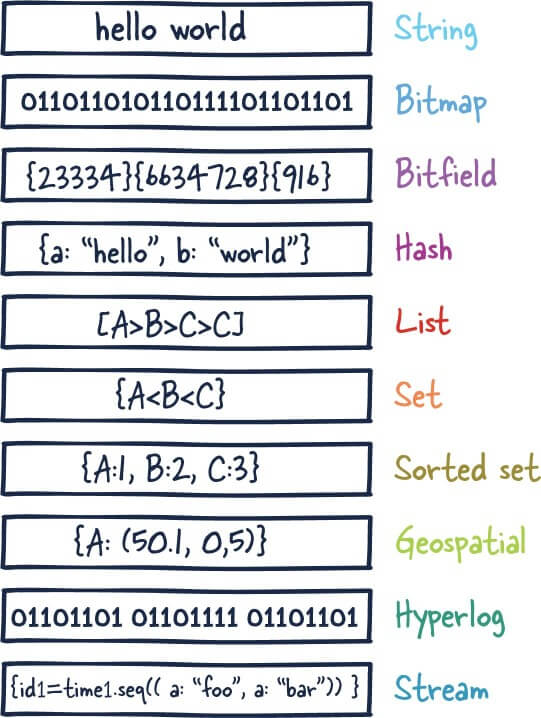

# Redis

提示词：我是一位面试官，我看见应聘者的简历上的项目写了技术栈有Redis，请问我可以问他什么问题来考察

```bash
# 打开客户端
redis-cli

# 查看所有keys
keys *
# 查看特定模式的键，列出以 SYSTEM_MONITOR_MAP 开头的键。
keys "SYSTEM_MONITOR_MAP*"

# 查看字符串类型的键值对
get "SYSTEM_MONITOR_MAP"

# 检查某个键的过期时间，如果返回值为 -1，表示键没有设置过期时间；
ttl "SYSTEM_MONITOR_MAP"

# 删除单个键
del "SYSTEM_MONITOR_MAP"
```

## Redis基础

### 什么是 Redis？

Redis（**RE**mote **DI**ctionary **S**erver）是一个基于 C 语言开发的开源 NoSQL 数据库（BSD 许可）。与传统数据库不同的是，Redis 的数据是保存在内存中的（内存数据库，支持持久化），因此读写速度非常快，被广泛应用于分布式缓存方向。并且，Redis 存储的是 KV 键值对数据。

为了满足不同的业务场景，Redis 内置了多种数据类型实现（比如 String、Hash、Sorted Set、Bitmap、HyperLogLog、GEO）。并且，Redis 还支持事务、持久化、Lua 脚本、发布订阅模型、多种开箱即用的集群方案（Redis Sentinel、Redis Cluster）。



## Redis 数据类型

### ZSet

Zset 类型（有序集合类型）相比于 Set 类型多了一个排序属性 score（分值），对于有序集合 ZSet 来说，每个存储元素相当于有两个值组成的，一个是有序集合的元素值，一个是排序值。

有序集合保留了集合不能有重复成员的特性（分值可以重复），但不同的是，有序集合中的元素可以排序。

#### 内部实现

Zset 类型的底层数据结构是由**压缩列表或跳表**实现的：

- 如果有序集合的**元素个数小于 128 个，并且每个元素的值小于 64 字节**时，Redis 会使用压缩列表作为 Zset 类型的底层数据结构； 
- 如果有序集合的元素不满足上面的条件，Redis 会使用跳表作为 Zset 类型的底层数据结构； 

在 Redis 7.0 中，压缩列表数据结构已经废弃了，交由 listpack 数据结构来实现了。

### Redis 持久化机制（重要）

Redis 持久化机制（RDB 持久化、AOF 持久化、RDB 和 AOF 的混合持久化）

使用缓存的时候，我们经常需要对内存中的数据进行持久化也就是将内存中的数据写入到硬盘中。大部分原因是为了之后重用数据（比如重启机器、机器故障之后恢复数据），或者是为了做数据同步（比如 Redis 集群的主从节点通过 RDB 文件同步数据）。

Redis 不同于 Memcached 的很重要一点就是，Redis 支持持久化，而且支持 3 种持久化方式:

- 快照（snapshotting，RDB）
- 只追加文件（append-only file, AOF）
- RDB 和 AOF 的混合持久化(Redis 4.0 新增)

快照持久化是 Redis 默认采用的持久化方式，在 `redis.conf` 配置文件中默认有此下配置：

```conf
save 900 1           #在900秒(15分钟)之后，如果至少有1个key发生变化，Redis就会自动触发bgsave命令创建快照。

save 300 10          #在300秒(5分钟)之后，如果至少有10个key发生变化，Redis就会自动触发bgsave命令创建快照。

save 60 10000        #在60秒(1分钟)之后，如果至少有10000个key发生变化，Redis就会自动触发bgsave命令创建快照。
```

与快照持久化相比，AOF 持久化的实时性更好。默认情况下 Redis 没有开启 AOF（append only file）方式的持久化（Redis 6.0 之后已经默认是开启了），可以通过 `appendonly` 参数开启：

```conf
appendonly yes
```

开启 AOF 持久化后每执行一条会更改 Redis 中的数据的命令，Redis 就会将该命令写入到 AOF 缓冲区 `server.aof_buf` 中，然后再写入到 AOF 文件中（此时还在系统内核缓存区未同步到磁盘），最后再根据持久化方式（ `fsync`策略）的配置来决定何时将系统内核缓存区的数据同步到硬盘中的。

## Redis生产问题

### 缓存穿透、击穿和雪崩
#### 什么是缓存穿透？

缓存穿透说简单点就是大量请求的 key 是不合理的，**根本不存在于缓存中，也不存在于数据库中**。这就导致这些请求直接到了数据库上，根本没有经过缓存这一层，对数据库造成了巨大的压力，可能直接就被这么多请求弄宕机了。

举个例子：某个黑客故意制造一些非法的 key 发起大量请求，导致大量请求落到数据库，结果数据库上也没有查到对应的数据。也就是说这些请求最终都落到了数据库上，对数据库造成了巨大的压力。

有哪些解决办法？

最基本的就是首先做好参数校验，一些不合法的参数请求直接抛出异常信息返回给客户端。比如查询的数据库 id 不能小于 0、传入的邮箱格式不对的时候直接返回错误消息给客户端等等。

**1）缓存无效 key**

如果缓存和数据库都查不到某个 key 的数据，就写一个到 Redis 中去并设置过期时间，具体命令如下：`SET key value EX 10086`。这种方式可以解决请求的 key 变化不频繁的情况，如果黑客恶意攻击，每次构建不同的请求 key，会导致 Redis 中缓存大量无效的 key。很明显，这种方案并不能从根本上解决此问题。如果非要用这种方式来解决穿透问题的话，尽量将无效的 key 的过期时间设置短一点，比如 1 分钟。

另外，这里多说一嘴，一般情况下我们是这样设计 key 的：`表名:列名:主键名:主键值`。

如果用 Java 代码展示的话，差不多是下面这样的：

**2）布隆过滤器**

布隆过滤器是一个非常神奇的数据结构，通过它我们可以非常方便地**判断一个给定数据是否存在于海量数据中**。我们可以把它看作由二进制向量（或者说位数组）和一系列随机映射函数（哈希函数）两部分组成的数据结构。相比于我们平时常用的 List、Map、Set 等数据结构，它占用空间更少并且效率更高，但是缺点是其返回的结果是概率性的，而不是非常准确的。理论情况下添加到集合中的元素越多，误报的可能性就越大。并且，存放在布隆过滤器的数据不容易删除。

具体是这样做的：把所有可能存在的请求的值都存放在布隆过滤器中，当用户请求过来，先判断用户发来的请求的值是否存在于布隆过滤器中。不存在的话，直接返回请求参数错误信息给客户端，存在的话才会走下面的流程。

加入布隆过滤器之后的缓存处理流程图如下：


**3）接口限流**

根据用户或者 IP 对接口进行限流，对于异常频繁的访问行为，还可以采取黑名单机制，例如将异常 IP 列入黑名单。

后面提到的缓存击穿和雪崩都可以配合接口限流来解决，毕竟这些问题的关键都是有很多请求落到了数据库上造成数据库压力过大。

#### 什么是缓存击穿？

缓存击穿中，请求的 key 对应的是 **热点数据**，该数据 **存在于数据库中，但不存在于缓存中（通常是因为缓存中的那份数据已经过期）**。这就可能会导致瞬时大量的请求直接打到了数据库上，对数据库造成了巨大的压力，可能直接就被这么多请求弄宕机了。

举个例子：秒杀进行过程中，缓存中的某个秒杀商品的数据**突然过期**，这就导致瞬时大量对该商品的请求直接落到数据库上，对数据库造成了巨大的压力。

有哪些解决办法？

1. **永不过期**（不推荐）：设置热点数据永不过期或者过期时间比较长。
2. **提前预热**（推荐）：针对热点数据提前预热，将其存入缓存中并设置合理的过期时间比如秒杀场景下的数据在秒杀结束之前不过期。
3. **加锁**（看情况）：在缓存失效后，通过设置互斥锁确保只有一个请求去查询数据库并更新缓存。

缓存穿透和缓存击穿有什么区别？

缓存穿透中，请求的 key 既不存在于缓存中，也不存在于数据库中。

缓存击穿中，请求的 key 对应的是 **热点数据** ，该数据 **存在于数据库中，但不存在于缓存中（通常是因为缓存中的那份数据已经过期）** 。

> 击穿说明是有东西（即缓存），有东西才能被击穿；穿透说明没有东西，直接穿进去

#### 什么是缓存雪崩？

实际上，缓存雪崩描述的就是这样一个简单的场景：**缓存在同一时间大面积的失效，导致大量的请求都直接落到了数据库上，对数据库造成了巨大的压力。** 这就好比雪崩一样，摧枯拉朽之势，数据库的压力可想而知，可能直接就被这么多请求弄宕机了。

另外，缓存服务宕机也会导致缓存雪崩现象，导致所有的请求都落到了数据库上。

举个例子：缓存中的大量数据在同一时间过期，这个时候突然有大量的请求需要访问这些过期的数据。这就导致大量的请求直接落到数据库上，对数据库造成了巨大的压力。

有哪些解决办法？

**针对 Redis 服务不可用的情况**：

1. **Redis 集群**：采用 Redis 集群，避免单机出现问题整个缓存服务都没办法使用。Redis Cluster 和 Redis Sentinel 是两种最常用的 Redis 集群实现方案。
2. **多级缓存**：设置多级缓存，例如本地缓存+Redis 缓存的二级缓存组合，当 Redis 缓存出现问题时，还可以从本地缓存中获取到部分数据。

**针对大量缓存同时失效的情况**：

1. **设置随机失效时间**（可选）：为缓存设置随机的失效时间，例如在固定过期时间的基础上加上一个随机值，这样可以避免大量缓存同时到期，从而减少缓存雪崩的风险。
2. **提前预热**（推荐）：针对热点数据提前预热，将其存入缓存中并设置合理的过期时间，比如秒杀场景下的数据在秒杀结束之前不过期。
3. **持久缓存策略**（看情况）：虽然一般不推荐设置缓存永不过期，但对于某些关键性和变化不频繁的数据，可以考虑这种策略。

缓存预热如何实现？

常见的缓存预热方式有两种：

1. 使用定时任务，比如 xxl-job，来定时触发缓存预热的逻辑，将数据库中的热点数据查询出来并存入缓存中。
2. 使用消息队列，比如 Kafka，来异步地进行缓存预热，将数据库中的热点数据的主键或者 ID 发送到消息队列中，然后由缓存服务消费消息队列中的数据，根据主键或者 ID 查询数据库并更新缓存。

缓存雪崩和缓存击穿有什么区别？

缓存雪崩和缓存击穿比较像，但缓存雪崩导致的原因是缓存中的大量或者所有数据失效，缓存击穿导致的原因主要是某个**热点数据**不存在于缓存中（通常是因为缓存中的那份数据已经过期）。

