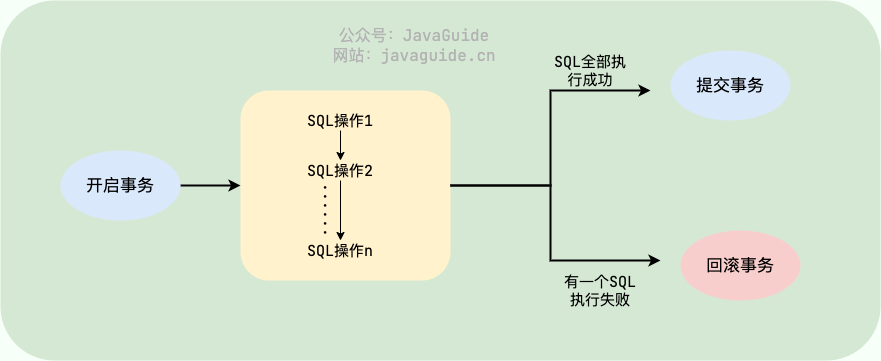
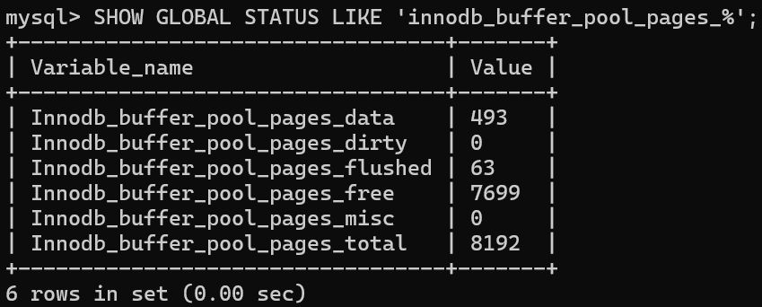

# MySQL面试题

## 语法

### LIMIT

```sql
SELECT column1, column2, ...
FROM table_name
WHERE condition
LIMIT offset, row_count;
```

- **`offset`**：表示跳过的行数，从哪一行开始返回数据（从 0 开始计数）。
- **`row_count`**：表示返回的行数。

如果只指定一个参数，它将被解释为返回的行数，从结果集的第一行开始返回。

### LEFT JOIN 和 RIGHT JOIN

- 左连接返回左表（主表）的所有记录，即使这些记录在右表中没有匹配的记录。如果左表的某条记录在右表中没有匹配，则右表的字段在结果集中会显示为 `NULL`。
- 右连接返回右表（主表）的所有记录，即使这些记录在左表中没有匹配的记录。如果右表的某条记录在左表中没有匹配，则左表的字段在结果集中会显示为 `NULL`。

### 在SQL中，为什么建议在大表上避免频繁使用DELETE操作而推荐使用TRUNCATE？

在SQL中，对于大表，建议避免频繁使用`DELETE`操作而推荐使用`TRUNCATE`，主要有以下原因：

1. **性能差异**：
   - `DELETE`操作是**逐行**删除数据，速度较慢，尤其是对于大表，会产生**大量日志记录**，占用存储空间并降低性能。
   - `TRUNCATE`操作是直接删除表中的所有数据页，**速度非常快**，几乎不产生日志记录，对系统资源的压力很小。

2. **事务支持**：
   - `DELETE`操作是可回滚的，适合需要根据特定条件删除部分数据或保证数据一致性的场景。
   - `TRUNCATE`操作是不可回滚的，适合需要清空整个表数据的场景，且在性能要求较高的场景中表现更优。

3. **适用场景**：
   - 如果需要根据特定条件删除部分数据，`DELETE`是合适的选择。
   - 如果需要快速清空整个表的数据，`TRUNCATE`是更好的选择，尤其是在处理大表时。

因此，在大表上，如果目标是快速清空表中的所有数据，`TRUNCATE`通常是更高效的选择。但需要注意，`TRUNCATE`操作不可回滚，使用时需谨慎。

### 查询SQL

```sql
# 统计出学生的成绩总分，按降序排序
select name, sum(score) as total_score from tbname group by name order by total_score desc;

# 查询所有课程的平均成绩
select subject, avg(score) as avg_score from tbname group by subject;
```

#### Having

`HAVING` 通常出现在 `GROUP BY` 之后，`WHERE` 优先于 `HAVING` 执行。

```sql
SELECT department_id, COUNT(*) AS num_employees
FROM employees
WHERE salary > 5000
GROUP BY department_id
HAVING COUNT(*) > 5
ORDER BY num_employees DESC;
```

执行顺序

1. FROM：从 `employees` 表中读取数据。
2. WHERE：过滤出工资大于 5000 的员工记录。
3. GROUP BY：按 `department_id` 对过滤后的结果进行分组。
4. HAVING：对分组后的结果进行过滤，只保留员工数量大于 5 的部门。
5. SELECT：选择 `department_id` 和 `num_employees` 列。
6. ORDER BY：按 `num_employees` 降序排序。


### 项目中的用法

```sql
# 给video_records表新增一个del_flag字段，类型为INT，默认值为1
ALTER TABLE detect_video_records ADD COLUMN del_flag INT(11) DEFAULT 1;
# 给sys_role_info表新增一个role_desc、enabled_flag字段
ALTER TABLE sys_role_info ADD COLUMN role_desc VARCHAR(255) COMMENT '角色描述';
ALTER TABLE sys_role_info ADD COLUMN enabled_flag CHAR(1) DEFAULT '1' COMMENT '是否启用';

# Asc 表示升序（Ascending），即从低到高或从小到大排序；
# Desc 表示降序（Descending），即从高到低或从大到小排序。

# 修改del_flag字段的默认值为0
ALTER TABLE detect_img_records ALTER del_flag SET DEFAULT 0;
ALTER TABLE detect_video_records ALTER del_flag SET DEFAULT 0;
ALTER TABLE detect_camera_records ALTER del_flag SET DEFAULT 0;
```


## 存储引擎

### MyISAM 和 InnoDB 有什么区别？

MySQL 5.5 之前，MyISAM 引擎是 MySQL 的默认存储引擎。

虽然，MyISAM 的性能还行，各种特性也还不错（比如全文索引、压缩、空间函数等）。但是，MyISAM 不支持事务和行级锁，而且最大的缺陷就是崩溃后无法安全恢复。

MySQL 5.5 版本之后，InnoDB 是 MySQL 的默认存储引擎。

简单对比一下两者：

**1、是否支持行级锁**

MyISAM 只有表级锁(table-level locking)，而 InnoDB 支持行级锁(row-level locking)和表级锁,默认为行级锁。

也就说，MyISAM 一锁就是锁住了整张表，这在并发写的情况下是多么滴憨憨啊！这也是为什么 InnoDB 在并发写的时候，性能更牛皮了！

**2、是否支持事务**

MyISAM 不提供事务支持。

InnoDB 提供事务支持，实现了 SQL 标准定义了四个隔离级别，具有提交(commit)和回滚(rollback)事务的能力。并且，InnoDB 默认使用的 REPEATABLE-READ（可重读）隔离级别是可以解决幻读问题发生的（基于 MVCC 和 Next-Key Lock）。

关于 MySQL 事务的详细介绍，可以看看我写的这篇文章：[MySQL 事务隔离级别详解]()。

**3、是否支持外键**

MyISAM 不支持，而 InnoDB 支持。

外键对于维护数据一致性非常有帮助，但是对性能有一定的损耗。因此，通常情况下，我们是不建议在实际生产项目中使用外键的，在业务代码中进行约束即可！

阿里的《Java 开发手册》也是明确规定禁止使用外键的。

不过，在代码中进行约束的话，对程序员的能力要求更高，具体是否要采用外键还是要根据你的项目实际情况而定。

总结：一般我们也是不建议在数据库层面使用外键的，应用层面可以解决。不过，这样会对数据的一致性造成威胁。具体要不要使用外键还是要根据你的项目来决定。

**4、是否支持数据库异常崩溃后的安全恢复**

MyISAM 不支持，而 InnoDB 支持。

使用 InnoDB 的数据库在异常崩溃后，数据库重新启动的时候会保证数据库恢复到崩溃前的状态。这个恢复的过程依赖于 `redo log` 。

**5、是否支持 MVCC**

MyISAM 不支持，而 InnoDB 支持。

讲真，这个对比有点废话，毕竟 MyISAM 连行级锁都不支持。MVCC 可以看作是行级锁的一个升级，可以有效减少加锁操作，提高性能。

**6、索引实现不一样。**

虽然 MyISAM 引擎和 InnoDB 引擎都是使用 B+Tree 作为索引结构，但是两者的实现方式不太一样。

InnoDB 引擎中，其数据文件本身就是索引文件。相比 MyISAM，索引文件和数据文件是分离的，其表数据文件本身就是按 B+Tree 组织的一个索引结构，树的叶节点 data 域保存了完整的数据记录。

详细区别，推荐你看看我写的这篇文章：[MySQL 索引详解]()。

**7、性能有差别。**

InnoDB 的性能比 MyISAM 更强大，不管是在读写混合模式下还是只读模式下，随着 CPU 核数的增加，InnoDB 的读写能力呈线性增长。MyISAM 因为读写不能并发，它的处理能力跟核数没关系。

**8、数据缓存策略和机制实现不同。**

InnoDB 使用缓冲池（Buffer Pool）缓存数据页和索引页，MyISAM 使用键缓存（Key Cache）仅缓存索引页而不缓存数据页。

**总结**：

- InnoDB 支持行级别的锁粒度，MyISAM 不支持，只支持表级别的锁粒度。
- MyISAM 不提供事务支持。InnoDB 提供事务支持，实现了 SQL 标准定义了四个隔离级别。
- MyISAM 不支持外键，而 InnoDB 支持。
- MyISAM 不支持 MVCC，而 InnoDB 支持。
- 虽然 MyISAM 引擎和 InnoDB 引擎都是使用 B+Tree 作为索引结构，但是两者的实现方式不太一样。
- MyISAM 不支持数据库异常崩溃后的安全恢复，而 InnoDB 支持。
- InnoDB 的性能比 MyISAM 更强大。

最后，再分享一张图片给你，这张图片详细对比了常见的几种 MySQL 存储引擎。

## 索引

### 索引介绍

**索引是一种用于快速查询和检索数据的数据结构，其本质可以看成是一种排序好的数据结构。**

索引的作用就相当于书的目录。打个比方：我们在查字典的时候，如果没有目录，那我们就只能一页一页地去找我们需要查的那个字，速度很慢；如果有目录了，我们只需要先去目录里查找字的位置，然后直接翻到那一页就行了。

索引底层数据结构存在很多种类型，常见的索引结构有：B 树、 B+ 树 和 Hash、红黑树。在 MySQL 中，无论是 Innodb 还是 MyISAM，都使用了 **B+ 树**作为索引结构。

### 索引底层数据结构选型

#### B 树& B+ 树

B 树也称 B- 树，全称为 **多路平衡查找树**，B+ 树是 B 树的一种变体。B 树和 B+ 树中的 B 是 `Balanced`（平衡）的意思。

目前大部分数据库系统及文件系统都采用 B-Tree 或其变种 B+Tree 作为索引结构。

**B 树& B+ 树两者有何异同呢？**

- B 树的所有节点既存放键(key)也存放数据(data)，而 B+ 树只有叶子节点存放 key 和 data，其他内节点只存放 key。
- B 树的叶子节点都是独立的；B+ 树的叶子节点有一条引用链指向与它相邻的叶子节点。
- B 树的检索的过程相当于对范围内的每个节点的关键字做二分查找，可能还没有到达叶子节点，检索就结束了。而 B+ 树的检索效率就很稳定了，任何查找都是从根节点到叶子节点的过程，叶子节点的顺序检索很明显。
- 在 B 树中进行范围查询时，首先找到要查找的下限，然后对 B 树进行中序遍历，直到找到查找的上限；而 B+ 树的范围查询，只需要对链表进行遍历即可。

综上，B+ 树与 B 树相比，具备更少的 IO 次数、更稳定的查询效率和更适于范围查询这些优势。

在 MySQL 中，MyISAM 引擎和 InnoDB 引擎都是使用 B+Tree 作为索引结构，但是，两者的实现方式不太一样。（下面的内容整理自《Java 工程师修炼之道》）

- MyISAM 引擎中，B+Tree 叶节点的 data 域存放的是数据记录的地址。在索引检索的时候，首先按照 B+Tree 搜索算法搜索索引，如果指定的 Key 存在，则取出其 data 域的值，然后以 data 域的值为地址读取相应的数据记录。这被称为“**非聚簇索引（非聚集索引）**”。

- InnoDB 引擎中，其数据文件本身就是索引文件。相比 MyISAM，索引文件和数据文件是分离的，其表数据文件本身就是按 B+Tree 组织的一个索引结构，树的叶节点 data 域保存了完整的数据记录。这个索引的 key 是数据表的主键，因此 InnoDB 表数据文件本身就是主索引。这被称为“**聚簇索引（聚集索引）**”，而其余的索引都作为 **辅助索引**，辅助索引的 data 域存储相应记录主键的值而不是地址，这也是和 MyISAM 不同的地方。在根据主索引搜索时，直接找到 key 所在的节点即可取出数据；在根据辅助索引查找时，则需要先取出主键的值，再走一遍主索引。 因此，在设计表的时候，不建议使用过长的字段作为主键，也不建议使用非单调的字段作为主键，这样会造成主索引频繁分裂。

### 索引类型总结

按照数据结构维度划分：

- BTree 索引：MySQL 里默认和最常用的索引类型。只有叶子节点存储 value，非叶子节点只有指针和 key。存储引擎 MyISAM 和 InnoDB 实现 BTree 索引都是使用 B+Tree，但二者实现方式不一样（前面已经介绍了）。
- 哈希索引：类似键值对的形式，一次即可定位。
- RTree 索引：一般不会使用，仅支持 geometry 数据类型，优势在于范围查找，效率较低，通常使用搜索引擎如 ElasticSearch 代替。
- 全文索引：对文本的内容进行分词，进行搜索。目前只有 `CHAR`、`VARCHAR`、`TEXT` 列上可以创建全文索引。一般不会使用，效率较低，通常使用搜索引擎如 ElasticSearch 代替。

按照底层存储方式角度划分：

- 聚簇索引（聚集索引）：索引结构和数据一起存放的索引，InnoDB 中的主键索引就属于聚簇索引。
- 非聚簇索引（非聚集索引）：索引结构和数据分开存放的索引，二级索引（辅助索引）就属于非聚簇索引。MySQL 的 MyISAM 引擎，不管主键还是非主键，使用的都是非聚簇索引。

按照应用维度划分：

- 主键索引：加速查询 + 列值唯一（不可以有 NULL）+ 表中只有一个。
- 普通索引：仅加速查询。
- 唯一索引：加速查询 + 列值唯一（可以有 NULL）。
- 覆盖索引：一个索引包含（或者说覆盖）所有需要查询的字段的值。
- 联合索引：多列值组成一个索引，专门用于组合搜索，其效率大于索引合并。
- 全文索引：对文本的内容进行分词，进行搜索。目前只有 `CHAR`、`VARCHAR`、`TEXT` 列上可以创建全文索引。一般不会使用，效率较低，通常使用搜索引擎如 ElasticSearch 代替。
- 前缀索引：对文本的前几个字符创建索引，相比普通索引建立的数据更小，因为只取前几个字符。

### 覆盖索引和联合索引

#### 覆盖索引

如果一个索引包含（或者说覆盖）所有需要查询的字段的值，我们就称之为 **覆盖索引（Covering Index）**。

在 InnoDB 存储引擎中，非主键索引的叶子节点包含的是主键的值。这意味着，当使用非主键索引进行查询时，数据库会先找到对应的主键值，然后再通过主键索引来定位和检索完整的行数据。这个过程被称为“回表”。

**覆盖索引即需要查询的字段正好是索引的字段，那么直接根据该索引，就可以查到数据了，而无需回表查询。**

> 如主键索引，如果一条 SQL 需要查询主键，那么正好根据主键索引就可以查到主键。再如普通索引，如果一条 SQL 需要查询 name，name 字段正好有索引，
> 那么直接根据这个索引就可以查到数据，也无需回表。

以 `score` 和 `name` 两个字段建立联合索引：

```sql
ALTER TABLE `cus_order` ADD INDEX id_score_name(score, name);
```

创建完成之后，再用 `EXPLAIN` 命令分析再次分析这条 SQL 语句。通过 `Extra` 这一列的 `Using index`，说明这条 SQL 语句成功使用了覆盖索引。

#### 联合索引

使用表中的多个字段创建索引，就是 **联合索引**，也叫 **组合索引** 或 **复合索引**。

以 `score` 和 `name` 两个字段建立联合索引：

```sql
ALTER TABLE `cus_order` ADD INDEX id_score_name(score, name);
```


## 事务

**何为事务？** 一言蔽之，**事务是逻辑上的一组操作，要么都执行，要么都不执行。**



另外，关系型数据库（例如：`MySQL`、`SQL Server`、`Oracle` 等）事务都有 **ACID** 特性：

1. **原子性**（`Atomicity`）：事务是最小的执行单位，不允许分割。事务的原子性确保动作要么全部完成，要么完全不起作用；

2. **一致性**（`Consistency`）：执行事务前后，数据保持一致，例如转账业务中，无论事务是否成功，转账者和收款人的总额应该是不变的；

3. **隔离性**（`Isolation`）：并发访问数据库时，一个用户的事务不被其他事务所干扰，各并发事务之间数据库是独立的；

4. **持久性**（`Durability`）：一个事务被提交之后。它对数据库中数据的改变是持久的，即使数据库发生故障也不应该对其有任何影响。

🌈 这里要额外补充一点：只有保证了事务的持久性、原子性、隔离性之后，一致性才能得到保障。也就是说 A、I、D 是手段，**C 是目的**！


### SQL 标准定义了哪些事务隔离级别?

SQL 标准定义了四种事务隔离级别，用来平衡事务的隔离性（Isolation）和并发性能。级别越高，数据一致性越好，但并发性能可能越低。这四个级别是：

- READ-UNCOMMITTED(读取未提交) ：最低的隔离级别，允许读取尚未提交的数据变更，可能会导致**脏读、幻读或不可重复读**。这种级别在实际应用中很少使用，因为它对数据一致性的保证太弱。

- READ-COMMITTED(读取已提交) ：允许读取并发事务已经提交的数据，可以**阻止脏读**，但是幻读或不可重复读仍有可能发生。这是大多数数据库（如 Oracle, SQL Server）的默认隔离级别。

- REPEATABLE-READ(可重复读) ：对同一字段的多次读取结果都是一致的，除非数据是被本身事务自己所修改，可以阻止脏读和不可重复读，但幻读仍有可能发生。MySQL InnoDB 存储引擎的**默认隔离级别**正是 REPEATABLE READ。并且，InnoDB 在此级别下通过 MVCC（多版本并发控制） 和 Next-Key Locks（间隙锁+行锁） 机制，在很大程度上解决了幻读问题。

- SERIALIZABLE(可串行化) ：最高的隔离级别，完全服从 ACID 的隔离级别。所有的事务依次逐个执行，这样事务之间就完全不可能产生干扰，也就是说，该级别可以防止脏读、不可重复读以及幻读。

| 隔离级别         | 脏读 (Dirty Read) | 不可重复读 (Non-Repeatable Read) | 幻读 (Phantom Read)    |
| ---------------- | ----------------- | -------------------------------- | ---------------------- |
| READ UNCOMMITTED | √                 | √                                | √                      |
| READ COMMITTED   | ×                 | √                                | √                      |
| REPEATABLE READ  | ×                 | ×                                | √ (标准) / ≈× (InnoDB) |
| SERIALIZABLE     | ×                 | ×                                | ×                      |

```sql
SELECT @@GLOBAL.tx_isolation, @@tx_isolation;
```

可以看到，默认的隔离级别为 REPEATABLE-READ，全局隔离级别和当前会话隔离级别皆是如此。

不可重复读和脏读的区别在于，脏读是看到了其他事务未提交的数据，而不可重复读是看到了其他事务已经提交的数据（由于当前 SQL 也是在事务中，因此有可能并不想看到其他事务已经提交的数据）。

## 锁

### MySQL 有哪些锁？

在 MySQL 里，根据加锁的范围，可以分为**全局锁、表级锁和行锁**三类。

#### 全局锁

```sql
# 使用全局锁
# 执行后，整个数据库就处于只读状态了
flush tables with read lock
# 释放全局锁
unlock tables
```

#### 表级锁

MySQL 里面表级别的锁有这几种：

- 表锁
- 元数据锁（MDL）
- 意向锁
- AUTO-INC锁

```sql
//表级别的共享锁，也就是读锁；
//允许当前会话读取被锁定的表，但阻止其他会话对这些表进行写操作。
lock tables t_student read;

//表级别的独占锁，也就是写锁；
//允许当前会话对表进行读写操作，但阻止其他会话对这些表进行任何操作（读或写）。
lock tables t_stuent write;
```

#### 行级锁

## 日志


## 重要知识点

### SQL语句在MySQL中的执行过程

- **连接器：** 身份认证和权限相关(登录 MySQL 的时候)。

- **查询缓存：** 执行查询语句的时候，会先查询缓存（MySQL 8.0 版本后移除，因为这个功能不太实用）。

- **分析器：** 没有命中缓存的话，SQL 语句就会经过分析器，分析器说白了就是要先看你的 SQL 语句要干嘛，再检查你的 SQL 语句语法是否正确。

- **优化器：** 按照 MySQL 认为最优的方案去执行。

- **执行器：** 执行语句，然后从存储引擎返回数据。


#### 2.1 查询语句

先分析下查询语句，语句如下：

```sql
select * from tb_student  A where A.age='18' and A.name=' 张三 ';
```

结合上面的说明，我们分析下这个语句的执行流程：

- 先检查该语句是否有权限，如果没有权限，直接返回错误信息，如果有权限，在 MySQL8.0 版本以前，会先查询缓存，以这条 SQL 语句为 key 在内存中查询是否有结果，如果有直接缓存，如果没有，执行下一步。

- 通过分析器进行**词法分析**，提取 SQL 语句的关键元素，比如提取上面这个语句是查询 select，提取需要查询的表名为 tb_student，需要查询所有的列，查询条件是这个表的 id='1'。然后判断这个 SQL 语句是否有语法错误，比如关键词是否正确等等，如果检查没问题就执行下一步。

- 接下来就是优化器进行确定执行方案，上面的 SQL 语句，可以有两种执行方案：

  - a.先查询学生表中姓名为“张三”的学生，然后判断是否年龄是 18。
  - b.先找出学生中年龄 18 岁的学生，然后再查询姓名为“张三”的学生。

  那么优化器根据自己的优化算法进行选择执行效率最好的一个方案（优化器认为，有时候不一定最好）。那么确认了执行计划后就准备开始执行了。

- 进行权限校验，如果没有权限就会返回错误信息，如果有权限就会调用数据库引擎接口，返回引擎的执行结果。

#### 2.2 更新语句

SQL 语句如下：

```sql
update tb_student A set A.age='19' where A.name=' 张三 ';
```

这条语句也基本上会沿着上一个查询的流程走，只不过执行更新的时候肯定要记录日志啦，这就会引入日志模块了，MySQL 自带的日志模块是 **binlog（归档日志）** ，所有的存储引擎都可以使用，我们常用的 InnoDB 引擎还自带了一个日志模块 **redo log（重做日志）**，我们就以 InnoDB 模式下来探讨这个语句的执行流程。流程如下：

- 先查询到张三这一条数据，不会走查询缓存，因为更新语句会导致与该表相关的查询缓存失效。
- 然后拿到查询的语句，把 age 改为 19，然后调用引擎 API 接口，写入这一行数据，InnoDB 引擎把数据保存在内存中，同时记录 redo log，此时 redo log 进入 prepare 状态，然后告诉**执行器**，执行完成了，随时可以提交。
- 执行器收到通知后记录 binlog，然后调用引擎接口，提交 redo log 为提交状态。
- 更新完成。

**追问：为什么要用两个日志模块，用一个日志模块不行吗?**

这是因为最开始 MySQL 并没有 InnoDB 引擎（InnoDB 引擎是其他公司以插件形式插入 MySQL 的），MySQL 自带的引擎是 MyISAM，但是我们知道 redo log 是 InnoDB 引擎特有的，其他存储引擎都没有，这就导致会没有 crash-safe 的能力(crash-safe 的能力即使数据库发生异常重启，之前提交的记录都不会丢失)，binlog 日志只能用来归档。

并不是说只用一个日志模块不可以，只是 InnoDB 引擎就是通过 redo log 来支持事务的。那么，又会有同学问，我用两个日志模块，但是不要这么复杂行不行，为什么 redo log 要引入 prepare 预提交状态？这里我们用反证法来说明下为什么要这么做？

- **先写 redo log 直接提交，然后写 binlog**，假设写完 redo log 后，机器挂了，binlog 日志没有被写入，那么机器重启后，这台机器会通过 redo log 恢复数据，但是这个时候 binlog 并没有记录该数据，后续进行机器备份的时候，就会丢失这一条数据，同时主从同步也会丢失这一条数据。

- **先写 binlog，然后写 redo log**，假设写完了 binlog，机器异常重启了，由于没有 redo log，本机是无法恢复这一条记录的，但是 binlog 又有记录，那么和上面同样的道理，就会产生数据不一致的情况。

如果采用 redo log 两阶段提交的方式就不一样了，写完 binlog 后，然后再提交 redo log 就会防止出现上述的问题，从而保证了数据的一致性。那么问题来了，有没有一个极端的情况呢？假设 redo log 处于预提交状态，binlog 也已经写完了，这个时候发生了异常重启会怎么样呢？
 这个就要依赖于 MySQL 的处理机制了，MySQL 的处理过程如下：

- 判断 redo log 是否完整，如果判断是完整的，就立即提交。
- 如果 redo log 只是预提交但不是 commit 状态，这个时候就会去判断 binlog 是否完整，如果完整就提交 redo log, 不完整就回滚事务。

这样就解决了数据一致性的问题。

### MySQL主从同步是如何实现的 

*Binary log：主数据库的二进制日志。*

*Relay log：从服务器的中继日志。*

**第一步：**master在每个事务更新数据完成之前，将该操作记录串行地写入到 `binlog` 文件中。

**第二步：**salve开启一个I/O Thread，该线程在master打开一个普通连接，主要工作是binlog dump process。如果读取的进度已经跟上了master，就进入睡眠状态并等待master产生新的事件。I/O线程最终的目的是将这些事件写入到中继日志中。

**第三步：**SQL Thread会读取中继日志，并顺序执行该日志中的SQL事件，从而与主数据库中的数据保持一致。

这个同步是有延迟的，无法做到实时同步。

### 你对MySQL的慢查询优化有了解吗 

**慢查询** 是指执行时间超过设定阈值的查询语句。MySQL 的默认阈值是 10 秒，但通常我们会根据实际情况调整。

1. **添加索引**
   - **复合索引**：联合索引可以加速多个字段的查询，尤其是 `AND` 连接条件时。
   - **覆盖索引**：索引包含查询所需的所有列，避免回表查询，提高查询效率。
2. **优化 SQL 语句**
   - **避免 SELECT \* **：只查询需要的字段，减少数据传输。
   - **使用合适的 JOIN**：避免使用 `N+1` 查询，避免笛卡尔积，尽量减少查询的次数。
3. **表结构与数据设计优化**
   - **优化表结构**：合理选择数据类型，避免过大的字段长度，尽量使用合适的 `INT`、`VARCHAR` 类型。
   - **分表分库**：对于极大的表，可以通过分表分库来减轻单一表的压力，提升查询效率。
4. **查询缓存与数据库配置优化**

### 慢 SQL 怎么排查

1. 开启慢查询日志

2. 分析慢查询日志

   慢查询日志记录了执行时间超过阈值的 SQL 语句。可以使用以下工具来分析慢查询日志：

   - **mysqldumpslow**：MySQL 自带的命令行工具，用于解析和汇总慢查询日志文件。例如：

     ```bash
     mysqldumpslow -s t -t 10 /path/to/your/slow.log
     ```

     这条命令会按执行时间排序，显示前 10 条最慢的查询。

   - **pt-query-digest**：更强大的工具，可以提供详细的查询分析报告。例如：

     ```bash
     pt-query-digest /path/to/your/slow.log > query_report.txt
     ```

     这条命令会生成一个详细的查询分析报告。

3. 使用 `EXPLAIN` 分析查询计划

   如果 `EXPLAIN` 的输出中 `type` 列显示为 `ALL`，说明是全表扫描，没有使用索引

4. 优化查询语句

5. 使用 `SHOW PROCESSLIST` 查看当前执行的 SQL

6. 调整数据库配置

## 性能调优

### 1. 选择合适的存储引擎: InnoDB

### 2. 保证从内存中读取数据，将数据保存在内存中

```sql
SHOW GLOBAL STATUS LIKE 'innodb_buffer_pool_pages_%';
```



发现 Innodb_buffer_pool_pages_free 为 0，则说明 buffer pool 已经被用光，需要增大 innodb_buffer_pool_size

### 3. 定期优化重建数据库

mysqlcheck -o –all-databases 会让 `ibdata1` 不断增大，真正的优化只有**重建数据表结构**。

### 6. 充分使用索引

### 7. 分析查询日志和慢查询日志

### 8. 激进的方法，使用内存磁盘