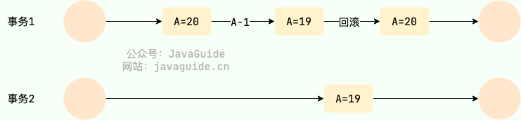
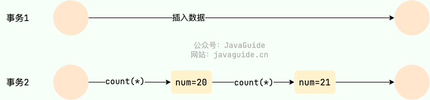
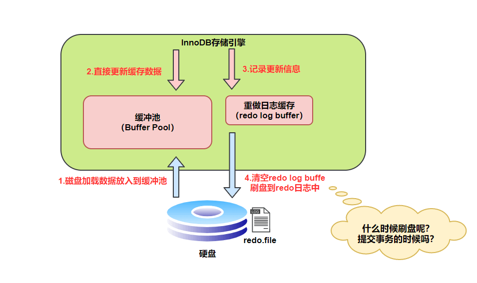
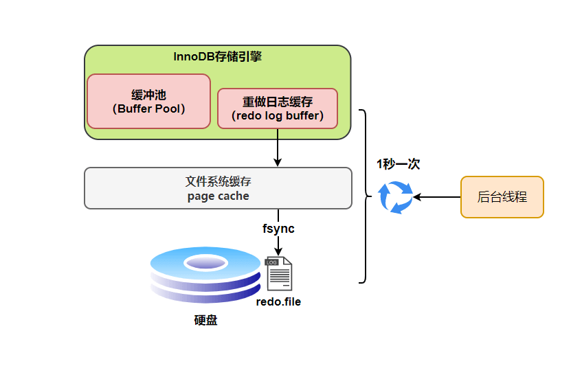
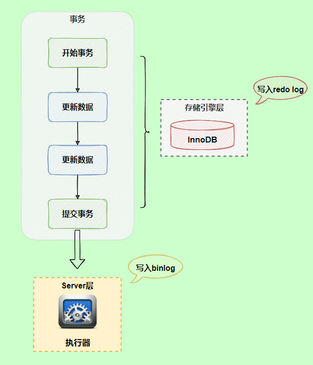
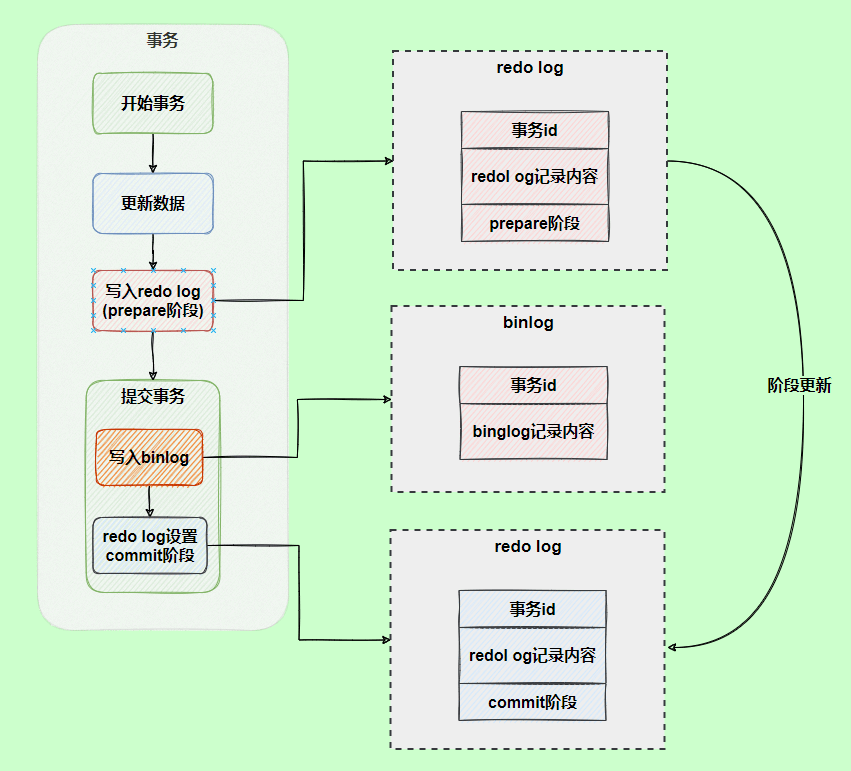

# MySQL面试题

## 基础

### 数据库范式了解吗?

数据库范式有 3 种：

- 1NF(第一范式)：属性不可再分。
- 2NF(第二范式)：1NF 的基础之上，消除了非主属性对于码的**部分函数依赖**。
- 3NF(第三范式)：3NF 在 2NF 的基础之上，消除了非主属性对于码的**传递函数依赖** 。

#### 1NF(第一范式)

属性（对应于表中的字段）不能再被分割，也就是这个字段只能是一个值，不能再分为多个其他的字段了。**1NF 是所有关系型数据库的最基本要求** ，也就是说关系型数据库中创建的表一定满足第一范式。

#### 2NF(第二范式)

2NF 在 1NF 的基础之上，消除了非主属性对于码的部分函数依赖。如下图所示，展示了第一范式到第二范式的过渡。第二范式在第一范式的基础上增加了一个列，这个列称为**主键**，非主属性都依赖于主键。

一些重要的概念：

- **函数依赖（functional dependency）**：若在一张表中，在属性（或属性组）X 的值确定的情况下，必定能确定属性 Y 的值，那么就可以说 Y 函数依赖于 X，写作 X → Y。
- **部分函数依赖（partial functional dependency）**：如果 X→Y，并且存在 X 的一个真子集 X0，使得 X0→Y，则称 Y 对 X 部分函数依赖。比如学生基本信息表 R 中（学号，身份证号，姓名）当然学号属性取值是唯一的，在 R 关系中，（学号，身份证号）->（姓名），（学号）->（姓名），（身份证号）->（姓名）；所以姓名部分函数依赖于（学号，身份证号）；

- **完全函数依赖(Full functional dependency)**：在一个关系中，若某个非主属性数据项依赖于全部关键字称之为完全函数依赖。比如学生基本信息表 R（学号，班级，姓名）假设不同的班级学号有相同的，班级内学号不能相同，在 R 关系中，（学号，班级）->（姓名），但是（学号）->(姓名)不成立，（班级）->(姓名)不成立，所以姓名完全函数依赖与（学号，班级）；
- **传递函数依赖**：在关系模式 R(U)中，设 X，Y，Z 是 U 的不同的属性子集，如果 X 确定 Y、Y 确定 Z，且有 X 不包含 Y，Y 不确定 X，（X∪Y）∩Z=空集合，则称 Z 传递函数依赖(transitive functional dependency) 于 X。传递函数依赖会导致数据冗余和异常。传递函数依赖的 Y 和 Z 子集往往同属于某一个事物，因此可将其合并放到一个表中。比如在关系 R(学号 , 姓名, 系名，系主任)中，学号 → 系名，系名 → 系主任，所以存在非主属性系主任对于学号的传递函数依赖。

#### 3NF(第三范式)

3NF 在 2NF 的基础之上，消除了非主属性对于码的传递函数依赖 。符合 3NF 要求的数据库设计，**基本**上解决了数据冗余过大，插入异常，修改异常，删除异常的问题。比如在关系 R(学号 , 姓名, 系名，系主任)中，学号 → 系名，系名 → 系主任，所以存在非主属性系主任对于学号的传递函数依赖，所以该表的设计，不符合 3NF 的要求。

## 语法

### 基本

> 经纬恒润二面

```sql
INSERT INTO 表名 (列1, 列2, ..., 列n) VALUES (值1, 值2, ..., 值n);

UPDATE 表名 SET 列1 = 值1, 列2 = 值2, ..., 列n = 值n WHERE 条件;
```


### LIMIT

```sql
SELECT column1, column2, ...
FROM table_name
WHERE condition
LIMIT offset, row_count;
```

- **`offset`**：表示跳过的行数，从哪一行开始返回数据（从 0 开始计数）。
- **`row_count`**：表示返回的行数。

如果只指定一个参数，它将被解释为返回的行数，从结果集的第一行开始返回。

### LEFT JOIN 和 RIGHT JOIN

> 招银科技笔试

- 左连接返回左表（主表）的所有记录，即使这些记录在右表中没有匹配的记录。如果左表的某条记录在右表中没有匹配，则右表的字段在结果集中会显示为 `NULL`。
- 右连接返回右表（主表）的所有记录，即使这些记录在左表中没有匹配的记录。如果右表的某条记录在左表中没有匹配，则左表的字段在结果集中会显示为 `NULL`。

```sql
SELECT O.order, C.name 
FROM orders O LEFT JION customers C 
ON O.customer_id = C.id 
WHERE O.amount > 1000 AND C.city = 'HANGZHOU';
```

若订单定额>1000但客户城市非杭州，该记录会出现在结果中吗？ 不会

### 在SQL中，为什么建议在大表上避免频繁使用DELETE操作而推荐使用TRUNCATE？

在SQL中，对于大表，建议避免频繁使用`DELETE`操作而推荐使用`TRUNCATE`，主要有以下原因：

1. **性能差异**：
   - `DELETE`操作是**逐行**删除数据，速度较慢，尤其是对于大表，会产生**大量日志记录**，占用存储空间并降低性能。
   - `TRUNCATE`操作是直接删除表中的所有数据页，**速度非常快**，几乎不产生日志记录，对系统资源的压力很小。

2. **事务支持**：
   - `DELETE`操作是可回滚的，适合需要根据特定条件删除部分数据或保证数据一致性的场景。
   - `TRUNCATE`操作是不可回滚的，适合需要清空整个表数据的场景，且在性能要求较高的场景中表现更优。

3. **适用场景**：
   - 如果需要根据特定条件删除部分数据，`DELETE`是合适的选择。
   - 如果需要快速清空整个表的数据，`TRUNCATE`是更好的选择，尤其是在处理大表时。

因此，在大表上，如果目标是快速清空表中的所有数据，`TRUNCATE`通常是更高效的选择。但需要注意，`TRUNCATE`操作不可回滚，使用时需谨慎。

### 查询SQL

```sql
# 统计出学生的成绩总分，按降序排序
select name, sum(score) as total_score from tbname group by name order by total_score desc;

# 查询所有课程的平均成绩
select subject, avg(score) as avg_score from tbname group by subject;

# 查询出总分前三的学生的 name 和总分
SELECT name, SUM(score) AS total_score
FROM students
GROUP BY name
ORDER BY total_score DESC
LIMIT 3;
```

#### Having

`HAVING` 通常出现在 `GROUP BY` 之后，`WHERE` 优先于 `HAVING` 执行。

```sql
SELECT department_id, COUNT(*) AS num_employees
FROM employees
WHERE salary > 5000
GROUP BY department_id
HAVING COUNT(*) > 5
ORDER BY num_employees DESC;
```

执行顺序

1. FROM：从 `employees` 表中读取数据。
2. WHERE：过滤出工资大于 5000 的员工记录。
3. GROUP BY：按 `department_id` 对过滤后的结果进行分组。
4. HAVING：对分组后的结果进行过滤，只保留员工数量大于 5 的部门。
5. SELECT：选择 `department_id` 和 `num_employees` 列。
6. ORDER BY：按 `num_employees` 降序排序。

### 聚合函数

COUNT、SUM、AVG、MAX、MIN、STDDEV（标准差）、VARIANCE（方差）

GROUP_CONCAT：用于将同一组中的值连接成一个字符串。

```sql
-- 按部门分组，将每个部门的员工名字连接成一个字符串
SELECT department, GROUP_CONCAT(name SEPARATOR ', ') FROM employees GROUP BY department; 
```

### 项目中的用法

```sql
# 给video_records表新增一个del_flag字段，类型为INT，默认值为1
ALTER TABLE detect_video_records ADD COLUMN del_flag INT(11) DEFAULT 1;
# 给sys_role_info表新增一个role_desc、enabled_flag字段
ALTER TABLE sys_role_info ADD COLUMN role_desc VARCHAR(255) COMMENT '角色描述';
ALTER TABLE sys_role_info ADD COLUMN enabled_flag CHAR(1) DEFAULT '1' COMMENT '是否启用';

# Asc 表示升序（Ascending），即从低到高或从小到大排序；
# Desc 表示降序（Descending），即从高到低或从大到小排序。

# 修改del_flag字段的默认值为0
ALTER TABLE detect_img_records ALTER del_flag SET DEFAULT 0;
ALTER TABLE detect_video_records ALTER del_flag SET DEFAULT 0;
ALTER TABLE detect_camera_records ALTER del_flag SET DEFAULT 0;
```


## 存储引擎

### MyISAM 和 InnoDB 有什么区别？

MySQL 5.5 之前，MyISAM 引擎是 MySQL 的默认存储引擎。虽然，MyISAM 的性能还行，各种特性也还不错（比如全文索引、压缩、空间函数等）。但是，MyISAM 不支持事务和行级锁，而且最大的缺陷就是崩溃后无法安全恢复。MySQL 5.5 版本之后，InnoDB 是 MySQL 的默认存储引擎。简单对比一下两者：

**1、是否支持行级锁**

MyISAM 只有表级锁(table-level locking)，而 InnoDB 支持行级锁(row-level locking)和表级锁，默认为行级锁。

也就说，MyISAM 一锁就是锁住了整张表。这也是为什么 InnoDB 在并发写的时候，性能更牛皮了！

**2、是否支持事务**

MyISAM 不提供事务支持。

InnoDB 提供事务支持，实现了 SQL 标准定义了四个隔离级别，具有提交(commit)和回滚(rollback)事务的能力。并且，InnoDB 默认使用的 REPEATABLE-READ（可重读）隔离级别是可以解决幻读问题发生的（基于 MVCC 和 Next-Key Lock）。

**3、是否支持外键**

MyISAM 不支持，而 InnoDB 支持。

外键对于维护数据一致性非常有帮助，但是对性能有一定的损耗。因此，通常情况下，我们是不建议在实际生产项目中使用外键的，在业务代码中进行约束即可！

阿里的《Java 开发手册》也是明确规定禁止使用外键的。

不过，在代码中进行约束的话，对程序员的能力要求更高，具体是否要采用外键还是要根据你的项目实际情况而定。

总结：一般我们也是不建议在数据库层面使用外键的，应用层面可以解决。不过，这样会对数据的一致性造成威胁。具体要不要使用外键还是要根据你的项目来决定。

**4、是否支持数据库异常崩溃后的安全恢复**

MyISAM 不支持，而 InnoDB 支持。

使用 InnoDB 的数据库在异常崩溃后，数据库重新启动的时候会保证数据库恢复到崩溃前的状态。这个恢复的过程依赖于 `redo log` 。

**5、是否支持 MVCC**

MyISAM 不支持，而 InnoDB 支持。

MVCC 可以看作是行级锁的一个升级，可以有效减少加锁操作，提高性能。

**6、索引实现不一样。**

虽然 MyISAM 引擎和 InnoDB 引擎都是使用 B+Tree 作为索引结构，但是两者的实现方式不太一样。

InnoDB 引擎中，其数据文件本身就是索引文件。相比 MyISAM，索引文件和数据文件是分离的，其表数据文件本身就是按 B+Tree 组织的一个索引结构，树的叶节点 data 域保存了完整的数据记录。

**7、性能有差别。**

InnoDB 的性能比 MyISAM 更强大，不管是在读写混合模式下还是只读模式下，随着 CPU 核数的增加，InnoDB 的读写能力呈线性增长。MyISAM 因为读写不能并发，它的处理能力跟核数没关系。

**8、数据缓存策略和机制实现不同。**

InnoDB 使用缓冲池（Buffer Pool）缓存数据页和索引页，MyISAM 使用键缓存（Key Cache）仅缓存索引页而不缓存数据页。

**总结**：

- InnoDB 支持行级别的锁粒度，MyISAM 不支持，只支持表级别的锁粒度。
- MyISAM 不提供事务支持。InnoDB 提供事务支持，实现了 SQL 标准定义了四个隔离级别。
- MyISAM 不支持外键，而 InnoDB 支持。
- MyISAM 不支持 MVCC，而 InnoDB 支持。
- 虽然 MyISAM 引擎和 InnoDB 引擎都是使用 B+Tree 作为索引结构，但是两者的实现方式不太一样。
- MyISAM 不支持数据库异常崩溃后的安全恢复，而 InnoDB 支持。
- InnoDB 的性能比 MyISAM 更强大。

## 索引

### 索引介绍

**索引是一种用于快速查询和检索数据的数据结构，其本质可以看成是一种排序好的数据结构。**

索引的作用就相当于书的目录。打个比方：我们在查字典的时候，如果没有目录，那我们就只能一页一页地去找我们需要查的那个字，速度很慢；如果有目录了，我们只需要先去目录里查找字的位置，然后直接翻到那一页就行了。

索引底层数据结构存在很多种类型，常见的索引结构有：B 树、 B+ 树 和 Hash、红黑树。在 MySQL 中，无论是 Innodb 还是 MyISAM，都使用了 **B+ 树**作为索引结构。

### 索引底层数据结构选型

#### B 树& B+ 树

B 树也称 B- 树，全称为 **多路平衡查找树**，B+ 树是 B 树的一种变体。B 树和 B+ 树中的 B 是 `Balanced`（平衡）的意思。

目前大部分数据库系统及文件系统都采用 B-Tree 或其变种 B+Tree 作为索引结构。

**B 树& B+ 树两者有何异同呢？**

- B 树的所有节点既存放键(key)也存放数据(data)，而 B+ 树只有叶子节点存放 key 和 data，其他内节点只存放 key。
- B 树的叶子节点都是独立的；B+ 树的叶子节点有一条引用链指向与它相邻的叶子节点。
- B 树的检索的过程相当于对范围内的每个节点的关键字做二分查找，可能还没有到达叶子节点，检索就结束了。而 B+ 树的检索效率就很稳定了，任何查找都是从根节点到叶子节点的过程，叶子节点的顺序检索很明显。
- 在 B 树中进行范围查询时，首先找到要查找的下限，然后对 B 树进行**中序遍历**，直到找到查找的上限；而 B+ 树的范围查询，只需要对链表进行遍历即可。

|          | B树                                                          | B+树                                                         |
| -------- | ------------------------------------------------------------ | ------------------------------------------------------------ |
| 数据     | 所有节点既存放键(key)也存放数据(data)                        | 只有叶子节点存放 key 和 data，其他内节点只存放 key           |
| 叶子节点 | 叶子节点都是独立的                                           | 叶子节点有一条引用链指向与它相邻的叶子节点                   |
| 检索     | 检索的过程相当于对范围内的每个节点的关键字做二分查找，可能还没有到达叶子节点，检索就结束了 | 检索效率就很稳定了，任何查找都是从根节点到叶子节点的过程，叶子节点的顺序检索很明显 |
| 范围查询 | 进行范围查询时，首先找到要查找的下限，然后对 B 树进行中序遍历，直到找到查找的上限 | 范围查询，只需要对链表进行遍历即可                           |

综上，B+ 树与 B 树相比，具备更少的 IO 次数、更稳定的查询效率和更适于范围查询这些优势。

在 MySQL 中，MyISAM 引擎和 InnoDB 引擎都是使用 B+Tree 作为索引结构，但是，两者的实现方式不太一样。（下面的内容整理自《Java 工程师修炼之道》）

- MyISAM 引擎中，B+Tree 叶节点的 data 域存放的是数据记录的地址。在索引检索的时候，首先按照 B+Tree 搜索算法搜索索引，如果指定的 Key 存在，则取出其 data 域的值，然后以 data 域的值为地址读取相应的数据记录。这被称为“**非聚簇索引（非聚集索引）**”。

- InnoDB 引擎中，其数据文件本身就是索引文件。相比 MyISAM，索引文件和数据文件是分离的，其表数据文件本身就是按 B+Tree 组织的一个索引结构，树的叶节点 data 域保存了完整的数据记录。这个索引的 key 是数据表的主键，因此 InnoDB 表数据文件本身就是主索引。这被称为“**聚簇索引（聚集索引）**”，而其余的索引都作为 **辅助索引**，辅助索引的 data 域存储相应记录主键的值而不是地址，这也是和 MyISAM 不同的地方。在根据主索引搜索时，直接找到 key 所在的节点即可取出数据；在根据辅助索引查找时，则需要先取出主键的值，再走一遍主索引。 因此，在设计表的时候，不建议使用过长的字段作为主键，也不建议使用非单调的字段作为主键，这样会造成主索引频繁分裂。

### 为什么MySQL采用B+树作为索引？


### 索引类型总结

按照数据结构维度划分：

- BTree 索引：MySQL 里默认和最常用的索引类型。只有叶子节点存储 value，非叶子节点只有指针和 key。存储引擎 MyISAM 和 InnoDB 实现 BTree 索引都是使用 B+Tree，但二者实现方式不一样（前面已经介绍了）。
- 哈希索引：类似键值对的形式，一次即可定位。
- RTree 索引：一般不会使用，仅支持 geometry 数据类型，优势在于范围查找，效率较低，通常使用搜索引擎如 ElasticSearch 代替。
- 全文索引：对文本的内容进行分词，进行搜索。目前只有 `CHAR`、`VARCHAR`、`TEXT` 列上可以创建全文索引。一般不会使用，效率较低，通常使用搜索引擎如 ElasticSearch 代替。

按照底层存储方式角度划分：

- 聚簇索引（聚集索引）：索引结构和数据一起存放的索引，InnoDB 中的主键索引就属于聚簇索引。
- 非聚簇索引（非聚集索引）：索引结构和数据分开存放的索引，二级索引（辅助索引）就属于非聚簇索引。MySQL 的 MyISAM 引擎，不管主键还是非主键，使用的都是非聚簇索引。

按照应用维度划分：

- 主键索引：加速查询 + 列值唯一（不可以有 NULL）+ 表中只有一个。
- 普通索引：仅加速查询。
- 唯一索引：加速查询 + 列值唯一（可以有 NULL）。
- 覆盖索引：一个索引包含（或者说覆盖）所有需要查询的字段的值。
- 联合索引：多列值组成一个索引，专门用于组合搜索，其效率大于索引合并。
- 全文索引：对文本的内容进行分词，进行搜索。目前只有 `CHAR`、`VARCHAR`、`TEXT` 列上可以创建全文索引。一般不会使用，效率较低，通常使用搜索引擎如 ElasticSearch 代替。
- 前缀索引：对文本的前几个字符创建索引，相比普通索引建立的数据更小，因为只取前几个字符。

### 主键索引（Primary Key）

数据表的主键列使用的就是主键索引。

一张数据表有只能有一个主键，并且主键不能为 null，不能重复。

在 MySQL 的 InnoDB 的表中，当没有显示的指定表的主键时，InnoDB 会自动先检查表中是否有唯一索引且不允许存在 null 值的字段，如果有，则选择该字段为默认的主键，否则 InnoDB 将会自动创建一个 6Byte 的自增主键。

### 二级索引

二级索引（Secondary Index）的叶子节点存储的数据是主键的值，也就是说，通过二级索引可以定位主键的位置，二级索引又称为辅助索引/**非主键索引**。

唯一索引、普通索引、前缀索引等索引都属于二级索引。

### 覆盖索引和联合索引

> 科大讯飞

#### 覆盖索引

如果一个索引包含（或者说覆盖）所有需要查询的字段的值，我们就称之为 覆盖索引（Covering Index）。

在 InnoDB 存储引擎中，**非主键索引**的叶子节点包含的是主键的值。这意味着，当使用非主键索引进行查询时，数据库会先找到对应的主键值，然后再通过主键索引来定位和检索完整的行数据。这个过程被称为“**回表**”。

覆盖索引即**需要查询的字段正好是索引的字段**，那么直接根据该索引，就可以查到数据了，而无需回表查询。

如主键索引，如果一条 SQL 需要查询主键，那么正好根据主键索引就可以查到主键。再如普通索引，如果一条 SQL 需要查询 name，name 字段正好有索引，那么直接根据这个索引就可以查到数据，也无需回表。

以 `score` 和 `name` 两个字段建立联合索引：

```sql
ALTER TABLE `cus_order` ADD INDEX id_score_name(score, name);
```

创建完成之后，再用 `EXPLAIN` 命令分析再次分析这条 SQL 语句。通过 `Extra` 这一列的 `Using index`，说明这条 SQL 语句成功使用了覆盖索引。

#### 联合索引

使用表中的多个字段创建索引，就是 **联合索引**，也叫 **组合索引** 或 **复合索引**。

以 `score` 和 `name` 两个字段建立联合索引：

```sql
ALTER TABLE `cus_order` ADD INDEX id_score_name(score, name);
```

#### 联合索引中的字段排序

> 美的二面

1、**最左前缀原则**

2、**查询条件的频率**

3、**字段的选择性**

选择性（Selectivity）是指字段中不同值的数量与总记录数的比例。选择性高的字段（即不同值较多的字段）应该放在联合索引的前面，因为这样可以更快地过滤掉大量不相关的记录。

示例

假设有一个表 `users`，字段包括 `age` 和 `country`，其中 `age` 的不同值较少（例如18-60岁），而 `country` 的不同值较多（例如195个国家）。在这种情况下，联合索引应该定义为 `(country, age)`，而不是 `(age, country)`。

4、**字段的大小**

#### 最左前缀匹配原则

最左匹配原则会一直向右匹配，直到遇到范围查询（如 >、<）为止。对于 >=、<=、BETWEEN 以及前缀匹配 LIKE 的范围查询，不会停止匹配。

### 索引失效情况

1、对索引使用左或者左右**模糊匹配**

```sql
// name 字段为二级索引
select * from t_user where name like '%林';
```

2、对索引使用函数

```sql
select * from t_user where length(name)=6;
```

3、对索引进行表达式计算

```sql
explain select * from t_user where id + 1 = 10;
```

4、对索引隐式类型转换

如果索引字段是字符串类型，但是在条件查询中，输入的参数是整型的话，你会在执行计划的结果发现这条语句会走全表扫描。

phone字段为varchar类型：

```sql
select * from t_user where phone = 1300000001;
```

反过来却不会失效

```sql
 explain select * from t_user where id = '1';
```

5、联合索引非最左匹配

需要注意的是，因为有查询优化器，所以 a 字段在 where 子句的顺序并不重要。

6、WHERE 子句中的 OR

在 WHERE 子句中，如果在 OR 前的条件列是索引列，而在 OR 后的条件列不是索引列，那么索引会失效。

```sql
select * from t_user where id = 1 or age = 18;
```


## 事务

**何为事务？** 一言蔽之，**事务是逻辑上的一组操作，要么都执行，要么都不执行。**


另外，关系型数据库（例如：`MySQL`、`SQL Server`、`Oracle` 等）事务都有 **ACID** 特性：

1. **原子性**（`Atomicity`）：事务是最小的执行单位，不允许分割。事务的原子性确保动作要么全部完成，要么完全不起作用；

2. **一致性**（`Consistency`）：执行事务前后，数据保持一致，例如转账业务中，无论事务是否成功，转账者和收款人的总额应该是不变的；

3. **隔离性**（`Isolation`）：并发访问数据库时，一个用户的事务不被其他事务所干扰，各并发事务之间数据库是独立的；

4. **持久性**（`Durability`）：一个事务被提交之后。它对数据库中数据的改变是持久的，即使数据库发生故障也不应该对其有任何影响。

🌈 这里要额外补充一点：只有保证了事务的持久性、原子性、隔离性之后，一致性才能得到保障。也就是说 A、I、D 是手段，**C 是目的**！


### 并发事务带来了哪些问题?

#### 脏读（Dirty read）

一个事务读取数据并且对数据进行了修改，这个修改对其他事务来说是可见的，即使当前事务没有提交。这时另外一个事务读取了这个还未提交的数据，但第一个事务突然回滚，导致数据并没有被提交到数据库，那第二个事务读取到的就是脏数据，这也就是脏读的由来。

例如：事务 1 读取某表中的数据 A=20，事务 1 修改 A=A-1，事务 2 读取到 A = 19，事务 1 回滚导致对 A 的修改并未提交到数据库， A 的值还是 20。



#### 不可重复读（Unrepeatable read）

指在一个事务内多次读同一数据。在这个事务还没有结束时，另一个事务也访问该数据。那么，在第一个事务中的两次读数据之间，由于第二个事务的修改导致第一个事务两次读取的数据可能不太一样。这就发生了在一个事务内两次读到的数据是不一样的情况，因此称为不可重复读。

例如：事务 1 读取某表中的数据 A=20，事务 2 也读取 A=20，事务 1 修改 A=A-1，事务 2 再次读取 A =19，此时读取的结果和第一次读取的结果不同。


#### 幻读（Phantom read）

幻读与不可重复读类似。它发生在一个事务读取了几行数据，接着另一个并发事务插入了一些数据时。在随后的查询中，第一个事务就会发现多了一些原本不存在的记录，就好像发生了幻觉一样，所以称为幻读。

例如：事务 2 读取某个范围的数据，事务 1 在这个范围插入了新的数据，事务 2 再次读取这个范围的数据发现相比于第一次读取的结果多了新的数据。




### 不可重复读和幻读有什么区别？

- 不可重复读的重点是内容修改或者记录减少比如多次读取一条记录发现其中某些记录的值被修改；
- 幻读的重点在于记录新增比如多次执行同一条查询语句（DQL）时，发现查到的记录增加了。

幻读其实可以看作是不可重复读的一种特殊情况，单独把幻读区分出来的原因主要是解决幻读和不可重复读的方案不一样。

举个例子：执行 `delete` 和 `update` 操作的时候，可以直接对记录加锁，保证事务安全。而执行 `insert` 操作的时候，由于记录锁（Record Lock）只能锁住已经存在的记录，为了避免插入新记录，需要依赖**间隙锁（Gap Lock）**。也就是说执行 `insert` 操作的时候需要依赖 Next-Key Lock（Record Lock+Gap Lock） 进行加锁来保证不出现幻读。

### SQL 标准定义了哪些事务隔离级别?

SQL 标准定义了四种事务隔离级别，用来平衡事务的隔离性（Isolation）和并发性能。级别越高，数据一致性越好，但并发性能可能越低。这四个级别是：

- READ-UNCOMMITTED(读取未提交) ：最低的隔离级别，允许读取尚未提交的数据变更，可能会导致**脏读、幻读或不可重复读**。这种级别在实际应用中很少使用，因为它对数据一致性的保证太弱。

- READ-COMMITTED(读取已提交) ：允许读取并发事务已经提交的数据，可以**阻止脏读**，但是幻读或不可重复读仍有可能发生。这是大多数数据库（如 Oracle, SQL Server）的默认隔离级别。

- REPEATABLE-READ(可重复读) ：对同一字段的多次读取结果都是一致的，除非数据是被本身事务自己所修改，可以阻止脏读和不可重复读，但幻读仍有可能发生。MySQL InnoDB 存储引擎的**默认隔离级别**正是 REPEATABLE READ。并且，InnoDB 在此级别下通过 MVCC（多版本并发控制） 和 Next-Key Locks（间隙锁+行锁） 机制，在很大程度上解决了幻读问题。

- SERIALIZABLE(可串行化) ：最高的隔离级别，完全服从 ACID 的隔离级别。所有的事务依次逐个执行，这样事务之间就完全不可能产生干扰，也就是说，该级别可以防止脏读、不可重复读以及幻读。

| 隔离级别         | 脏读 (Dirty Read) | 不可重复读 (Non-Repeatable Read) | 幻读 (Phantom Read)    |
| ---------------- | ----------------- | -------------------------------- | ---------------------- |
| READ UNCOMMITTED | √                 | √                                | √                      |
| READ COMMITTED   | ×                 | √                                | √                      |
| REPEATABLE READ  | ×                 | ×                                | √ (标准) / ≈× (InnoDB) |
| SERIALIZABLE     | ×                 | ×                                | ×                      |

```sql
SELECT @@GLOBAL.tx_isolation, @@tx_isolation;
```

可以看到，默认的隔离级别为 REPEATABLE-READ，全局隔离级别和当前会话隔离级别皆是如此。

不可重复读和脏读的区别在于，脏读是看到了其他事务未提交的数据，而不可重复读是看到了其他事务已经提交的数据（由于当前 SQL 也是在事务中，因此有可能并不想看到其他事务已经提交的数据）。

## 锁

### MySQL 有哪些锁？

在 MySQL 里，根据加锁的范围，可以分为**全局锁、表级锁和行锁**三类。

#### 全局锁

```sql
# 使用全局锁
# 执行后，整个数据库就处于只读状态了
flush tables with read lock
# 释放全局锁
unlock tables
```

#### 表级锁

MySQL 里面表级别的锁有这几种：

- 表锁
- 元数据锁（MDL）
- 意向锁
- AUTO-INC锁

```sql
//表级别的共享锁，也就是读锁；
//允许当前会话读取被锁定的表，但阻止其他会话对这些表进行写操作。
lock tables t_student read;

//表级别的独占锁，也就是写锁；
//允许当前会话对表进行读写操作，但阻止其他会话对这些表进行任何操作（读或写）。
lock tables t_stuent write;
```

#### 行级锁

### InnoDB 有哪几类行锁？

InnoDB 行锁是通过对索引数据页上的记录加锁实现的，MySQL InnoDB 支持三种行锁定方式：

- **记录锁（Record Lock）**：属于单个行记录上的锁。
- **间隙锁（Gap Lock）**：锁定一个范围，不包括记录本身。
- **临键锁（Next-Key Lock）**：Record Lock+Gap Lock，锁定一个范围，包含记录本身，主要目的是为了解决幻读问题（MySQL 事务部分提到过）。记录锁只能锁住已经存在的记录，为了避免插入新记录，需要依赖间隙锁。

在 InnoDB 默认的隔离级别 REPEATABLE-READ 下，行锁默认使用的是 Next-Key Lock。但是，如果操作的索引是唯一索引或主键，InnoDB 会对 Next-Key Lock 进行优化，将其降级为 Record Lock，即仅锁住索引本身，而不是范围。

### 共享锁和排他锁呢？

不论是表级锁还是行级锁，都存在共享锁（Share Lock，S 锁）和排他锁（Exclusive Lock，X 锁）这两类：

- **共享锁（S 锁）**：又称读锁，事务在读取记录的时候获取共享锁，允许多个事务同时获取（锁兼容）。
- **排他锁（X 锁）**：又称写锁/独占锁，事务在修改记录的时候获取排他锁，不允许多个事务同时获取。如果一个记录已经被加了排他锁，那其他事务不能再对这条事务加任何类型的锁（锁不兼容）。

排他锁与任何的锁都不兼容，共享锁仅和共享锁兼容。

|      | S 锁   | X 锁 |
| :--- | :----- | :--- |
| S 锁 | 不冲突 | 冲突 |
| X 锁 | 冲突   | 冲突 |

由于 MVCC 的存在，对于一般的 `SELECT` 语句，InnoDB 不会加任何锁。不过， 你可以通过以下语句显式加共享锁或排他锁。

## 日志

### redo log

redo log（重做日志）是 InnoDB 存储引擎独有的，它让 MySQL 拥有了崩溃恢复能力。比如 MySQL 实例挂了或宕机了，重启时，InnoDB 存储引擎会使用 redo log 恢复数据，保证数据的持久性与完整性。

MySQL 中数据是**以页为单位**，你查询一条记录，会从硬盘把一页的数据加载出来，加载出来的数据叫数据页，会放入到 `Buffer Pool` 中。后续的查询都是先从 `Buffer Pool` 中找，没有命中再去硬盘加载，减少硬盘 IO 开销，提升性能。

更新表数据的时候，也是如此，发现 `Buffer Pool` 里存在要更新的数据，就直接在 `Buffer Pool` 里更新。然后会把“在某个数据页上做了什么修改”记录到重做日志缓存（`redo log buffer`）里，接着刷盘到 redo log 文件里。



理想情况，事务一提交就会进行刷盘操作，但实际上，刷盘的时机是根据策略来进行的。

> 每条 redo 记录由“表空间号+数据页号+偏移量+修改数据长度+具体修改的数据”组成

#### 刷盘时机

我们要注意设置正确的刷盘策略`innodb_flush_log_at_trx_commit` 。根据 MySQL 配置的刷盘策略的不同，MySQL 宕机之后可能会存在轻微的数据丢失问题。

`innodb_flush_log_at_trx_commit` 的值有 3 种，也就是共有 3 种刷盘策略：

- **0**：设置为 0 的时候，表示每次事务提交时不进行刷盘操作。这种方式性能最高，但是也最不安全，因为如果 MySQL 挂了或宕机了，可能会丢失最近 1 秒内的事务。
- **1**：设置为 1 的时候，表示每次事务提交时都将进行刷盘操作。这种方式性能最低，但是也最安全，因为只要事务提交成功，redo log 记录就一定在磁盘里，不会有任何数据丢失。
- **2**：设置为 2 的时候，表示每次事务提交时都只把 log buffer 里的 redo log 内容写入 page cache（文件系统缓存）。page cache 是专门用来缓存文件的，这里被缓存的文件就是 redo log 文件。这种方式的性能和安全性都介于前两者中间。

刷盘策略 `innodb_flush_log_at_trx_commit` 的默认值为 1，设置为 1 的时候才不会丢失任何数据。为了保证事务的持久性，我们必须将其设置为 1。

另外，InnoDB 存储引擎有一个后台线程，每隔 1 秒，就会把 `redo log buffer` 中的内容写到文件系统缓存（page cache），然后调用 `fsync` 刷盘。也就是说，一个没有提交事务的 redo log 记录，也可能会刷盘。



因为在事务执行过程 redo log 记录是会写入`redo log buffer` 中，这些 redo log 记录会被后台线程刷盘。

除了后台线程每秒 1 次的轮询操作，还有一种情况，当 `redo log buffer` 占用的空间即将达到 `innodb_log_buffer_size` 一半的时候，后台线程会主动刷盘。

### binlog

可以说 MySQL 数据库的**数据备份、主备、主主、主从**都离不开 binlog，需要依靠 binlog 来同步数据，保证数据一致性。

### 两阶段提交

redo log（重做日志）让 InnoDB 存储引擎拥有了崩溃恢复能力。

binlog（归档日志）保证了 MySQL 集群架构的数据一致性。

虽然它们都属于持久化的保证，但是侧重点不同。

在执行更新语句过程，会记录 redo log 与 binlog 两块日志，以基本的事务为单位，redo log 在事务执行过程中可以不断写入，而 binlog 只有在提交事务时才写入，所以 redo log 与 binlog 的写入时机不一样。



为了解决两份日志之间的逻辑一致问题，InnoDB 存储引擎使用**两阶段提交**方案。

原理很简单，将 redo log 的写入拆成了两个步骤`prepare`和`commit`，这就是**两阶段提交**。



使用**两阶段提交**后，写入 binlog 时发生异常也不会有影响，因为 MySQL 根据 redo log 日志恢复数据时，发现 redo log 还处于`prepare`阶段，并且没有对应 binlog 日志，就会回滚该事务。

再看一个场景，redo log 设置`commit`阶段发生异常，那会不会回滚事务呢？

并不会回滚事务，它会执行上图框住的逻辑，虽然 redo log 是处于`prepare`阶段，但是能通过事务`id`找到对应的 binlog 日志，所以 MySQL 认为是完整的，就会提交事务恢复数据。

### undo log

每一个事务对数据的修改都会被记录到 undo log ，当执行事务过程中出现错误或者需要执行回滚操作的话，MySQL 可以利用 undo log 将数据恢复到事务开始之前的状态。

undo log 属于**逻辑日志**，记录的是 SQL 语句，比如说事务执行一条 DELETE 语句，那 undo log 就会记录一条相对应的 INSERT 语句。同时，undo log 的信息也会被记录到 redo log 中，因为 undo log 也要实现持久性保护。并且，undo-log 本身是会被删除清理的，例如 INSERT 操作，在事务提交之后就可以清除掉了；UPDATE/DELETE 操作在事务提交不会立即删除，会加入 history list，由后台线程 purge 进行清理。

undo log 是采用 segment（段）的方式来记录的，每个 undo 操作在记录的时候占用一个 **undo log segment**（undo 日志段），undo log segment 包含在 **rollback segment**（回滚段）中。事务开始时，需要为其分配一个 rollback segment。每个 rollback segment 有 1024 个 undo log segment，这有助于管理多个并发事务的回滚需求。

通常情况下， **rollback segment header**（通常在回滚段的第一个页）负责管理 rollback segment。rollback segment header 是 rollback segment 的一部分，通常在回滚段的第一个页。**history list** 是 rollback segment header 的一部分，它的主要作用是记录所有已经提交但还没有被清理（purge）的事务的 undo log。这个列表使得 purge 线程能够找到并清理那些不再需要的 undo log 记录。

另外，`MVCC` 的实现依赖于：**隐藏字段、Read View、undo log**。在内部实现中，InnoDB 通过数据行的 `DB_TRX_ID` 和 `Read View` 来判断数据的可见性，如不可见，则通过数据行的 `DB_ROLL_PTR` 找到 undo log 中的历史版本。每个事务读到的数据版本可能是不一样的，在同一个事务中，用户只能看到该事务创建 `Read View` 之前已经提交的修改和该事务本身做的修改。

## 重要知识点

### SQL语句在MySQL中的执行过程

- **连接器：** 身份认证和权限相关(登录 MySQL 的时候)。

- **查询缓存：** 执行查询语句的时候，会先查询缓存（MySQL 8.0 版本后移除，因为这个功能不太实用）。

- **分析器：** 没有命中缓存的话，SQL 语句就会经过分析器，分析器说白了就是要先看你的 SQL 语句要干嘛，再检查你的 SQL 语句语法是否正确。

- **优化器：** 按照 MySQL 认为最优的方案去执行。

- **执行器：** 执行语句，然后从存储引擎返回数据。


#### 2.1 查询语句

先分析下查询语句，语句如下：

```sql
select * from tb_student  A where A.age='18' and A.name=' 张三 ';
```

结合上面的说明，我们分析下这个语句的执行流程：

- 先检查该语句是否有权限，如果没有权限，直接返回错误信息，如果有权限，在 MySQL8.0 版本以前，会先查询缓存，以这条 SQL 语句为 key 在内存中查询是否有结果，如果有直接缓存，如果没有，执行下一步。

- 通过分析器进行**词法分析**，提取 SQL 语句的关键元素，比如提取上面这个语句是查询 select，提取需要查询的表名为 tb_student，需要查询所有的列，查询条件是这个表的 id='1'。然后判断这个 SQL 语句是否有语法错误，比如关键词是否正确等等，如果检查没问题就执行下一步。

- 接下来就是优化器进行确定执行方案，上面的 SQL 语句，可以有两种执行方案：

  - a.先查询学生表中姓名为“张三”的学生，然后判断是否年龄是 18。
  - b.先找出学生中年龄 18 岁的学生，然后再查询姓名为“张三”的学生。

  那么优化器根据自己的优化算法进行选择执行效率最好的一个方案（优化器认为，有时候不一定最好）。那么确认了执行计划后就准备开始执行了。

- 进行权限校验，如果没有权限就会返回错误信息，如果有权限就会调用数据库引擎接口，返回引擎的执行结果。

#### 2.2 更新语句

SQL 语句如下：

```sql
update tb_student A set A.age='19' where A.name=' 张三 ';
```

这条语句也基本上会沿着上一个查询的流程走，只不过执行更新的时候肯定要记录日志啦，这就会引入日志模块了，MySQL 自带的日志模块是 **binlog（归档日志）** ，所有的存储引擎都可以使用，我们常用的 InnoDB 引擎还自带了一个日志模块 **redo log（重做日志）**，我们就以 InnoDB 模式下来探讨这个语句的执行流程。流程如下：

- 先查询到张三这一条数据，不会走查询缓存，因为更新语句会导致与该表相关的查询缓存失效。
- 然后拿到查询的语句，把 age 改为 19，然后调用引擎 API 接口，写入这一行数据，InnoDB 引擎把数据保存在内存中，同时记录 redo log，此时 redo log 进入 prepare 状态，然后告诉**执行器**，执行完成了，随时可以提交。
- 执行器收到通知后记录 binlog，然后调用引擎接口，提交 redo log 为提交状态。
- 更新完成。

**追问：为什么要用两个日志模块，用一个日志模块不行吗?**

这是因为最开始 MySQL 并没有 InnoDB 引擎（InnoDB 引擎是其他公司以插件形式插入 MySQL 的），MySQL 自带的引擎是 MyISAM，但是我们知道 redo log 是 InnoDB 引擎特有的，其他存储引擎都没有，这就导致会没有 crash-safe 的能力(crash-safe 的能力即使数据库发生异常重启，之前提交的记录都不会丢失)，binlog 日志只能用来归档。

并不是说只用一个日志模块不可以，只是 InnoDB 引擎就是通过 redo log 来支持事务的。那么，又会有同学问，我用两个日志模块，但是不要这么复杂行不行，为什么 redo log 要引入 prepare 预提交状态？这里我们用反证法来说明下为什么要这么做？

- **先写 redo log 直接提交，然后写 binlog**，假设写完 redo log 后，机器挂了，binlog 日志没有被写入，那么机器重启后，这台机器会通过 redo log 恢复数据，但是这个时候 binlog 并没有记录该数据，后续进行机器备份的时候，就会丢失这一条数据，同时主从同步也会丢失这一条数据。

- **先写 binlog，然后写 redo log**，假设写完了 binlog，机器异常重启了，由于没有 redo log，本机是无法恢复这一条记录的，但是 binlog 又有记录，那么和上面同样的道理，就会产生数据不一致的情况。

如果采用 redo log 两阶段提交的方式就不一样了，写完 binlog 后，然后再提交 redo log 就会防止出现上述的问题，从而保证了数据的一致性。那么问题来了，有没有一个极端的情况呢？假设 redo log 处于预提交状态，binlog 也已经写完了，这个时候发生了异常重启会怎么样呢？
 这个就要依赖于 MySQL 的处理机制了，MySQL 的处理过程如下：

- 判断 redo log 是否完整，如果判断是完整的，就立即提交。
- 如果 redo log 只是预提交但不是 commit 状态，这个时候就会去判断 binlog 是否完整，如果完整就提交 redo log, 不完整就回滚事务。

这样就解决了数据一致性的问题。

### MySQL主从同步是如何实现的 

*Binary log：主数据库的二进制日志。*

*Relay log：从服务器的中继日志。*

**第一步：**master在每个事务更新数据完成之前，将该操作记录串行地写入到 `binlog` 文件中。

**第二步：**salve开启一个I/O Thread，该线程在master打开一个普通连接，主要工作是binlog dump process。如果读取的进度已经跟上了master，就进入睡眠状态并等待master产生新的事件。I/O线程最终的目的是将这些事件写入到中继日志中。

**第三步：**SQL Thread会读取中继日志，并顺序执行该日志中的SQL事件，从而与主数据库中的数据保持一致。

这个同步是有延迟的，无法做到实时同步。

### 你对MySQL的慢查询优化有了解吗 

**慢查询** 是指执行时间超过设定阈值的查询语句。MySQL 的默认阈值是 10 秒，但通常我们会根据实际情况调整。

1. **添加索引**
   - **复合索引**：联合索引可以加速多个字段的查询，尤其是 `AND` 连接条件时。
   - **覆盖索引**：索引包含查询所需的所有列，避免回表查询，提高查询效率。
2. **优化 SQL 语句**
   - **避免 SELECT \* **：只查询需要的字段，减少数据传输。
   - **使用合适的 JOIN**：避免使用 `N+1` 查询，避免笛卡尔积，尽量减少查询的次数。
3. **表结构与数据设计优化**
   - **优化表结构**：合理选择数据类型，避免过大的字段长度，尽量使用合适的 `INT`、`VARCHAR` 类型。
   - **分表分库**：对于极大的表，可以通过分表分库来减轻单一表的压力，提升查询效率。
4. **查询缓存与数据库配置优化**

### 慢 SQL 怎么排查

1. 开启慢查询日志

2. 分析慢查询日志

   慢查询日志记录了执行时间超过阈值的 SQL 语句。可以使用以下工具来分析慢查询日志：

   - **mysqldumpslow**：MySQL 自带的命令行工具，用于解析和汇总慢查询日志文件。例如：

     ```bash
     mysqldumpslow -s t -t 10 /path/to/your/slow.log
     ```

     这条命令会按执行时间排序，显示前 10 条最慢的查询。

   - **pt-query-digest**：更强大的工具，可以提供详细的查询分析报告。例如：

     ```bash
     pt-query-digest /path/to/your/slow.log > query_report.txt
     ```

     这条命令会生成一个详细的查询分析报告。

3. 使用 `EXPLAIN` 分析查询计划

   如果 `EXPLAIN` 的输出中 `type` 列显示为 `ALL`，说明是全表扫描，没有使用索引

4. 优化查询语句

5. 使用 `SHOW PROCESSLIST` 查看当前执行的 SQL

6. 调整数据库配置

## MVCC

MVCC 是一种并发控制机制，用于在多个并发事务同时读写数据库时保持数据的一致性和隔离性。它是通过在每个数据行上**维护多个版本的数据**来实现的。当一个事务要对数据库中的数据进行修改时，MVCC 会为该事务创建一个**数据快照**，而不是直接修改实际的数据行。

1、读操作（SELECT）：

当一个事务执行读操作时，它会使用快照读取。快照读取是基于事务开始时数据库中的状态创建的，因此事务不会读取其他事务尚未提交的修改。具体工作情况如下：

- 对于读取操作，事务会查找符合条件的数据行，并选择符合其事务开始时间的数据版本进行读取。
- 如果某个数据行有多个版本，事务会选择不晚于其开始时间的最新版本，确保事务只读取在它开始之前已经存在的数据。
- 事务读取的是快照数据，因此其他并发事务对数据行的修改不会影响当前事务的读取操作。

2、写操作（INSERT、UPDATE、DELETE）：

当一个事务执行写操作时，它会生成一个新的数据版本，并将修改后的数据写入数据库。具体工作情况如下：

- 对于写操作，事务会为要修改的数据行创建一个新的版本，并将修改后的数据写入新版本。
- 新版本的数据会带有当前事务的版本号，以便其他事务能够正确读取相应版本的数据。
- 原始版本的数据仍然存在，供其他事务使用快照读取，这保证了其他事务不受当前事务的写操作影响。

3、事务提交和回滚：

- 当一个事务提交时，它所做的修改将成为数据库的最新版本，并且对其他事务可见。
- 当一个事务回滚时，它所做的修改将被撤销，对其他事务不可见。

4、版本的回收：

为了防止数据库中的版本无限增长，MVCC 会定期进行版本的回收。回收机制会删除已经不再需要的旧版本数据，从而释放空间。

MVCC 通过创建数据的多个版本和使用快照读取来实现并发控制。读操作使用旧版本数据的快照，写操作创建新版本，并确保原始版本仍然可用。这样，不同的事务可以在一定程度上并发执行，而不会相互干扰，从而提高了数据库的并发性能和数据一致性。

### InnoDB 对 MVCC 的实现

`MVCC` 的实现依赖于：**隐藏字段、Read View、undo log**。在内部实现中，`InnoDB` 通过数据行的 `DB_TRX_ID` 和 `Read View` 来判断数据的可见性，如不可见，则通过数据行的 `DB_ROLL_PTR` 找到 `undo log` 中的历史版本。每个事务读到的数据版本可能是不一样的，在同一个事务中，用户只能看到该事务创建 `Read View` 之前已经提交的修改和该事务本身做的修改

### 隐藏字段

在内部，`InnoDB` 存储引擎为每行数据添加了三个 [隐藏字段](https://dev.mysql.com/doc/refman/5.7/en/innodb-multi-versioning.html)：

- `DB_TRX_ID（6字节）`：表示最后一次插入或更新该行的事务 id。此外，`delete` 操作在内部被视为更新，只不过会在记录头 `Record header` 中的 `deleted_flag` 字段将其标记为已删除
- `DB_ROLL_PTR（7字节）` 回滚指针，指向该行的 `undo log` 。如果该行未被更新，则为空
- `DB_ROW_ID（6字节）`：如果没有设置主键且该表没有唯一非空索引时，`InnoDB` 会使用该 id 来生成聚簇索引

### ReadView

`Read View` 主要是用来做可见性判断，里面保存了 “当前对本事务不可见的其他活跃事务”

主要有以下字段：

- `m_low_limit_id`：目前出现过的最大的事务 ID+1，即下一个将被分配的事务 ID。大于等于这个 ID 的数据版本均不可见
- `m_up_limit_id`：活跃事务列表 `m_ids` 中最小的事务 ID，如果 `m_ids` 为空，则 `m_up_limit_id` 为 `m_low_limit_id`。小于这个 ID 的数据版本均可见
- `m_ids`：`Read View` 创建时其他未提交的活跃事务 ID 列表。创建 `Read View`时，将当前未提交事务 ID 记录下来，后续即使它们修改了记录行的值，对于当前事务也是不可见的。`m_ids` 不包括当前事务自己和已提交的事务（正在内存中）
- `m_creator_trx_id`：创建该 `Read View` 的事务 ID

**事务可见性示意图**（[图源](https://leviathan.vip/2019/03/20/InnoDB的事务分析-MVCC/#MVCC-1)）：


### undo-log

`undo log` 主要有两个作用：

- 当事务回滚时用于将数据恢复到修改前的样子
- 另一个作用是 `MVCC` ，当读取记录时，若该记录被其他事务占用或当前版本对该事务不可见，则可以通过 `undo log` 读取之前的版本数据，以此实现非锁定读

**在 `InnoDB` 存储引擎中 `undo log` 分为两种：`insert undo log` 和 `update undo log`：**

1. **`insert undo log`**：指在 `insert` 操作中产生的 `undo log`。因为 `insert` 操作的记录只对事务本身可见，对其他事务不可见，故该 `undo log` 可以在事务提交后直接删除。不需要进行 `purge` 操作
2. **`update undo log`**：`update` 或 `delete` 操作中产生的 `undo log`。该 `undo log`可能需要提供 `MVCC` 机制，因此不能在事务提交时就进行删除。提交时放入 `undo log` 链表，等待 `purge线程` 进行最后的删除

不同事务或者相同事务的对同一记录行的修改，会使该记录行的 `undo log` 成为一条**链表**，链首就是最新的记录，链尾就是最早的旧记录。

## 性能调优

### 1. 选择合适的存储引擎: InnoDB

### 2. 保证从内存中读取数据，将数据保存在内存中

```sql
SHOW GLOBAL STATUS LIKE 'innodb_buffer_pool_pages_%';
```


发现 Innodb_buffer_pool_pages_free 为 0，则说明 buffer pool 已经被用光，需要增大 innodb_buffer_pool_size

### 3. 定期优化重建数据库

mysqlcheck -o –all-databases 会让 `ibdata1` 不断增大，真正的优化只有**重建数据表结构**。

### 6. 充分使用索引

### 7. 分析查询日志和慢查询日志

### 8. 激进的方法，使用内存磁盘