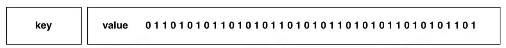
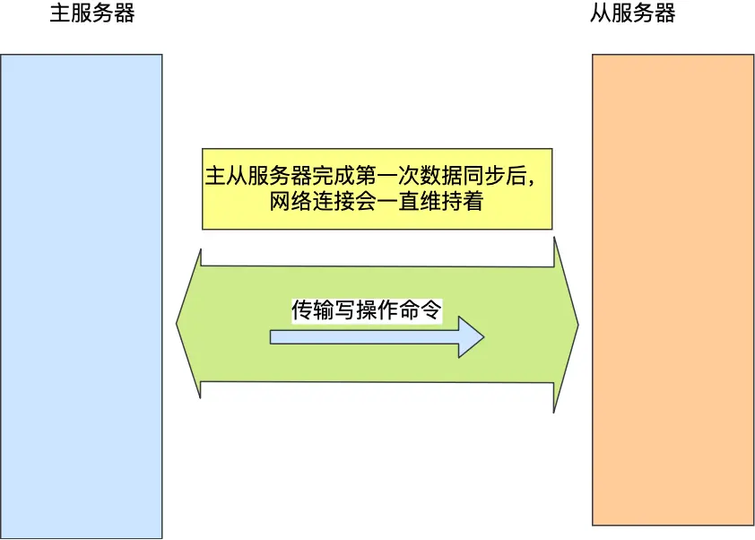

# Redis

提示词：我是一位面试官，我看见应聘者的简历上的项目写了技术栈有Redis，请问我可以问他什么问题来考察

```bash
# 打开客户端
redis-cli

# 查看所有keys
keys *
# 查看特定模式的键，列出以 SYSTEM_MONITOR_MAP 开头的键。
keys "SYSTEM_MONITOR_MAP*"

# 查看字符串类型的键值对
get "SYSTEM_MONITOR_MAP"

# 检查某个键的过期时间，如果返回值为 -1，表示键没有设置过期时间；
ttl "SYSTEM_MONITOR_MAP"

# 删除单个键
del "SYSTEM_MONITOR_MAP"
```

## Redis基础

### 什么是 Redis？

Redis（**RE**mote **DI**ctionary **S**erver）是一个基于 C 语言开发的开源 NoSQL 数据库（BSD 许可）。与传统数据库不同的是，Redis 的数据是保存在内存中的（内存数据库，支持持久化），因此读写速度非常快，被广泛应用于分布式缓存方向。并且，Redis 存储的是 KV 键值对数据。

为了满足不同的业务场景，Redis 内置了多种数据类型实现（比如 String、Hash、Sorted Set、Bitmap、HyperLogLog、GEO）。并且，Redis 还支持事务、持久化、Lua 脚本、发布订阅模型、多种开箱即用的集群方案（Redis Sentinel、Redis Cluster）。


### Redis 为什么这么快？

> 科大讯飞

Redis 内部做了非常多的性能优化，比较重要的有下面 4 点：

1. 纯内存操作 (Memory-Based Storage) ：这是最主要的原因。Redis 数据读写操作都发生在内存中，访问速度是纳秒级别，而传统数据库频繁读写磁盘的速度是毫秒级别，两者相差数个数量级。

2. 高效的 I/O 模型 (I/O Multiplexing & Single-Threaded Event Loop) ：Redis 使用**单线程**事件循环配合 **I/O 多路复用**技术，让单个线程可以同时处理多个网络连接上的 I/O 事件（如读写），避免了多线程模型中的上下文切换和锁竞争问题。虽然是单线程，但结合内存操作的高效性和 I/O 多路复用，使得 Redis 能轻松处理大量并发请求。

3. 优化的内部数据结构 (Optimized Data Structures) ：Redis 提供多种数据类型（如 String, List, Hash, Set, Sorted Set 等），其内部实现采用**高度优化的编码方式**（如 ziplist, quicklist, skiplist, hashtable 等）。Redis 会根据数据大小和类型动态选择最合适的内部编码，以在性能和空间效率之间取得最佳平衡。

4. 简洁高效的通信协议 (Simple Protocol - RESP) ：Redis 使用的是自己设计的 **RESP (REdis Serialization Protocol) 协议**。这个协议实现简单、解析性能好，并且是二进制安全的。客户端和服务端之间通信的序列化/反序列化开销很小，有助于提升整体的交互速度。

### Redis 除了做缓存，还能做什么？

> 美的二面

- **分布式锁**：通过 Redis 来做分布式锁是一种比较常见的方式。通常情况下，我们都是基于 **Redisson** 来实现分布式锁。
- **限流**：一般是通过 Redis + Lua 脚本的方式来实现限流。如果不想自己写 Lua 脚本的话，也可以直接利用 Redisson 中的 `RRateLimiter` 来实现分布式限流，其底层实现就是基于 Lua 代码+令牌桶算法。
- **消息队列**：Redis 自带的 List 数据结构可以作为一个简单的队列使用。Redis 5.0 中增加的 Stream 类型的数据结构更加适合用来做消息队列。它比较类似于 Kafka，有主题和消费组的概念，支持消息持久化以及 ACK 机制。
- **延时队列**：Redisson 内置了延时队列（基于 Sorted Set 实现的）。
- **分布式 Session**：利用 String 或者 Hash 数据类型保存 Session 数据，所有的服务器都可以访问。
- **复杂业务场景**：通过 Redis 以及 Redis 扩展（比如 Redisson）提供的数据结构，我们可以很方便地完成很多复杂的业务场景，比如通过 Bitmap 统计活跃用户、通过 Sorted Set 维护排行榜、通过 HyperLogLog 统计网站 UV 和 PV。
- ……


## Redis 数据类型

### Redis 常用的数据类型有哪些？

Redis 中比较常见的数据类型有下面这些：

- **5 种基础数据类型**：String（字符串）、List（列表）、Set（集合）、Hash（散列）、Zset（有序集合）。
- **3 种特殊数据类型**：HyperLogLog（基数统计）、Bitmap （位图）、Geospatial (地理位置)。

除了上面提到的之外，还有一些其他的比如 [Bloom filter（布隆过滤器）](https://javaguide.cn/cs-basics/data-structure/bloom-filter.html)、Bitfield（位域）。

### String

#### 应用场景

**需要存储常规数据的场景**

- 举例：缓存 Session、Token、图片地址、序列化后的对象(相比较于 Hash 存储更节省内存)。
- 相关命令：`SET`、`GET`。

**需要计数的场景**

- 举例：用户单位时间的请求数（简单限流可以用到）、页面单位时间的访问数。
- 相关命令：`SET`、`GET`、 `INCR`、`DECR` 。

**分布式锁**

利用 `SETNX key value` 命令可以实现一个最简易的分布式锁（存在一些缺陷，通常不建议这样实现分布式锁）。

### List

#### 应用场景

**信息流展示**

- 举例：最新文章、最新动态。
- 相关命令：`LPUSH`、`LRANGE`。

**消息队列**

`List` 可以用来做消息队列，只是功能过于简单且存在很多缺陷，不建议这样做。

相对来说，Redis 5.0 新增加的一个数据结构 `Stream` 更适合做消息队列一些，只是功能依然非常简陋。和专业的消息队列相比，还是有很多欠缺的地方比如消息丢失和堆积问题不好解决。

### Hash

#### 应用场景

**对象数据存储场景**

- 举例：用户信息、商品信息、文章信息、购物车信息。
- 相关命令：`HSET` （设置单个字段的值）、`HMSET`（设置多个字段的值）、`HGET`（获取单个字段的值）、`HMGET`（获取多个字段的值）。

### Set

#### 应用场景

**需要存放的数据不能重复的场景**

- 举例：网站 UV 统计（数据量巨大的场景还是 `HyperLogLog`更适合一些）、文章点赞、动态点赞等场景。
- 相关命令：`SCARD`（获取集合数量） 。

**需要获取多个数据源交集、并集和差集的场景**

- 举例：共同好友(交集)、共同粉丝(交集)、共同关注(交集)、好友推荐（差集）、音乐推荐（差集）、订阅号推荐（差集+交集） 等场景。
- 相关命令：`SINTER`（交集）、`SINTERSTORE` （交集）、`SUNION` （并集）、`SUNIONSTORE`（并集）、`SDIFF`（差集）、`SDIFFSTORE` （差集）。

**需要随机获取数据源中的元素的场景**

- 举例：抽奖系统、随机点名等场景。
- 相关命令：`SPOP`（随机获取集合中的元素并移除，适合不允许重复中奖的场景）、`SRANDMEMBER`（随机获取集合中的元素，适合允许重复中奖的场景）。

### ZSet

Zset 类型（有序集合类型）相比于 Set 类型多了一个**排序属性 score（分值）**，对于有序集合 ZSet 来说，每个存储元素相当于有两个值组成的，一个是有序集合的元素值，一个是排序值。

有序集合保留了集合不能有重复成员的特性（分值可以重复），但不同的是，有序集合中的元素可以排序。

#### 内部实现

Zset 类型的底层数据结构是由**压缩列表或跳表**实现的：

- 如果有序集合的**元素个数小于 128 个，并且每个元素的值小于 64 字节**时，Redis 会使用压缩列表作为 Zset 类型的底层数据结构； 
- 如果有序集合的元素不满足上面的条件，Redis 会使用跳表作为 Zset 类型的底层数据结构； 

在 Redis 7.0 中，压缩列表数据结构已经废弃了，交由 **listpack** 数据结构来实现了。

#### 应用场景

**需要随机获取数据源中的元素根据某个权重进行排序的场景**

- 举例：各种排行榜比如直播间送礼物的排行榜、朋友圈的微信步数排行榜、王者荣耀中的段位排行榜、话题热度排行榜等等。
- 相关命令：`ZRANGE` (从小到大排序)、 `ZREVRANGE` （从大到小排序）、`ZREVRANK` (指定元素排名)。

**需要存储的数据有优先级或者重要程度的场景** 比如优先级任务队列。

- 举例：优先级任务队列。
- 相关命令：`ZRANGE` (从小到大排序)、 `ZREVRANGE` （从大到小排序）、`ZREVRANK` (指定元素排名)。

### BitMap

> 科大讯飞

**介绍**

Bitmap，即位图，是一串连续的二进制数组（0和1），可以通过**偏移量（offset）**定位元素。BitMap通过最小的单位bit来进行`0|1`的设置，表示某个元素的值或者状态，时间复杂度为O(1)。

由于 bit 是计算机中最小的单位，使用它进行储存将非常节省空间，特别适合一些数据量大且使用**二值统计的场景**。



**应用场景**

1、签到统计

签到统计时，每个用户一天的签到用 1 个 bit 位就能表示，一个月（假设是 31 天）的签到情况用 31 个 bit 位就可以，而一年的签到也只需要用 365 个 bit 位，根本不用太复杂的集合类型。

```bash
# 记录该用户 6 月 3 号已签到
SETBIT uid:sign:100:202206 2 1
# 检查该用户 6 月 3 日是否签到
GETBIT uid:sign:100:202206 2 
# 统计该用户在 6 月份的签到次数
BITCOUNT uid:sign:100:202206
# 统计这个月首次打卡时间
BITPOS uid:sign:100:202206 1
```

2、判断用户登陆态

```bash
# 执行以下指令，表示用户已登录
SETBIT login_status 10086 1
# 检查该用户是否登陆，返回值 1 表示已登录
GETBIT login_status 10086
# 登出，将 offset 对应的 value 设置成 0
SETBIT login_status 10086 0
```

3、连续签到用户总数

如何统计出这连续 3 天连续打卡用户总数呢？

```bash
# 与操作
BITOP AND destmap bitmap:01 bitmap:02 bitmap:03
# 统计 bit 位 =  1 的个数
BITCOUNT destmap
```

### GEO

**内部实现：**

GEO 本身并没有设计新的底层数据结构，而是直接使用了 **Sorted Set** 集合类型。

GEO 类型使用 GeoHash 编码方法实现了经纬度到 Sorted Set 中元素权重分数的转换，这其中的两个关键机制就是「对二维地图做区间划分」和「对区间进行编码」。一组经纬度落在某个区间后，就用区间的编码值来表示，并把编码值作为 Sorted Set 元素的权重分数。

这样一来，我们就可以把经纬度保存到 Sorted Set 中，利用 Sorted Set 提供的“按权重进行有序范围查找”的特性，实现 LBS 服务中频繁使用的“搜索附近”的需求。

### String 还是 Hash 存储对象数据更好呢？

简单对比一下二者：

- **对象存储方式**：
  - String 存储的是序列化后的对象数据，存放的是整个对象，操作简单直接。
  - Hash 是对对象的每个字段单独存储，可以获取部分字段的信息，也可以修改或者添加部分字段，节省网络流量。如果对象中某些字段需要经常变动或者经常需要单独查询对象中的个别字段信息，Hash 就非常适合。

- **内存消耗**：Hash 通常比 String 更节省内存，特别是在字段较多且字段长度较短时。Redis 对小型 Hash 进行优化（如使用 ziplist 存储），进一步降低内存占用。
- **复杂对象存储**：String 在处理多层嵌套或复杂结构的对象时更方便，因为无需处理每个字段的独立存储和操作。
- **性能**：
  - String 的操作通常具有 O(1) 的时间复杂度，因为它存储的是整个对象，操作简单直接，整体读写的性能较好。
  - Hash 由于需要处理多个字段的增删改查操作，在字段较多且经常变动的情况下，可能会带来额外的性能开销。


总结：

- 在绝大多数情况下，**String** 更适合存储对象数据，尤其是当对象结构简单且整体读写是主要操作时。
- 如果你需要频繁操作对象的部分字段或节省内存，**Hash** 可能是更好的选择。


## Redis 持久化机制（重要）

Redis 持久化机制（RDB 持久化、AOF 持久化、RDB 和 AOF 的混合持久化）

使用缓存的时候，我们经常需要对内存中的数据进行持久化也就是将内存中的数据写入到硬盘中。大部分原因是为了之后重用数据（比如重启机器、机器故障之后恢复数据），或者是为了做数据同步（比如 Redis 集群的主从节点通过 RDB 文件同步数据）。

Redis 不同于 Memcached 的很重要一点就是，Redis 支持持久化，而且支持 3 种持久化方式:

- 快照（snapshotting，RDB）
- 只追加文件（append-only file, AOF）
- RDB 和 AOF 的混合持久化(Redis 4.0 新增)

### 什么是 RDB 持久化？

Redis 可以通过创建快照来获得存储在内存里面的数据在 **某个时间点** 上的副本。Redis 创建快照之后，可以对快照进行备份，可以将快照复制到其他服务器从而创建具有相同数据的服务器副本（Redis 主从结构，主要用来提高 Redis 性能），还可以将快照留在原地以便重启服务器的时候使用。

快照持久化是 Redis 默认采用的持久化方式，在 `redis.conf` 配置文件中默认有此下配置：

```conf
save 900 1           #在900秒(15分钟)之后，如果至少有1个key发生变化，Redis就会自动触发bgsave命令创建快照。

save 300 10          #在300秒(5分钟)之后，如果至少有10个key发生变化，Redis就会自动触发bgsave命令创建快照。

save 60 10000        #在60秒(1分钟)之后，如果至少有10000个key发生变化，Redis就会自动触发bgsave命令创建快照。
```

这里提一点，Redis 的快照是**全量快照**，也就是说每次执行快照，都是把内存中的「所有数据」都记录到磁盘中。

### 为什么RDB恢复数据比AOF快？

这两种技术都会用各用一个日志文件来记录信息，但是记录的内容是不同的。

- AOF 文件的内容是操作命令；
- RDB 文件的内容是二进制数据。

RDB 快照就是记录某一个瞬间的内存数据，记录的是实际数据，而 AOF 文件记录的是命令操作的日志，而不是实际的数据。

因此在 Redis 恢复数据时， RDB 恢复数据的效率会比 AOF 高些，因为直接将 RDB 文件读入内存就可以，不需要像 AOF 那样还需要**额外执行操作命令的步骤**才能恢复数据。

### 什么是 AOF 持久化？

与快照持久化相比，AOF 持久化的实时性更好。默认情况下 Redis 没有开启 AOF（append only file）方式的持久化（Redis 6.0 之后已经默认是开启了），可以通过 `appendonly` 参数开启：

```bash
appendonly yes
```

开启 AOF 持久化后**每执行一条会更改 Redis 中的数据的命令**，Redis 就会将该命令写入到 **AOF 缓冲区** `server.aof_buf` 中，然后再写入到 AOF 文件中（此时还在系统内核缓存区未同步到磁盘），最后再根据持久化方式（ `fsync`策略）的配置来决定何时将系统内核缓存区的数据同步到硬盘中的。

只有同步到磁盘中才算持久化保存了，否则依然存在数据丢失的风险，比如说：系统内核缓存区的数据还未同步，磁盘机器就宕机了，那这部分数据就算丢失了。

AOF 文件的保存位置和 RDB 文件的位置相同，都是通过 `dir` 参数设置的，默认的文件名是 `appendonly.aof`。

### AOF 工作基本流程是怎样的？

AOF 持久化功能的实现可以简单分为 5 步：

1. **命令追加（append）**：所有的写命令会追加到 AOF 缓冲区中。
2. **文件写入（write）**：将 AOF 缓冲区的数据写入到 AOF 文件中。这一步需要调用`write`函数（系统调用），`write`将数据写入到了系统内核缓冲区之后直接返回了（延迟写）。注意！！！此时并没有同步到磁盘。
3. **文件同步（fsync）**：AOF 缓冲区根据对应的持久化方式（ `fsync` 策略）向硬盘做同步操作。这一步需要调用 `fsync` 函数（系统调用）， `fsync` 针对单个文件操作，对其进行强制硬盘同步，`fsync` 将阻塞直到写入磁盘完成后返回，保证了数据持久化。
4. **文件重写（rewrite）**：随着 AOF 文件越来越大，需要定期对 AOF 文件进行重写，达到压缩的目的。
5. **重启加载（load）**：当 Redis 重启时，可以加载 AOF 文件进行数据恢复。

AOF 工作流程图如下：


### RDB 和 AOF 合体

尽管 RDB 比 AOF 的数据恢复速度快，但是快照的频率不好把握：

- 如果频率太低，两次快照间一旦服务器发生宕机，就可能会比较多的数据丢失；
- 如果频率太高，频繁写入磁盘和创建子进程会带来额外的性能开销。

那有没有什么方法不仅有 **RDB 恢复速度快**的优点，又有 **AOF 丢失数据少**的优点呢？

当然有，那就是将 RDB 和 AOF 合体使用，这个方法是在 Redis 4.0 提出的，该方法叫**混合使用 AOF 日志和内存快照**，也叫混合持久化。

如果想要开启混合持久化功能，可以在 Redis 配置文件将下面这个配置项设置成 yes：

```bash
aof-use-rdb-preamble yes
```

混合持久化工作在 **AOF 日志重写过程**。

当开启了混合持久化时，在 AOF 重写日志时，`fork` 出来的重写子进程会先将与主线程共享的内存数据以 RDB 方式写入到 AOF 文件，然后主线程处理的操作命令会被记录在重写缓冲区里，重写缓冲区里的增量命令会以 AOF 方式写入到 AOF 文件，写入完成后通知主进程将新的含有 RDB 格式和 AOF 格式的 AOF 文件替换旧的的 AOF 文件。

也就是说，使用了混合持久化，AOF 文件的**前半部分是 RDB 格式的全量数据，后半部分是 AOF 格式的增量数据**。


这样的好处在于，重启 Redis 加载数据的时候，由于前半部分是 RDB 内容，这样**加载的时候速度会很快**。

加载完 RDB 的内容后，才会加载后半部分的 AOF 内容，这里的内容是 Redis 后台子进程重写 AOF 期间，主线程处理的操作命令，可以使得**数据更少的丢失**。

## Redis生产问题

> 美的二面

### 什么是缓存穿透？

缓存穿透说简单点就是大量请求的 key 是不合理的，**根本不存在于缓存中，也不存在于数据库中**。这就导致这些请求直接到了数据库上，根本没有经过缓存这一层，对数据库造成了巨大的压力，可能直接就被这么多请求弄宕机了。

举个例子：某个黑客故意制造一些非法的 key 发起大量请求，导致大量请求落到数据库，结果数据库上也没有查到对应的数据。也就是说这些请求最终都落到了数据库上，对数据库造成了巨大的压力。

#### 有哪些解决办法？

最基本的就是首先做好参数校验，一些不合法的参数请求直接抛出异常信息返回给客户端。比如查询的数据库 id 不能小于 0、传入的邮箱格式不对的时候直接返回错误消息给客户端等等。

**1）缓存无效 key**

如果缓存和数据库都查不到某个 key 的数据，就写一个到 Redis 中去并设置过期时间，具体命令如下：`SET key value EX 10086`。这种方式可以解决请求的 key 变化不频繁的情况，如果黑客恶意攻击，每次构建不同的请求 key，会导致 Redis 中缓存大量无效的 key。很明显，这种方案并不能从根本上解决此问题。如果非要用这种方式来解决穿透问题的话，尽量将无效的 key 的过期时间设置短一点，比如 1 分钟。

另外，这里多说一嘴，一般情况下我们是这样设计 key 的：`表名:列名:主键名:主键值`。

如果用 Java 代码展示的话，差不多是下面这样的：

**2）布隆过滤器**

布隆过滤器是一个非常神奇的数据结构，通过它我们可以非常方便地**判断一个给定数据是否存在于海量数据中**。我们可以把它看作由二进制向量（或者说位数组）和一系列随机映射函数（哈希函数）两部分组成的数据结构。相比于我们平时常用的 List、Map、Set 等数据结构，它占用空间更少并且效率更高，但是缺点是其返回的结果是概率性的，而不是非常准确的。理论情况下添加到集合中的元素越多，误报的可能性就越大。并且，存放在布隆过滤器的数据不容易删除。

具体是这样做的：把所有可能存在的请求的值都存放在布隆过滤器中，当用户请求过来，先判断用户发来的请求的值是否存在于布隆过滤器中。不存在的话，直接返回请求参数错误信息给客户端，存在的话才会走下面的流程。

加入布隆过滤器之后的缓存处理流程图如下：


**3）接口限流**

根据用户或者 IP 对接口进行限流，对于异常频繁的访问行为，还可以采取黑名单机制，例如将异常 IP 列入黑名单。

后面提到的缓存击穿和雪崩都可以配合接口限流来解决，毕竟这些问题的关键都是有很多请求落到了数据库上造成数据库压力过大。

### 什么是缓存击穿？

缓存击穿中，请求的 key 对应的是 **热点数据**，该数据 **存在于数据库中，但不存在于缓存中（通常是因为缓存中的那份数据已经过期）**。这就可能会导致瞬时大量的请求直接打到了数据库上，对数据库造成了巨大的压力，可能直接就被这么多请求弄宕机了。

举个例子：秒杀进行过程中，缓存中的某个秒杀商品的数据**突然过期**，这就导致瞬时大量对该商品的请求直接落到数据库上，对数据库造成了巨大的压力。

#### 有哪些解决办法？

1. **永不过期**（不推荐）：设置热点数据永不过期或者过期时间比较长。
2. **提前预热**（推荐）：针对热点数据提前预热，将其存入缓存中并设置合理的过期时间比如秒杀场景下的数据在秒杀结束之前不过期。
3. **加锁**（看情况）：在缓存失效后，通过设置互斥锁确保只有一个请求去查询数据库并更新缓存。

#### 缓存穿透和缓存击穿有什么区别？

缓存穿透中，请求的 key 既不存在于缓存中，也不存在于数据库中。

缓存击穿中，请求的 key 对应的是 **热点数据** ，该数据 **存在于数据库中，但不存在于缓存中（通常是因为缓存中的那份数据已经过期）** 。

> 击穿说明是有东西（即缓存），有东西才能被击穿；穿透说明没有东西，直接穿进去

### 什么是缓存雪崩？

实际上，缓存雪崩描述的就是这样一个简单的场景：**缓存在同一时间大面积的失效**，导致大量的请求都直接落到了数据库上，对数据库造成了巨大的压力。 这就好比雪崩一样，摧枯拉朽之势，数据库的压力可想而知，可能直接就被这么多请求弄宕机了。

另外，缓存服务宕机也会导致缓存雪崩现象，导致所有的请求都落到了数据库上。

举个例子：缓存中的大量数据在同一时间过期，这个时候突然有大量的请求需要访问这些过期的数据。这就导致大量的请求直接落到数据库上，对数据库造成了巨大的压力。

#### 有哪些解决办法？

**针对 Redis 服务不可用的情况**：

1. **Redis 集群**：采用 Redis 集群，避免单机出现问题整个缓存服务都没办法使用。Redis Cluster 和 Redis Sentinel 是两种最常用的 Redis 集群实现方案。
2. **多级缓存**：设置多级缓存，例如本地缓存+Redis 缓存的二级缓存组合，当 Redis 缓存出现问题时，还可以从本地缓存中获取到部分数据。

**针对大量缓存同时失效的情况**：

1. **设置随机失效时间**（可选）：为缓存设置随机的失效时间，例如在固定过期时间的基础上加上一个随机值，这样可以避免大量缓存同时到期，从而减少缓存雪崩的风险。
2. **提前预热**（推荐）：针对热点数据提前预热，将其存入缓存中并设置合理的过期时间，比如秒杀场景下的数据在秒杀结束之前不过期。
3. **持久缓存策略**（看情况）：虽然一般不推荐设置缓存永不过期，但对于某些关键性和变化不频繁的数据，可以考虑这种策略。

缓存预热如何实现？

常见的缓存预热方式有两种：

1. 使用定时任务，比如 xxl-job，来定时触发缓存预热的逻辑，将数据库中的热点数据查询出来并存入缓存中。
2. 使用消息队列，比如 Kafka，来异步地进行缓存预热，将数据库中的热点数据的主键或者 ID 发送到消息队列中，然后由缓存服务消费消息队列中的数据，根据主键或者 ID 查询数据库并更新缓存。

缓存雪崩和缓存击穿有什么区别？

缓存雪崩和缓存击穿比较像，但缓存雪崩导致的原因是缓存中的大量或者所有数据失效，缓存击穿导致的原因主要是某个**热点数据**不存在于缓存中（通常是因为缓存中的那份数据已经过期）。

### 如何保证缓存和数据库数据的一致性？

引入缓存主要是为了提升性能、减轻数据库压力，但确实会带来数据不一致的风险。绝对的一致性往往意味着更高的系统复杂度和性能开销，所以实践中我们通常会根据业务场景选择合适的策略，在性能和一致性之间找到一个平衡点。

下面单独对 **Cache Aside Pattern（旁路缓存模式）** 来聊聊。这是非常常用的一种缓存读写策略，它的读写逻辑是这样的：

- 读操作： 
  1. 先尝试从缓存读取数据。
  2. 如果缓存命中，直接返回数据。
  3. 如果缓存未命中，从数据库查询数据，将查到的数据放入缓存并返回数据。
- 写操作： 
  1. 先更新数据库。
  2. 再直接删除缓存中对应的数据。


如果更新数据库成功，而删除缓存这一步失败的情况的话，简单说有两个解决方案：

1. **缓存失效时间（TTL - Time To Live）变短**（不推荐，治标不治本）：我们让缓存数据的过期时间变短，这样的话缓存就会从数据库中加载数据。另外，这种解决办法对于先操作缓存后操作数据库的场景不适用。
2. **增加缓存更新重试机制**（常用）：如果缓存服务当前不可用导致缓存删除失败的话，我们就隔一段时间进行重试，重试次数可以自己定。不过，这里更适合引入消息队列实现异步重试，将删除缓存重试的消息投递到消息队列，然后由专门的消费者来重试，直到成功。虽然说多引入了一个消息队列，但其整体带来的收益还是要更高一些。

## 主从复制

### 第一次同步

接着，主服务器会执行 bgsave 命令来生成 RDB 文件，然后把文件发送给从服务器。

从服务器收到 RDB 文件后，会先清空当前的数据，然后载入 RDB 文件。

### 命令传播

主从服务器在完成第一次同步后，双方之间就会维护一个 TCP 连接。



后续主服务器可以通过这个连接继续将写操作命令传播给从服务器，然后从服务器执行该命令，使得与主服务器的数据库状态相同。

而且这个连接是长连接的，目的是避免频繁的 TCP 连接和断开带来的性能开销。

上面的这个过程被称为**基于长连接的命令传播**，通过这种方式来保证第一次同步后的主从服务器的数据一致性。

### 增量复制

那么关键的问题来了，**主服务器怎么知道要将哪些增量数据发送给从服务器呢？**

答案藏在这两个东西里：

- **repl_backlog_buffer**，是一个「**环形**」缓冲区，用于主从服务器断连后，从中找到差异的数据；
- **replication offset**，标记上面那个缓冲区的同步进度，主从服务器都有各自的偏移量，主服务器使用 master_repl_offset 来记录自己「*写*」到的位置，从服务器使用 slave_repl_offset 来记录自己「*读*」到的位置。


## Redis 集群

### 1. 为什么需要Redis Cluster？
