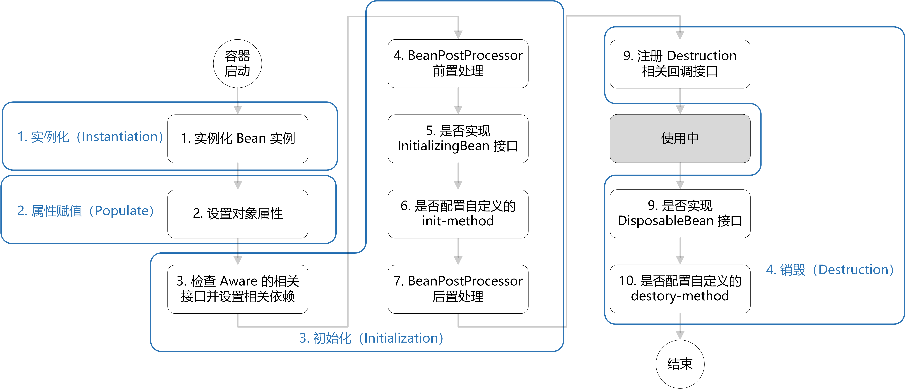
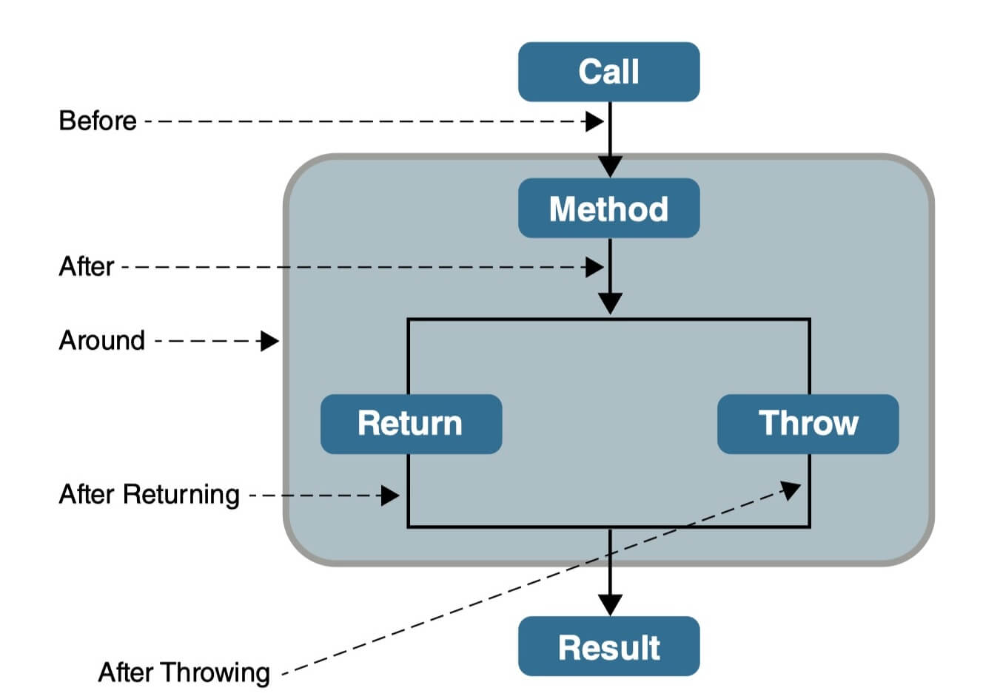
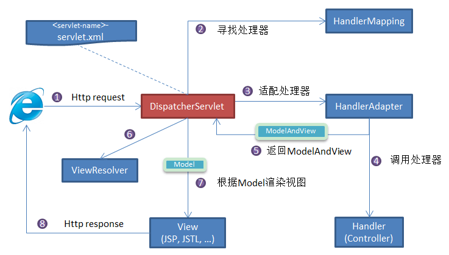

# SpringBoot

## Spring Boot 3.x

禁止循环依赖

SpringBoot为什么要禁止循环依赖?

Spring Boot（以及Spring框架）禁止循环依赖，主要是因为以下几个原因：

依赖关系复杂化： 循环依赖会导致类之间的依赖关系变得复杂和难以理解。维护一个具有循环依赖的应用程序会更加困难，可能会增加代码的耦合度，降低代码的可维护性和可读性。

实例化问题： 在Spring框架中，Bean的实例化是由Spring容器负责管理的。如果出现循环依赖，Spring容器在创建Bean时，可能会陷入死循环。例如，A依赖B，B依赖A，Spring容器在创建这两个Bean时，会一直相互等待，无法正常完成依赖注入。

构造函数注入的冲突： 当Bean的依赖通过构造函数注入时，Spring容器无法通过构造器解决循环依赖。这是因为构造函数注入要求所有依赖在创建实例时就要提供，而在循环依赖的情况下，Spring无法通过构造函数来解决问题。

解决方式： Spring框架通过setter注入（或使用其他方式，如**@Lazy**）解决了部分循环依赖问题。对于依赖注入的构造函数，如果存在循环依赖，可以通过使用代理、懒加载等机制来绕过这个问题，但这些解决方法增加了复杂性和潜在的性能开销。因此，Spring框架更倾向于避免循环依赖的出现。

```yaml
spring:
  main:
    allow-circular-references: true
```

综上，Spring Boot及Spring框架通过禁止循环依赖来保持依赖关系的简洁性、可维护性和系统的稳定性。在实际开发中，设计时应尽量避免产生循环依赖，可以通过重构代码、使用接口、事件驱动等方式来解决。


@Async

```java
@Async
@Override
public CompletableFuture<Boolean> saveOperLog(SysOperlogInfo info) {
    return CompletableFuture.completedFuture(this.save(info));
}
```


## 升级

- 在使用 `springdoc-openapi-starter-webmvc-ui` 时，可以使用 `@Tag` 和 `@Operation` 注解来替代 `@Api` 和 `@ApiOperation`

## Spring

### 谈谈自己对于 Spring IoC 的了解

**IoC（Inversion of Control:控制反转）** 是一种设计思想，而不是一个具体的技术实现。IoC 的思想就是将原本在程序中手动创建对象的控制权，交由 Spring 框架来管理。不过， IoC 并非 Spring 特有，在其他语言中也有应用。

**为什么叫控制反转？**

- **控制**：指的是对象创建（实例化、管理）的权力
- **反转**：控制权交给外部环境（Spring 框架、IoC 容器）

将对象之间的相互依赖关系交给 IoC 容器来管理，并由 IoC 容器完成对象的注入。这样可以很大程度上简化应用的开发，把应用从复杂的依赖关系中解放出来。 IoC 容器就像是一个工厂一样，当我们需要创建一个对象的时候，只需要配置好配置文件/注解即可，完全不用考虑对象是如何被创建出来的。

在实际项目中一个 Service 类可能依赖了很多其他的类，假如我们需要实例化这个 Service，你可能要每次都要搞清这个 Service 所有底层类的构造函数，这可能会把人逼疯。如果利用 IoC 的话，你只需要配置好，然后在需要的地方引用就行了，这大大增加了项目的可维护性且降低了开发难度。

在 Spring 中， IoC 容器是 Spring 用来实现 IoC 的载体， IoC 容器**实际上就是个 Map（key，value）**，Map 中存放的是各种对象。

Spring 时代我们一般通过 XML 文件来配置 Bean，后来开发人员觉得 XML 文件来配置不太好，于是 SpringBoot 注解配置就慢慢开始流行起来。

###  IOC和AOP是通过什么机制来实现的?

> Spring IOC 实现机制

- **反射**：Spring IOC容器利用Java的反射机制动态地加载类、创建对象实例及调用对象方法，反射允许在运行时检查类、方法、属性等信息，从而实现灵活的对象实例化和管理。
- **依赖注入**：IOC的核心概念是依赖注入，即容器负责管理应用程序组件之间的依赖关系。Spring通过构造函数注入、属性注入或方法注入，将组件之间的依赖关系描述在配置文件中或使用注解。
- **设计模式 - 工厂模式**：Spring IOC容器通常采用工厂模式来管理对象的创建和生命周期。容器作为工厂负责实例化Bean并管理它们的生命周期，将Bean的实例化过程交给容器来管理。
- **容器实现**：Spring IOC容器是实现IOC的核心，通常使用BeanFactory或ApplicationContext来管理Bean。BeanFactory是IOC容器的基本形式，提供基本的IOC功能；ApplicationContext是BeanFactory的扩展，并提供更多企业级功能。

### 什么是 Spring Bean？

简单来说，Bean 代指的就是那些被 IoC 容器所管理的对象。

我们需要告诉 IoC 容器帮助我们管理哪些对象，这个是通过**配置元数据**来定义的。配置元数据可以是 XML 文件、注解或者 Java 配置类。

```xml
<!-- Constructor-arg with 'value' attribute -->
<bean id="..." class="...">
   <constructor-arg value="..."/>
</bean>
```

下图简单地展示了 IoC 容器如何使用配置元数据来管理对象。


### 将一个类声明为 Bean 的注解有哪些?

- `@Component`：通用的注解，可标注任意类为 `Spring` 组件。如果一个 Bean 不知道属于哪个层，可以使用`@Component` 注解标注。
- `@Repository` : 对应持久层即 Dao 层，主要用于数据库相关操作。
- `@Service` : 对应服务层，主要涉及一些复杂的逻辑，需要用到 Dao 层。
- `@Controller` : 对应 Spring MVC 控制层，主要用于接受用户请求并调用 `Service` 层返回数据给前端页面。

### @Autowired 和 @Resource 的区别是什么？

`Autowired` 属于 Spring 内置的注解，默认的注入方式为`byType`（根据类型进行匹配），也就是说会优先根据接口类型去匹配并注入 Bean （接口的实现类）。

**这会有什么问题呢？** 当一个接口存在多个实现类的话，`byType`这种方式就无法正确注入对象了，因为这个时候 Spring 会同时找到多个满足条件的选择，默认情况下它自己不知道选择哪一个。

这种情况下，注入方式会变为 `byName`（根据名称进行匹配），这个名称通常就是类名（首字母小写）。就比如说下面代码中的 `smsService` 就是我这里所说的名称，这样应该比较好理解了吧。

举个例子，`SmsService` 接口有两个实现类: `SmsServiceImpl1`和 `SmsServiceImpl2`，且它们都已经被 Spring 容器所管理。

```java
// 报错，byName 和 byType 都无法匹配到 bean
@Autowired
private SmsService smsService;
// 正确注入 SmsServiceImpl1 对象对应的 bean
@Autowired
private SmsService smsServiceImpl1;
// 正确注入  SmsServiceImpl1 对象对应的 bean
// smsServiceImpl1 就是我们上面所说的名称
@Autowired
@Qualifier(value = "smsServiceImpl1")
private SmsService smsService;
```

我们还是建议通过 `@Qualifier` 注解来显式指定名称而不是依赖变量的名称。

`@Resource`属于 JDK 提供的注解，默认注入方式为 `byName`。如果无法通过名称匹配到对应的 Bean 的话，注入方式会变为`byType`。

`@Resource` 有两个比较重要且日常开发常用的属性：`name`（名称）、`type`（类型）。

如果仅指定 `name` 属性则注入方式为`byName`，如果仅指定`type`属性则注入方式为`byType`，如果同时指定`name` 和`type`属性（不建议这么做）则注入方式为`byType`+`byName`。

```java
// 报错，byName 和 byType 都无法匹配到 bean
@Resource
private SmsService smsService;
// 正确注入 SmsServiceImpl1 对象对应的 bean
@Resource
private SmsService smsServiceImpl1;
// 正确注入 SmsServiceImpl1 对象对应的 bean（比较推荐这种方式）
@Resource(name = "smsServiceImpl1")
private SmsService smsService;
```

简单总结一下：

- `@Autowired` 是 Spring 提供的注解，`@Resource` 是 JDK 提供的注解。
- `Autowired` 默认的注入方式为`byType`（根据类型进行匹配），`@Resource`默认注入方式为 `byName`（根据名称进行匹配）。
- 当一个接口存在多个实现类的情况下，`@Autowired` 和`@Resource`都需要通过名称才能正确匹配到对应的 Bean。`Autowired` 可以通过 `@Qualifier` 注解来显式指定名称，`@Resource`可以通过 `name` 属性来显式指定名称。
- `@Autowired` 支持在构造函数、方法、字段和参数上使用。`@Resource` 主要用于字段和方法上的注入，不支持在构造函数或参数上使用。

### Bean 的生命周期了解么?

1. 创建 Bean 的实例：Bean 容器首先会找到配置文件中的 Bean 定义，然后**使用 Java 反射 API 来创建 Bean 的实例**。

2. Bean 属性赋值/填充：为 Bean 设置相关属性和依赖，例如`@Autowired` 等注解注入的对象、`@Value` 注入的值、`setter`方法或构造函数注入依赖和值、`@Resource`注入的各种资源。

3. **Bean 初始化**：

   最先执行一堆 Aware 接口，让 Bean 知道自己是谁，在哪个工厂里 

- 如果 Bean 实现了 BeanNameAware 接口，调用 `setBeanName()`方法，传入 Bean 的名字。
- 如果 Bean 实现了 BeanClassLoaderAware 接口，调用 `setBeanClassLoader()`方法，传入 `ClassLoader`对象的实例。
- 如果 Bean 实现了 BeanFactoryAware 接口，调用 `setBeanFactory()`方法，传入 `BeanFactory`对象的实例。
- 与上面的类似，如果实现了其他 `*.Aware`接口，就调用相应的方法。
- 如果有和加载这个 Bean 的 Spring 容器相关的 BeanPostProcessor 对象，执行`postProcessBeforeInitialization()` 方法
- 如果 Bean 实现了`InitializingBean`接口，执行`afterPropertiesSet()`方法。
- 如果 Bean 在配置文件中的定义包含 `init-method` 属性，执行指定的方法。
- 如果有和加载这个 Bean 的 Spring 容器相关的 BeanPostProcessor 对象，执行`postProcessAfterInitialization()` 方法。

4. **销毁 Bean**：销毁并不是说要立马把 Bean 给销毁掉，而是把 Bean 的销毁方法先记录下来，将来需要销毁 Bean 或者销毁容器的时候，就调用这些方法去释放 Bean 所持有的资源。 

- 如果 Bean 实现了 `DisposableBean` 接口，执行 `destroy()` 方法。
- 如果 Bean 在配置文件中的定义包含 `destroy-method` 属性，执行指定的 Bean 销毁方法。或者，也可以直接通过`@PreDestroy` 注解标记 Bean 销毁之前执行的方法。



### 谈谈自己对于 AOP 的了解

AOP(Aspect-Oriented Programming:面向切面编程)能够将那些与业务无关，却为业务模块所共同调用的逻辑或责任（例如事务处理、日志管理、权限控制等）封装起来，便于减少系统的重复代码，降低模块间的耦合度，并有利于未来的可拓展性和可维护性。

Spring AOP 就是基于动态代理的，如果要代理的对象，实现了某个接口，那么 Spring AOP 会使用 **JDK Proxy**，去创建代理对象，而对于没有实现接口的对象，就无法使用 JDK Proxy 去进行代理了，这时候 Spring AOP 会使用 **Cglib** 生成一个被代理对象的子类来作为代理，如下图所示：

### Spring事务什么时候会失效？

1. 方法不是 `public` 修饰的
   - Spring AOP 默认是基于**代理**机制的，**只有 `public` 方法才能被代理增强**，也就只有 `public` 方法上的 `@Transactional` 注解才会生效。
2. 方法调用是 **同类内部方法调用**（即自调用）
   - 这是最常见的事务失效问题。Spring事务依赖于 AOP 代理，如果你在一个类的方法中**直接调用本类中另一个带有 `@Transactional` 注解的方法**，事务不会生效。
3. 异常类型不匹配，事务没有回滚
   - 默认情况下，Spring 只对 **运行时异常（`RuntimeException` 及其子类）和 Error** 进行回滚。
4. 数据库不支持事务（或操作不在事务范围内）
5. 事务方法执行在**线程池或异步线程**中
6. 事务管理器没有配置或配置错误
7. 数据库连接自动提交（autoCommit = true）
8. 异常被捕获后没有重新抛出

### Spring 事务的传播行为有哪些？

**事务传播行为是为了解决业务层方法之间互相调用的事务问题**。

当事务方法被另一个事务方法调用时，必须指定事务应该如何传播。例如：方法可能继续在现有事务中运行，也可能开启一个新事务，并在自己的事务中运行。

正确的事务传播行为可能的值如下:

**1.`TransactionDefinition.PROPAGATION_REQUIRED`**

使用的最多的一个事务传播行为，我们平时经常使用的`@Transactional`注解默认使用就是这个事务传播行为。如果当前存在事务，则加入该事务；如果当前没有事务，则创建一个新的事务。

**`2.TransactionDefinition.PROPAGATION_REQUIRES_NEW`**

创建一个新的事务，如果当前存在事务，则把当前事务挂起。也就是说不管外部方法是否开启事务，`Propagation.REQUIRES_NEW`修饰的内部方法会**新开启自己的事务**，且开启的事务相互独立，互不干扰。

**3.`TransactionDefinition.PROPAGATION_NESTED`**

如果当前存在事务，则创建一个事务作为当前事务的**嵌套事务**来运行；如果当前没有事务，则该取值等价于`TransactionDefinition.PROPAGATION_REQUIRED`。

**4.`TransactionDefinition.PROPAGATION_MANDATORY`**

如果当前存在事务，则加入该事务；如果当前没有事务，则抛出异常。（mandatory：强制性）

这个使用的很少。

若是错误的配置以下 3 种事务传播行为，事务将不会发生回滚：

- **`TransactionDefinition.PROPAGATION_SUPPORTS`**: 如果当前存在事务，则加入该事务；如果当前没有事务，则以非事务的方式继续运行。
- **`TransactionDefinition.PROPAGATION_NOT_SUPPORTED`**: 以非事务方式运行，如果当前存在事务，则把当前事务挂起。
- **`TransactionDefinition.PROPAGATION_NEVER`**: 以非事务方式运行，如果当前存在事务，则抛出异常。

### AOP

```java
@Aspect //说明这是切面
@Component // 切面也是容器中的组件

// 表示切入所有 返回类型为 ApiResult 的公共方法。
// 是一个环绕通知，会在目标方法 执行前后 执行逻辑，控制方法执行过程。
// 相比 @Before（前置通知）或 @After（后置通知），@Around 是 功能最强的通知类型
@Around("execution(public com.littlelee.base.common.util.ApiResult *(..))")
```

项目中的应用：统一拦截所有 ApiResult 返回类型的方法（Controller层的方法），若打上 @SysLog 注解，则采集操作日志信息并发送至 MQ 消息队列中，支持异常记录、耗时统计、用户信息提取等功能。

项目选用的是**AspectJ**

Spring AOP和AspectJ有什么区别？

| 特性       | Spring AOP                                                | AspectJ                                    |
| ---------- | --------------------------------------------------------- | ------------------------------------------ |
| 增强方式   | 运行时增强（基于动态代理）                                | 编译时增强、类加载时增强（直接操作字节码） |
| 切入点支持 | 方法级（Spring Bean 范围内，不支持 final 和 static 方法） | 方法级、字段、构造器、静态方法等           |
| 性能       | 运行时依赖代理，有一定开销，切面多时性能较低              | 运行时无代理开销，性能更高                 |
| 复杂性     | 简单，易用，适合大多数场景                                | 功能强大，但相对复杂                       |
| 使用场景   | Spring 应用下比较简单的 AOP 需求                          | 高性能、高复杂度的 AOP 需求                |

AOP 常见的通知类型有哪些？



**Before**（前置通知）：目标对象的方法调用之前触发

**After** （后置通知）：目标对象的方法调用之后触发

**AfterReturning**（返回通知）：目标对象的方法调用完成，在返回结果值之后触发

**AfterThrowing**（异常通知）：目标对象的方法运行中抛出 / 触发异常后触发。AfterReturning 和 AfterThrowing 两者互斥。如果方法调用成功无异常，则会有返回值；如果方法抛出了异常，则不会有返回值。

**Around** （环绕通知）：编程式控制目标对象的方法调用。环绕通知是所有通知类型中可操作范围最大的一种，因为它可以直接拿到目标对象，以及要执行的方法，所以环绕通知可以任意的在目标对象的方法调用前后搞事，甚至不调用目标对象的方法

### Spring AOP 在什么场景下会失效

一、内部方法调用失效

场景与原因

当一个 Bean 的内部方法直接调用另一个方法时，AOP 无法拦截。

原因：AOP 通过代理对象增强方法，但内部调用通过 this 直接调用目标对象的方法，绕过了代理。

解决方案：使用AopContext.currentProxy()：需开启exposeProxy配置

```java
@EnableAspectJAutoProxy(exposeProxy = true)
public class AppConfig { ... }
// 调用方式
((MyBean) AopContext.currentProxy()).methodB();
```

二、非 Spring 管理的对象

通过 new 关键字直接创建对象，而非通过 Spring 容器获取 Bean

解决方案：使用 @Component 等注解将类声明为 Bean，并通过 @Autowired 注入。

三、异步方法（@Async）

异步方法在新线程中执行时，AOP 拦截器可能无法跟踪

四、切入点表达式错误

表达式为正确匹配目标方法

```java
// 下面是项目中正确的写法
@Around("execution(public com.littlelee.base.common.util.ApiResult *(..))")
```

###  SpringMVC 工作原理了解吗?

> 经纬恒润二面

Spring MVC 原理如下图所示：



**流程说明（重要）：**

1. 客户端（浏览器）发送请求， `DispatcherServlet`拦截请求。
2. `DispatcherServlet` 根据请求信息调用 `HandlerMapping` 。`HandlerMapping` 根据 URL 去匹配查找能处理的 `Handler`（也就是我们平常说的 `Controller` 控制器） ，并会将请求涉及到的拦截器和 `Handler` 一起封装。
3. `DispatcherServlet` 调用 `HandlerAdapter`适配器执行 `Handler` 。
4. `Handler` 完成对用户请求的处理后，会返回一个 `ModelAndView` 对象给`DispatcherServlet`，`ModelAndView` 顾名思义，包含了数据模型以及相应的视图的信息。`Model` 是返回的数据对象，`View` 是个逻辑上的 `View`。
5. `ViewResolver` 会根据逻辑 `View` 查找实际的 `View`。
6. `DispaterServlet` 把返回的 `Model` 传给 `View`（视图渲染）。
7. 把 `View` 返回给请求者（浏览器）

上述流程是传统开发模式（JSP，Thymeleaf 等）的工作原理。然而现在主流的开发方式是前后端分离，这种情况下 Spring MVC 的 `View` 概念发生了一些变化。由于 `View` 通常由前端框架（Vue, React 等）来处理，后端不再负责渲染页面，而是只负责提供数据，因此：

- 前后端分离时，后端通常不再返回具体的视图，而是返回**纯数据**（通常是 JSON 格式），由前端负责渲染和展示。
- `View` 的部分在前后端分离的场景下往往不需要设置，Spring MVC 的控制器方法只需要返回数据，不再返回 `ModelAndView`，而是直接返回数据，Spring 会自动将其转换为 JSON 格式。相应的，`ViewResolver` 也将不再被使用。

怎么做到呢？

- 使用 `@RestController` 注解代替传统的 `@Controller` 注解，这样所有方法默认会返回 JSON 格式的数据，而不是试图解析视图。
- 如果你使用的是 `@Controller`，可以结合 `@ResponseBody` 注解来返回 JSON。

### Spring 循环依赖了解吗，怎么解决？

循环依赖是指 Bean 对象循环引用，是两个或多个 Bean 之间相互持有对方的引用，例如 CircularDependencyA → CircularDependencyB → CircularDependencyA。

单个对象的自我依赖也会出现循环依赖，但这种概率极低，属于是代码编写错误。

Spring 框架通过使用三级缓存来解决这个问题，确保即使在循环依赖的情况下也能正确创建 Bean。

Spring 中的三级缓存其实就是三个 Map，如下：

简单来说，Spring 的三级缓存包括：

1. **一级缓存（singletonObjects）**：存放最终形态的 Bean（已经实例化、属性填充、初始化），单例池，为“Spring 的单例属性”⽽⽣。一般情况我们获取 Bean 都是从这里获取的，但是并不是所有的 Bean 都在单例池里面，例如原型 Bean 就不在里面。
2. **二级缓存（earlySingletonObjects）**：存放过渡 Bean（半成品，尚未属性填充），也就是三级缓存中`ObjectFactory`产生的对象，与三级缓存配合使用的，可以防止 AOP 的情况下，每次调用`ObjectFactory#getObject()`都是会产生新的代理对象的。
3. **三级缓存（singletonFactories）**：存放`ObjectFactory`，`ObjectFactory`的`getObject()`方法（最终调用的是`getEarlyBeanReference()`方法）可以生成原始 Bean 对象或者代理对象（如果 Bean 被 AOP 切面代理）。三级缓存只会对单例 Bean 生效。

接下来说一下 Spring 创建 Bean 的流程：

1. 先去 **一级缓存 `singletonObjects`** 中获取，存在就返回；
2. 如果不存在或者对象正在创建中，于是去 **二级缓存 `earlySingletonObjects`** 中获取；
3. 如果还没有获取到，就去 **三级缓存 `singletonFactories`** 中获取，通过执行 `ObjectFacotry` 的 `getObject()` 就可以获取该对象，获取成功之后，从三级缓存移除，并将该对象加入到二级缓存中。

