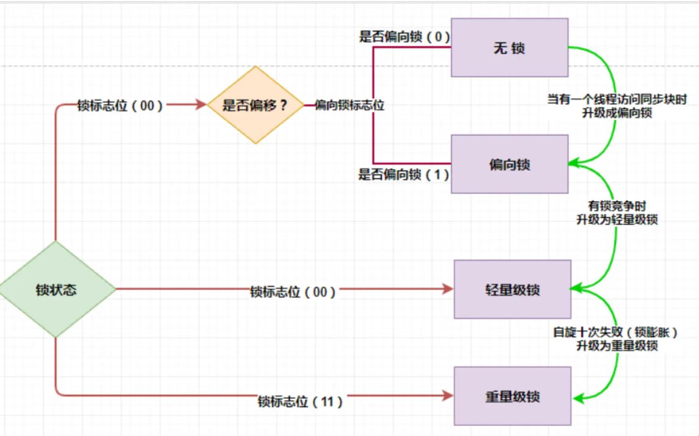
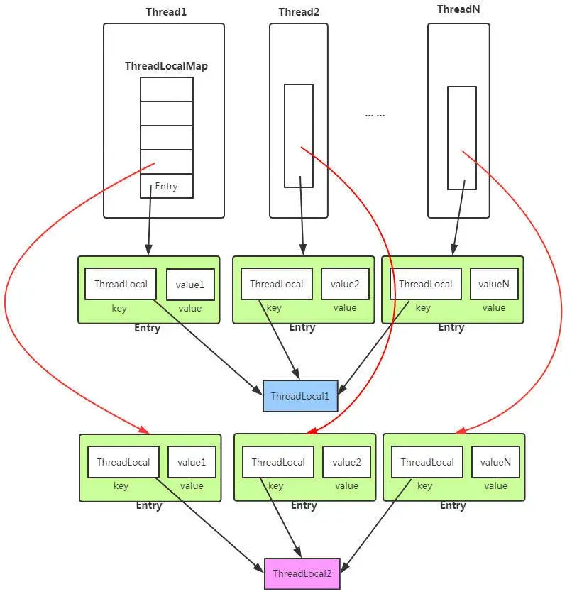
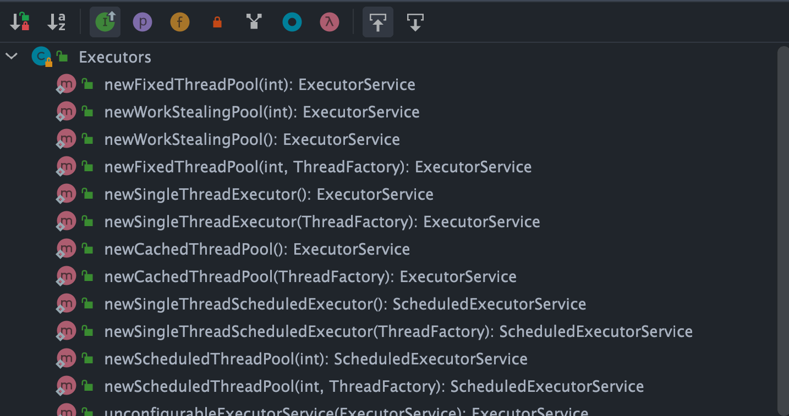
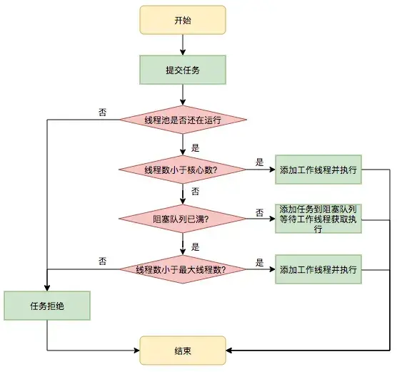
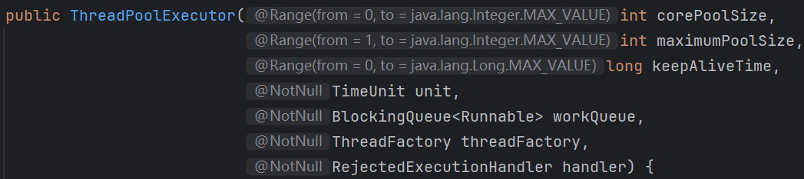
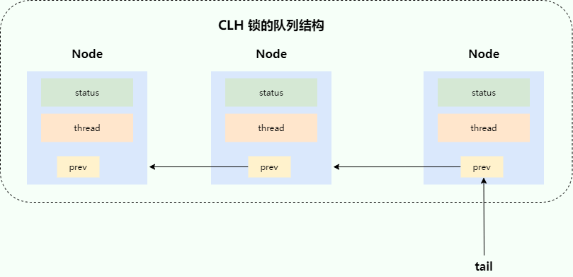

# JUC并发编程

## 多线程

### 如何创建线程？

一般来说，创建线程有很多种方式，例如继承 Thread 类、实现 Runnable 接口、实现 Callable 接口、使用线程池、使用CompletableFuture 类等等。不过，这些方式其实并没有真正创建出线程。准确点来说，这些都属于是在 Java 代码中使用多线程的方法。严格来说，Java 就只有一种方式可以创建线程，那就是通过`new Thread().start()`创建。不管是哪种方式，最终还是依赖于`new Thread().start()`。

> 2.实现Runnable接口

如果一个类已经继承了其他类，就不能再继承Thread类，此时可以实现java.lang.Runnable接口。 实现Runnable接口需要重写run()方法，然后将此Runnable对象作为参数传递给Thread类的构造器，创建Thread对象后调用其start()方法启动线程。

```java
class MyRunnable implements Runnable {
    @Override
    public void run() {
        // 线程执行的代码
    }
}

public static void main(String[] args) {
    Thread t = new Thread(new MyRunnable());
    t.start();
}
```

采用实现Runnable接口方式： 

- 优点：线程类只是实现了Runable接口，还可以继承其他的类。在这种方式下，可以多个线程共享同一个目标对象，所以非常适合多个相同线程来处理同一份资源的情况，从而可以将CPU代码和数据分开，形成清晰的模型，较好地体现了面向对象的思想。 
- 缺点：编程稍微复杂，如果需要访问当前线程，必须使用Thread.currentThread()方法。

> 3. 实现Callable接口与FutureTask

java.util.concurrent.Callable接口类似于Runnable，但**Callable的call()方法可以有返回值并且可以抛出异常**。要执行Callable任务，需将它包装进一个FutureTask，因为Thread类的构造器只接受 Runnable参数，而FutureTask实现了Runnable接口。

```java
class MyCallable implements Callable<Integer> {
    @Override
    public Integer call() throws Exception {
        // 线程执行的代码，这里返回一个整型结果
        return 1;
    }
}

public static void main(String[] args) {
    MyCallable task = new MyCallable();
    FutureTask<Integer> futureTask = new FutureTask<>(task);
    Thread t = new Thread(futureTask);
    t.start();

    try {
        Integer result = futureTask.get();  // 获取线程执行结果
        System.out.println("Result: " + result);
    } catch (InterruptedException | ExecutionException e) {
        e.printStackTrace();
    }
}
```

采用实现Callable接口方式：

- 缺点：编程稍微复杂，如果需要访问当前线程，必须调用Thread.currentThread()方法。 
- 优点：线程只是实现Runnable或实现Callable接口，还可以继承其他类。这种方式下，多个线程可以共享一个target对象，非常适合多线程处理同一份资源的情形。

### Runnable和Callable的区别

|          | Runable            | Callable                                                     |
| -------- | ------------------ | ------------------------------------------------------------ |
| 包名     | java.lang.Runnable | java.util.concurrent.Callable                                |
| 方法     | run()              | call()，可以有返回值并且可以抛出异常                         |
| 实现方式 | 直接扔给Thread类   | 需将它包装进一个FutureTask，因为Thread类的构造器只接受 Runnable参数 |

### sleep() 方法和 wait() 方法对比

> 汉得笔试

**共同点**：两者都可以暂停线程的执行。

**区别**：

- **`sleep()` 方法没有释放锁，而 `wait()` 方法释放了锁** 。
- `wait()` 通常被用于线程间交互/通信，`sleep()`通常被用于暂停执行。
- `wait()` 方法被调用后，线程不会自动苏醒，需要别的线程调用同一个对象上的 `notify()`或者 `notifyAll()` 方法。`sleep()`方法执行完成后，线程会自动苏醒，或者也可以使用 `wait(long timeout)` 超时后线程会自动苏醒。
- `sleep()` 是 `Thread` 类的静态本地方法，`wait()` 则是 `Object` 类的本地方法。

### notify 和 notifyAll 的区别?

同样是唤醒等待的线程，同样最多只有一个线程能获得锁，同样不能控制哪个线程获得锁。

区别在于：

- notify：唤醒一个线程，其他线程依然处于wait的等待唤醒状态，如果被唤醒的线程结束时没调用notify，其他线程就永远没人去唤醒，只能等待超时，或者被中断；
- notifyAll：所有线程退出wait的状态，开始竞争锁，但只有一个线程能抢到，这个线程执行完后，其他线程又会有一个幸运儿脱颖而出得到锁。

## 并发安全

### 怎么保证多线程安全？

> 美团AI面

- **synchronized关键字**：可以使用 `synchronized` 关键字来**同步**代码块或方法，**确保同一时刻只有一个线程可以访问这些代码**。对象锁是通过 `synchronized` 关键字锁定对象的监视器（monitor）来实现的。

```java
public synchronized void someMethod() { /* ... */ }

public void anotherMethod() {
    synchronized (someObject) {
        /* ... */
    }
}
```

- **volatile关键字**：`volatile` 关键字用于变量，**确保所有线程看到的是该变量的最新值**，而不是可能存储在本地寄存器中的副本。

```java
public volatile int sharedVariable;
```

- **Lock接口和ReentrantLock类**：`java.util.concurrent.locks.Lock` 接口提供了比 `synchronized` 更强大的锁定机制，`ReentrantLock` 是一个实现该接口的例子，提供了更灵活的锁管理和更高的性能。

```java
private final ReentrantLock lock = new ReentrantLock();

public void someMethod() {
    lock.lock();
    try {
        /* ... */
    } finally {
        lock.unlock();
    }
}
```

- **原子类**：Java并发库（`java.util.concurrent.atomic`）提供了原子类，如 `AtomicInteger`、`AtomicLong` 等，这些类提供了原子操作，可以用于更新基本类型的变量而无需额外的同步。

```java
AtomicInteger counter = new AtomicInteger(0);

int newValue = counter.incrementAndGet();
```

- **线程局部变量**：ThreadLocal 类可以为每个线程提供独立的变量副本，这样每个线程都拥有自己的变量，消除了竞争条件。
  
  ```java
  ThreadLocal<Integer> threadLocalVar = new ThreadLocal<>();
  threadLocalVar.set(10);
  int value = threadLocalVar.get();
  ```
  
- **并发集合**：使用 `java.util.concurrent` 包中的线程安全集合，如 ConcurrentHashMap 、ConcurrentLinkedQueue 等，这些集合内部已经实现了线程安全的逻辑。

- **JUC工具类**：使用 `java.util.concurrent` 包中的一些工具类可以用于控制线程间的同步和协作。例如：Semaphore 和 CyclicBarrier 等。

### juc包下你常用的类？

并发集合类：

- ConcurrentHashMap：线程安全的哈希映射表，用于在多线程环境下高效地存储和访问键值对。它采用了**分段锁**等技术，允许多个线程同时访问不同的段，提高了并发性能，在高并发场景下比传统的Hashtable性能更好。
- CopyOnWriteArrayList：：线程安全的列表，在对列表进行修改操作时，会创建一个新的底层数组，将修改操作应用到新数组上，而读操作仍然可以在旧数组上进行，从而实现了读写分离，提高了并发读的性能，适用于读多写少的场景。

原子类：

- AtomicInteger：原子整数类，提供了对整数类型的原子操作，如自增、自减、比较并交换等。通过硬件级别的原子指令来保证操作的原子性和线程安全性，避免了使用锁带来的性能开销，在多线程环境下对整数进行计数、状态标记等操作非常方便。

> 在项目中的SSE用过ConcurrentHashMap、AtomicInteger

### 除了用synchronized，还有什么方法可以实现线程同步？

> 北森云AI面

- 使用 **ReentrantLock** 类：ReentrantLock 是一个可重入的互斥锁，相比 synchronized 提供了更灵活的锁定和解锁操作。它还支持公平锁和非公平锁，以及可以响应中断的锁获取操作。
- 使用 volatile 关键字：虽然 volatile 不是一种锁机制，但它可以确保变量的可见性。当一个变量被声明为 volatile 后，线程将直接从主内存中读取该变量的值，这样就能保证线程间变量的可见性。但它不具备原子性。
- 使用 Atomic 类：Java提供了一系列的原子类，例如 AtomicInteger 、AtomicLong 、AtomicReference 等，用于实现对单个变量的原子操作，这些类在实现细节上利用了**CAS（Compare-And-Swap）**算法，可以用来实现无锁的线程安全。

###  syncronized锁升级的过程讲一下

具体的锁升级的过程是：**无锁->偏向锁->轻量级锁->重量级锁**。

- **无锁**：这是没有开启偏向锁的时候的状态，在JDK1.6之后偏向锁的默认开启的，但是有一个偏向延迟，需要在JVM启动之后的多少秒之后才能开启，这个可以通过JVM参数进行设置，同时是否开启偏向锁也可以通过JVM参数设置。

- **偏向锁**：这个是在偏向锁开启之后的锁的状态，如果还没有一个线程拿到这个锁的话，这个状态叫做匿名偏向，当一个线程拿到偏向锁的时候，下次想要竞争锁只需要拿线程ID跟 MarkWord 当中存储的线程ID进行比较，如果线程ID相同则直接获取锁（相当于锁偏向于这个线程），不需要进行CAS操作和将线程挂起的操作。

- **轻量级锁**：在这个状态下线程主要是通过CAS操作实现的。将对象的MarkWord存储到线程的虚拟机栈上，然后通过CAS将对象的MarkWord的内容设置为指向Displaced Mark Word的指针，如果设置成功则获取锁。在线程出临界区的时候，也需要使用CAS，如果使用CAS替换成功则同步成功，如果失败表示有其他线程在获取锁，那么就需要在释放锁之后将被挂起的线程唤醒。

- **重量级锁**：当有两个以上的线程获取锁的时候轻量级锁就会升级为重量级锁，因为CAS如果没有成功的话始终都在自旋，进行while循环操作，这是非常消耗CPU的，但是在升级为重量级锁之后，线程会被操作系统调度然后挂起，这可以节约CPU资源。

了解完 4 种锁状态之后，我们就可以整体的来看一下锁升级的过程了。



线程A进入 synchronized 开始抢锁，JVM 会判断当前是否是偏向锁的状态，如果是就会根据 Mark Word 中存储的线程 ID 来判断，当前线程A是否就是持有偏向锁的线程。如果是，则忽略 check，线程A直接执行临界区内的代码。

但如果 Mark Word 里的线程不是线程 A，就会通过**自旋**尝试获取锁，如果获取到了，就将 Mark Word 中的线程 ID 改为自己的；如果竞争失败，就会立马撤销偏向锁，膨胀为轻量级锁。

后续的竞争线程都会通过自旋来尝试获取锁，如果自旋成功那么锁的状态仍然是轻量级锁。然而如果竞争失败，锁会膨胀为重量级锁，后续等待的竞争的线程都会被阻塞。

### CAS 和 AQS 有什么关系？

CAS 和 AQS 两者的区别：
- CAS 是一种**乐观锁**机制，它包含三个操作数：内存位置（V）、预期值（A）和新值（B）。CAS 操作的逻辑是，如果内存位置 V 的值等于预期值 A，则将其更新为新值 B，否则不做任何操作。整个过程是原子性的，通常由硬件指令支持，如在现代处理器上，cmpxchg 指令可以实现 CAS 操作。
- AQS 是一个用于构建锁和同步器的框架，许多同步器如 ReentrantLock、Semaphore、CountDownLatch 等都是基于 AQS 构建的。AQS 使用一个 volatile 的整数变量 state 来表示同步状态，通过内置的 FIFO 队列来管理等待线程。它提供了一些基本的操作，如 acquire（获取资源）和 release（释放资源），这些操作会修改 state 的值，并根据 state 的值来判断线程是否可以获取或释放资源。AQS 的 acquire 操作通常会先尝试获取资源，如果失败，线程将被添加到等待队列中，并阻塞等待。release 操作会释放资源，并唤醒等待队列中的线程。

CAS 和 AQS 两者的联系：
- CAS 为 AQS 提供原子操作支持：AQS 内部使用 CAS 操作来更新 state 变量，以实现线程安全的状态修改。在 acquire 操作中，当线程尝试获取资源时，会使用 CAS 操作尝试将 state 从一个值更新为另一个值，如果更新失败，说明资源已被占用，线程会进入等待队列。在 release 操作中，当线程释放资源时，也会使用 CAS 操作将 state 恢复到相应的值，以保证状态更新的原子性。

### CAS 算法存在哪些问题？

ABA 问题是 CAS 算法最常见的问题。

#### ABA 问题

如果一个变量 V 初次读取的时候是 A 值，并且在准备赋值的时候检查到它仍然是 A 值，那我们就能说明它的值没有被其他线程修改过了吗？很明显是不能的，因为在这段时间它的值可能被改为其他值，然后又改回 A，那 CAS 操作就会误认为它从来没有被修改过。这个问题被称为 CAS 操作的 **"ABA"问题。**

ABA 问题的解决思路是在变量前面追加上**版本号或者时间戳**。JDK 1.5 以后的 `AtomicStampedReference` 类就是用来解决 ABA 问题的，其中的 `compareAndSet()` 方法就是首先检查当前引用是否等于预期引用，并且当前标志是否等于预期标志，如果全部相等，则以原子方式将该引用和该标志的值设置为给定的更新值。

```java
public boolean compareAndSet(V   expectedReference,
                             V   newReference,
                             int expectedStamp,
                             int newStamp) {
    Pair<V> current = pair;
    return
        expectedReference == current.reference &&
        expectedStamp == current.stamp &&
        ((newReference == current.reference &&
          newStamp == current.stamp) ||
         casPair(current, Pair.of(newReference, newStamp)));
}
```

### Threadlocal作用，原理，具体里面存的key value是啥，会有什么问题，如何解决? 

ThreadLocal 是Java中用于解决线程安全问题的一种机制，它允许创建线程**局部变量**，即每个线程都有自己独立的变量副本，从而避免了线程间的资源共享和同步问题。



从内存结构图，我们可以看到： 

- Thread类中，有个ThreadLocal.ThreadLocalMap 的成员变量。 
- ThreadLocalMap内部维护了Entry数组，每个Entry代表一个完整的对象，key是 ThreadLocal 本 身，value是ThreadLocal的泛型对象值。

> ThreadLocal 的作用 

- 线程隔离： ThreadLocal 为每个线程提供了独立的变量副本，这意味着线程之间不会相互影响，可以安全地在多线程环境中使用这些变量而不必担心数据竞争或同步问题。

- 性能优势：由于 ThreadLocal 避免了线程间的同步开销，所以在大量线程并发执行时，相比传统的锁机制，它可以提供更好的性能。

> ThreadLocal的原理 

ThreadLocal 的实现依赖于 Thread 类中的一个 ThreadLocalMap 字段，这是一个存储 ThreadLocal 变量本身和对应值的映射。每个线程都有自己的 ThreadLocalMap 实例，用于存储该线程所持有的所有 ThreadLocal 变量的值。 

当你创建一个 ThreadLocal 变量时，它实际上就是一个 ThreadLocal 对象的实例。每个 ThreadLocal 对象都可以存储任意类型的值，这个值对每个线程来说是独立的。 

- 当调用 `ThreadLocal` 的 get() 方法时，` ThreadLocal` 会检查当前线程的 ThreadLocalMap 中是否有与之关联的值。
-  如果有，返回该值； 
- 如果没有，会调用 `initialValue()` 方法（如果重写了的话）来初始化该值，然后将其放入 `ThreadLocalMap` 中并返回。 
- 当调用 set() 方法时， ThreadLocal 会将给定的值与当前线程关联起来，即在当前线程的 ThreadLocalMap 中存储一个键值对，键是 ThreadLocal 对象自身，值是传入的值。 
- 当调用 remove() 方法时，会从当前线程的 ThreadLocalMap 中移除与该 `ThreadLocal` 对象关联 的条目。 

> 可能存在的问题 

当一个线程结束时，其 ThreadLocalMap 也会随之销毁，但是 ThreadLocal 对象本身不会立即被垃圾回收，直到没有其他引用指向它为止。 

因此，在使用 ThreadLocal 时需要注意，如果不显式调用 remove() 方法，或者线程结束时未正确清理 ThreadLocal 变量，可能会导致**内存泄漏**，因为 ThreadLocalMap 会持续持有 ThreadLocal 变量的引用，即使这些变量不再被其他地方引用。

 因此，实际应用中需要在使用完 ThreadLocal 变量后调用 remove() 方法释放资源。

### volatile关键字有什么作用？

volatile作用有 2 个：

- 保证变量对所有线程的可见性。当一个变量被声明为volatile时，它会保证对这个变量的写操作会立即刷新到**主存**中，而对这个变量的读操作会直接从主存中读取，从而确保了多线程环境下对该变量访问的可见性。这意味着一个线程修改了volatile变量的值，其他线程能够立刻看到这个修改，不会受到各自线程工作内存的影响。

- **禁止指令重排序优化**。volatile关键字在Java中主要通过**内存屏障**来禁止特定类型的指令重排序。
  - 1）**写-写（Write-Write）屏障**：在对volatile变量执行写操作之前，会插入一个写屏障。这确保了在该变量写操作之前的所有普通写操作都已完成，防止了这些写操作被移到volatile写操作之后。

  - 2）**读-写（Read-Write）屏障**：在对volatile变量执行读操作之后，会插入一个读屏障。它确保了对volatile变量的读操作之后的所有普通读操作都不会被提前到volatile读之前执行，保证了读取到的数据是最新的。

  - 3）**写-读（Write-Read）屏障**：这是最重要的一个屏障，它发生在volatile写之后和volatile读之前。这个屏障确保了volatile写操作之前的所有内存操作（包括写操作）都不会被重排序到volatile读之后，同时也确保了volatile读操作之后的所有内存操作（包括读操作）都不会被重排序到volatile写之前。


### 指令重排序的原理是什么？

在执行程序时，为了提高性能，处理器和编译器常常会对指令进行重排序，但是重排序要满足下面 2 个条件才能进行：

- 在单线程环境下不能改变程序运行的结果
- 存在数据依赖关系的不允许重排序。

所以重排序不会对单线程有影响，只会破坏多线程的执行语义。

我们看这个例子，A和C之间存在数据依赖关系，同时B和C之间也存在数据依赖关系。因此在最终执行的指令序列中，C不能被重排序到A和B的前面，如果C排到A和B的前面，那么程序的结果将会被改变。但A和B之间没有数据依赖关系，编译器和处理器可以重排序A和B之间的执行顺序。

```java
double width = 15.67;           // A
double height = 14.32;          // B
double area = width * height;   // C
```


### 什么情况会产生死锁问题？如何解决？

死锁只有**同时满足**以下四个条件才会发生：

- 互斥条件：互斥条件是指**多个线程不能同时使用同一个资源**。
- 持有并等待条件：持有并等待条件是指，当线程 A 已经持有了资源 1，又想申请资源 2，而资源 2 已经被线程 C 持有了，所以线程 A 就会处于等待状态，但是线程 A 在等待资源 2 的同时并不会释放自己已经持有的资源 1。
- 不可剥夺条件：不可剥夺条件是指，当线程已经持有了资源 ，在自己使用完之前不能被其他线程获取，线程 B 如果也想使用此资源，则只能在线程 A 使用完并释放后才能获取。
- 环路等待条件：环路等待条件指的是，在死锁发生的时候，两个线程获取资源的顺序构成了环形链。

避免死锁问题就只需要破坏其中一个条件就可以，最常见的并且可行的就是**使用资源有序分配法，来破坏环路等待条件**。

那什么是资源有序分配法呢？线程 A 和 线程 B 获取资源的顺序要一样，当线程 A 是先尝试获取资源 A，然后尝试获取资源 B 的时候，线程 B 同样也是先尝试获取资源 A，然后尝试获取资源 B。也就是说，线程 A 和 线程 B 总是以相同的顺序申请自己想要的资源。

### ReentrantLock 是什么？

ReentrantLock 实现了 Lock 接口，是一个可重入且**独占式**的锁，和 `synchronized` 关键字类似。不过，ReentrantLock 更灵活、更强大，增加了轮询、超时、中断、公平锁和非公平锁等高级功能。

```java
public class ReentrantLock implements Lock, java.io.Serializable {}
```

ReentrantLock 里面有一个内部类 Sync ，Sync 继承 **AQS（AbstractQueuedSynchronizer）**，添加锁和释放锁的大部分操作实际上都是在 Sync 中实现的。Sync 有公平锁 FairSync 和非公平锁 `NonfairSync` 两个子类。

ReentrantLock 默认使用非公平锁，也可以通过构造器来显式的指定使用公平锁。

```java
// 传入一个 boolean 值，true 时为公平锁，false 时为非公平锁
public ReentrantLock(boolean fair) {
    sync = fair ? new FairSync() : new NonfairSync();
}
```

### 公平锁和非公平锁有什么区别？

- **公平锁** : 锁被释放之后，先申请的线程先得到锁。性能较差一些，因为公平锁为了保证时间上的绝对顺序，上下文切换更频繁。
- **非公平锁**：锁被释放之后，后申请的线程可能会先获取到锁，是随机或者按照其他优先级排序的。性能更好，但可能会导致某些线程永远无法获取到锁。

### ⭐️synchronized 和 ReentrantLock 有什么区别？

**1、两者都是可重入锁**

**可重入锁** 也叫递归锁，指的是线程可以再次获取自己的内部锁。比如一个线程获得了某个对象的锁，此时这个对象锁还没有释放，当其再次想要获取这个对象的锁的时候还是可以获取的，如果是不可重入锁的话，就会造成死锁。

JDK 提供的所有现成的 `Lock` 实现类，包括 `synchronized` 关键字锁都是可重入的。

在下面的代码中，`method1()` 和 `method2()`都被 `synchronized` 关键字修饰，`method1()`调用了`method2()`。

```java
public class SynchronizedDemo {
    public synchronized void method1() {
        System.out.println("方法1");
        method2();
    }

    public synchronized void method2() {
        System.out.println("方法2");
    }
}
```

由于 `synchronized`锁是可重入的，同一个线程在调用`method1()` 时可以直接获得当前对象的锁，执行 `method2()` 的时候可以再次获取这个对象的锁，不会产生死锁问题。假如`synchronized`是不可重入锁的话，由于该对象的锁已被当前线程所持有且无法释放，这就导致线程在执行 `method2()`时获取锁失败，会出现死锁问题。

**2、synchronized 依赖于 JVM 而 ReentrantLock 依赖于 API**

`synchronized` 是依赖于 JVM 实现的，虚拟机团队在 JDK1.6 为 `synchronized` 关键字进行了很多优化，但是这些优化都是在虚拟机层面实现的，并没有直接暴露给我们。

`ReentrantLock` 是 JDK 层面实现的（也就是 API 层面，需要 lock() 和 unlock() 方法配合 try/finally 语句块来完成），所以我们可以通过查看它的源代码，来看它是如何实现的。

**3、ReentrantLock 比 synchronized 增加了一些高级功能**

相比`synchronized`，ReentrantLock 增加了一些高级功能。主要来说主要有三点：

- **等待可中断** ：ReentrantLock 提供了一种能够中断等待锁的线程的机制，通过 `lock.lockInterruptibly()` 来实现这个机制。也就是说当前线程在等待获取锁的过程中，如果其他线程中断当前线程「 `interrupt()` 」，当前线程就会抛出 `InterruptedException` 异常，可以捕捉该异常进行相应处理。
- **可实现公平锁** : ReentrantLock 可以指定是公平锁还是非公平锁。而`synchronized`只能是非公平锁。所谓的公平锁就是先等待的线程先获得锁。ReentrantLock 默认情况是非公平的，可以通过 `ReentrantLock`类的`ReentrantLock(boolean fair)`构造方法来指定是否是公平的。
- **可实现选择性通知（锁可以绑定多个条件）**：
  - `synchronized`关键字与`wait()`和`notify()`/`notifyAll()`方法相结合可以实现等待/通知机制。
  - ReentrantLock 类当然也可以实现，但是需要借助于`Condition`接口与`newCondition()`方法。

- **支持超时** ：`ReentrantLock` 提供了 `tryLock(timeout)` 的方法，可以指定等待获取锁的最长等待时间，如果超过了等待时间，就会获取锁失败，不会一直等待。

如果你想使用上述功能，那么选择 `ReentrantLock` 是一个不错的选择。

### 锁的可重入如何实现？

synchronized底层是利用计算机系统**mutex Lock**实现的。每一个可重入锁都会关联一个线程ID和一个锁状态status。

当一个线程请求方法时，会去检查锁状态。

1. 如果锁状态是0，代表该锁没有被占用，使用**CAS操作**获取锁，将线程ID替换成自己的线程ID。
2. 如果锁状态不是0，代表有线程在访问该方法。此时，如果线程ID是自己的线程ID，如果是可重入锁，会将status自增1，然后获取到该锁，进而执行相应的方法；如果是非重入锁，就会进入阻塞队列等待。

在释放锁时，

1. 如果是可重入锁的，每一次退出方法，就会将status减1，直至status的值为0，最后释放该锁。
2. 如果非可重入锁的，线程退出方法，直接就会释放该锁。

`ReentrantLock` 实现可重入锁的机制是基于**线程持有锁的计数器**。

- 当一个线程第一次获取锁时，计数器会加1，表示该线程持有了锁。在此之后，如果同一个线程再次获取锁，计数器会再次加1。每次线程成功获取锁时，都会将计数器加1。
- 当线程释放锁时，计数器会相应地减1。只有当计数器减到0时，锁才会完全释放，其他线程才有机会获取锁。

这种计数器的设计使得同一个线程可以多次获取同一个锁，而不会造成死锁或其他问题。每次获取锁时，计数器加1；每次释放锁时，计数器减1。只有当计数器减到0时，锁才会完全释放。

`ReentrantLock` 通过这种计数器的方式，实现了可重入锁的机制。它允许同一个线程多次获取同一个锁，并且能够正确地处理锁的获取和释放，避免了死锁和其他并发问题。

## ⭐️JMM(Java 内存模型)


## ⭐️乐观锁和悲观锁

### 什么是悲观锁？

悲观锁总是假设最坏的情况，认为共享资源每次被访问的时候就会出现问题(比如共享数据被修改)，所以每次在获取资源操作的时候都会上锁，这样其他线程想拿到这个资源就会阻塞直到锁被上一个持有者释放。也就是说，**共享资源每次只给一个线程使用，其它线程阻塞，用完后再把资源转让给其它线程**。

像 Java 中`synchronized`和`ReentrantLock`等独占锁就是悲观锁思想的实现。

```java
public void performSynchronisedTask() {
    synchronized (this) {
        // 需要同步的操作
    }
}

private Lock lock = new ReentrantLock();
lock.lock();
try {
   // 需要同步的操作
} finally {
    lock.unlock();
}
```

高并发的场景下，激烈的锁竞争会造成线程阻塞，大量阻塞线程会导致系统的上下文切换，增加系统的性能开销。并且，悲观锁还可能会存在**死锁**问题，影响代码的正常运行。

### 什么是乐观锁？

乐观锁总是假设最好的情况，认为共享资源每次被访问的时候不会出现问题，线程可以不停地执行，无需加锁也无需等待，**只是在提交修改的时候去验证对应的资源（也就是数据）是否被其它线程修改了**（具体方法可以使用版本号机制或 CAS 算法）。

在 Java 中`java.util.concurrent.atomic`包下面的原子变量类（比如`AtomicInteger`、`LongAdder`）就是使用了乐观锁的一种实现方式 **CAS** 实现的。

```java
// LongAdder 在高并发场景下会比 AtomicInteger 和 AtomicLong 的性能更好
// 代价就是会消耗更多的内存空间（空间换时间）
LongAdder sum = new LongAdder();
sum.increment();
```

高并发的场景下，乐观锁相比悲观锁来说，不存在锁竞争造成线程阻塞，也不会有死锁的问题，在性能上往往会更胜一筹。但是，如果冲突频繁发生（写占比非常多的情况），会频繁失败和重试，这样同样会非常影响性能，导致 CPU 飙升。

## JMM


## 线程池

### 如何创建线程池？

在 Java 中，创建线程池主要有两种方式：

**方式一：通过 `ThreadPoolExecutor` 构造函数直接创建 (推荐)**

这是最推荐的方式，因为它允许开发者明确指定线程池的核心参数，对线程池的运行行为有更精细的控制，从而避免资源耗尽的风险。

**方式二：通过 `Executors` 工具类创建 (不推荐用于生产环境)**

`Executors`工具类提供的创建线程池的方法如下图所示：



通过`Executors`工具类可以创建多种类型的线程池，包括：

- `FixedThreadPool`：固定线程数量的线程池。该线程池中的线程数量始终不变。当有一个新的任务提交时，线程池中若有空闲线程，则立即执行。若没有，则新的任务会被暂存在一个任务队列中，待有线程空闲时，便处理在任务队列中的任务。
- `SingleThreadExecutor`： 只有一个线程的线程池。若多余一个任务被提交到该线程池，任务会被保存在一个任务队列中，待线程空闲，按先入先出的顺序执行队列中的任务。
- `CachedThreadPool`： 可根据实际情况调整线程数量的线程池。线程池的线程数量不确定，但若有空闲线程可以复用，则会优先使用可复用的线程。若所有线程均在工作，又有新的任务提交，则会创建新的线程处理任务。所有线程在当前任务执行完毕后，将返回线程池进行复用。
- `ScheduledThreadPool`：给定的延迟后运行任务或者定期执行任务的线程池。

### 介绍一下线线程程池池的工作原理 

线程池是为了减少频繁的创建线程和销毁线程带来的性能损耗，线线程程池池的工作原理如下图：



线程池分为核心线程池，线程池的最大容量，还有等待任务的队列，提交一个任务，如果核心线程没有满，就创建一个线程，如果满了，就是会加入等待队列，如果等待队列满了，就会增加线程，如果达到最大线程数量，如果都达到最大线程数量，就会按照一些丢弃的策略进行处理。 任务执行流程如下：

```
提交任务 → 核心线程是否已满？
  ├─ 未满 → 创建核心线程执行
  └─ 已满 → 任务入队
       ├─ 队列未满 → 等待执行
       └─ 队列已满 → 创建非核心线程
           ├─ 未达最大线程数 → 执行任务
           └─ 已达最大线程数 → 执行拒绝策略
```

### 线程池的参数有哪些？

线程池的构造函数有7个参数：



- **corePoolSize**：线程池核心线程数量。默认情况下，线程池中线程的数量如果 <= `corePoolSize`，那么即使这些线程处于空闲状态，那也不会被销毁。 
- **maximumPoolSize**：限制了线程池能创建的**最大线程总数**（包括核心线程和非核心线程），
  - 当 `corePoolSize` 已满 并且 尝试将新任务加入阻塞队列失败（即队列已满）并且 当前线程数 < `maximumPoolSize` ，就会创建新线程执行此任务，

  - 但是当 `corePoolSize` 满 并且 队列满 并且 线程数已达 `maximumPoolSize` 并且 又有新任务提交时，就会触发拒绝策略。

- **keepAliveTime**：当线程池中线程的数量大于 `corePoolSize` ，并且某个线程的**空闲时间**超过了 `keepAliveTime` ，那么这个线程就会被销毁。 
- unit：就是 `keepAliveTime` 时间的单位。
- **workQueue**：工作队列。当没有空闲的线程执行新任务时，该任务就会被放入工作队列中，等待执行。

- threadFactory：线程工厂。可以用来给线程取名字等等 
- handler：拒绝策略。当一个新任务交给线线程程池池，如果此时线线程程池池中有空闲的线程，就会直接执行，如果没有空闲的线程，就会将该任务加入到阻塞队列中，如果阻塞队列满了，就会创建一 个新线程，从阻塞队列头部取出一个任务来执行，并将新任务加入到阻塞队列末尾。如果当前线线程程池池中线程的数量等于maximumPoolSize，就不会创建新线程，就会去执行拒绝策略

### ⭐️线程池的拒绝策略有哪些？

> 科大讯飞

如果当前同时运行的线程数量达到最大线程数量并且队列也已经被放满了任务时，ThreadPoolExecutor 定义一些策略:

- AbortPolicy：抛出 `RejectedExecutionException`来拒绝新任务的处理。
- CallerRunsPolicy：调用执行者自己的线程运行任务，也就是直接在调用`execute`方法的线程中运行(`run`)被拒绝的任务，如果执行程序已关闭，则会丢弃该任务。因此这种策略会降低对于新任务提交速度，影响程序的整体性能。如果你的应用程序可以承受此延迟并且你要求任何一个任务请求都要被执行的话，你可以选择这个策略。
- DiscardPolicy：不处理新任务，直接丢弃掉。
- DiscardOldestPolicy：此策略将丢弃最早的未处理的任务请求。

举个例子：Spring 通过 ThreadPoolTaskExecutor 或者我们直接通过 ThreadPoolExecutor 的构造函数创建线程池的时候，当我们不指定 `RejectedExecutionHandler` 拒绝策略来配置线程池的时候，默认使用的是 `AbortPolicy`。在这种拒绝策略下，如果队列满了，`ThreadPoolExecutor` 将抛出 `RejectedExecutionException` 异常来拒绝新来的任务 ，这代表你将丢失对这个任务的处理。

如果**不想丢弃任务**的话，可以使用`CallerRunsPolicy`。`CallerRunsPolicy` 和其他的几个策略不同，它既不会抛弃任务，也不会抛出异常，而是将任务回退给调用者，使用调用者的线程来执行任务。

```java
public static class CallerRunsPolicy implements RejectedExecutionHandler {

        public CallerRunsPolicy() { }

        public void rejectedExecution(Runnable r, ThreadPoolExecutor e) {
            if (!e.isShutdown()) {
                // 直接主线程执行，而不是线程池中的线程执行
                r.run();
            }
        }
    }
```

### 核心线程数设置为0可不可以？

> 美的二面

可以，当核心线程数为0的时候，会创建一个非核心线程进行执行。

从下面的源码也可以看到，当核心线程数为 0 时，来了一个任务之后，会先将任务添加到**任务队列**，同时也会判断当前工作的线程数是否为 0，如果为 0，则会创建线程来执行线程池的任务。


###  有线程池参数设置的经验吗？

场景一：电商场景，特点瞬时高并发、任务处理时间短，线程池的配置可设置如下：

```java
new ThreadPoolExecutor(
    16,                        // corePoolSize = 16（假设8核CPU × 2）
    32,                        // maximumPoolSize = 32（突发流量扩容）
    10, TimeUnit.SECONDS,      // 非核心线程空闲10秒回收
    new SynchronousQueue<>(),  // 不缓存任务，直接扩容线程
    new AbortPolicy()          // 直接拒绝，避免系统过载
```

说明：

- 使用`SynchronousQueue`确保任务直达线程，避免队列延迟。
- 拒绝策略快速失败，前端返回“活动火爆”提示，结合降级策略（如缓存预热）。

### 线程池常用的阻塞队列有哪些？

> 其他问法：来了很多请求，线程池处理请求的顺序

新任务来的时候会先判断当前运行的线程数量是否达到核心线程数，如果达到的话，新任务就会被存放在队列中。

不同的线程池会选用不同的阻塞队列，我们可以结合内置线程池来分析。

- 容量为 `Integer.MAX_VALUE` 的 LinkedBlockingQueue（有界阻塞队列）：`FixedThreadPool` 和 `SingleThreadExecutor` 。`FixedThreadPool`最多只能创建核心线程数的线程（核心线程数和最大线程数相等），`SingleThreadExecutor`只能创建一个线程（核心线程数和最大线程数都是 1），二者的任务队列永远不会被放满。
- SynchronousQueue（同步队列）：`CachedThreadPool` 。SynchronousQueue 没有容量，不存储元素，目的是保证对于提交的任务，如果有空闲线程，则使用空闲线程来处理；否则新建一个线程来处理任务。也就是说，`CachedThreadPool` 的最大线程数是 `Integer.MAX_VALUE` ，可以理解为线程数是可以无限扩展的，可能会创建大量线程，从而导致 OOM。
- DelayedWorkQueue（延迟队列）：`ScheduledThreadPool` 和 `SingleThreadScheduledExecutor` 。DelayedWorkQueue 的内部元素并不是按照放入的时间排序，而是会按照延迟的时间长短对任务进行排序，内部采用的是“堆”的数据结构，可以保证每次出队的任务都是当前队列中执行时间最靠前的。DelayedWorkQueue 添加元素满了之后会自动扩容，增加原来容量的 50%，即永远不会阻塞，最大扩容可达 `Integer.MAX_VALUE`，所以最多只能创建核心线程数的线程。

- ArrayBlockingQueue（有界阻塞队列）：底层由数组实现，容量一旦创建，就不能修改。

## AQS

### AQS 是什么？

AQS （AbstractQueuedSynchronizer ，抽象队列同步器）是从 JDK1.5 开始提供的 Java 并发核心组件。

AQS 解决了开发者在实现同步器时的复杂性问题。它提供了一个通用框架，用于实现各种同步器，例如 **可重入锁**（ReentrantLock）、**信号量**（`Semaphore`）和 **倒计时器**（`CountDownLatch`）。通过封装底层的线程同步机制，AQS 将复杂的线程管理逻辑隐藏起来，使开发者只需专注于具体的同步逻辑。

简单来说，AQS 是一个抽象类，为同步器提供了通用的执行框架。它定义了 **资源获取和释放的通用流程**，而具体的资源获取逻辑则由具体同步器通过重写模板方法来实现。 因此，可以将 AQS 看作是同步器的 **基础“底座”**，而同步器则是基于 AQS 实现的 **具体“应用”**。

### ⭐️AQS 的原理是什么？

AQS 核心思想是，如果被请求的共享资源空闲，则将当前请求资源的线程设置为有效的工作线程，并且将共享资源设置为锁定状态。如果被请求的共享资源被占用，那么就需要一套线程阻塞等待以及被唤醒时锁分配的机制，这个机制 AQS 是基于 **CLH 锁** （Craig, Landin, and Hagersten locks） 进一步优化实现的。

**CLH 锁** 对自旋锁进行了改进，是基于单链表的自旋锁。在多线程场景下，会将请求获取锁的线程组织成一个单向队列，每个等待的线程会通过自旋访问前一个线程节点的状态，前一个节点释放锁之后，当前节点才可以获取锁。**CLH 锁** 的队列结构如下图所示。



### CountDownLatch 有什么用？

`CountDownLatch` 允许 `count` 个线程阻塞在一个地方，直至所有线程的任务都执行完毕。

`CountDownLatch` 是一次性的，计数器的值只能在构造方法中初始化一次，之后没有任何机制再次对其设置值，当 `CountDownLatch` 使用完毕后，它不能再次被使用。

