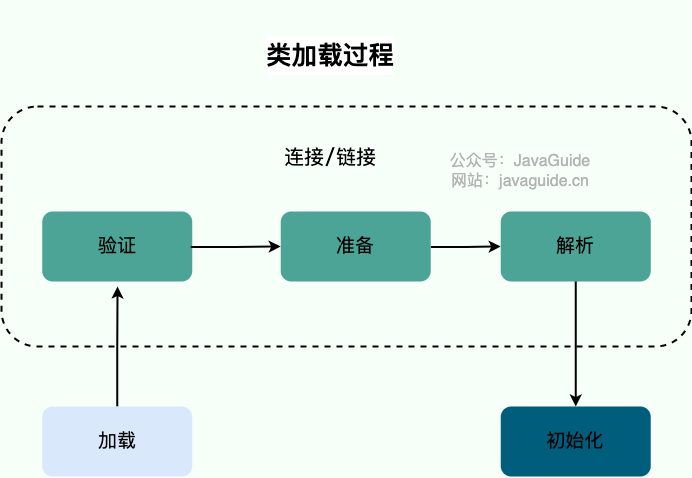
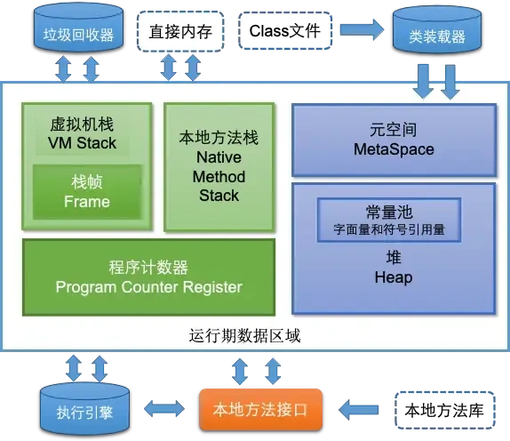
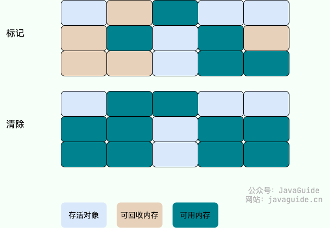
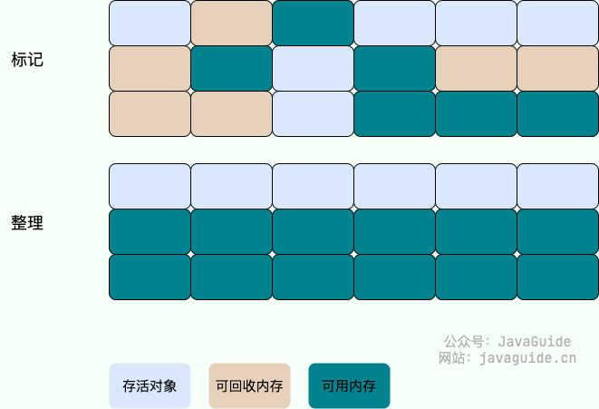

# JVM

[基于jdk17的JVM GC配置详解](https://blog.csdn.net/qq_27027927/article/details/133928425)

[Spring Boot应用性能优化：深入JVM调优与线程池配置实战](https://blog.csdn.net/2501_91980039/article/details/148027328)

## 1. 字节码篇


## 2. 类的加载篇

### 类加载过程

系统加载 Class 类型的文件主要三步：**加载->连接->初始化**。连接过程又可分为三步：**验证->准备->解析**。



#### 加载

类加载过程的第一步，主要完成下面 3 件事情：

1. 通过全类名获取定义此类的二进制字节流。
2. 将字节流所代表的静态存储结构转换为方法区的运行时数据结构。
3. 在内存中生成一个代表该类的 `Class` 对象，作为方法区这些数据的访问入口。

加载这一步主要是通过我们后面要讲到的 **类加载器** 完成的。类加载器有很多种，当我们想要加载一个类的时候，具体是哪个类加载器加载由 **双亲委派模型** 决定（不过，我们也能打破双亲委派模型）。

每个 Java 类都有一个引用指向加载它的 `ClassLoader`。不过，数组类不是通过 `ClassLoader` 创建的，而是 JVM 在需要的时候自动创建的，数组类通过`getClassLoader()`方法获取 `ClassLoader` 的时候和该数组的元素类型的 `ClassLoader` 是一致的。

一个非数组类的加载阶段（加载阶段获取类的二进制字节流的动作）是可控性最强的阶段，这一步我们可以去完成还可以自定义类加载器去控制字节流的获取方式（重写一个类加载器的 `loadClass()` 方法）。

加载阶段与连接阶段的部分动作(如一部分字节码文件格式验证动作)是交叉进行的，加载阶段尚未结束，连接阶段可能就已经开始了。

#### 验证

验证是连接阶段的第一步，这一阶段的目的是确保 Class 文件的字节流中包含的信息符合《Java 虚拟机规范》的全部约束要求，保证这些信息被当作代码运行后不会危害虚拟机自身的安全。

验证阶段这一步在整个类加载过程中耗费的资源还是相对较多的，但很有必要，可以有效防止恶意代码的执行。任何时候，程序安全都是第一位。

不过，验证阶段也不是必须要执行的阶段。如果程序运行的全部代码(包括自己编写的、第三方包中的、从外部加载的、动态生成的等所有代码)都已经被反复使用和验证过，在生产环境的实施阶段就可以考虑使用 `-Xverify:none` 参数来关闭大部分的类验证措施，以缩短虚拟机类加载的时间。但是需要注意的是 `-Xverify:none` 和 `-noverify` 在 JDK 13 中被标记为 deprecated ，在未来版本的 JDK 中可能会被移除。

验证阶段主要由四个检验阶段组成：

1. 文件格式验证（Class 文件格式检查）
2. 元数据验证（字节码语义检查）
3. 字节码验证（程序语义检查）
4. 符号引用验证（类的正确性检查）

#### 准备

**准备阶段是正式为类变量分配内存并设置类变量初始值的阶段**，这些内存都将在方法区中分配。对于该阶段有以下几点需要注意：

1. 这时候进行内存分配的仅包括类变量（ Class Variables ，即静态变量，被 `static` 关键字修饰的变量，只与类相关，因此被称为类变量），而不包括实例变量。实例变量会在对象实例化时随着对象一块分配在 Java 堆中。

2. 从概念上讲，类变量所使用的内存都应当在 **方法区** 中进行分配。不过有一点需要注意的是：JDK 7 之前，HotSpot 使用永久代来实现方法区的时候，实现是完全符合这种逻辑概念的。 而在 JDK 7 及之后，HotSpot 已经把原本放在永久代的字符串常量池、静态变量等移动到堆中，这个时候类变量则会随着 Class 对象一起存放在 Java 堆中。

3. 这里所设置的初始值"通常情况"下是数据类型默认的零值（如 0、0L、null、false 等），比如我们定义了`public static int value=111` ，那么 value 变量在准备阶段的初始值就是 0 而不是 111（初始化阶段才会赋值）。特殊情况：比如给 value 变量加上了 final 关键字`public static final int value=111` ，那么准备阶段 value 的值就被赋值为 111。

#### 解析

**解析阶段是虚拟机将常量池内的符号引用替换为直接引用的过程。** 解析动作主要针对类或接口、字段、类方法、接口方法、方法类型、方法句柄和调用限定符 7 类符号引用进行。

#### 初始化

**初始化阶段是执行初始化方法 `<clinit> ()`方法的过程，是类加载的最后一步，这一步 JVM 才开始真正执行类中定义的 Java 程序代码(字节码)。**

### 双亲委派模型的执行流程

双亲委派模型的实现代码都集中在 `java.lang.ClassLoader` 的 `loadClass()` 中，相关代码如下所示。

```java
protected Class<?> loadClass(String name, boolean resolve)
    throws ClassNotFoundException
{
    synchronized (getClassLoadingLock(name)) {
        //首先，检查该类是否已经加载过
        Class c = findLoadedClass(name);
        if (c == null) {
            //如果 c 为 null，则说明该类没有被加载过
            long t0 = System.nanoTime();
            try {
                if (parent != null) {
                    //当父类的加载器不为空，则通过父类的loadClass来加载该类
                    c = parent.loadClass(name, false);
                } else {
                    //当父类的加载器为空，则调用启动类加载器来加载该类
                    c = findBootstrapClassOrNull(name);
                }
            } catch (ClassNotFoundException e) {
                //非空父类的类加载器无法找到相应的类，则抛出异常
            }

            if (c == null) {
                //当父类加载器无法加载时，则调用findClass方法来加载该类
                //用户可通过覆写该方法，来自定义类加载器
                long t1 = System.nanoTime();
                c = findClass(name);

                //用于统计类加载器相关的信息
                sun.misc.PerfCounter.getParentDelegationTime().addTime(t1 - t0);
                sun.misc.PerfCounter.getFindClassTime().addElapsedTimeFrom(t1);
                sun.misc.PerfCounter.getFindClasses().increment();
            }
        }
        if (resolve) {
            //对类进行link操作
            resolveClass(c);
        }
        return c;
    }
}
```

每当一个类加载器接收到加载请求时，它会先将请求转发给父类加载器。在父类加载器没有找到所请求的类的情况下，该类加载器才会尝试去加载。

结合上面的源码，简单总结一下双亲委派模型的执行流程：

- 在类加载的时候，系统会首先判断当前类是否被加载过。已经被加载的类会直接返回，否则才会尝试加载（每个父类加载器都会走一遍这个流程）。
- 类加载器在进行类加载的时候，它首先不会自己去尝试加载这个类，而是把这个请求委派给父类加载器去完成（调用父加载器 `loadClass()`方法来加载类）。这样的话，所有的请求最终都会传送到顶层的**启动类加载器** `BootstrapClassLoader` 中。
- 只有当父加载器反馈自己无法完成这个加载请求（它的搜索范围中没有找到所需的类）时，子加载器才会尝试自己去加载（调用自己的 `findClass()` 方法来加载类）。
- 如果子类加载器也无法加载这个类，那么它会抛出一个 `ClassNotFoundException` 异常。

### 双亲委派模型的好处

双亲委派模型是 Java 类加载机制的重要组成部分，它通过委派父加载器优先加载类的方式，实现了**两个关键的安全目标**：避免类的重复加载和防止核心 API 被篡改。

JVM 区分不同类的依据是类名加上加载该类的类加载器，即使类名相同，如果由不同的类加载器加载，也会被视为不同的类。 双亲委派模型确保核心类总是由 `BootstrapClassLoader` 加载，保证了核心类的唯一性。

例如，当应用程序尝试加载 `java.lang.Object` 时，`AppClassLoader` 会首先将请求委派给 `ExtClassLoader`，`ExtClassLoader` 再委派给 `BootstrapClassLoader`。`BootstrapClassLoader` 会在 JRE 核心类库中找到并加载 `java.lang.Object`，从而保证应用程序使用的是 JRE 提供的标准版本。

有很多小伙伴就要说了：“那我绕过双亲委派模型不就可以了么？”。

然而，即使攻击者绕过了双亲委派模型，Java 仍然具备更底层的安全机制来保护核心类库。`ClassLoader` 的 `preDefineClass` 方法会在定义类之前进行类名校验。任何以 `"java."` 开头的类名都会触发 `SecurityException`，阻止恶意代码定义或加载伪造的核心类。

## 3. 运行时内存篇

###  JVM的内存模型介绍一下

> 美的二面、北森一面

根据JDK 8规范，JVM运行时内存共分为**虚拟机栈、堆、元空间、程序计数器、本地方法栈**五个部分。还有一部分内存叫直接内存，属于操作系统的本地内存，也是可以直接操作的。



JVM的内存结构主要分为以下几个部分：

- **程序计数器**：可以看作是当前线程所执行的字节码的**行号指示器**，用于存储当前线程正在执行的Java方法的JVM指令地址。如果线程执行的是Native方法，计数器值为null。是唯一一个在Java虚拟机规范中没有规定任何OutOfMemoryError情况的区域，生命周期与线程相同。

- **Java虚拟机栈**：每个线程都有自己的Java虚拟机栈，生命周期与线程相同。每个方法在执行时都会创建一个**栈帧**，用于存储局部变量表、操作数栈、动态链接、方法出口等信息。可能会抛出StackOverflowError和OutOfMemoryError异常。

- **本地方法栈**：与Java虚拟机栈类似，主要为虚拟机使用的Native方法服务，在HotSpot虚拟机中和Java虚拟机栈合二为一。本地方法执行时也会出现StackOverflowError和OutOfMemoryError两种错误。

- **Java堆**：JVM中最大的一块内存区域，被所有线程共享，在虚拟机启动时创建，用于存放对象实例。从内存回收角度，堆被划分为新生代和老年代，新生代又分为Eden区和两个Survivor区（From Survivor和To Survivor）。如果在堆中没有内存完成实例分配，并且堆也无法扩展时会抛出OutOfMemoryError异常。

- **方法区（元空间）**：在JDK 1.8及以后的版本中，方法区被元空间取代，使用本地内存。用于存储已被虚拟机加载的**类信息、常量、静态变量**等数据。虽然方法区被描述为**堆的逻辑部分**，但有“非堆”的别名。方法区可以选择不实现垃圾收集，内存不足时会抛出OutOfMemoryError异常。

- **运行时常量池**：是方法区的一部分，用于存放编译期生成的各种字面量和符号引用，具有动态性，运行时也可将新的常量放入池中。当无法申请到足够内存时，**会抛出OutOfMemoryError异常**。

- **直接内存**：不属于JVM运行时数据区的一部分，通过NIO类引入，是一种堆外内存，可以显著提高I/O性能。直接内存的使用受到本机总内存的限制，若分配不当，可能导致OutOfMemoryError异常。

###  JVM内存模型里的堆和栈有什么区别？

> 美的二面

- **用途**：
  - 栈主要用于存储局部变量、方法调用的参数、方法返回地址以及一些临时数据。每当一个方法被调用，一个栈帧（stack frame）就会在栈中创建，用于存储该方法的信息，当方法执行完毕，栈帧也会被移除。
  - 堆用于存储对象的实例（包括类的实例和数组）。当你使用`new`关键字创建一个对象时，对象的实例就会在堆上分配空间。
- **生命周期**：
  - 栈中的数据具有确定的生命周期，当一个方法调用结束时，其对应的栈帧就会被销毁，栈中存储的局部变量也会随之消失。
  - 堆中的对象生命周期不确定，对象会在垃圾回收机制检测到对象不再被引用时才被回收。
- **存取速度**：
  - 栈的存取速度通常比堆快，因为栈遵循先进后出的原则，操作简单快速。
  - 堆的存取速度相对较慢，因为对象在堆上的分配和回收需要更多的时间，而且垃圾回收机制的运行也会影响性能。
- **存储空间**：
  - 栈的空间相对较小，且固定，由操作系统管理。当栈溢出时，通常是因为递归过深或局部变量过大。
  - 堆的空间较大，动态扩展，由JVM管理。堆溢出通常是由于创建了太多的大对象或未能及时回收不再使用的对象。
- **可见性**：
  - 栈中的数据对线程是私有的，每个线程有自己的栈空间。
  - 堆中的数据对线程是共享的，所有线程都可以访问堆上的对象。

### 堆分为哪几部分呢

Java堆（Heap）是 JVM 中内存管理的一个重要区域，主要用于存放对象实例和数组。随着JVM的发展和不同垃圾收集器的实现，堆的具体划分可能会有所不同，但通常可以分为以下几个部分：


- 新生代（Young Generation）:新生代分为Eden Space和Survivor Space。
  - 在**Eden Space**中， 大多数新创建的对象首先存放在这里。Eden区相对较小，当Eden区满时，会触发一次Minor GC（新生代垃圾回收）。
  - 在**Survivor Spaces**中，通常分为两个相等大小的区域，称为S0（Survivor 0）和S1（Survivor 1）。在每次Minor GC后，存活下来的对象会被移动到其中一个Survivor空间，以继续它们的生命周期。这两个区域轮流充当对象的中转站，帮助区分短暂存活的对象和长期存活的对象。

- 老年代（Old Generation/Tenured Generation）：存放过一次或多次Minor GC仍存活的对象会被移动到老年代。老年代中的对象生命周期较长，因此Major GC（也称为Full GC，涉及老年代的垃圾回收）发生的频率相对较低，但其执行时间通常比Minor GC长。老年代的空间通常比新生代大，以存储更多的长期存活对象。

- 元空间（Metaspace）:从Java 8开始，永久代（Permanent Generation）被元空间取代，用于存储类的元数据信息，如类的结构信息（如字段、方法信息等）。元空间并不在Java堆中，而是使用本地内存，这解决了永久代容易出现的内存溢出问题。

- 大对象区（Large Object Space / Humongous Objects）:在某些JVM实现中（如**G1垃圾收集器**），为大对象分配了专门的区域，称为大对象区或Humongous Objects区域。大对象是指需要大量连续内存空间的对象，如大数组。这类对象直接分配在**老年代**，以避免因频繁的年轻代晋升而导致的内存碎片化问题。

###  内存泄漏和内存溢出的理解？

> 北森一面

**内存泄露**：内存泄漏是指程序在运行过程中不再使用的对象仍然被引用，而无法被垃圾收集器回收，从而导致可用内存逐渐减少。虽然在Java中，垃圾回收机制会自动回收不再使用的对象，但如果有对象仍被不再使用的引用持有，垃圾收集器无法回收这些内存，最终可能导致程序的内存使用不断增加。

内存泄露常见原因：

- **静态集合**：使用静态数据结构（如`HashMap`或`ArrayList`）存储对象，且未清理。
- **事件监听**：未取消对事件源的监听，导致对象持续被引用。
- **线程**：未停止的线程可能持有对象引用，无法被回收。

内存溢出：内存溢出是指Java虚拟机（JVM）在申请内存时，无法找到足够的内存，最终引发`OutOfMemoryError`。这通常发生在堆内存不足以存放新创建的对象时。

内存溢出常见原因：

- **大量对象创建**：程序中不断创建大量对象，超出JVM堆的限制。
- **持久引用**：大型数据结构（如缓存、集合等）长时间持有对象引用，导致内存累积。
- **递归调用**：深度递归导致栈溢出。

## 4. 对象内存布局

## 5. 执行引擎篇

## 6. 垃圾回收篇

###  判断垃圾的方法有哪些？

> 北森一面

在Java中，判断对象是否为垃圾（即不再被使用，可以被垃圾回收器回收）主要依据两种主流的垃圾回收算法来实现：引用计数法和可达性分析算法。

**引用计数法（Reference Counting）**

- 原理：为每个对象分配一个引用计数器，每当有一个地方引用它时，计数器加1；当引用失效时，计数器减1。当计数器为0时，表示对象不再被任何变量引用，可以被回收。

- 缺点：不能解决**循环引用**的问题，即两个对象相互引用，但不再被其他任何对象引用，这时引用计数器不会为0，导致对象无法被回收。

**可达性分析算法（Reachability Analysis）**


Java虚拟机主要采用此算法来判断对象是否为垃圾。

- 原理：从一组称为 **GC Roots**（垃圾收集根）的对象出发，向下追溯它们引用的对象，以及这些对象引用的其他对象，以此类推。如果一个对象到GC Roots没有任何引用链相连（即从GC Roots到这个对象不可达），那么这个对象就被认为是不可达的，可以被回收。
- GC Roots对象包括：虚拟机栈（栈帧中的本地变量表）中引用的对象、方法区中类静态属性引用的对象、本地方法栈中JNI（Java Native Interface）引用的对象、活跃线程的引用等。

### 引用类型总结

> 招银一面、北森云AI面

无论是通过引用计数法判断对象引用数量，还是通过可达性分析法判断对象的引用链是否可达，判定对象的存活都与“引用”有关。

**1．强引用（StrongReference）**

强引用实际上就是程序代码中普遍存在的引用赋值，这是使用最普遍的引用，其代码如下

```java
String strongReference = new String("abc");
```

如果一个对象具有强引用，那就类似于**必不可少的生活用品**，垃圾回收器绝不会回收它。当内存空间不足，Java 虚拟机宁愿抛出 OutOfMemoryError 错误，使程序异常终止，也不会靠随意回收具有强引用的对象来解决内存不足问题。

**2．软引用（SoftReference）**

如果一个对象只具有软引用，那就类似于**可有可无的生活用品**。软引用代码如下

```java
// 软引用
String str = new String("abc");
SoftReference<String> softReference = new SoftReference<String>(str);
```

如果内存空间足够，垃圾回收器就不会回收它，**如果内存空间不足了**，就会回收这些对象的内存。只要垃圾回收器没有回收它，该对象就可以被程序使用。软引用可用来实现内存敏感的**高速缓存**。

软引用可以和一个**引用队列（ReferenceQueue）**联合使用，如果软引用所引用的对象被垃圾回收，JAVA 虚拟机就会把这个软引用加入到与之关联的引用队列中。

**3．弱引用（WeakReference）**

如果一个对象只具有弱引用，那就类似于可有可无的生活用品。弱引用代码如下：

```java
String str = new String("abc");
WeakReference<String> weakReference = new WeakReference<>(str);
str = null; //str变成软引用，可以被收集
```

弱引用与软引用的区别在于：只具有弱引用的对象拥有**更短暂的生命周期**。在垃圾回收器线程扫描它所管辖的内存区域的过程中，一旦发现了只具有弱引用的对象，**不管当前内存空间足够与否**，都会回收它的内存。不过，由于垃圾回收器是一个优先级很低的线程， 因此不一定会很快发现那些只具有弱引用的对象。

弱引用可以和一个引用队列（ReferenceQueue）联合使用，如果弱引用所引用的对象被垃圾回收，Java 虚拟机就会把这个弱引用加入到与之关联的引用队列中。

**4．虚引用（PhantomReference）**

"虚引用"顾名思义，就是形同虚设，与其他几种引用都不同，虚引用并不会决定对象的生命周期。如果一个对象仅持有虚引用，那么它就和没有任何引用一样，在任何时候都可能被垃圾回收。虚引用代码如下：

```java
String str = new String("abc");
ReferenceQueue queue = new ReferenceQueue();
// 创建虚引用，要求必须与一个引用队列关联
PhantomReference pr = new PhantomReference(str, queue);
```

虚引用主要用来**跟踪对象被垃圾回收的活动**。

**虚引用与软引用和弱引用的一个区别在于：** 虚引用必须和引用队列（ReferenceQueue）联合使用。当垃圾回收器准备回收一个对象时，如果发现它还有虚引用，就会在回收对象的内存之前，把这个虚引用加入到与之关联的引用队列中。程序可以通过判断引用队列中是否已经加入了虚引用，来了解被引用的对象是否将要被垃圾回收。程序如果发现某个虚引用已经被加入到引用队列，那么就可以在所引用的对象的内存被回收之前采取必要的行动。

特别注意，在程序设计中一般很少使用弱引用与虚引用，使用软引用的情况较多，这是因为**软引用可以加速 JVM 对垃圾内存的回收速度，可以维护系统的运行安全，防止内存溢出（OutOfMemory）等问题的产生**。

## 垃圾收集算法

> 北森一面

### 标记-清除算法

标记-清除（Mark-and-Sweep）算法分为“标记（Mark）”和“清除（Sweep）”阶段：首先标记出所有不需要回收的对象，在标记完成后统一回收掉所有没有被标记的对象。

它是**最基础的收集算法**，后续的算法都是对其不足进行改进得到。这种垃圾收集算法会带来两个明显的问题：

1. **效率问题**：标记和清除两个过程效率都不高。
2. **空间问题**：标记清除后会产生大量不连续的内存碎片。



关于具体是标记可回收对象（不可达对象）还是不可回收对象（可达对象），众说纷纭，两种说法其实都没问题，我个人更倾向于是后者。

如果按照前者的理解，整个标记-清除过程大致是这样的：

1. 当一个对象被创建时，给一个标记位，假设为 0 (false)；
2. 在标记阶段，我们将所有可达对象（或用户可以引用的对象）的标记位设置为 1 (true)；
3. 扫描阶段清除的就是标记位为 0 (false)的对象。

### 复制算法

为了解决标记-清除算法的效率和内存碎片问题，复制（Copying）收集算法出现了。它可以将内存分为大小相同的两块，每次使用其中的一块。当这一块的内存使用完后，就将**还存活的对象**复制到另一块去，然后再把使用的空间一次清理掉。这样就使每次的内存回收都是对内存区间的一半进行回收。


虽然改进了标记-清除算法，但依然存在下面这些问题：

- 可用内存变小：可用内存缩小为原来的一半。
- **不适合老年代**：如果存活对象数量比较大，复制性能会变得很差。

### 标记-整理算法

标记-整理（Mark-and-Compact）算法是根据老年代的特点提出的一种标记算法，标记过程仍然与“标记-清除”算法一样，但后续步骤不是直接对可回收对象回收，而是让所有存活的对象向一端移动，然后直接清理掉端边界以外的内存。



由于多了整理这一步，因此效率也不高，**适合老年代**这种垃圾回收频率不是很高的场景。

### 分代收集算法

当前虚拟机的垃圾收集都采用分代收集算法，这种算法没有什么新的思想，只是根据对象存活周期的不同将内存分为几块。一般将 Java 堆分为新生代和老年代，这样我们就可以根据各个年代的特点选择合适的垃圾收集算法。

比如在新生代中，每次收集都会有大量对象死去，所以可以选择“复制”算法，只需要付出少量对象的复制成本就可以完成每次垃圾收集。而老年代的对象存活几率是比较高的，而且没有额外的空间对它进行分配担保，所以我们必须选择“标记-清除”或“标记-整理”算法进行垃圾收集。

**延伸面试问题：** HotSpot 为什么要分为新生代和老年代？

### 垃圾回收器有哪些

#### Serial 收集器

#### ParNew 收集器

ParNew 收集器其实就是 Serial 收集器的**多线程版本**，除了使用多线程进行垃圾收集外，其余行为（控制参数、收集算法、回收策略等等）和 Serial 收集器完全一样。

#### Parallel Scavenge 收集器

#### Serial Old 收集器

#### Parallel Old 收集器

#### CMS 收集器

CMS（Concurrent Mark Sweep）收集器是一种以获取最短回收停顿时间为目标的收集器。它非常符合在注重用户体验的应用上使用。

整个过程分为四个步骤：

- **初始标记：** 短暂停顿，标记直接与 **root** 相连的对象（根对象）；
- **并发标记：** 同时开启 GC 和用户线程，用一个**闭包结构**去记录可达对象。但在这个阶段结束，这个闭包结构并不能保证包含当前所有的可达对象。因为用户线程可能会不断的更新引用域，所以 GC 线程无法保证可达性分析的实时性。所以这个算法里会跟踪记录这些发生引用更新的地方。
- **重新标记：** 重新标记阶段就是为了修正并发标记期间因为用户程序继续运行而导致标记产生变动的那一部分对象的标记记录，这个阶段的停顿时间一般会比初始标记阶段的时间稍长，远远比并发标记阶段时间短
- **并发清除：** 开启用户线程，同时 GC 线程开始对未标记的区域做清扫。


#### G1 收集器

G1 (Garbage-First) 是一款面向服务器的垃圾收集器，主要针对配备多颗处理器及大容量内存的机器。以极高概率满足 GC 停顿时间要求的同时，还具备高吞吐量性能特征。

被视为 JDK1.7 中 HotSpot 虚拟机的一个重要进化特征。它具备以下特点：

- **并行与并发**：G1 能充分利用 CPU、多核环境下的硬件优势，使用多个 CPU（CPU 或者 CPU 核心）来缩短 Stop-The-World 停顿时间。部分其他收集器原本需要停顿 Java 线程执行的 GC 动作，G1 收集器仍然可以通过并发的方式让 java 程序继续执行。
- **分代收集**：虽然 G1 可以不需要其他收集器配合就能独立管理整个 GC 堆，但是还是保留了分代的概念。
- **空间整合**：与 CMS 的“标记-清除”算法不同，G1 从整体来看是基于“**标记-整理**”算法实现的收集器；从局部上来看是基于“标记-复制”算法实现的。
- **可预测的停顿**：这是 G1 相对于 CMS 的另一个大优势，降低停顿时间是 G1 和 CMS 共同的关注点，但 G1 除了追求低停顿外，还能建立可预测的停顿时间模型，能让使用者明确指定在一个长度为 M 毫秒的时间片段内，消耗在垃圾收集上的时间不得超过 N 毫秒。

G1 收集器的运作大致分为以下几个步骤：

- **初始标记**： 短暂停顿（Stop-The-World，STW），标记从 GC Roots 可直接引用的对象，即标记所有直接可达的活跃对象
- **并发标记**：与应用并发运行，标记所有可达对象。 这一阶段可能持续较长时间，取决于堆的大小和对象的数量。
- **最终标记**： 短暂停顿（STW），处理并发标记阶段结束后残留的少量未处理的引用变更。
- **筛选回收**：根据标记结果，选择回收价值高的区域，复制存活对象到新区域，回收旧区域内存。这一阶段包含一个或多个停顿（STW），具体取决于回收的复杂度。

**G1 收集器在后台维护了一个优先列表，每次根据允许的收集时间，优先选择回收价值最大的 Region(这也就是它的名字 Garbage-First 的由来)** 。这种使用 Region 划分内存空间以及有优先级的区域回收方式，保证了 G1 收集器在有限时间内可以尽可能高的收集效率（把内存化整为零）。

**从 JDK9 开始，G1 垃圾收集器成为了默认的垃圾收集器。**

#### ZGC 收集器

与 CMS、ParNew 和 G1 类似，ZGC 也采用标记-复制算法，不过 ZGC 对该算法做了重大改进。

ZGC 可以**将暂停时间控制在几毫秒以内**，且暂停时间不受堆内存大小的影响，出现 Stop The World 的情况会更少，但代价是牺牲了一些吞吐量。ZGC **最大支持 16TB 的堆内存**。

ZGC 在 Java11 中引入，处于试验阶段。经过多个版本的迭代，不断的完善和修复问题，ZGC 在 Java15 已经可以正式使用了。

不过，默认的垃圾回收器依然是 G1。你可以通过下面的参数启用 ZGC：

```bash
java -XX:+UseZGC className
```

在 Java21 中，引入了分代 ZGC，暂停时间可以缩短到 1 毫秒以内。

你可以通过下面的参数启用分代 ZGC：

```bash
java -XX:+UseZGC -XX:+ZGenerational className
```

### minorGC、majorGC、fullGC的区别，什么场景触发full GC

> 科大讯飞

**Minor GC (Young GC)**

作用范围：只针对年轻代进行回收，包括Eden区和两个Survivor区（S0和S1）。

触发条件：当Eden区空间不足时，JVM会触发一次Minor GC，将Eden区和一个Survivor区中的存活对象移动到另一个Survivor区或老年代（Old Generation）。

特点：通常发生得非常频繁，因为年轻代中对象的生命周期较短，回收效率高，暂停时间相对较短。

**Major GC**

作用范围：主要针对老年代进行回收，但不一定只回收老年代。

**full GC**

作用范围：对**整个堆内存**（包括年轻代、老年代以及永久代/元空间）进行回收。

触发条件：

- 直接调用`System.gc()`或`Runtime.getRuntime().gc()`方法时，虽然不能保证立即执行，但JVM会尝试执行Full GC。
- Minor GC（新生代垃圾回收）时，如果存活的对象无法全部放入老年代，或者老年代空间不足以容纳存活的对象，则会触发Full GC，对整个堆内存进行回收。
- 当永久代（Java 8之前的版本）或元空间（Java 8及以后的版本）空间不足时。

## 7. JVM性能监控篇

#### 内存监控

JConsole 可以显示当前内存的详细信息。不仅包括堆内存/非堆内存的整体信息，还可以细化到 eden 区、survivor 区等的使用情况，如下图所示。

点击右边的“执行 GC(G)”按钮可以强制应用程序执行一个 Full GC。

- **新生代 GC（Minor GC）**:指发生新生代的的垃圾收集动作，Minor GC 非常频繁，回收速度一般也比较快。

- **老年代 GC（Major GC/Full GC）**:指发生在老年代的 GC，出现了 Major GC 经常会伴随至少一次的 Minor GC（并非绝对），Major GC 的速度一般会比 Minor GC 的慢 10 倍以上。


## 8. JVM性能调优案例篇

### 步骤


### 案例

#### 案例1

调整堆大小提高服务的吞吐量

## 参数

