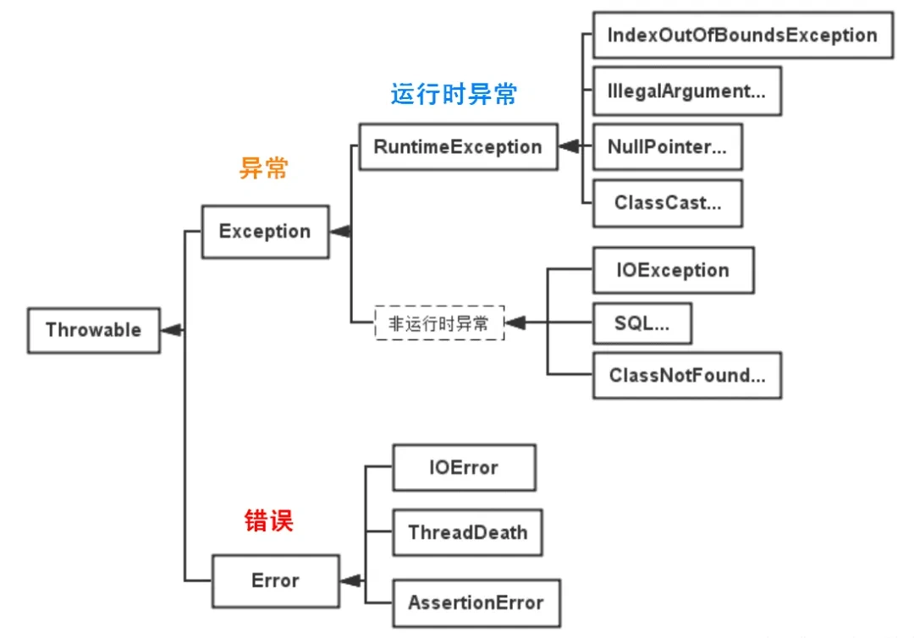
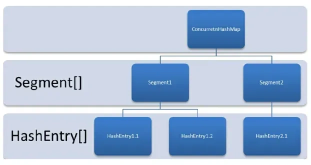

# Java

## 基础

###  Java 中 final 作用是什么？

final 关键字主要有以下三个方面的作用：

- 修饰类：当 final 修饰一个类时，表示这个类不能被继承，是类继承体系中的最终形态。
  - 例如，**String 类**就是用 final 修饰的，这保证了 String 类的不可变性和安全性，防止其他类通过继承来改变 String 类的行为和特性。

- 修饰方法：用 final 修饰的方法不能在子类中被重写。
  - 例如，**java.lang.Object 类中的 getClass 方法**就是 final 的，因为这个方法的行为是由 Java 虚拟机底层实现来保证的，不应该被子类修改。

- 修饰变量：
  - 当 final 修饰基本数据类型的变量时，该变量一旦被赋值就不能再改变。例如，final int num = 10;，这里的 num 就是一个常量，不能再对其进行重新赋值操作，否则会导致编译错误。
  - 对于引用数据类型，final 修饰意味着这个引用变量不能再指向其他对象，**但对象本身的内容是可以改变的**。例如，final StringBuilder sb = new StringBuilder("Hello");，不能让 sb 再指向其他 StringBuilder 对象，但可以通过 sb.append(" World"); 来修改字符串的内容。

### ⭐️面向对象三大特征

#### 封装

封装是指把一个对象的**状态信息（也就是属性）**隐藏在对象内部，不允许外部对象直接访问对象的内部信息。但是可以提供一些可以被外界访问的方法来操作属性。就好像我们看不到挂在墙上的空调的内部的零件信息（也就是属性），但是可以通过遥控器（方法）来控制空调。如果属性不想被外界访问，我们大可不必提供方法给外界访问。但是如果一个类没有提供给外界访问的方法，那么这个类也没有什么意义了。就好像如果没有空调遥控器，那么我们就无法操控空凋制冷，空调本身就没有意义了（当然现在还有很多其他方法 ，这里只是为了举例子）。

#### 继承

不同类型的对象，相互之间经常有一定数量的共同点。例如，小明同学、小红同学、小李同学，都共享学生的特性（班级、学号等）。同时，每一个对象还定义了额外的特性使得他们与众不同。例如小明的数学比较好，小红的性格惹人喜爱；小李的力气比较大。**继承**是使用已存在的类的定义作为基础建立新类的技术，新类的定义可以增加新的数据或新的功能，也可以用父类的功能，但不能选择性地继承父类。通过使用继承，可以快速地创建新的类，可以提高代码的重用，程序的可维护性，节省大量创建新类的时间 ，提高我们的开发效率。

**关于继承如下 3 点请记住：**

1. 子类拥有父类对象所有的属性和方法（包括私有属性和私有方法），但是父类中的私有属性和方法子类是无法访问，**只是拥有**。
2. 子类可以拥有自己属性和方法，即子类可以对父类进行扩展。
3. 子类可以用自己的方式实现父类的方法。（以后介绍）。

#### 多态

多态，顾名思义，表示一个对象具有多种的状态，具体表现为**父类的引用指向子类的实例**。

**多态的特点:**

- 对象类型和引用类型之间具有继承（类）/实现（接口）的关系；
- 引用类型变量发出的方法调用的到底是哪个类中的方法，必须在程序运行期间才能确定；
- 多态不能调用“只在子类存在但在父类不存在”的方法；
- 如果子类重写了父类的方法，真正执行的是子类重写的方法，如果子类没有重写父类的方法，执行的是父类的方法。

#### 接口和抽象类的区别

- **设计目的**：接口主要用于对类的行为进行约束，你实现了某个接口就具有了对应的行为。抽象类主要用于代码复用，强调的是所属关系。
- **继承和实现**：一个类只能继承一个类（包括抽象类），因为 Java 不支持多继承。但一个类可以实现多个接口，一个接口也可以继承多个其他接口。
- **成员变量**：接口中的成员变量只能是 `public static final` 类型的，不能被修改且必须有初始值。抽象类的成员变量可以有任何修饰符（`private`, `protected`, `public`），可以在子类中被重新定义或赋值。
- 方法： 
  - Java 8 之前，接口中的方法默认是 `public abstract` ，也就是只能有方法声明。自 Java 8 起，可以在接口中定义 `default`（默认） 方法和 `static` （静态）方法。 自 Java 9 起，接口可以包含 `private` 方法。
  - 抽象类可以包含抽象方法和非抽象方法。抽象方法没有方法体，必须在子类中实现。非抽象方法有具体实现，可以直接在抽象类中使用或在子类中重写。

### 深拷贝和浅拷贝区别了解吗？什么是引用拷贝？

关于深拷贝和浅拷贝区别 ：

- **浅拷贝**：浅拷贝会在堆上创建一个新的对象（区别于引用拷贝的一点），不过，如果原对象内部的属性是引用类型的话，浅拷贝会直接复制内部对象的引用地址，也就是说拷贝对象和原对象共用同一个内部对象。
- **深拷贝**：深拷贝会完全复制整个对象，包括这个对象所包含的内部对象。

#### 浅拷贝

浅拷贝的示例代码如下，我们这里实现了 `Cloneable` 接口，并重写了 `clone()` 方法。

`clone()` 方法的实现很简单，直接调用的是父类 `Object` 的 `clone()` 方法。

#### 深拷贝

这里我们简单对 `Person` 类的 `clone()` 方法进行修改，连带着要把 `Person` 对象内部的 `Address` 对象一起复制。

```java
@Override
public Person clone() {
    try {
        Person person = (Person) super.clone();
        person.setAddress(person.getAddress().clone());  // 深拷贝
        return person;
    } catch (CloneNotSupportedException e) {
        throw new AssertionError();
    }
}
```

### 实现深拷贝的三种方法是什么？

在 Java 中，实现对象深拷贝的方法有以下几种主要方式：

实现 Cloneable 接口并重写 clone() 方法

使用序列化和反序列化

手动递归复制

### 异常

#### 介绍一下Java异常

Java异常类层次结构图：



Java的异常体系主要基于两大类：**Throwable类**及其子类。Throwable有两个重要的子类：Error和Exception，它们分别代表了不同类型的异常情况。

1. **Error（错误）**：表示运行时环境的错误。错误是程序无法处理的严重问题，如系统崩溃、虚拟机错误、动态链接失败等。通常，程序不应该尝试捕获这类错误。例如，OutOfMemoryError、StackOverflowError等。

2. **Exception（异常）**：表示程序本身可以处理的异常条件。异常分为两大类：
   - **非运行时异常**：这类异常在编译时期就必须被捕获或者声明抛出。它们通常是外部错误，如文件不存在（FileNotFoundException）、类未找到（ClassNotFoundException）等。非运行时异常强制程序员处理这些可能出现的问题，增强了程序的健壮性。
   - **运行时异常**：这类异常包括运行时异常（RuntimeException）和错误（Error）。运行时异常由程序错误导致，如空指针访问（NullPointerException）、数组越界（ArrayIndexOutOfBoundsException）等。**运行时异常是不需要在编译时强制捕获或声明的。**

### 什么是反射？

简单来说，Java 反射 (Reflection) 是一种在程序运行时，动态地获取类的信息并操作类或对象（方法、属性）的能力。

```java
// 获取Class对象
Class<?> clazz = Class.forName("com.example.Person");
// 获取所有字段（包括继承的public字段）
Field[] fields = clazz.getFields();

// 获取所有声明的字段（不包括继承的字段）
Field[] declaredFields = clazz.getDeclaredFields();

// 获取指定字段
Field nameField = clazz.getDeclaredField("name");
```


### == 和 equals() 的区别

== 对于基本类型和引用类型的作用效果是不同的：

- 对于基本数据类型来说，`==` 比较的是值。
- 对于引用数据类型来说，`==` 比较的是对象的内存地址。

因为 Java 只有**值传递**，所以，对于 == 来说，不管是比较基本数据类型，还是引用数据类型的变量，其本质比较的都是值，只是引用类型变量存的值是对象的地址。

`equals()` 不能用于判断基本数据类型的变量，只能用来判断两个对象是否相等。`equals()`方法存在于 Object 类中，而`Object`类是所有类的直接或间接父类，因此所有的类都有`equals()`方法。

`Object` 类 `equals()` 方法：

```java
public boolean equals(Object obj) {
     return (this == obj);
}
```

`equals()` 方法存在两种使用情况：

- **类没有重写 `equals()`方法**：通过`equals()`比较该类的两个对象时，等价于通过“==”比较这两个对象，使用的默认是 Object 类`equals()`方法。
- **类重写了 `equals()`方法**：一般我们都重写 `equals()`方法来比较两个对象中的属性是否相等；若它们的属性相等，则返回 true(即，认为这两个对象相等)。

举个例子（这里只是为了举例。实际上，你按照下面这种写法的话，像 IDEA 这种比较智能的 IDE 都会提示你将 `==` 换成 `equals()` ）：

```java
String a = new String("ab"); // a 为一个引用
String b = new String("ab"); // b为另一个引用,对象的内容一样
String aa = "ab"; // 放在常量池中
String bb = "ab"; // 从常量池中查找
System.out.println(aa == bb);// true
System.out.println(a == b);// false
System.out.println(a.equals(b));// true
System.out.println(42 == 42.0);// true
```

String 中的 `equals` 方法是被重写过的，因为 `Object` 的 `equals` 方法是比较的对象的内存地址，而 String 的 `equals` 方法比较的是对象的值。

当创建 `String` 类型的对象时，虚拟机会在常量池中查找有没有已经存在的值和要创建的值相同的对象，如果有就把它赋给当前引用。如果没有就在常量池中重新创建一个 String 对象。

String 类`equals()`方法：

```java
public boolean equals(Object anObject) {
    if (this == anObject) {
        return true;
    }
    if (anObject instanceof String) {
        String anotherString = (String)anObject;
        int n = value.length;
        if (n == anotherString.value.length) {
            char v1[] = value;
            char v2[] = anotherString.value;
            int i = 0;
            while (n-- != 0) {
                if (v1[i] != v2[i])
                    return false;
                i++;
            }
            return true;
        }
    }
    return false;
}
```

### 为什么要有 hashCode？

其实， `hashCode()` 和 `equals()`都是用于比较两个对象是否相等。

**那为什么 JDK 还要同时提供这两个方法呢？**

这是因为在一些容器（比如 HashMap、HashSet）中，有了 `hashCode()` 之后，判断元素是否在对应容器中的效率会更高（参考添加元素进`HashSet`的过程）！

我们在前面也提到了添加元素进 HashSet 的过程，如果 HashSet 在对比的时候，同样的 `hashCode` 有多个对象，它会继续使用 `equals()` 来判断是否真的相同。也就是说 `hashCode` 帮助我们大大缩小了查找成本。

**那为什么不只提供 `hashCode()` 方法呢？**

这是因为两个对象的`hashCode` 值相等并不代表两个对象就相等。

**那为什么两个对象有相同的 `hashCode` 值，它们也不一定是相等的？**

因为 `hashCode()` 所使用的哈希算法也许刚好会让多个对象传回相同的哈希值。越糟糕的哈希算法越容易碰撞，但这也与数据值域分布的特性有关（所谓哈希碰撞也就是指的是不同的对象得到相同的 `hashCode` )。

总结下来就是：

- 如果两个对象的`hashCode` 值相等，那这两个对象不一定相等（哈希碰撞）。
- 如果两个对象的`hashCode` 值相等并且`equals()`方法也返回 `true`，我们才认为这两个对象相等。
- 如果两个对象的`hashCode` 值不相等，我们就可以直接认为这两个对象不相等。

相信大家看了我前面对 `hashCode()` 和 `equals()` 的介绍之后，下面这个问题已经难不倒你们了。

### ⭐️String、StringBuffer、StringBuilder 的区别？

**可变性**

`String` 是不可变的。

`StringBuilder` 与 `StringBuffer` 都继承自 `AbstractStringBuilder` 类，在 `AbstractStringBuilder` 中也是使用字符数组保存字符串，不过没有使用 `final` 和 `private` 关键字修饰，最关键的是这个 `AbstractStringBuilder` 类还提供了很多修改字符串的方法比如 `append` 方法。

**线程安全性**

`String` 中的对象是不可变的，也就可以理解为常量，线程安全。`AbstractStringBuilder` 是 `StringBuilder` 与 `StringBuffer` 的公共父类，定义了一些字符串的基本操作，如 `expandCapacity`、`append`、`insert`、`indexOf` 等公共方法。`StringBuffer` 对方法加了同步锁或者对调用的方法加了同步锁，所以是线程安全的。`StringBuilder` 并没有对方法进行加同步锁，所以是非线程安全的。

**性能**

每次对 `String` 类型进行改变的时候，都会生成一个新的 `String` 对象，然后将指针指向新的 `String` 对象。`StringBuffer` 每次都会对 `StringBuffer` 对象本身进行操作，而不是生成新的对象并改变对象引用。相同情况下使用 `StringBuilder` 相比使用 `StringBuffer` 仅能获得 10%~15% 左右的性能提升，但却要冒多线程不安全的风险。

**对于三者使用的总结：**

- 操作少量的数据: 适用 `String`
- 单线程操作字符串缓冲区下操作大量数据: 适用 `StringBuilder`
- 多线程操作字符串缓冲区下操作大量数据: 适用 `StringBuffer`


## 集合

### Java中有哪些集合类

 Java中的集合类分为4大类，分别由4个接口来代表，它们是Set、List、Queue、Map。其中，Set、List、Queue、都继承自Collection接口。

· Set代表无序的、元素不可重复的集合。

· List代表有序的、元素可以重复的集合。

· Queue代表先进先出（FIFO）的队列。

· Map代表具有映射关系（key-value）的集合。

 Java提供了众多集合的实现类，它们都是这些接口的直接或间接的实现类，其中比较常用的有：HashSet、TreeSet、ArrayList、LinkedList、ArrayDeque、HashMap、TreeMap等。

### Arrays.sorted怎么处理泛型？

通过使用Lambda表达式或Comparator，可以灵活地对泛型数组进行排序。

```java
// 使用Lambda表达式按升序排序
Arrays.sort(numbers, (a, b) -> a.compareTo(b));

// 使用Comparator按降序排序
Arrays.sort(numbers, new Comparator<Integer>() {
    @Override
    public int compare(Integer a, Integer b) {
        return b.compareTo(a);
    }
});
```


### List

####  ArrayList线程安全吗？把ArrayList变成线程安全有哪些方法？

> 笔试：小红书

不是线程安全的，ArrayList变成线程安全的方式有：

- 使用**Collections**类的synchronizedList方法将ArrayList包装成线程安全的List：

  ```java
  List<String> synchronizedList = Collections.synchronizedList(arrayList);
  ```

- 使用CopyOnWriteArrayList类代替ArrayList，它是一个线程安全的List实现：

  ```java
  CopyOnWriteArrayList copyOnWriteArrayList = new CopyOnWriteArrayList<>(arrayList)
  ```

- 使用Vector类代替ArrayList，Vector是线程安全的List实现：

  ```java
  Vector<String> vector = new Vector<>(arrayList);
  ```

### Arraylist 与 LinkedList 区别?

- **是否保证线程安全：**都是不同步的，也就是不保证线程安全；(Vector是线程安全的)
- **底层数据结构：** 
  - ArrayList 底层使用的是 **`Object` 数组**；

  - LinkedList 底层使用的是 **双向链表** 数据结构（JDK1.6 之前为循环链表，JDK1.7 取消了循环。注意双向链表和双向循环链表的区别，下面有介绍到！）

- **插入和删除是否受元素位置的影响：**
  - ArrayList 采用数组存储，所以插入和删除元素的时间复杂度受元素位置的影响。 比如：执行`add(E e)`方法的时候， ArrayList 会默认在将指定的元素追加到此列表的末尾，这种情况时间复杂度就是 O(1)。但是如果要在指定位置 i 插入和删除元素的话（`add(int index, E element)`），时间复杂度就为 O(n)。因为在进行上述操作的时候集合中第 i 和第 i 个元素之后的(n-i)个元素都要执行向后位/向前移一位的操作。

  - LinkedList 采用链表存储，所以在头尾插入或者删除元素不受元素位置的影响（`add(E e)`、`addFirst(E e)`、`addLast(E e)`、`removeFirst()`、 `removeLast()`），时间复杂度为 O(1)，如果是要在指定位置 `i` 插入和删除元素的话（`add(int index, E element)`，`remove(Object o)`,`remove(int index)`）， 时间复杂度为 O(n) ，因为需要先移动到指定位置再插入和删除。

- **是否支持快速随机访问：** LinkedList 不支持高效的随机元素访问，而 ArrayList（实现了 `RandomAccess` 接口） 支持。快速随机访问就是通过元素的序号快速获取元素对象(对应于`get(int index)`方法)。
- **内存空间占用：** 
  - ArrayList 的空间浪费主要体现在在 list 列表的结尾会预留一定的容量空间，
  - 而 LinkedList 的空间花费则体现在它的每一个元素都需要消耗比 ArrayList 更多的空间（因为要存放直接后继和直接前驱以及数据）。


### ⭐️说一说 ArrayList 的扩容机制吧

以无参数构造方法创建 ArrayList 时，实际上初始化赋值的是一个空数组。当真正对数组进行添加元素操作时，才真正分配容量。即向数组中添加第一个元素时，数组容量扩为 10。 

- 当我们要 `add` 进第 1 个元素到 ArrayList 时，`elementData.length` 为 0 （因为还是一个空的 list），因为执行了 `ensureCapacityInternal()` 方法 ，所以 `minCapacity` 此时为 10。此时，`minCapacity - elementData.length > 0`成立，所以会进入 `grow(minCapacity)` 方法。
- 当 `add` 第 2 个元素时，`minCapacity` 为 2，此时 `elementData.length`(容量)在添加第一个元素后扩容成 `10` 了。此时，`minCapacity - elementData.length > 0` 不成立，所以不会进入 （执行）`grow(minCapacity)` 方法。
- 添加第 3、4···到第 10 个元素时，依然不会执行 grow 方法，数组容量都为 10。

直到添加第 11 个元素，`minCapacity`(为 11)比 `elementData.length`（为 10）要大。进入 `grow` 方法进行扩容。

```java
/**
 * 要分配的最大数组大小
 */
private static final int MAX_ARRAY_SIZE = Integer.MAX_VALUE - 8;

/**
 * ArrayList扩容的核心方法。
 */
private void grow(int minCapacity) {
    // oldCapacity为旧容量，newCapacity为新容量
    int oldCapacity = elementData.length;
    // 将oldCapacity 右移一位，其效果相当于oldCapacity /2，
    // 我们知道位运算的速度远远快于整除运算，整句运算式的结果就是将新容量更新为旧容量的1.5倍，
    int newCapacity = oldCapacity + (oldCapacity >> 1);

    // 然后检查新容量是否大于最小需要容量，若还是小于最小需要容量，那么就把最小需要容量当作数组的新容量，
    if (newCapacity - minCapacity < 0)
        newCapacity = minCapacity;

    // 如果新容量大于 MAX_ARRAY_SIZE,进入(执行) `hugeCapacity()` 方法来比较 minCapacity 和 MAX_ARRAY_SIZE，
    // 如果minCapacity大于最大容量，则新容量则为`Integer.MAX_VALUE`，否则，新容量大小则为 MAX_ARRAY_SIZE 即为 `Integer.MAX_VALUE - 8`。
    if (newCapacity - MAX_ARRAY_SIZE > 0)
        newCapacity = hugeCapacity(minCapacity);

    // minCapacity is usually close to size, so this is a win:
    elementData = Arrays.copyOf(elementData, newCapacity);
}
```

`int newCapacity = oldCapacity + (oldCapacity >> 1)`，所以 ArrayList 每次扩容之后容量都会变为原来的 1.5 倍左右（oldCapacity 为偶数就是 1.5 倍，否则是 1.5 倍左右）！ 奇偶不同，比如：10+10/2 = 15, 33+33/2=49。如果是奇数的话会丢掉小数.

> ">>"（移位运算符）：>>1 右移一位相当于除 2，右移 n 位相当于除以 2 的 n 次方。这里 oldCapacity 明显右移了 1 位所以相当于 oldCapacity /2。对于大数据的 2 进制运算,位移运算符比那些普通运算符的运算要快很多,因为程序仅仅移动一下而已,不去计算,这样提高了效率,节省了资源

### System.arraycopy() 和 Arrays.copyOf()方法

阅读源码的话，我们就会发现 `ArrayList` 中大量调用了这两个方法。比如：我们上面讲的扩容操作以及`add(int index, E element)`、`toArray()` 等方法中都用到了该方法！

```java
    // 我们发现 arraycopy 是一个 native 方法,接下来我们解释一下各个参数的具体意义
    /**
    *   复制数组
    * @param src 源数组
    * @param srcPos 源数组中的起始位置
    * @param dest 目标数组
    * @param destPos 目标数组中的起始位置
    * @param length 要复制的数组元素的数量
    */
    public static native void arraycopy(Object src,  int  srcPos,
                                        Object dest, int destPos,
                                        int length);
```

## Queue

### Queue 与 Deque 的区别

> 算法题经常拿 Deque 当栈用

Queue 是单端队列，只能从一端插入元素，另一端删除元素，实现上一般遵循 **先进先出（FIFO）** 规则。

Queue 扩展了 `Collection` 的接口，根据 **因为容量问题而导致操作失败后处理方式的不同** 可以分为两类方法: 一种在操作失败后会抛出异常，另一种则会返回特殊值。

Deque 是双端队列，在队列的两端均可以插入或删除元素。

Deque 扩展了 `Queue` 的接口, 增加了在队首和队尾进行插入和删除的方法，同样根据失败后处理方式的不同分为两类：

事实上，Deque 还提供有 `push()` 和 `pop()` 等其他方法，可用于**模拟栈**。

### ArrayDeque 与 LinkedList 的区别

`ArrayDeque` 和 `LinkedList` 都实现了 **Deque** 接口，两者都具有队列的功能，但两者有什么区别呢？

- `ArrayDeque` 是基于可变长的数组和双指针来实现，而 `LinkedList` 则通过链表来实现。
- `ArrayDeque` 不支持存储 `NULL` 数据，但 `LinkedList` 支持。
- `ArrayDeque` 是在 JDK1.6 才被引入的，而`LinkedList` 早在 JDK1.2 时就已经存在。
- `ArrayDeque` 插入时可能存在扩容过程, 不过均摊后的插入操作依然为 O(1)。虽然 `LinkedList` 不需要扩容，但是每次插入数据时均需要申请新的堆空间，均摊性能相比更慢。

从性能的角度上，选用 `ArrayDeque` 来实现队列要比 `LinkedList` 更好。此外，`ArrayDeque` 也可以用于实现栈。

### 说一说 PriorityQueue

PriorityQueue 是在 JDK1.5 中被引入的, 其与 Queue 的区别在于元素出队顺序是与优先级相关的，即总是优先级最高的元素先出队。

这里列举其相关的一些要点：

- 利用了**二叉堆**的数据结构来实现的，底层使用可变长的数组来存储数据
- 通过堆元素的上浮和下沉，实现了在 O(logn) 的时间复杂度内插入元素和删除堆顶元素。
- 是非线程安全的，且不支持存储 `NULL` 和 `non-comparable` 的对象。
- 默认是**小顶堆**，但可以接收一个 `Comparator` 作为构造参数，从而来自定义元素优先级的先后。

PriorityQueue 在面试中可能更多的会出现在手撕算法的时候，典型例题包括堆排序、求第 K 大的数、带权图的遍历等，所以需要会熟练使用才行。

**常用方法**

- `add(E e)`：将指定元素插入队列，如果队列已满则抛出异常。
- `offer(E e)`：将指定元素插入队列，如果队列已满则返回 `false`。
- `peek()`：返回队列头部元素（优先级最高的元素），但不移除它。如果队列为空，则返回 `null`。
- `poll()`：移除并返回队列头部元素（优先级最高的元素）。如果队列为空，则返回 `null`。

## Map

### ⭐️HashMap 和 Hashtable 的区别

- **线程是否安全：** HashMap 是非线程安全的，Hashtable 是线程安全的，因为 Hashtable 内部的方法基本都经过`synchronized` 修饰。（如果你要保证线程安全的话就使用 `ConcurrentHashMap` 吧！）；

- **效率：** 因为线程安全的问题，HashMap 要比 Hashtable 效率高一点。另外，Hashtable 基本被淘汰，不要在代码中使用它；

- **对 Null key 和 Null value 的支持：** 
  - HashMap 可以存储 null 的 key 和 value，但 null 作为键只能有一个，null 作为值可以有多个；
  - Hashtable 不允许有 null 键和 null 值，否则会抛出 `NullPointerException`。

- **初始容量大小和每次扩充容量大小的不同：**

  - ① 创建时如果不指定容量初始值，Hashtable 默认的初始大小为 11，之后每次扩充，容量变为原来的 2n+1。HashMap 默认的初始化大小为 16。之后每次扩充，容量变为原来的 2 倍。

  - ② 创建时如果给定了容量初始值，那么 Hashtable 会直接使用你给定的大小，而 HashMap 会将其扩充为 2 的幂次方大小（HashMap 中的`tableSizeFor()`方法保证，下面给出了源代码）。也就是说 HashMap 总是使用 2 的幂作为哈希表的大小,后面会介绍到为什么是 2 的幂次方。


- **底层数据结构：** JDK1.8 以后的 `HashMap` 在解决哈希冲突时有了较大的变化，当链表长度大于阈值（默认为 8）时，将链表转化为红黑树（将链表转换成红黑树前会判断，如果当前数组的长度小于 64，那么会选择先进行数组扩容，而不是转换为红黑树），以减少搜索时间（后文中我会结合源码对这一过程进行分析）。Hashtable 没有这样的机制。

- **哈希函数的实现**：HashMap 对哈希值进行了高位和低位的混合扰动处理以减少冲突，而 Hashtable 直接使用键的 `hashCode()` 值。

### ⭐️HashMap 和 TreeMap 区别

TreeMap 和 HashMap 都继承自 AbstractMap ，但是需要注意的是 TreeMap 它还实现了 NavigableMap 接口和 SortedMap 接口。

实现 NavigableMap 接口让 TreeMap 有了**对集合内元素的搜索的能力**。

NavigableMap 接口提供了丰富的方法来探索和操作键值对:

1. **定向搜索**: `ceilingEntry()`, `floorEntry()`, `higherEntry()`和 `lowerEntry()` 等方法可以用于定位大于等于、小于等于、严格大于、严格小于给定键的最接近的键值对。
2. **子集操作**: `subMap()`, `headMap()`和 `tailMap()` 方法可以高效地创建原集合的子集视图，而无需复制整个集合。
3. **逆序视图**:`descendingMap()` 方法返回一个逆序的 `NavigableMap` 视图，使得可以反向迭代整个 `TreeMap`。
4. **边界操作**: `firstEntry()`, `lastEntry()`, `pollFirstEntry()`和 `pollLastEntry()` 等方法可以方便地访问和移除元素。

这些方法都是基于红黑树数据结构的属性实现的，红黑树保持平衡状态，从而保证了搜索操作的时间复杂度为 O(log n)，这让 TreeMap成为了处理有序集合搜索问题的强大工具。

实现 SortedMap 接口让 TreeMap 有了**对集合中的元素根据键排序的能力**。默认是按 key 的升序排序，不过我们也可以指定排序的**比较器**。

综上，相比于`HashMap`来说， `TreeMap` 主要多了对集合中的元素根据键排序的能力以及对集合内元素的搜索的能力。

### HashMap 的底层实现

> 经纬恒润一面

#### JDK1.8 之前

JDK1.8 之前 HashMap 底层是数组和链表结合在一起使用也就是链表散列。HashMap 通过 key 的 `hashcode` 经过**扰动函数**处理过后得到 hash 值，然后通过 `(n - 1) & hash` 判断当前元素存放的位置（这里的 n 指的是数组的长度），如果当前位置存在元素的话，就判断该元素与要存入的元素的 hash 值以及 key 是否相同，如果相同的话，直接覆盖，不相同就通过拉链法解决冲突。

> HashMap 中的**扰动函数（`hash` 方法）**是用来优化哈希值的分布。通过对原始的 `hashCode()` 进行额外处理，扰动函数可以减小由于糟糕的 `hashCode()` 实现导致的碰撞，从而提高数据的分布均匀性。

**JDK 1.8 HashMap 的 hash 方法源码:**

JDK 1.8 的 hash 方法 相比于 JDK 1.7 hash 方法更加简化，但是原理不变。

```java
    static final int hash(Object key) {
      int h;
      // key.hashCode()：返回散列值也就是hashcode
      // ^：按位异或
      // >>>:无符号右移，忽略符号位，空位都以0补齐
      return (key == null) ? 0 : (h = key.hashCode()) ^ (h >>> 16);
  }
```

对比一下 JDK1.7 的 HashMap 的 hash 方法源码.

```java
static int hash(int h) {
    // This function ensures that hashCodes that differ only by
    // constant multiples at each bit position have a bounded
    // number of collisions (approximately 8 at default load factor).

    h ^= (h >>> 20) ^ (h >>> 12);
    return h ^ (h >>> 7) ^ (h >>> 4);
}
```

相比于 JDK1.8 的 hash 方法 ，JDK 1.7 的 hash 方法的性能会稍差一点点，因为毕竟扰动了 4 次。

所谓 **“拉链法”** 就是：将链表和数组相结合。也就是说创建一个链表数组，数组中每一格就是一个链表。若遇到哈希冲突，则将冲突的值加到链表中即可。

#### JDK1.8 之后

相比于之前的版本， JDK1.8 之后在解决哈希冲突时有了较大的变化，**当链表长度大于阈值（默认为 8）（将链表转换成红黑树前会判断，如果当前数组的长度小于 64，那么会选择先进行数组扩容，而不是转换为红黑树）时**，将链表转化为红黑树。

这样做的目的是减少搜索时间：链表的查询效率为 **O(n)**（n 是链表的长度），红黑树是一种自平衡二叉搜索树，其查询效率为 **O(log n)**。当链表较短时，O(n) 和 O(log n) 的性能差异不明显。但当链表变长时，查询性能会显著下降。

**为什么优先扩容而非直接转为红黑树？**

数组扩容能减少哈希冲突的发生概率（即将元素重新分散到新的、更大的数组中），这在多数情况下比直接转换为红黑树更高效。

红黑树需要保持自平衡，维护成本较高。并且，过早引入红黑树反而会增加复杂度。

**为什么选择阈值 8 和 64？**

1. 泊松分布表明，链表长度达到 8 的概率极低（小于千万分之一）。在绝大多数情况下，链表长度都不会超过 8。阈值设置为 8，可以保证性能和空间效率的平衡。
2. 数组长度阈值 64 同样是经过实践验证的经验值。在小数组中扩容成本低，优先扩容可以避免过早引入红黑树。数组大小达到 64 时，冲突概率较高，此时红黑树的性能优势开始显现。

> TreeMap、TreeSet 以及 JDK1.8 之后的 HashMap 底层都用到了红黑树。红黑树就是为了解决二叉查找树的缺陷，因为**二叉查找树在某些情况下会退化成一个线性结构**。

结合源码分析一下 `HashMap` 链表到红黑树的转换。

**1、 `putVal` 方法中执行链表转红黑树的判断逻辑。**

链表的长度大于 8 的时候，就执行 `treeifyBin` （转换红黑树）的逻辑。

```java
// 遍历链表
for (int binCount = 0; ; ++binCount) {
    // 遍历到链表最后一个节点
    if ((e = p.next) == null) {
        p.next = newNode(hash, key, value, null);
        // 如果链表元素个数大于TREEIFY_THRESHOLD（8）
        if (binCount >= TREEIFY_THRESHOLD - 1) // -1 for 1st
            // 红黑树转换（并不会直接转换成红黑树）
            treeifyBin(tab, hash);
        break;
    }
    if (e.hash == hash &&
        ((k = e.key) == key || (key != null && key.equals(k))))
        break;
    p = e;
}
```

**2、`treeifyBin` 方法中判断是否真的转换为红黑树。**

```java
final void treeifyBin(Node<K,V>[] tab, int hash) {
    int n, index; Node<K,V> e;
    // 判断当前数组的长度是否小于 64
    if (tab == null || (n = tab.length) < MIN_TREEIFY_CAPACITY)
        // 如果当前数组的长度小于 64，那么会选择先进行数组扩容
        resize();
    else if ((e = tab[index = (n - 1) & hash]) != null) {
        // 否则才将列表转换为红黑树

        TreeNode<K,V> hd = null, tl = null;
        do {
            TreeNode<K,V> p = replacementTreeNode(e, null);
            if (tl == null)
                hd = p;
            else {
                p.prev = tl;
                tl.next = p;
            }
            tl = p;
        } while ((e = e.next) != null);
        if ((tab[index] = hd) != null)
            hd.treeify(tab);
    }
}
```

将链表转换成红黑树前会判断，如果当前数组的长度小于 64，那么会选择先进行数组扩容，而不是转换为红黑树。

### HashMap 为什么线程不安全？

JDK1.7 及之前版本，在多线程环境下，`HashMap` 扩容时会造成死循环和数据丢失的问题。

数据丢失这个在 JDK1.7 和 JDK 1.8 中都存在，这里以 JDK 1.8 为例进行介绍。

JDK 1.8 后，在 `HashMap` 中，多个键值对可能会被分配到同一个桶（bucket），并以链表或红黑树的形式存储。多个线程对 `HashMap` 的 `put` 操作会导致线程不安全，具体来说会有**数据覆盖**的风险。

举个例子：

- 两个线程 1,2 同时进行 put 操作，并且发生了哈希冲突（hash 函数计算出的插入下标是相同的）。
- 不同的线程可能在不同的时间片获得 CPU 执行的机会，当前线程 1 执行完哈希冲突判断后，由于时间片耗尽挂起。线程 2 先完成了插入操作。
- 随后，线程 1 获得时间片，由于之前已经进行过 hash 碰撞的判断，所有此时会直接进行插入，这就导致线程 2 插入的数据被线程 1 覆盖了。

```java
public V put(K key, V value) {
        return putVal(hash(key), key, value, false, true);
    }

    
final V putVal(int hash, K key, V value, boolean onlyIfAbsent,
               boolean evict) {
    Node<K,V>[] tab; Node<K,V> p; int n, i;
    if ((tab = table) == null || (n = tab.length) == 0)
        n = (tab = resize()).length;
    // 判断是否出现 hash 碰撞
    // (n - 1) & hash 确定元素存放在哪个桶中，桶为空，新生成结点放入桶中(此时，这个结点是放在数组中)
    if ((p = tab[i = (n - 1) & hash]) == null)
        tab[i] = newNode(hash, key, value, null);
    else {
        Node<K,V> e; K k;
        if (p.hash == hash &&
            ((k = p.key) == key || (key != null && key.equals(k))))
            e = p;
        else if (p instanceof TreeNode)
            e = ((TreeNode<K,V>)p).putTreeVal(this, tab, hash, key, value);
        else {
            for (int binCount = 0; ; ++binCount) {
                if ((e = p.next) == null) {
                    p.next = newNode(hash, key, value, null);
                    if (binCount >= TREEIFY_THRESHOLD - 1) // -1 for 1st
                        treeifyBin(tab, hash);
                    break;
                }
                if (e.hash == hash &&
                    ((k = e.key) == key || (key != null && key.equals(k))))
                    break;
                p = e;
            }
        }
        if (e != null) { // existing mapping for key
            V oldValue = e.value;
            if (!onlyIfAbsent || oldValue == null)
                e.value = value;
            afterNodeAccess(e);
            return oldValue;
        }
    }
    ++modCount;
    // 实际大小大于阈值则扩容
    if (++size > threshold)
        resize();
    // 插入后回调
    afterNodeInsertion(evict);
    return null;
}
```

还有一种情况是这两个线程同时 `put` 操作导致 `size` 的值不正确，进而导致数据覆盖的问题：

1. 线程 1 执行 `if(++size > threshold)` 判断时，假设获得 `size` 的值为 10，由于时间片耗尽挂起。
2. 线程 2 也执行 `if(++size > threshold)` 判断，获得 `size` 的值也为 10，并将元素插入到该桶位中，并将 `size` 的值更新为 11。
3. 随后，线程 1 获得时间片，它也将元素放入桶位中，并将 size 的值更新为 11。
4. 线程 1、2 都执行了一次 `put` 操作，但是 `size` 的值只增加了 1，也就导致实际上只有一个元素被添加到了 `HashMap` 中。

### HashMap key可以为null吗？

可以为 null。

- hashMap中使用hash()方法来计算key的哈希值，当key为空时，直接另key的哈希值为0，不走key.hashCode()方法；

- hashMap虽然支持key和value为null，但是null作为key只能有一个，null作为value可以有多个；
- 因为hashMap中，如果key值一样，那么会覆盖相同key值的value为最新，所以key为null只能有一个。

### HashMap里的put方法的流程

HashMap 只提供了 put 用于添加元素，putVal 方法只是给 put 方法调用的一个方法，并没有提供给用户使用。

**对 putVal 方法添加元素的分析如下：**

1. 如果定位到的数组位置没有元素就直接插入。
2. 如果定位到的数组位置有元素就和要插入的 key 比较，如果 key 相同就直接覆盖，如果 key 不相同，就判断 p 是否是一个树节点，如果是就调用`e = ((TreeNode<K,V>)p).putTreeVal(this, tab, hash, key, value)`将元素添加进入。如果不是就遍历链表插入(插入的是链表尾部)。

**我们再来对比一下 JDK1.7 put 方法的代码**

**对于 put 方法的分析如下：**

- ① 如果定位到的数组位置没有元素 就直接插入。
- ② 如果定位到的数组位置有元素，遍历以这个元素为头结点的链表，依次和插入的 key 比较，如果 key 相同就直接覆盖，不同就采用**头插法**插入元素。

### HashMap常用方法

```java
// 创建一个HashMap
HashMap<String, Integer> map = new HashMap<>();

Integer value1 = map.getOrDefault("apple", 0); // 键存在，返回对应的值，键不存在，返回默认
```


###  ConcurrentHashMap怎么实现的？

#### JDK 1.7

在 JDK 1.7 中它使用的是数组加链表的形式实现的，而数组又分为：大数组 Segment 和小数组 HashEntry。 Segment 是一种**可重入锁**（ReentrantLock），在 ConcurrentHashMap 里扮演锁的角色；HashEntry 则用于存储键值对数据。一个 ConcurrentHashMap 里包含一个 Segment 数组，一个 Segment 里包含一个 HashEntry 数组，每个 HashEntry 是一个链表结构的元素。



JDK 1.7 ConcurrentHashMap **分段锁**技术将数据分成一段一段的存储，然后给每一段数据配一把锁，当一个线程占用锁访问其中一个段数据的时候，其他段的数据也能被其他线程访问，能够实现真正的并发访问。

#### JDK 1.8 

在 JDK 1.7 中，ConcurrentHashMap 虽然是线程安全的，但因为它的底层实现是数组 + 链表的形式，所以在数据比较多的情况下访问是很慢的，因为要遍历整个链表，而 JDK 1.8 则使用了数组 + 链表/红黑树的方式优化了 ConcurrentHashMap 的实现，具体实现结构如下：


JDK 1.8 ConcurrentHashMap 主要通过 volatile + CAS 或者 synchronized 来实现的线程安全的。添加元素时首先会判断容器是否为空：

- 如果为空则使用 **volatile** 加  CAS  来初始化
- 如果容器不为空，则根据存储的元素计算该位置是否为空。
  - 如果根据存储的元素计算结果为空，则利用  CAS  设置该节点；
  - 如果根据存储的元素计算结果不为空，则使用 synchronized  ，然后，遍历桶中的数据，并替换或新增节点到桶中，最后再判断是否需要转为红黑树，这样就能保证并发访问时的线程安全了。

如果把上面的执行用一句话归纳的话，就相当于是ConcurrentHashMap通过**对头结点加锁**来保证线程安全的，锁的粒度相比 Segment 来说更小了，发生冲突和加锁的频率降低了，并发操作的性能就提高了。

而且 JDK 1.8 使用的是红黑树优化了之前的固定链表，那么当数据量比较大的时候，查询性能也得到了很大的提升，从之前的 O(n) 优化到了 O(logn) 的时间复杂度。

### ⭐️ConcurrentHashMap 和 Hashtable 的区别

ConcurrentHashMap 和 Hashtable 的区别主要体现在实现线程安全的方式上不同。

- **底层数据结构：** 
  - JDK1.7 的 ConcurrentHashMap 底层采用 **分段的数组+链表** 实现，在 JDK1.8 中采用的数据结构跟 `HashMap` 的结构一样，数组+链表/红黑二叉树。
  - Hashtable 和 JDK1.8 之前的 HashMap 的底层数据结构类似都是采用 **数组+链表** 的形式，数组是 HashMap 的主体，链表则是主要为了解决哈希冲突而存在的；

- **实现线程安全的方式（重要）：**
  - 在 JDK1.7 的时候，ConcurrentHashMap 对整个桶数组进行了分割分段(`Segment`，分段锁)，每一把锁只锁容器其中一部分数据（下面有示意图），多线程访问容器里不同数据段的数据，就不会存在锁竞争，提高并发访问率。
  - 到了 JDK1.8 的时候，`ConcurrentHashMap` 已经摒弃了 `Segment` 的概念，而是直接用 `Node` 数组+链表+红黑树的数据结构来实现，并发控制使用 `synchronized` 和 CAS 来操作。（JDK1.6 以后 `synchronized` 锁做了很多优化） 整个看起来就像是优化过且线程安全的 `HashMap`，虽然在 JDK1.8 中还能看到 `Segment` 的数据结构，但是已经简化了属性，只是为了兼容旧版本；
  - **`Hashtable`(同一把锁)** :使用 `synchronized` 来保证线程安全，效率非常低下。当一个线程访问同步方法时，其他线程也访问同步方法，可能会进入阻塞或轮询状态，如使用 put 添加元素，另一个线程不能使用 put 添加元素，也不能使用 get，竞争会越来越激烈效率越低。

下面，我们再来看看两者底层数据结构的对比图。


## Set

### Set集合有什么特点？如何实现key无重复的？ 

- set集合特点：Set集合中的元素是唯一的，不会出现重复的元素。 

- set实现原理：Set集合通过内部的数据结构（如哈希表、红黑树等）来实现key的无重复。当向 Set集合中插入元素时，会先根据元素的hashCode值来确定元素的存储位置，然后再通过 equals方法来判断是否已经存在相同的元素，如果存在则不会再次插入，保证了元素的唯一 性。

### 比较 HashSet、LinkedHashSet 和 TreeSet 三者的异同

- 都是 `Set` 接口的实现类，都能保证元素唯一，并且都不是线程安全的。
- 主要区别在于底层数据结构不同。
  - `HashSet` 的底层数据结构是哈希表（基于 `HashMap` 实现）。
  - `LinkedHashSet` 的底层数据结构是链表和哈希表，元素的插入和取出顺序满足 FIFO。
  - `TreeSet` 底层数据结构是红黑树，元素是有序的，排序的方式有自然排序和定制排序。
- 底层数据结构不同又导致这三者的应用场景不同。
  - `HashSet` 用于不需要保证元素插入和取出顺序的场景，
  - `LinkedHashSet` 用于保证元素的插入和取出顺序满足 FIFO 的场景，
  - `TreeSet` 用于支持对元素自定义排序规则的场景。

## IO

### IO 流简介

> 美的二面

IO 流在 Java 中分为输入流和输出流，而根据数据的处理方式又分为字节流和字符流。

Java IO 流的 40 多个类都是从如下 4 个抽象类基类中派生出来的。

- `InputStream`/`Reader`: 所有的输入流的基类，前者是字节输入流，后者是字符输入流。
- `OutputStream`/`Writer`: 所有输出流的基类，前者是字节输出流，后者是字符输出流。

### 字符流

> 美的二面

字符流默认采用的是 `Unicode` 编码，我们可以通过构造方法自定义编码。

Unicode 本身只是一种字符集，它为每个字符分配一个唯一的数字编号，并没有规定具体的存储方式。UTF-8、UTF-16、UTF-32 都是 Unicode 的**编码方式**，它们使用不同的字节数来表示 Unicode 字符。例如，UTF-8 :英文占 1 字节，中文占 3 字节。

## Java 中 3 种常见 IO 模型

### BIO (Blocking I/O)

BIO 属于**同步阻塞** IO 模型 。

同步阻塞 IO 模型中，应用程序发起 read 调用后，会一直阻塞，直到内核把数据拷贝到用户空间。

在客户端连接数量不高的情况下，是没问题的。但是，当面对十万甚至百万级连接的时候，传统的 BIO 模型是无能为力的。因此，我们需要一种更高效的 I/O 处理模型来应对更高的并发量。

### NIO (Non-blocking/New I/O)


同步非阻塞 IO 模型中，应用程序会一直发起 read 调用，等待数据从内核空间拷贝到用户空间的这段时间里，线程依然是阻塞的，直到在内核把数据拷贝到用户空间。

相比于同步阻塞 IO 模型，同步非阻塞 IO 模型确实有了很大改进。通过**轮询操作**，避免了一直阻塞。

> 同步非阻塞 IO，发起一个 read 调用，如果数据没有准备好，这个时候应用程序可以不阻塞等待，而是切换去做一些小的计算任务，然后很快回来继续发起 read 调用，也就是轮询。这个轮询不是持续不断发起的，会有间隙, 这个间隙的利用就是同步非阻塞 IO 比同步阻塞 IO 高效的地方。

但是，这种 IO 模型同样存在问题：应用程序不断进行 I/O 系统调用轮询数据是否已经准备好的过程是十分消耗 CPU 资源的。

这个时候，**I/O 多路复用模型** 就上场了。

IO 多路复用模型中，线程首先发起 select 调用，询问内核数据是否准备就绪，等内核把数据准备好了，用户线程再发起 read 调用。read 调用的过程（数据从内核空间 -> 用户空间）还是阻塞的。

> 目前支持 IO 多路复用的系统调用，有 select，epoll 等等。select 系统调用，目前几乎在所有的操作系统上都有支持。
>
> - **select 调用**：内核提供的系统调用，它支持一次查询多个系统调用的可用状态。几乎所有的操作系统都支持。
> - **epoll 调用**：linux 2.6 内核，属于 select 调用的增强版本，优化了 IO 的执行效率。

### AIO (Asynchronous I/O)

异步 IO 是基于**事件和回调**机制实现的，也就是应用操作之后会直接返回，不会堵塞在那里，当后台处理完成，操作系统会通知相应的线程进行后续的操作。

## 新特性

### Java8 新特性

#### Stream流的原理

Stream 流的核心原理之一是**惰性求值**。当我们对 Stream 进行一系列的中间操作，如 `filter`、`map` 等时，这些操作并不会立即执行，而是会构建一个操作管道。只有当我们执行终端操作，比如 `forEach`、`collect` 等时，整个操作管道才会被触发执行。这种机制的好处在于它可以避免不必要的计算，提高性能，并且支持链式调用，让代码更加简洁易读。

此外，Stream 流还支持**短路操作**。某些终端操作，例如 `findAny`、`findFirst`、`anyMatch` 等，会在找到满足条件的结果后立即停止操作，而不会继续处理后续的元素。这同样是一种性能优化的体现，能够减少不必要的计算。

#### Stream流怎么结合Lambda表达式？

1. 过滤（filter）

   ```java
   filter(fruit -> fruit.length() > 5)
   ```

2. 映射（map）

   ```java
   map(String::toUpperCase)
   ```

3. 排序（sorted）

   ```java
   sorted((f1, f2) -> Integer.compare(f1.length(), f2.length()))
   ```

4. 遍历（forEach）

   ```java
   forEach(fruit -> System.out.println(fruit))
   ```

5. 收集（collect）、匹配（allMatch、anyMatch、noneMatch）、查找（findFirst、findAny）

```java
List<String> fruits = Arrays.asList("apple", "banana", "cherry", "date");

// 使用Lambda表达式过滤长度大于5的字符串
List<String> filteredFruits = fruits.stream()
                                    .filter(fruit -> fruit.length() > 5)
                                    .collect(Collectors.toList());

 // 使用Lambda表达式将所有字符串转换为大写
List<String> upperCaseFruits = fruits.stream()
                                     .map(String::toUpperCase)
                                     .collect(Collectors.toList());

// 使用Lambda表达式按字符串长度排序
List<String> sortedFruits = fruits.stream()
                                  .sorted((f1, f2) -> Integer.compare(f1.length(), f2.length()))
                                  .collect(Collectors.toList());

// 使用Lambda表达式打印每个元素
fruits.stream()
      .forEach(fruit -> System.out.println(fruit));

// 使用Lambda表达式按字符串长度分组
Map<Integer, List<String>> groupedByLength = fruits.stream()
                                                   .collect(Collectors.groupingBy(String::length));

// 使用Lambda表达式检查所有字符串是否都以'a'开头
boolean allStartWithA = fruits.stream()
                              .allMatch(fruit -> fruit.startsWith("a"));
// 使用Lambda表达式检查是否有任何字符串以'b'开头
boolean anyStartWithB = fruits.stream()
                              .anyMatch(fruit -> fruit.startsWith("b"));
// 使用Lambda表达式检查是否有字符串以'z'开头
boolean noneStartWithZ = fruits.stream()
                               .noneMatch(fruit -> fruit.startsWith("z"));

// 使用Lambda表达式查找第一个以'a'开头的字符串
Optional<String> firstStartWithA = fruits.stream()
                                         .filter(fruit -> fruit.startsWith("a"))
                                         .findFirst();
// 使用Lambda表达式查找任意一个以'b'开头的字符串
Optional<String> anyStartWithB = fruits.stream()
                                       .filter(fruit -> fruit.startsWith("b"))
                                       .findAny();
```

#### Optional类是干嘛的？

防止空指针异常的

`ofNullable` 方法和`of`方法唯一区别就是当 value 为 null 时，

- `ofNullable` 返回的是`EMPTY`，
- of 会抛出 `NullPointerException` 异常。

如果需要把 `NullPointerException` 暴漏出来就用 `of`，否则就用 `ofNullable`。

**`map()` 和 `flatMap()` 有什么区别的？**

`map` 和 `flatMap` 都是将一个函数应用于集合中的每个元素，但不同的是`map`返回一个新的集合，`flatMap`是将每个元素都映射为一个集合，最后再将这个集合展平。

在实际应用场景中，如果`map`返回的是数组，那么最后得到的是一个二维数组，使用`flatMap`就是为了将这个二维数组展平变成一个一维数组。

