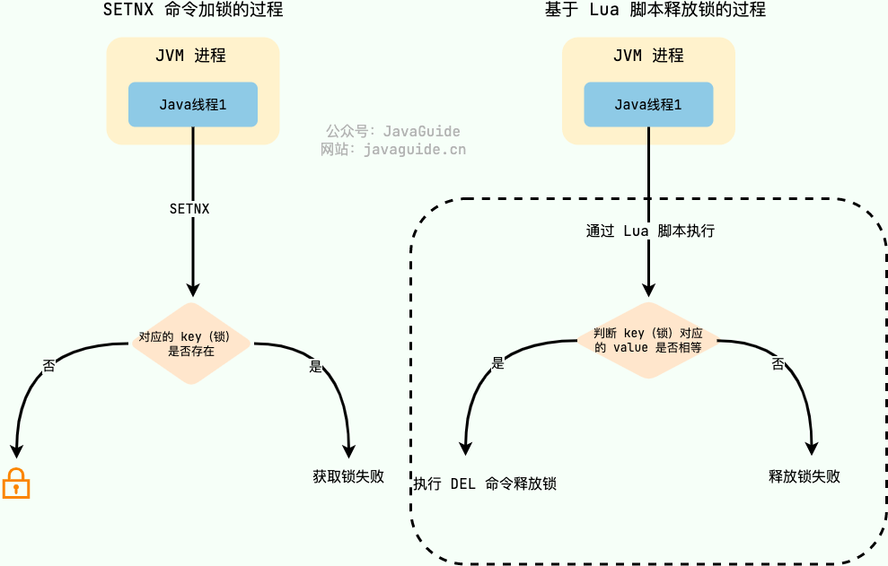

# 分布式

### 分布式锁

分布式系统下，不同的服务/客户端通常运行在独立的 JVM 进程上。如果多个 JVM 进程共享同一份资源的话，使用本地锁就没办法实现资源的互斥访问了。于是，**分布式锁** 就诞生了。

举个例子：系统的订单服务一共部署了 3 份，都对外提供服务。用户下订单之前需要检查库存，为了防止超卖，这里需要加锁以实现对检查库存操作的同步访问。由于订单服务位于不同的 JVM 进程中，本地锁在这种情况下就没办法正常工作了。我们需要用到分布式锁，这样的话，即使多个线程不在同一个 JVM 进程中也能获取到同一把锁，进而实现共享资源的互斥访问。

下面是我对分布式锁画的一张示意图。


从图中可以看出，这些独立的进程中的线程访问共享资源是互斥的，同一时刻只有一个线程可以获取到分布式锁访问共享资源。

### 如何基于 Redis 实现一个最简易的分布式锁？

不论是本地锁还是分布式锁，核心都在于“互斥”。

在 Redis 中， `SETNX` 命令是可以帮助我们实现互斥。`SETNX` 即 **SET** if **N**ot e**X**ists (对应 Java 中的 `setIfAbsent` 方法)，如果 key 不存在的话，才会设置 key 的值。如果 key 已经存在， `SETNX` 啥也不做。

```bash
SETNX lockKey uniqueValue
(integer) 1
SETNX lockKey uniqueValue
(integer) 0
```

释放锁的话，直接通过 `DEL` 命令删除对应的 key 即可。

```bash
DEL lockKey
(integer) 1
```

为了防止误删到其他的锁，这里我们建议使用 Lua 脚本通过 key 对应的 value（唯一值）来判断。

选用 Lua 脚本是为了保证解锁操作的**原子性**。因为 Redis 在执行 Lua 脚本时，可以以原子性的方式执行，从而保证了锁释放操作的原子性。

```lua
// 释放锁时，先比较锁对应的 value 值是否相等，避免锁的误释放
if redis.call("get",KEYS[1]) == ARGV[1] then
    return redis.call("del",KEYS[1])
else
    return 0
end
```



###  分布式事务的解决方案你知道哪些？

> 美团AI面

| **方案**   | **一致性** | **性能** | **复杂度** | **适用场景**             |
| ---------- | ---------- | -------- | ---------- | ------------------------ |
| 2PC        | 强一致性   | 低       | 中         | 传统数据库、XA协议       |
| 3PC        | 强一致性   | 中低     | 高         | 需减少阻塞的强一致场景   |
| TCC        | 最终一致性 | 高       | 高         | 高并发业务（支付、库存） |
| Saga       | 最终一致性 | 中       | 高         | 长事务、跨服务流程       |
| 消息队列   | 最终一致性 | 高       | 中         | 事件驱动架构             |
| 本地消息表 | 最终一致性 | 中       | 低         | 异步通知（订单-积分）    |

- 两阶段提交协议（2PC）：为准备阶段和提交阶段。准备阶段，协调者向参与者发送准备请求，参与者执行事务操作并反馈结果。若所有参与者准备就绪，协调者在提交阶段发送提交请求，参与者执行提交；否则发送回滚请求。
  - 实现简单，能保证事务强一致性。
  - 存在单点故障，协调者故障会影响事务流程；性能低，多次消息交互增加延迟；资源锁导致资源长时间占用，降低并发性能。
  - 适用于对数据一致性要求高、并发度低的场景，如金融系统转账业务。
- 三阶段提交协议（3PC）：在 2PC 基础上，将准备阶段拆分为**询问阶段**和准备阶段，形成询问、准备和提交三个阶段。询问阶段协调者询问参与者能否执行事务，后续阶段与 2PC 类似。
  - 降低参与者阻塞时间，提高并发性能，引入超时机制一定程度解决单点故障问题。
  - 无法完全避免数据不一致，极端网络情况下可能出现部分提交部分回滚。
  - 用于对并发性能有要求、对数据一致性要求相对较低的场景。

- TCC：将业务操作拆分为 Try、Confirm、Cancel 三个阶段。TCC：将业务操作拆分为 Try、Confirm、Cancel 三个阶段。
  - 可根据业务场景定制开发，性能较高，减少资源占用时间。
  - 开发成本高，需实现三个方法，要处理异常和补偿逻辑，实现复杂度大。
  - 适用于对性能要求高、业务逻辑复杂的场景，如电商系统订单处理、库存管理。

- Saga：将长事务拆分为多个短事务，每个短事务有对应的补偿事务。某个短事务失败，按相反顺序执行补偿事务回滚系统状态。
  - 性能较高，短事务可并行执行减少时间，对业务侵入性小，只需实现补偿事务。
  - 只能保证最终一致性，部分补偿事务失败可能导致系统状态不一致。
  - 适用于业务流程长、对数据一致性要求为最终一致性的场景，如旅游系统订单、航班、酒店预订。
- 可靠消息最终一致性方案：基于消息队列，业务系统执行本地事务时将业务操作封装成消息发至消息队列，下游系统消费消息并执行操作，失败则消息队列重试。
  - 实现简单，对业务代码修改小，系统耦合度低，能保证数据最终一致性。
  - 消息队列可靠性和性能影响大，可能出现消息丢失或延迟，需处理消息幂等性。
  - 适用于对数据一致性要求为最终一致性、系统耦合度低的场景，如电商订单支付、库存扣减。

- 本地消息表：业务与消息存储在同一个数据库，利用本地事务保证一致性，后台任务轮询消息表，通过MQ通知下游服务，下游服务消费成功后确认消息，失败则重试。
  - 简单可靠，无外部依赖。消息可能重复消费，需幂等设计。
  - 适用场景是异步最终一致性（如订单创建后通知积分服务）。