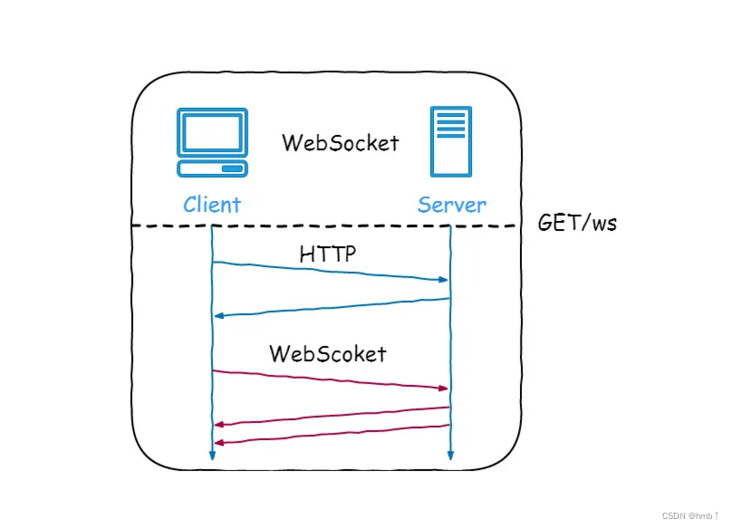

# 计算机网络

## 基础

### OSI 七层模型是什么？每一层的作用是什么？

**OSI 七层模型** 是国际标准化组织提出的一个网络分层模型，其大体结构以及每一层提供的功能如下图所示：


### TCP/IP 四层模型是什么？每一层的作用是什么？

**TCP/IP 四层模型** 是目前被广泛采用的一种模型,我们可以将 TCP / IP 模型看作是 OSI 七层模型的精简版本，由以下 4 层组成：

1. 应用层
2. 传输层
3. 网络层
4. 网络接口层

需要注意的是，我们并不能将 TCP/IP 四层模型 和 OSI 七层模型完全精确地匹配起来，不过可以简单将两者对应起来，如下图所示：


## HTTP

### HTTP 常见字段有哪些？

- Host
- Content-Length
- Connection
- Content-Type
- Content-Encoding

### [HTTP 和 HTTPS 有什么区别？（重要）](https://javaguide.cn/cs-basics/network/other-network-questions.html#http-和-https-有什么区别-重要)

- **端口号**：HTTP 默认是 80，HTTPS 默认是 443。
- **URL 前缀**：HTTP 的 URL 前缀是 `http://`，HTTPS 的 URL 前缀是 `https://`。
- **安全性和资源消耗**：
  - HTTP 协议运行在 TCP 之上，所有传输的内容都是明文，客户端和服务器端都无法验证对方的身份。
  - HTTPS 是运行在 **SSL/TLS** 之上的 HTTP 协议，SSL/TLS 运行在 TCP 之上。所有传输的内容都经过加密，加密采用**对称加密**，但对称加密的密钥用服务器方的证书进行了**非对称加密**。
  - 所以说，HTTP 安全性没有 HTTPS 高，但是 HTTPS 比 HTTP 耗费更多服务器资源。
- **SEO（搜索引擎优化）**：搜索引擎通常会更青睐使用 HTTPS 协议的网站，因为 HTTPS 能够提供更高的安全性和用户隐私保护。**使用 HTTPS 协议的网站在搜索结果中可能会被优先显示**，从而对 SEO 产生影响。

关于 HTTP 和 HTTPS 更详细的对比总结，可以看我写的这篇文章：[HTTP vs HTTPS（应用层）]() 。

### 从输入 URL 到页面展示到底发生了什么？（非常重要）

总体来说分为以下几个步骤:

1. 在浏览器中输入指定网页的 URL。
2. 浏览器通过 **DNS 协议**，获取域名对应的 IP 地址。
3. 浏览器根据 IP 地址和端口号，向目标服务器发起一个 TCP 连接请求。
4. 浏览器在 TCP 连接上，向服务器发送一个 HTTP 请求报文，请求获取网页的内容。
5. 服务器收到 HTTP 请求报文后，处理请求，并返回 HTTP 响应报文给浏览器。
6. 浏览器收到 HTTP 响应报文后，解析响应体中的 HTML 代码，渲染网页的结构和样式，同时根据 HTML 中的其他资源的 URL（如图片、CSS、JS 等），再次发起 HTTP 请求，获取这些资源的内容，直到网页完全加载显示。
7. 浏览器在不需要和服务器通信时，可以主动关闭 TCP 连接，或者等待服务器的关闭请求。

### HTTP/2

#### 头部压缩

#### 二进制帧


## WebSocket

### [什么是 WebSocket?](#什么是-websocket)

WebSocket 是一种基于 TCP 连接的**全双工**通信协议，即客户端和服务器可以同时发送和接收数据。

WebSocket 协议在 2008 年诞生，2011 年成为国际标准，几乎所有主流较新版本的浏览器都支持该协议。不过，WebSocket 不只能在基于浏览器的应用程序中使用，很多编程语言、框架和服务器都提供了 WebSocket 支持。

WebSocket 协议本质上是应用层的协议，用于弥补 HTTP 协议在持久通信能力上的不足。客户端和服务器**仅需一次握手**，两者之间就直接可以创建持久性的连接，并进行双向数据传输。



下面是 WebSocket 的常见应用场景：

- 视频弹幕
- 实时消息推送，详见[Web 实时消息推送详解](https://javaguide.cn/system-design/web-real-time-message-push.html)这篇文章
- 实时游戏对战
- 多用户协同编辑
- 社交聊天
- ……

### [WebSocket 和 HTTP 有什么区别？](#websocket-和-http-有什么区别)

WebSocket 和 HTTP 两者都是基于 TCP 的应用层协议，都可以在网络中传输数据。

下面是二者的主要区别：

- WebSocket 是一种双向实时通信协议，而 HTTP 是一种单向通信协议。并且，HTTP 协议下的通信只能由客户端发起，服务器无法主动通知客户端。
- WebSocket 使用 ws:// 或 wss://（使用 SSL/TLS 加密后的协议，类似于 HTTP 和 HTTPS 的关系） 作为协议前缀，HTTP 使用 http:// 或 https:// 作为协议前缀。
- WebSocket 可以支持扩展，用户可以扩展协议，实现部分自定义的子协议，如支持压缩、加密等。
- WebSocket 通信数据格式比较轻量，用于协议控制的数据包头部相对较小，网络开销小，而 HTTP 通信每次都要携带完整的头部，网络开销较大（HTTP/2.0 使用二进制帧进行数据传输，还支持头部压缩，减少了网络开销）。

### [WebSocket 的工作过程是什么样的？](#websocket-的工作过程是什么样的)

WebSocket 的工作过程可以分为以下几个步骤：

1. 客户端向服务器发送一个 HTTP 请求，请求头中包含 `Upgrade: websocket` 和 `Sec-WebSocket-Key` 等字段，表示要求升级协议为 WebSocket；

   ```html
   Connection: Upgrade
   Sec-WebSocket-Key: Pe5Y/rmK6CDSaNQh3BdT/Q==
   Upgrade: WebSocket
   ```

2. 服务器收到这个请求后，会进行升级协议的操作，如果支持 WebSocket，它将回复一个 HTTP 101 状态码，响应头中包含 ，`Connection: Upgrade`和 `Sec-WebSocket-Accept: xxx` 等字段、表示成功升级到 WebSocket 协议。

   ```html
   HTTP/1.1 101
   Upgrade: WebSocket
   Connection: Upgrade
   Sec-WebSocket-Accept: WY+qSXBa9/BtKeRjuiaNMukzKt4=
   Sec-WebSocket-Extensions: permessage-deflate; client_max_window_bits=15
   ```

3. 客户端和服务器之间建立了一个 WebSocket 连接，可以进行双向的数据传输。数据**以帧（frames）的形式**进行传送，WebSocket 的每条消息可能会被切分成多个数据帧（最小单位）。发送端会将消息切割成多个帧发送给接收端，接收端接收消息帧，并将关联的帧重新组装成完整的消息。

4. 客户端或服务器可以主动发送一个关闭帧，表示要断开连接。另一方收到后，也会回复一个关闭帧，然后双方关闭 TCP 连接。

另外，建立 WebSocket 连接之后，通过心跳机制来保持 WebSocket 连接的稳定性和活跃性。

### SSE 与 WebSocket有什么区别？

SSE (Server-Sent Events) 和 WebSocket 都是用来实现服务器向浏览器实时推送消息的技术，让网页内容能自动更新，而不需要用户手动刷新。虽然目标相似，但它们在工作方式和适用场景上有几个关键区别：

1. **通信方式:**
   - **SSE:** **单向通信**。只有服务器能向客户端（浏览器）发送数据。客户端不能通过同一个连接向服务器发送数据（需要发起新的 HTTP 请求）。
   
   - **WebSocket:** **双向通信 (全双工)**。客户端和服务器可以随时互相发送消息，实现真正的实时交互。
   
2. **底层协议:**
   - **SSE:** 基于标准的 HTTP/HTTPS 协议。它**本质上是一个“长连接”的 HTTP 请求**，服务器保持连接打开并持续发送事件流。不需要特殊的服务器或协议支持，现有的 HTTP 基础设施就能用。
   
   - WebSocket：使用**独立的 ws:// 或 wss:// 协议**。它需要通过一个**特定的 HTTP "Upgrade" 请求**来建立连接，并且服务器需要明确支持 WebSocket 协议来处理连接和消息帧。
   
3. **实现复杂度和成本:**
   - **SSE:** 实现相对简单，主要在服务器端处理。浏览器端有标准的 EventSource API，使用方便。开发和维护成本较低。
   
   - **WebSocket:** 稍微复杂一些。需要服务器端专门处理 WebSocket 连接和协议，客户端也需要使用 WebSocket API。如果需要考虑兼容性、心跳、重连等，开发成本会更高。
   
4. **断线重连:**
   - **SSE:** **浏览器原生支持**。EventSource API 提供了自动断线重连的机制。
   
   - **WebSocket:** **需要手动实现**。开发者需要自己编写逻辑来检测断线并进行重连尝试。
   
5. **数据类型:**
- SSE：**主要设计用来传输文本** (UTF-8 编码)。如果需要传输二进制数据，需要先进行 Base64 等编码转换成文本。
  
- WebSocket：**原生支持传输文本和二进制数据**，无需额外编码。

为了提供更好的用户体验和利用其简单、高效、基于标准 HTTP 的特性，Server-Sent Events (SSE) 是目前**大型语言模型 API**（如 OpenAI、DeepSeek 等）实现流式响应的常用甚至可以说是标准的技木选择。

|                  | SSE                        | WebSocket                       |
| ---------------- | -------------------------- | ------------------------------- |
| 通信方式         | 单向通信                   | 双向通信 (全双工)               |
| 底层协议         | 基于标准的 HTTP/HTTPS 协议 | 使用独立的 ws:// 或 wss:// 协议 |
| 实现复杂度和成本 | 实现相对简单               | 稍微复杂一些                    |
| 断线重连         | 浏览器原生支持             | 需要手动实现                    |
| 数据类型         | 主要设计用来传输文本       | 原生支持传输文本和二进制数据    |

### Flask实现 websocket 

1. 安装 flask、flask_socketio 库

   ```bash
   pip install flask flask-socketio
   ```

2. 初始化 Flask 应用并集成 SocketIO

   ```python
   from flask import Flask
   from flask_socketio import SocketIO
   
   app = Flask(__name__)
   socketio = SocketIO(app)
   ```

   

3. 


## TCP

### 什么是 TCP ？

TCP 是**面向连接的、可靠的、基于字节流**的传输层通信协议。

- **面向连接**：一定是「一对一」才能连接，不能像 UDP 协议可以一个主机同时向多个主机发送消息，也就是一对多是无法做到的；

- **可靠的**：无论的网络链路中出现了怎样的链路变化，TCP 都可以保证一个报文一定能够到达接收端；

- **字节流**：用户消息通过 TCP 协议传输时，消息可能会被操作系统「分组」成多个的 TCP 报文，如果接收方的程序如果不知道「消息的边界」，是无法读出一个有效的用户消息的。并且 TCP 报文是「有序的」，当「前一个」TCP 报文没有收到的时候，即使它先收到了后面的 TCP 报文，那么也不能扔给应用层去处理，同时对「重复」的 TCP 报文会自动丢弃。

### TCP协议的特点有哪些？

1.TCP是**面向连接**的**传输层**的协议（物理层-数据链路层-网络层-传输层-会话层-应用层）。

也就是说，应用程序在使用TCP协议之前，必须先建立TCP连接。数据传输完毕以后，必须释放已经建立的TCP的连接

2.每一条TCP连接必须是<strong>(一对一)的 </strong>

3.TCP提供**可靠交付**的服务。通过TCP连接传输的数据，不丢失、不重复、无差错，并且按需到达。

4.TCP提供**全双工**通信。TCP允许通信双方的应用程序在任何时候都能发送数据。TCP连接的两端都设有发送缓存和接收缓存，用来临时存放双向通信的数据。在发送时，应用程序在把数据传送给TCP的缓存后，就可以做自己的事，TCP在合适的时候把数据发送出去。在接收时，TCP把收到的数据存入缓存，上层的应用程序在合适的时候读取缓存中的数据。

5.**面向字节流。**TCP中“**流(Stream)”指的是流入到进程或从进程流出的字节序列**。

面向字节流的含义是：虽然应用程序和TCP的交互式一次一个数据块(大小不等)，但TCP把应用程序交下来的数据仅仅看成是一连串的**无结构的字节流**

### TCP 头格式有哪些？

我们先来看看 TCP 头的格式，标注颜色的表示与本文关联比较大的字段，其他字段不做详细阐述。


**序列号：** 在建立连接时由计算机生成的随机数作为其初始值，通过 SYN 包传给接收端主机，每发送一次数据，就「累加」一次该「数据字节数」的大小。用来解决网络包乱序问题。

**确认应答号：** 指下一次「期望」收到的数据的序列号，发送端收到这个确认应答以后可以认为在这个序号以前的数据都已经被正常接收。用来解决丢包的问题。

**控制位：**
- ACK：该位为 1 时，「确认应答」的字段变为有效，TCP 规定除了最初建立连接时的 SYN 包之外该位必须设置为 1。
- RST：该位为 1 时，表示 TCP 连接中出现异常必须强制断开连接。
- SYN：该位为 1 时，表示**希望建立连接**，并在其「序列号」的字段进行序列号初始值的设定。
- FIN：该位为 1 时，表示今后不会再有数据发送，希望断开连接。当通信结束希望断开连接时，通信双方的主机之间就可以相互交换 FIN 位为 1 的 TCP 段。

### 三次握手过程


- 一开始，客户端和服务端都处于 `CLOSE` 状态。先是服务端主动监听某个接口，处于 `LISTEN` 状态

- 客户端会随机初始化序号（`client_isn`），将此序号置于 TCP 首部的「序号」字段中，同时把`SYN`标志位置为1 ，表示 SYN 报文。接着把第一个 SYN 报文发送给服务端，表示向服务端发起连接，该报文不包含应用层数据，之后客户端处于 `SYN-SENT` 状态。

  

- 服务端收到客户端的 `SYN` 报文后，首先服务端也随机初始化自己的序号（`server_isn`），将此序号填入 TCP 首部的「序号」字段中，其次把 TCP 首部的「确认应答号」字段填入 client_isn + 1, 接着把 `SYN` 和 `ACK` 标志位置为 1。最后把该报文发给客户端，该报文也不包含应用层数据，之后服务端处于 SYN-RCVD 状态。

  

- 客户端收到服务端报文后，还要向服务端回应最后一个应答报文，首先该应答报文 TCP 首部 ACK 标志位置为 1 ，其次「确认应答号」字段填入 server_isn + 1 ，最后把报文发送给服务端，这次报文**可以携带客户到服务端的数据**，之后客户端处于 ESTABLISHED 状态。

  

- 服务端收到客户端的应答报文后，也进入 ESTABLISHED 状态。

从上面的过程可以发现第三次握手是可以携带数据的，前两次握手是不可以携带数据的，这也是面试常问的题。

一旦完成三次握手，双方都处于 ESTABLISHED 状态，此时连接就已建立完成，客户端和服务端就可以相互发送数据了。

### 四次挥手过程

天下没有不散的宴席，对于 TCP 连接也是这样， TCP 断开连接是通过**四次挥手**方式。

双方都可以主动断开连接，断开连接后主机中的「资源」将被释放，四次挥手的过程如下图：


- 客户端打算关闭连接，此时会发送一个TCP首部FIN标志位被置为1的报文，也即FIN报文，之后客户端进入 `FIN_WAIT_1` 状态。
- 服务端收到该报文后，就向客户端发送ACK应答报文，接着服务端进入 `CLOSE_WAIT` 状态。
- 客户端收到服务端的 `ACK` 应答报文后，之后进入 `FIN_WAIT_2` 状态。
- 等待服务端处理完数据后，也向客户端发送FIN报文，之后服务端进入 `LAST_ACK` 状态。
- 客户端收到服务端的FIN报文后，回一个ACK应答报文，之后进入 `TIME_WAIT` 状态。【迅雷笔试】
- 服务端收到了 `ACK` 应答报文后，就进入了 `CLOSE` 状态，至此服务端已经完成连接的关闭。
- 客户端在经过 `2MSL` 一段时间后，自动进入 `CLOSE` 状态，至此客户端也完成连接的关闭。

### 为什么 TIME_WAIT 等待的时间是 2MSL？

MSL 是 Maximum Segment Lifetime，报文最大生存时间，它是任何报文在网络上存在的最长时间，超过这个时间报文将被丢弃。因为 TCP 报文基于是 IP 协议的，而 IP 头中有一个 TTL 字段，是 IP 数据报可以经过的最大路由数，每经过一个处理他的路由器此值就减 1，当此值为 0 则数据报将被丢弃，同时发送 ICMP 报文通知源主机。

MSL 与 TTL 的区别：MSL 的单位是时间，而 TTL 是经过路由跳数。所以 MSL 应该要大于等于 TTL 消耗为 0 的时间，以确保报文已被自然消亡。

TTL 的值一般是 64，Linux 将 MSL 设置为 30 秒，意味着 Linux 认为数据报文经过 64 个路由器的时间不会超过 30 秒，如果超过了，就认为报文已经消失在网络中了。

TIME_WAIT 等待 2 倍的 MSL，比较合理的解释是：网络中可能存在来自发送方的数据包，当这些发送方的数据包被接收方处理后又会向对方发送响应，所以**一来一回需要等待 2 倍的时间**。

可以看到 2MSL 时长 这其实是相当于至少允许报文丢失一次。比如，若 ACK 在一个 MSL 内丢失，这样被动方重发的 FIN 会在第 2 个 MSL 内到达，TIME_WAIT 状态的连接可以应对。

为什么不是 4 或者 8 MSL 的时长呢？你可以想象一个丢包率达到百万分之一的糟糕网络，连续两次丢包的概率只有万分之一，这个概率实在是太小了，忽略它比解决它更具性价比。

2MSL 的时间是**从客户端接收到 FIN 后发送 ACK 开始计时的**。如果在 TIME-WAIT 时间内，因为客户端的 ACK 没有传输到服务端，客户端又接收到了服务端重发的 FIN 报文，那么 2MSL 时间将重新计时。

在 Linux 系统里 `2MSL` 默认是 `60` 秒，那么一个 `MSL` 也就是 `30` 秒。**Linux 系统停留在 TIME_WAIT 的时间为固定的 60 秒**。

其定义在 Linux 内核代码里的名称为 `TCP_TIMEWAIT_LEN`：

```c
#define TCP_TIMEWAIT_LEN (60*HZ) /* how long to wait to destroy TIME-WAIT state, about 60 seconds */
```

如果要修改 TIME_WAIT 的时间长度，只能修改 Linux 内核代码里 TCP_TIMEWAIT_LEN 的值，并重新编译 Linux 内核。

### TCP 与 UDP 的区别

为了更直观地对比，可以看下面这个表格：

| 特性         | TCP                        | UDP                                 |
| ------------ | -------------------------- | ----------------------------------- |
| **连接性**   | 面向连接                   | 无连接                              |
| **可靠性**   | 可靠                       | 不可靠 (尽力而为)                   |
| **状态维护** | 有状态                     | 无状态                              |
| **传输效率** | 较低                       | 较高                                |
| **传输形式** | 面向字节流                 | 面向数据报 (报文)                   |
| **头部开销** | 20 - 60 字节               | 8 字节                              |
| **通信模式** | 点对点 (单播)              | 单播、多播、广播                    |
| **常见应用** | HTTP/HTTPS, FTP, SMTP, SSH | DNS, DHCP, SNMP, TFTP, VoIP, 视频流 |

### 什么时候选择 TCP，什么时候选 UDP?

选择 TCP 还是 UDP，主要取决于你的应用**对数据传输的可靠性要求有多高，以及对实时性和效率的要求有多高**。

当**数据准确性和完整性至关重要，一点都不能出错**时，通常选择 TCP。因为 TCP 提供了一整套机制（三次握手、确认应答、重传、流量控制等）来保证数据能够可靠、有序地送达。典型应用场景如下：

- **Web 浏览 (HTTP/HTTPS):** 网页内容、图片、脚本必须完整加载才能正确显示。
- **文件传输 (FTP, SCP):** 文件内容不允许有任何字节丢失或错序。
- **邮件收发 (SMTP, POP3, IMAP):** 邮件内容需要完整无误地送达。
- **远程登录 (SSH, Telnet):** 命令和响应需要准确传输。
- ......

当**实时性、速度和效率优先，并且应用能容忍少量数据丢失或乱序**时，通常选择 UDP。UDP 开销小、传输快，没有建立连接和保证可靠性的复杂过程。典型应用场景如下：

- **实时音视频通信 (VoIP, 视频会议, 直播):** 偶尔丢失一两个数据包（可能导致画面或声音短暂卡顿）通常比因为等待重传（TCP 机制）导致长时间延迟更可接受。应用层可能会有自己的补偿机制。
- **在线游戏:** 需要快速传输玩家位置、状态等信息，对实时性要求极高，旧的数据很快就没用了，丢失少量数据影响通常不大。
- **DHCP (动态主机配置协议):** 客户端在请求 IP 时自身没有 IP 地址，无法满足 TCP 建立连接的前提条件，并且 DHCP 有广播需求、交互模式简单以及自带可靠性机制。
- **物联网 (IoT) 数据上报:** 某些场景下，传感器定期上报数据，丢失个别数据点可能不影响整体趋势分析。
- ......

### TCP 如何保证传输的可靠性？

1. **基于数据块传输**：应用数据被分割成 TCP 认为最适合发送的数据块，再传输给网络层，数据块被称为报文段或段。
2. **对失序数据包重新排序以及去重**：TCP 为了保证不发生丢包，就给每个包一个序列号，有了序列号能够将接收到的数据根据序列号排序，并且去掉重复序列号的数据就可以实现数据包去重。
3. **校验和** : TCP 将保持它首部和数据的检验和。这是一个端到端的检验和，目的是检测数据在传输过程中的任何变化。如果收到段的检验和有差错，TCP 将丢弃这个报文段和不确认收到此报文段。
4. **重传机制** : 在数据包丢失或延迟的情况下，重新发送数据包，直到收到对方的确认应答（ACK）。TCP 重传机制主要有：
   - 基于计时器的重传（也就是超时重传）
   - 快速重传（基于接收端的反馈信息来引发重传）
   - SACK（在快速重传的基础上，返回最近收到的报文段的序列号范围，这样客户端就知道，哪些数据包已经到达服务器了）
   - D-SACK（重复 SACK，在 SACK 的基础上，额外携带信息，告知发送方有哪些数据包自己重复接收了）。
   - 关于重传机制的详细介绍，可以查看[详解 TCP 超时与重传机制](https://zhuanlan.zhihu.com/p/101702312)这篇文章。
5. **流量控制** : TCP 连接的每一方都有固定大小的缓冲空间，TCP 的接收端只允许发送端发送接收端缓冲区能接纳的数据。当接收方来不及处理发送方的数据，能提示发送方降低发送的速率，防止包丢失。TCP 使用的流量控制协议是可变大小的滑动窗口协议（TCP 利用滑动窗口实现流量控制）。
6. **拥塞控制** : 当网络拥塞时，减少数据的发送。TCP 在发送数据的时候，需要考虑两个因素：一是接收方的接收能力，二是网络的拥塞程度。接收方的接收能力由滑动窗口表示，表示接收方还有多少缓冲区可以用来接收数据。网络的拥塞程度由拥塞窗口表示，它是发送方根据网络状况自己维护的一个值，表示发送方认为可以在网络中传输的数据量。发送方发送数据的大小是滑动窗口和拥塞窗口的最小值，这样可以保证发送方既不会超过接收方的接收能力，也不会造成网络的过度拥塞。

## IP

### IP协议的首部结构 

首部协议一共是20个字节（固定）

第一个4字节： 版本号；首部长度； 服务类型；总长度；

第二个4字节：标识；标志；片偏移；

第三个4字节：生存时间；协议；校验和；

第四个4字节：源ip地址；

第五个4字节：目的ip地址；

IPv4 首部与 IPv6 首部的差异如下图：


IPv6 相比 IPv4 的首部改进：

- 取消了**首部校验和**字段。 因为在数据链路层和传输层都会校验，因此 IPv6 直接取消了 IP 的校验。

- 取消了**分片/重新组装相关**字段。 分片与重组是耗时的过程，IPv6 不允许在中间路由器进行分片与重组，这种操作只能在源与目标主机，这将大大提高了路由器转发的速度。

- 取消**选项**字段。 选项字段不再是标准 IP 首部的一部分了，但它并没有消失，而是可能出现在 IPv6 首部中的「下一个首部」指出的位置上。删除该选项字段使的 IPv6 的首部成为固定长度的 