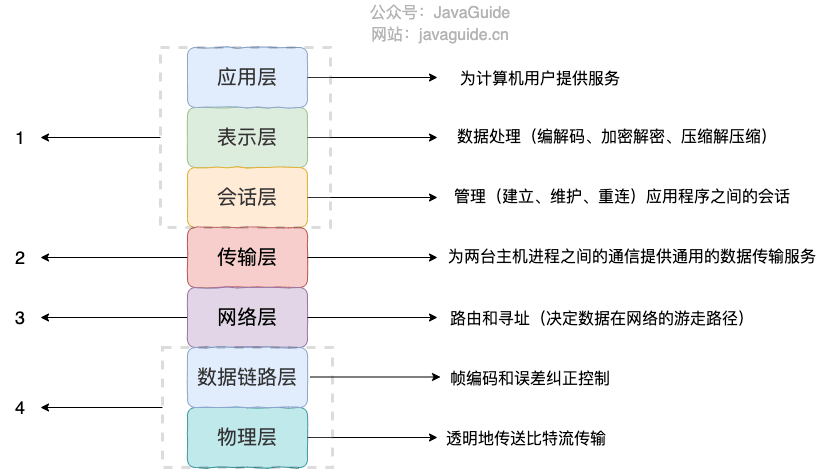
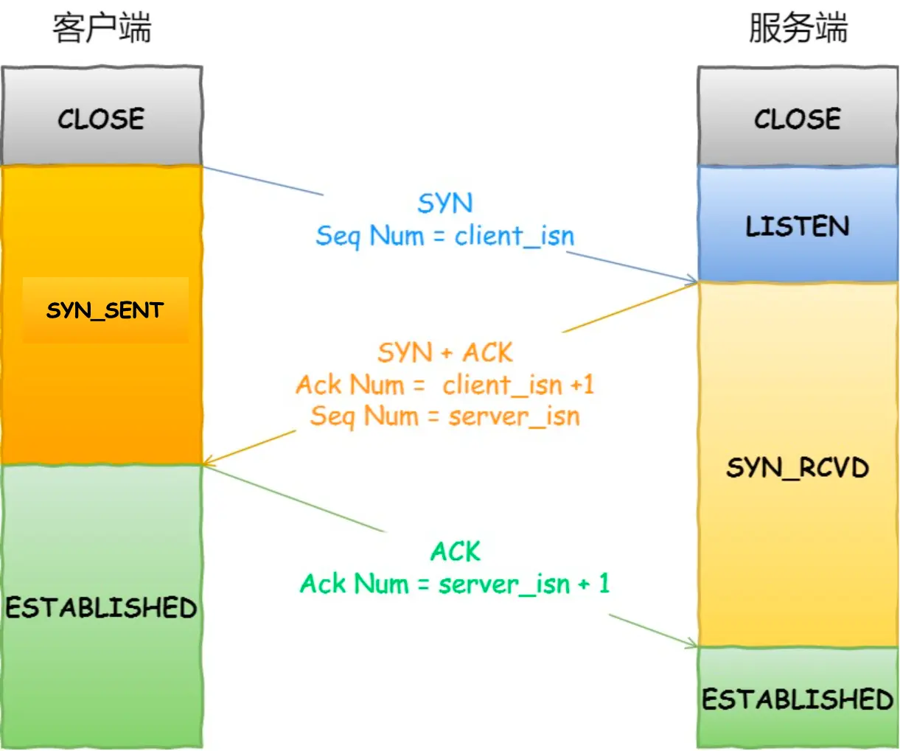

# 计算机网络

## 基础

#### OSI 七层模型是什么？每一层的作用是什么？

**OSI 七层模型** 是国际标准化组织提出的一个网络分层模型，其大体结构以及每一层提供的功能如下图所示：


#### TCP/IP 四层模型是什么？每一层的作用是什么？

**TCP/IP 四层模型** 是目前被广泛采用的一种模型,我们可以将 TCP / IP 模型看作是 OSI 七层模型的精简版本，由以下 4 层组成：

1. 应用层
2. 传输层
3. 网络层
4. 网络接口层

需要注意的是，我们并不能将 TCP/IP 四层模型 和 OSI 七层模型完全精确地匹配起来，不过可以简单将两者对应起来，如下图所示：




### HTTP 常见字段有哪些？

- Host
- Content-Length
- Connection
- Content-Type
- Content-Encoding

### [HTTP 和 HTTPS 有什么区别？（重要）](https://javaguide.cn/cs-basics/network/other-network-questions.html#http-和-https-有什么区别-重要)

- **端口号**：HTTP 默认是 80，HTTPS 默认是 443。
- **URL 前缀**：HTTP 的 URL 前缀是 `http://`，HTTPS 的 URL 前缀是 `https://`。
- **安全性和资源消耗**：
  - HTTP 协议运行在 TCP 之上，所有传输的内容都是明文，客户端和服务器端都无法验证对方的身份。
  - HTTPS 是运行在 **SSL/TLS** 之上的 HTTP 协议，SSL/TLS 运行在 TCP 之上。所有传输的内容都经过加密，加密采用**对称加密**，但对称加密的密钥用服务器方的证书进行了非对称加密。
  - 所以说，HTTP 安全性没有 HTTPS 高，但是 HTTPS 比 HTTP 耗费更多服务器资源。
- **SEO（搜索引擎优化）**：搜索引擎通常会更青睐使用 HTTPS 协议的网站，因为 HTTPS 能够提供更高的安全性和用户隐私保护。使用 HTTPS 协议的网站在搜索结果中可能会被优先显示，从而对 SEO 产生影响。

关于 HTTP 和 HTTPS 更详细的对比总结，可以看我写的这篇文章：[HTTP vs HTTPS（应用层）]() 。

## WebSocket

### [什么是 WebSocket?](#什么是-websocket)

WebSocket 是一种基于 TCP 连接的**全双工**通信协议，即客户端和服务器可以同时发送和接收数据。

WebSocket 协议在 2008 年诞生，2011 年成为国际标准，几乎所有主流较新版本的浏览器都支持该协议。不过，WebSocket 不只能在基于浏览器的应用程序中使用，很多编程语言、框架和服务器都提供了 WebSocket 支持。

WebSocket 协议本质上是应用层的协议，用于弥补 HTTP 协议在持久通信能力上的不足。客户端和服务器**仅需一次握手**，两者之间就直接可以创建持久性的连接，并进行双向数据传输。


下面是 WebSocket 的常见应用场景：

- 视频弹幕
- 实时消息推送，详见[Web 实时消息推送详解](https://javaguide.cn/system-design/web-real-time-message-push.html)这篇文章
- 实时游戏对战
- 多用户协同编辑
- 社交聊天
- ……

### [WebSocket 和 HTTP 有什么区别？](#websocket-和-http-有什么区别)

WebSocket 和 HTTP 两者都是基于 TCP 的应用层协议，都可以在网络中传输数据。

下面是二者的主要区别：

- WebSocket 是一种双向实时通信协议，而 HTTP 是一种单向通信协议。并且，HTTP 协议下的通信只能由客户端发起，服务器无法主动通知客户端。
- WebSocket 使用 ws:// 或 wss://（使用 SSL/TLS 加密后的协议，类似于 HTTP 和 HTTPS 的关系） 作为协议前缀，HTTP 使用 http:// 或 https:// 作为协议前缀。
- WebSocket 可以支持扩展，用户可以扩展协议，实现部分自定义的子协议，如支持压缩、加密等。
- WebSocket 通信数据格式比较轻量，用于协议控制的数据包头部相对较小，网络开销小，而 HTTP 通信每次都要携带完整的头部，网络开销较大（HTTP/2.0 使用二进制帧进行数据传输，还支持头部压缩，减少了网络开销）。

### [WebSocket 的工作过程是什么样的？](#websocket-的工作过程是什么样的)

WebSocket 的工作过程可以分为以下几个步骤：

1. 客户端向服务器发送一个 HTTP 请求，请求头中包含 `Upgrade: websocket` 和 `Sec-WebSocket-Key` 等字段，表示要求升级协议为 WebSocket；

   ```html
   Connection: Upgrade
   Sec-WebSocket-Key: Pe5Y/rmK6CDSaNQh3BdT/Q==
   Upgrade: WebSocket
   ```

2. 服务器收到这个请求后，会进行升级协议的操作，如果支持 WebSocket，它将回复一个 HTTP 101 状态码，响应头中包含 ，`Connection: Upgrade`和 `Sec-WebSocket-Accept: xxx` 等字段、表示成功升级到 WebSocket 协议。

   ```html
   HTTP/1.1 101
   Upgrade: WebSocket
   Connection: Upgrade
   Sec-WebSocket-Accept: WY+qSXBa9/BtKeRjuiaNMukzKt4=
   Sec-WebSocket-Extensions: permessage-deflate; client_max_window_bits=15
   ```

3. 客户端和服务器之间建立了一个 WebSocket 连接，可以进行双向的数据传输。数据**以帧（frames）的形式**进行传送，WebSocket 的每条消息可能会被切分成多个数据帧（最小单位）。发送端会将消息切割成多个帧发送给接收端，接收端接收消息帧，并将关联的帧重新组装成完整的消息。

4. 客户端或服务器可以主动发送一个关闭帧，表示要断开连接。另一方收到后，也会回复一个关闭帧，然后双方关闭 TCP 连接。

另外，建立 WebSocket 连接之后，通过心跳机制来保持 WebSocket 连接的稳定性和活跃性。

### SSE 与 WebSocket有什么区别？

SSE (Server-Sent Events) 和 WebSocket 都是用来实现服务器向浏览器实时推送消息的技术，让网页内容能自动更新，而不需要用户手动刷新。虽然目标相似，但它们在工作方式和适用场景上有几个关键区别：

1. **通信方式:**
   - **SSE:** **单向通信**。只有服务器能向客户端（浏览器）发送数据。客户端不能通过同一个连接向服务器发送数据（需要发起新的 HTTP 请求）。
   
   - **WebSocket:** **双向通信 (全双工)**。客户端和服务器可以随时互相发送消息，实现真正的实时交互。
   
2. **底层协议:**
   - **SSE:** 基于标准的 HTTP/HTTPS 协议。它**本质上是一个“长连接”的 HTTP 请求**，服务器保持连接打开并持续发送事件流。不需要特殊的服务器或协议支持，现有的 HTTP 基础设施就能用。
   
   - WebSocket：使用**独立的 ws:// 或 wss:// 协议**。它需要通过一个**特定的 HTTP "Upgrade" 请求**来建立连接，并且服务器需要明确支持 WebSocket 协议来处理连接和消息帧。
   
3. **实现复杂度和成本:**
   - **SSE:** 实现相对简单，主要在服务器端处理。浏览器端有标准的 EventSource API，使用方便。开发和维护成本较低。
   
   - **WebSocket:** 稍微复杂一些。需要服务器端专门处理 WebSocket 连接和协议，客户端也需要使用 WebSocket API。如果需要考虑兼容性、心跳、重连等，开发成本会更高。
   
4. **断线重连:**
   - **SSE:** **浏览器原生支持**。EventSource API 提供了自动断线重连的机制。
   
   - **WebSocket:** **需要手动实现**。开发者需要自己编写逻辑来检测断线并进行重连尝试。
   
5. **数据类型:**
- SSE：**主要设计用来传输文本** (UTF-8 编码)。如果需要传输二进制数据，需要先进行 Base64 等编码转换成文本。
  
- WebSocket：**原生支持传输文本和二进制数据**，无需额外编码。

为了提供更好的用户体验和利用其简单、高效、基于标准 HTTP 的特性，Server-Sent Events (SSE) 是目前**大型语言模型 API**（如 OpenAI、DeepSeek 等）实现流式响应的常用甚至可以说是标准的技木选择。

|                  | SSE                        | WebSocket                       |
| ---------------- | -------------------------- | ------------------------------- |
| 通信方式         | 单向通信                   | 双向通信 (全双工)               |
| 底层协议         | 基于标准的 HTTP/HTTPS 协议 | 使用独立的 ws:// 或 wss:// 协议 |
| 实现复杂度和成本 | 实现相对简单               | 稍微复杂一些                    |
| 断线重连         | 浏览器原生支持             | 需要手动实现                    |
| 数据类型         | 主要设计用来传输文本       | 原生支持传输文本和二进制数据    |

### Flask实现 websocket 

1. 安装 flask、flask_socketio 库

   ```bash
   pip install flask flask-socketio
   ```

2. 初始化 Flask 应用并集成 SocketIO

   ```python
   from flask import Flask
   from flask_socketio import SocketIO
   
   app = Flask(__name__)
   socketio = SocketIO(app)
   ```

   

3. 


## TCP

### TCP 头格式有哪些？

我们先来看看 TCP 头的格式，标注颜色的表示与本文关联比较大的字段，其他字段不做详细阐述。


**序列号：** 在建立连接时由计算机生成的随机数作为其初始值，通过 SYN 包传给接收端主机，每发送一次数据，就「累加」一次该「数据字节数」的大小。用来解决网络包乱序问题。

**确认应答号：** 指下一次「期望」收到的数据的序列号，发送端收到这个确认应答以后可以认为在这个序号以前的数据都已经被正常接收。用来解决丢包的问题。

**控制位：**
- ACK：该位为 1 时，「确认应答」的字段变为有效，TCP 规定除了最初建立连接时的 SYN 包之外该位必须设置为 1。
- RST：该位为 1 时，表示 TCP 连接中出现异常必须强制断开连接。
- SYN：该位为 1 时，表示希望建立连接，并在其「序列号」的字段进行序列号初始值的设定。
- FIN：该位为 1 时，表示今后不会再有数据发送，希望断开连接。当通信结束希望断开连接时，通信双方的主机之间就可以相互交换 FIN 位为 1 的 TCP 段。

### 三次握手过程



- 一开始，客户端和服务端都处于 `CLOSE` 状态。先是服务端主动监听某个接口，处于 `LISTEN` 状态

- 客户端会随机初始化序号（`client_isn`），将此序号置于 TCP 首部的「序号」字段中，同时把`SYN`标志位置为1 ，表示 SYN 报文。接着把第一个 SYN 报文发送给服务端，表示向服务端发起连接，该报文不包含应用层数据，之后客户端处于 `SYN-SENT` 状态。

  

- 服务端收到客户端的 `SYN` 报文后，首先服务端也随机初始化自己的序号（`server_isn`），将此序号填入 TCP 首部的「序号」字段中，其次把 TCP 首部的「确认应答号」字段填入 client_isn + 1, 接着把 `SYN` 和 `ACK` 标志位置为 1。最后把该报文发给客户端，该报文也不包含应用层数据，之后服务端处于 SYN-RCVD 状态。

  

- 客户端收到服务端报文后，还要向服务端回应最后一个应答报文，首先该应答报文 TCP 首部 ACK 标志位置为 1 ，其次「确认应答号」字段填入 server_isn + 1 ，最后把报文发送给服务端，这次报文**可以携带客户到服务端的数据**，之后客户端处于 ESTABLISHED 状态。

  

- 服务端收到客户端的应答报文后，也进入 ESTABLISHED 状态。

从上面的过程可以发现第三次握手是可以携带数据的，前两次握手是不可以携带数据的，这也是面试常问的题。

一旦完成三次握手，双方都处于 ESTABLISHED 状态，此时连接就已建立完成，客户端和服务端就可以相互发送数据了。